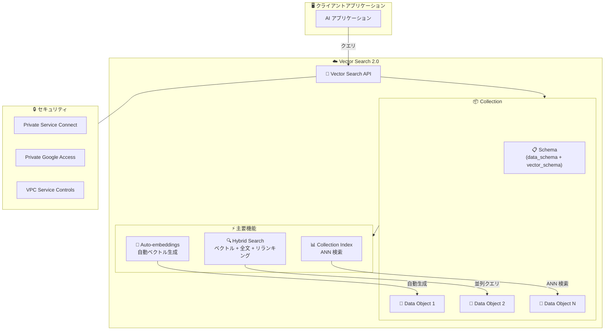

# Vertex AI: Vector Search 2.0 が一般提供 (GA) 開始

**リリース日**: 2026-03-14

**サービス**: Vertex AI

**機能**: Vector Search 2.0 一般提供 (GA)

**ステータス**: Announcement (GA)

📊 [このアップデートのインフォグラフィックを見る](https://takech9203.github.io/google-cloud-news-summary/20260314-vertex-ai-vector-search-2-0-ga.html)

## 概要

Vertex AI Vector Search 2.0 が一般提供 (GA) となった。Vector Search 2.0 は、AI 開発を効率化し、AI アプリケーションのナレッジコアとして機能するために設計された検索エンジンである。従来の Vector Search 1.0 が近似最近傍 (ANN) インデックスのサービスであったのに対し、2.0 ではストレージと検索を統合した包括的なシステムへと進化している。

Vector Search 2.0 はゼロから設計されたセルフチューニング型のフルマネージド AI ネイティブ検索エンジンであり、インデックスではなく「Collection (コレクション)」と「Data Object (データオブジェクト)」を中心としたアーキテクチャを採用している。レプリケーション対応のスケーラブルなストレージエンジンにより、AI アプリケーションの統一データソースとして機能し、補助的なデータストレージが不要になる。

主な対象ユーザーは、RAG (Retrieval-Augmented Generation) パイプラインの構築者、セマンティック検索やレコメンデーションシステムの開発者、エンタープライズ AI アプリケーションの構築チームである。

**アップデート前の課題**

- Vector Search 1.0 ではインデックスの管理が主要な操作単位であり、VM やレプリカの構成を手動で管理する必要があった
- ベクトルデータとペイロードデータを別々のストレージで管理する必要があり、データの一貫性維持が煩雑だった
- セマンティック検索とキーワード検索を組み合わせたハイブリッド検索には、密ベクトルと疎ベクトルの個別管理が必要だった
- エンベディング生成は外部で行い、明示的にベクトルフィールドを設定する必要があった

**アップデート後の改善**

- Collection ベースのアーキテクチャにより、データとベクトルを統一的に管理可能になった
- Auto-embeddings 機能によりベクトルフィールドの自動生成が可能になり、エンベディング管理の手間が大幅に削減された
- ハイブリッド検索とランキングが単一の並列クエリで実行可能になり、ベクトル検索、全文検索、セマンティックリランキングを統合的に利用できるようになった
- セルフチューニング機能により VM やレプリカの手動構成が不要になった

## アーキテクチャ図



Vector Search 2.0 のアーキテクチャを示す図。クライアントアプリケーションから API を通じて Collection にアクセスし、Auto-embeddings、Hybrid Search、Collection Index の各機能を利用する。セキュリティは PSC/PGA/VPC Service Controls で保護される。

## サービスアップデートの詳細

### 主要機能

1. **Collections (コレクション)**
   - データとベクトルを統一的に管理するコンテナ。リレーショナルデータベースのテーブルに類似した概念
   - Collection Schema として data_schema (ユーザー定義のデータ構造) と vector_schema (ベクトルフィールドの定義・構成) を JSON Schema draft-07 仕様で定義
   - 1 つのデータベース内に複数の Collection を作成可能
   - Collection Index により、Collection 内の Data Object に対する効率的な ANN 検索を実現
   - スキーマバリデーションは厳格モードで動作し、`additionalProperties` は常に `false` として扱われる

2. **Auto-embeddings (自動エンベディング)**
   - ベクトルフィールドを組み込みモデルで自動的に生成する機能
   - Data Object 作成時に自動でエンベディングが付与されるため、外部でのエンベディング生成・管理が不要
   - Bring Your Own Embeddings (BYOE) にも対応しており、自動生成されないベクトルフィールドに独自のエンベディングを設定可能

3. **Hybrid Search & Ranking (ハイブリッド検索とランキング)**
   - ベクトル検索、全文検索、組み込みセマンティックリランキングを単一の並列クエリで実行
   - セマンティック検索とキーワードベース検索の長所を組み合わせることで、より高品質な検索結果を提供
   - 「Out of domain」データ (製品番号、新しいブランド名、企業固有のコード名など) に対してもキーワード検索で対応可能

4. **セキュリティとネットワーキング**
   - Private Service Connect (PSC): 低レイテンシで安全な接続を提供。複数の VPC ネットワークからのアクセスに対応
   - Private Google Access (PGA): ハイブリッドネットワーキング環境でのプライベートアクセスを実現
   - VPC Service Controls: データ漏洩リスクの軽減のためのサービス境界を提供

## 技術仕様

### Collection Schema の構成

| 項目 | 説明 |
|------|------|
| data_schema | ユーザー定義のデータ構造 (JSON Schema draft-07) |
| vector_schema | ベクトルフィールドの定義 (dense_vector, sparse_vector) |
| additionalProperties | 常に false として扱われる (厳格バリデーション) |
| Dense Vector | 次元数を指定した密ベクトル |
| Sparse Vector | 疎ベクトル (キーワード検索用) |

### API エンドポイント

Vector Search 2.0 は専用の API エンドポイントを使用する。

```
https://vectorsearch.googleapis.com/v1beta/projects/{PROJECT_ID}/locations/{LOCATION}/collections
```

### Collection 作成例 (Python)

```python
from google.cloud import vectorsearch_v1beta

client = vectorsearch_v1beta.VectorSearchServiceClient()

data_schema = {
    "type": "object",
    "properties": {
        "title": {"type": "string"},
        "genre": {"type": "string"},
        "year": {"type": "number"},
    },
}

vector_schema = {
    "plot_embedding": {"dense_vector": {"dimensions": 3}},
    "sparse_embedding": {"sparse_vector": {}},
}

collection = vectorsearch_v1beta.Collection(
    data_schema=data_schema,
    vector_schema=vector_schema,
)

request = vectorsearch_v1beta.CreateCollectionRequest(
    parent="projects/PROJECT_ID/locations/LOCATION",
    collection_id="COLLECTION_ID",
    collection=collection,
)

operation = client.create_collection(request=request)
operation.result()
```

## 設定方法

### 前提条件

1. Google Cloud プロジェクトで Vertex AI API が有効化されていること
2. サポート対象リージョンにリソースを作成すること
3. 適切な IAM 権限が付与されていること

### 手順

#### ステップ 1: Collection の作成

gcloud CLI を使用して Collection を作成する。

```bash
gcloud beta vector-search collections create COLLECTION_ID \
  --location=LOCATION \
  --project=PROJECT_ID \
  --data-schema=data_schema.json \
  --vector-schema=vector_schema.json
```

#### ステップ 2: Data Object の追加

```bash
gcloud beta vector-search collections data-objects create DATA_OBJECT_ID \
  --data=data.json \
  --vectors=vectors.json \
  --collection=COLLECTION_ID \
  --location=LOCATION \
  --project=PROJECT_ID
```

Auto-embeddings が有効な場合、ベクトルフィールドは自動的に生成される。

#### ステップ 3: 検索の実行

Collection に対してクエリを実行し、ベクトル類似度検索やハイブリッド検索を行う。

## メリット

### ビジネス面

- **開発速度の向上**: 直感的なクライアントライブラリと最小限のコードで迅速に開始可能。セルフチューニングにより、インフラ構成の知識がなくても高パフォーマンスを維持できる
- **運用コストの削減**: VM やレプリカの手動管理が不要になり、フルマネージドサービスとして運用負荷を大幅に軽減
- **柔軟な料金体系**: 使用量ベース (小規模ワークロード向け) とリソースベース (パフォーマンス最適化向け) の 2 つの料金モデルを提供

### 技術面

- **統一データストレージ**: ベクトル類似度とペイロードデータによるフィルタリング、検索を一箇所で実行可能。補助ストレージが不要
- **高品質な検索結果**: ハイブリッド検索により、セマンティック検索だけでは対応できない固有名詞や専門用語にもキーワード検索で対応
- **Vector Search 1.0 との互換性**: 1.0 で実績のある高パフォーマンスと大規模スケーラビリティを維持

## デメリット・制約事項

### 制限事項

- スキーマは JSON Schema draft-07 仕様に準拠する必要がある。`additionalProperties` は常に false として扱われ、定義されていないフィールドは拒否される
- Auto-embeddings 使用時は Vertex AI Embedding サービスへの呼び出し料金が別途発生する

### 考慮すべき点

- 対応リージョンが現時点で 9 リージョンに限定されている (アジア 3、ヨーロッパ 3、米国 3)
- Vector Search 1.0 からの移行には、インデックスベースのアーキテクチャから Collection ベースへの設計変更が必要

## ユースケース

### ユースケース 1: RAG (Retrieval-Augmented Generation) パイプライン

**シナリオ**: LLM ベースのチャットボットで、社内ドキュメントから関連情報を検索して回答精度を向上させたい場合

**実装例**:
```python
# Collection にドキュメントを格納 (Auto-embeddings でベクトル自動生成)
data_object = vectorsearch_v1beta.DataObject(
    data={
        "title": "社内規程 v2.0",
        "content": "年次有給休暇の取得に関する規程...",
        "department": "人事部",
    },
    # Auto-embeddings が有効な場合、vectors は省略可能
)
```

**効果**: Auto-embeddings により外部エンベディング生成パイプラインが不要になり、ハイブリッド検索で固有の社内用語にも対応可能

### ユースケース 2: EC サイトの商品検索・レコメンデーション

**シナリオ**: 数百万件の商品カタログに対して、セマンティック検索とキーワード検索を組み合わせた高品質な検索体験を提供したい場合

**効果**: 統一データストレージにより商品データとベクトルを一元管理でき、ハイブリッド検索により型番やブランド名での正確な検索とセマンティックな類似商品検索を同時に実現

## 料金

Vector Search 2.0 は 2 つの料金モデルを提供する。

| 料金モデル | 対象 | 特徴 |
|-----------|------|------|
| 使用量ベース (Usage-based) | 小規模ワークロード | 使った分だけ課金 |
| リソースベース (Resource-based) | パフォーマンス最適化 | 予約済みリソースによる安定性 |

Auto-embeddings 使用時は、Vertex AI Embedding サービスの利用料金が別途発生する。

詳細な料金については [Vertex AI 料金ページ](https://cloud.google.com/vertex-ai/pricing) を参照。

## 利用可能リージョン

| リージョン | ロケーション |
|-----------|-------------|
| us-central1 | アイオワ (米国) |
| us-east4 | バージニア (米国) |
| us-west1 | オレゴン (米国) |
| asia-east1 | 台湾 |
| asia-northeast1 | 東京 (日本) |
| asia-southeast1 | シンガポール |
| europe-north1 | フィンランド |
| europe-west2 | ロンドン (英国) |
| europe-west4 | オランダ |

## 関連サービス・機能

- **Vertex AI Embeddings**: テキスト・マルチモーダルエンベディング生成 API。Vector Search 2.0 の Auto-embeddings 機能のバックエンドとして利用される
- **Vertex AI RAG Engine**: RAG パイプラインの構築を支援するサービス。Vector Search をベクトルデータベースとして利用可能
- **Vertex AI Agent Engine**: AI エージェントの構築・デプロイ基盤。Vector Search 2.0 をナレッジベースとして組み合わせることで、エージェントの回答精度を向上
- **Vertex AI Search (旧 Vertex AI Search & Conversation)**: ランキング API によるリランキング機能を提供。Vector Search からの検索結果の品質向上に活用可能
- **Vertex AI Feature Store**: 特徴量のオンラインサービング。Vector Search と組み合わせてリアルタイムレコメンデーションに利用可能 (ただし Legacy/V1 は非推奨)

## 参考リンク

- 📊 [インフォグラフィック](https://takech9203.github.io/google-cloud-news-summary/20260314-vertex-ai-vector-search-2-0-ga.html)
- [公式リリースノート](https://docs.cloud.google.com/release-notes#March_14_2026)
- [Vector Search 2.0 ドキュメント](https://cloud.google.com/vertex-ai/docs/vector-search-2/overview)
- [Collections ドキュメント](https://cloud.google.com/vertex-ai/docs/vector-search-2/collections/collections)
- [Data Objects ドキュメント](https://cloud.google.com/vertex-ai/docs/vector-search-2/data-objects/data-objects)
- [Vector Search 1.0 概要](https://cloud.google.com/vertex-ai/docs/vector-search/overview)
- [ハイブリッド検索について](https://cloud.google.com/vertex-ai/docs/vector-search/about-hybrid-search)
- [料金ページ](https://cloud.google.com/vertex-ai/pricing#vectorsearch)
- [Vector Search 2.0 Quickstart Notebook (GitHub)](https://github.com/GoogleCloudPlatform/generative-ai/blob/main/embeddings/vector-search-2-intro.ipynb)

## まとめ

Vector Search 2.0 の GA は、Vertex AI のベクトル検索機能における大きな進化である。Collection ベースの統一データ管理、Auto-embeddings による自動ベクトル生成、ハイブリッド検索の統合により、AI アプリケーション開発者はインフラ管理の複雑さから解放され、より迅速に高品質な検索・検索拡張生成 (RAG) システムを構築できるようになった。特に、東京リージョン (asia-northeast1) が利用可能リージョンに含まれているため、日本のユーザーにとっても低レイテンシでの利用が可能である。既存の Vector Search 1.0 ユーザーは、Collection ベースの新アーキテクチャへの移行を検討することを推奨する。

---

**タグ**: #VertexAI #VectorSearch #VectorSearch2 #HybridSearch #AutoEmbeddings #RAG #SemanticSearch #GA #AI #MachineLearning
