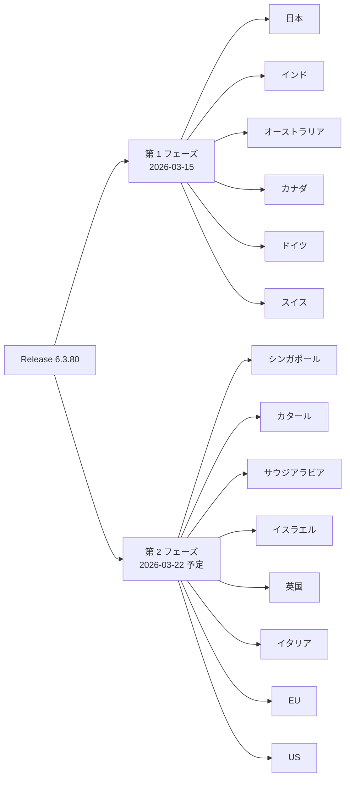

# Google SecOps SOAR: Release 6.3.80 のロールアウト開始

**リリース日**: 2026-03-15

**サービス**: Google SecOps SOAR

**機能**: Release 6.3.80 - 内部およびお客様向けバグ修正

**ステータス**: Announcement

📊 [このアップデートのインフォグラフィックを見る](https://takech9203.github.io/google-cloud-news-summary/20260315-google-secops-soar-release-6-3-80.html)

## 概要

Google SecOps SOAR に対して、Release 6.3.80 のロールアウトが第 1 フェーズのリージョンで開始されました。本リリースには内部バグ修正およびお客様から報告されたバグの修正が含まれています。

Google SecOps SOAR は、Google Cloud インフラストラクチャ上に構築されたセキュリティオーケストレーション、自動化、レスポンス (SOAR) プラットフォームです。Playbook エンジンによるセキュリティワークフローの自動化、ケース管理、統合管理機能を提供し、セキュリティチームのインシデント対応効率を向上させます。今回のリリースは定期的なメンテナンスリリースであり、プラットフォームの安定性と信頼性の向上を目的としています。

前回の Release 6.3.79 (2026-03-08) に続く週次リリースであり、Google SecOps SOAR の継続的な品質改善の一環です。

## リリースのロールアウトスケジュール

Google SecOps SOAR のリリースは、2 段階のフェーズで各リージョンに展開されます。通常、日曜日にアップデートが実施され、第 2 フェーズのリージョンは第 1 フェーズの 1 週間後にアップグレードされます。

上図は Release 6.3.80 の段階的ロールアウトスケジュールを示しています。第 1 フェーズのリージョンから展開が開始され、約 1 週間後に第 2 フェーズのリージョンに適用されます。

### 第 1 フェーズのリージョン

| リージョン |
|------|
| 日本 |
| インド |
| オーストラリア |
| カナダ |
| ドイツ |
| スイス |

### 第 2 フェーズのリージョン

| リージョン |
|------|
| シンガポール |
| カタール |
| サウジアラビア |
| イスラエル |
| 英国 (ロンドン) |
| イタリア |
| EU (マルチリージョン) |
| US (マルチリージョン) |

## サービスアップデートの詳細

### 対象コンポーネント

1. **Google SecOps SOAR**
   - Release 6.3.80 には内部およびお客様向けバグ修正が含まれています
   - SOAR はセキュリティワークフローの自動化と効率化を行うプラットフォームであり、本リリースにより信頼性が向上します

### 最近のリリース履歴

| リリース | 日付 | 内容 |
|---------|------|------|
| 6.3.80 | 2026-03-15 | 内部およびお客様向けバグ修正 |
| 6.3.79 | 2026-03-08 | 内部およびお客様向けバグ修正 |
| 6.3.78 | 2026-03-01 | 内部およびお客様向けバグ修正 |
| 6.3.77 | 2026-02-22 | Publisher Agent Version 2.6.4 (Python 3.7 サポート終了) |
| 6.3.76 | 2026-02-15 | 内部およびお客様向けバグ修正 |
| 6.3.75 | 2026-02-08 | 内部およびお客様向けバグ修正 |

## メリット

### 運用面

- **プラットフォームの安定性向上**: 内部バグ修正により、Google SecOps SOAR プラットフォーム全体の動作がより安定します
- **お客様報告の問題解決**: お客様から報告された問題が修正され、日常的なセキュリティ運用がよりスムーズになります

### 技術面

- **継続的な品質改善**: 週次リリースサイクルにより、問題の早期発見と修正が可能になっています

## 考慮すべき点

- 具体的なバグ修正の詳細は公開されていません
- 第 1 フェーズのリージョン (日本、インド、オーストラリア、カナダ、ドイツ、スイス) から順次展開されるため、第 2 フェーズのリージョンでは約 1 週間後 (2026-03-22 頃) に適用されます
- 公式メンテナンスウィンドウは日曜日の 11:00 - 15:00 UTC です。メンテナンスが必ずしもサービス停止を伴うわけではありません
- レガシー SOAR API は 2026 年 6 月に完全に廃止される予定です。まだ移行されていない場合は、Chronicle API への移行を計画してください
- 所属リージョンが不明な場合は、Google SecOps の担当者に確認してください

## 関連サービス・機能

- **Google SecOps SIEM**: セキュリティテレメトリの収集、正規化、分析、検索を行うクラウドサービス。UDM (Unified Data Model) による統一的なデータモデルを使用
- **Google SecOps SOAR**: セキュリティワークフローの自動化プラットフォーム。Playbook エンジンによる自動応答、ケース管理、統合管理機能を提供
- **Google SecOps プラットフォーム**: SIEM と SOAR を統合し、脅威の検出から調査、対応までのセキュリティライフサイクル全体をカバー

## 参考リンク

- 📊 [インフォグラフィック](https://takech9203.github.io/google-cloud-news-summary/20260315-google-secops-soar-release-6-3-80.html)
- [公式リリースノート](https://docs.cloud.google.com/release-notes#March_15_2026)
- [Google SecOps SOAR リリースノート](https://docs.cloud.google.com/chronicle/docs/soar/release-notes)
- [Google SecOps SOAR 概要](https://docs.cloud.google.com/chronicle/docs/soar/overview-and-introduction/soar-overview)
- [リリースのロールアウトスケジュール](https://docs.cloud.google.com/chronicle/docs/soar/overview-and-introduction/soar-gradual-release)

## まとめ

Google SecOps SOAR Release 6.3.80 は、内部バグ修正とお客様向けバグ修正を含む定期メンテナンスリリースです。第 1 フェーズのリージョン (日本、インド、オーストラリア、カナダ、ドイツ、スイス) から順次展開されており、第 2 フェーズのリージョンには約 1 週間後の 2026-03-22 頃に適用される予定です。Google SecOps SOAR をご利用のお客様は、通常通りの運用を継続しつつ、プラットフォームの安定性向上をご活用ください。なお、レガシー SOAR API の廃止が 2026 年 6 月に予定されているため、未移行の場合は Chronicle API への移行準備を進めることを推奨します。

---

**タグ**: Google SecOps, SOAR, Release 6.3.80, Bug Fix, Security Operations, Chronicle
