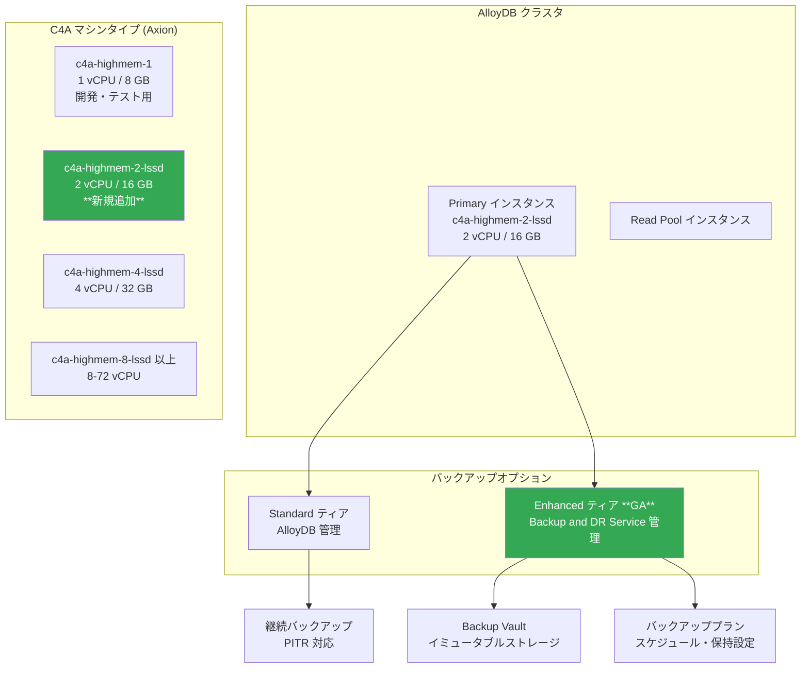

# AlloyDB for PostgreSQL: C4A 2 vCPU マシンタイプ追加と Enhanced Backups GA

**リリース日**: 2026-03-16

**サービス**: AlloyDB for PostgreSQL

**機能**: C4A 2 vCPU マシンタイプ (c4a-highmem-2-lssd) / Enhanced Backups GA

**ステータス**: GA (一般提供)

[このアップデートのインフォグラフィックを見る](https://takech9203.github.io/google-cloud-news-summary/20260316-alloydb-c4a-enhanced-backups.html)

## 概要

AlloyDB for PostgreSQL に 2 つの重要なアップデートが同時にリリースされた。1 つ目は、Google Axion プロセッサベースの C4A マシンシリーズに新たに 2 vCPU マシンタイプ (c4a-highmem-2-lssd) が追加されたこと。2 つ目は、Backup and DR Service と統合された Enhanced Backups 機能が GA (一般提供) になったことである。

C4A 2 vCPU マシンタイプの追加により、Axion ベースのインスタンスで本番ワークロードを実行する際の最小構成がより小さくなった。従来は開発・テスト用の 1 vCPU と本番向けの 4 vCPU の間に選択肢がなかったが、2 vCPU が加わることでコスト効率の高いスモールスタートが可能になる。

Enhanced Backups の GA により、クラスタ作成時に Enhanced ティアを選択でき、プロジェクトレベルのバックアップをティア別タブで管理し、Enhanced バックアップの個別削除が可能になった。これは Backup and DR Service との統合による集中管理機能であり、ランサムウェア対策やコンプライアンス要件を持つエンタープライズワークロードに特に有用である。

**アップデート前の課題**

- C4A マシンシリーズでは 1 vCPU (開発・テスト用) の次が 4 vCPU であり、小規模な本番ワークロード向けの選択肢がなかった
- 1 vCPU はアップタイム SLA が提供されず、本番環境には不向きだった
- Enhanced Backups は Preview 段階であり、本番環境での利用が制限されていた
- バックアップの集中管理やイミュータブルストレージによる保護が GA として利用できなかった

**アップデート後の改善**

- c4a-highmem-2-lssd (2 vCPU, 16 GB RAM, ローカル SSD 付き) が利用可能になり、小規模本番ワークロード向けの Axion ベースインスタンスが選択可能に
- Enhanced Backups が GA となり、クラスタ作成時にバックアップティアを選択可能に
- プロジェクトレベルでバックアップをティア別タブ (Standard / Enhanced) で管理可能に
- Enhanced バックアップの個別削除が可能に

## アーキテクチャ図



AlloyDB クラスタのマシンタイプ選択肢と、Standard / Enhanced の 2 つのバックアップティアの関係を示す。新規追加された C4A 2 vCPU マシンタイプと GA になった Enhanced Backups を緑色で強調している。

## サービスアップデートの詳細

### 主要機能

1. **C4A 2 vCPU マシンタイプ (c4a-highmem-2-lssd)**
   - Google Axion (Arm ベース) プロセッサを搭載した 2 vCPU / 16 GB RAM のマシンタイプ
   - ローカル Titanium SSD (lssd) 付きで、Ultra-fast キャッシュをサポート
   - 本番ワークロード向けの最小 Axion ベース構成として位置付け
   - 既存の N2 インスタンスから C4A への切り替えは、インスタンスの machine_type を変更するだけで可能

2. **Enhanced Backups GA**
   - Backup and DR Service との統合により、エンタープライズグレードのバックアップ管理を提供
   - クラスタ作成時に Standard または Enhanced ティアを選択可能
   - イミュータブルかつ削除不可 (indelible) なバックアップを Backup Vault に保存
   - 強制保持期間 (enforced retention) により、不正削除を防止

3. **バックアップ管理の改善**
   - プロジェクトレベルでバックアップをティア別タブで管理
   - Enhanced バックアップの個別削除が可能に
   - バックアッププランの関連付け・変更・解除がコンソールおよび gcloud CLI から操作可能

## 技術仕様

### C4A マシンタイプ比較

| マシンタイプ | vCPU | メモリ | ローカル SSD | 本番ワークロード | SLA |
|---|---|---|---|---|---|
| c4a-highmem-1 | 1 | 8 GB | なし | 非推奨 (開発・テスト用) | なし |
| c4a-highmem-2-lssd | 2 | 16 GB | あり (Titanium SSD) | 対応 | あり |
| c4a-highmem-4-lssd | 4 | 32 GB | 375 GiB | 対応 | あり |
| c4a-highmem-8-lssd | 8 | 64 GB | 750 GiB | 対応 | あり |

### バックアップティア比較

| 機能 | Standard ティア | Enhanced ティア (GA) |
|---|---|---|
| 管理主体 | AlloyDB | Backup and DR Service |
| バックアップ頻度 | 日次 (継続) / 時間・日・週 (自動) | 時間・日・週・月・年 |
| イミュータブルバックアップ | Backup Vault で対応 | Backup Vault でイミュータブル + 削除不可 |
| ソースプロジェクト削除からの保護 | 非対応 | 対応 |
| 集中管理 | 非対応 | 対応 |
| クロスリージョンリストア | 対応 | 非対応 |
| PITR (ポイントインタイムリカバリ) | 対応 | 対応 |

### 必要な権限 (Enhanced Backups)

Enhanced Backups の設定には `alloydb.backupDrAdmin` ロール、または以下の個別権限が必要:

```
backupdr.backupPlans.list
backupdr.backupPlanAssociations.createForAlloydbCluster
backupdr.backupPlanAssociations.fetchForAlloydbCluster
backupdr.backupPlanAssociations.list
backupdr.backupPlanAssociations.getForAlloydbCluster
backupdr.backupPlanAssociations.triggerBackupForAlloydbCluster
backupdr.backupPlanAssociations.deleteForAlloydbCluster
backupdr.backupPlans.useForAlloydbCluster
backupdr.bvdataSources.get
backupdr.bvdataSources.list
```

## 設定方法

### 前提条件

1. AlloyDB クラスタとインスタンスが作成済みであること
2. Enhanced Backups を使用する場合、Backup and DR API が有効化されていること
3. 適切な IAM 権限 (`alloydb.backupDrAdmin` ロールまたは個別権限) が付与されていること

### 手順

#### ステップ 1: C4A 2 vCPU マシンタイプへの変更

```bash
# 既存インスタンスのマシンタイプを C4A 2 vCPU に変更
gcloud alloydb instances update INSTANCE_ID \
  --cluster=CLUSTER_ID \
  --region=REGION \
  --machine-type=c4a-highmem-2-lssd
```

既存の N2 インスタンスから C4A に切り替える場合は、machine_type を変更する。N2 インスタンスを削除して新規作成する方法は推奨されない。

#### ステップ 2: Enhanced Backups の有効化

```bash
# Backup and DR API の有効化
gcloud services enable backupdr.googleapis.com

# バックアッププランとクラスタの関連付け
gcloud backup-dr backup-plan-associations create BPA_ID \
  --project=PROJECT_ID \
  --location=REGION \
  --resource-type=alloydb.googleapis.com/Cluster \
  --resource=projects/PROJECT_ID/locations/REGION/clusters/CLUSTER_ID \
  --backup-plan=projects/VAULT_PROJECT_ID/locations/REGION/backupPlans/BP_ID
```

Google Cloud コンソールからは、クラスタ作成時に「Show advanced options」 > 「Data Protection」 > 「Configure Backup Tier」から Enhanced backup tier を選択できる。

## メリット

### ビジネス面

- **コスト最適化**: C4A 2 vCPU により、小規模ワークロードでも Axion ベースの高い価格性能比を活用でき、本番環境のコストを抑制
- **コンプライアンス対応**: Enhanced Backups の GA により、金融・医療など規制産業で求められるイミュータブルバックアップと強制保持期間を GA 品質で利用可能
- **スケーラビリティ**: 2 vCPU から開始し、ビジネス成長に合わせて同じ C4A シリーズ内 (最大 72 vCPU) でスケールアップ可能

### 技術面

- **Axion プロセッサ**: Google 独自の Arm ベースプロセッサにより、キャッシュ適合ワークロードで最高のトランザクションスループットを提供
- **Ultra-fast キャッシュ**: lssd (ローカル Titanium SSD) 付きにより、2 vCPU 構成でも Ultra-fast キャッシュが利用可能
- **集中バックアップ管理**: Backup and DR Service との統合により、AlloyDB だけでなく Cloud SQL、Compute Engine など複数の Google Cloud ワークロードのバックアップを統一的に管理

## デメリット・制約事項

### 制限事項

- C4A マシンシリーズは限定リージョンでのみ利用可能 (asia-east1, asia-southeast1, europe-west1/2/3/4, us-central1, us-east1, us-east4)
- asia-southeast1 では 1 vCPU のみサポート (2 vCPU が利用可能かはリージョン別に確認が必要)
- Enhanced Backups はクロスリージョンリストアに対応していない (Standard ティアは対応)
- Enhanced Backups を有効化すると、既存のバックアップ・リストア設定がバックアッププランにより上書きされる

### 考慮すべき点

- N2 から C4A への切り替えは machine_type の変更で行い、インスタンスの削除・再作成は行わないこと
- Enhanced Backups 用のバックアッププランはクラスタと同じリージョンに配置する必要がある
- Backup Vault が異なるプロジェクトにある場合、Vault サービスエージェントに `backupdr.alloydbOperator` ロールを付与する必要がある

## ユースケース

### ユースケース 1: スタートアップの小規模本番データベース

**シナリオ**: スタートアップ企業が AlloyDB で本番データベースを運用したいが、初期段階では小規模なワークロードでコストを抑えたい。

**実装例**:
```bash
# C4A 2 vCPU で AlloyDB クラスタを作成
gcloud alloydb clusters create my-startup-cluster \
  --region=us-central1 \
  --password=MY_PASSWORD

gcloud alloydb instances create my-primary \
  --cluster=my-startup-cluster \
  --region=us-central1 \
  --instance-type=PRIMARY \
  --machine-type=c4a-highmem-2-lssd
```

**効果**: 4 vCPU の半分のコストで Axion ベースの高性能データベースを本番環境で運用開始でき、成長に合わせてスケールアップが可能。

### ユースケース 2: 規制産業向けのバックアップコンプライアンス

**シナリオ**: 金融機関が AlloyDB に顧客データを格納しており、バックアップの不正削除防止と長期保持が規制で求められている。

**効果**: Enhanced Backups の Backup Vault による強制保持期間とイミュータブルストレージにより、規制要件を満たすバックアップ管理が GA 品質で実現される。Backup and DR Service による集中管理で、他の Google Cloud ワークロードと統一的に監視・報告が可能になる。

## 料金

AlloyDB の料金は従量課金制で、インスタンスリソース (vCPU 数・メモリ)、ストレージ、ネットワーク Egress に基づく。C4A マシンシリーズは N2 と比較して高い価格性能比を提供する。CUD (確約利用割引) は 1 年で 25%、3 年で 52% の割引が適用される。

Enhanced Backups の料金は選択したリージョンに基づき、Backup and DR Service の料金体系に従う。クラスタ作成時にコンソールから「Compare tiers」で Standard と Enhanced の料金比較が可能。

詳細は [AlloyDB for PostgreSQL 料金ページ](https://cloud.google.com/alloydb/pricing) を参照。

## 利用可能リージョン

C4A マシンシリーズは以下のリージョンで利用可能:

| リージョン | 備考 |
|---|---|
| asia-east1 (台湾) | |
| asia-southeast1 (シンガポール) | 1 vCPU のみ |
| europe-west1 (ベルギー) | |
| europe-west2 (ロンドン) | |
| europe-west3 (フランクフルト) | |
| europe-west4 (オランダ) | |
| us-central1 (アイオワ) | |
| us-east1 (サウスカロライナ) | |
| us-east4 (バージニア) | |

Enhanced Backups は AlloyDB が利用可能なリージョンで利用可能。バックアッププランはクラスタと同一リージョンに配置する必要がある。

## 関連サービス・機能

- **Backup and DR Service**: Enhanced Backups の基盤となる Google Cloud のエンタープライズバックアップサービス。AlloyDB 以外にも Cloud SQL、Compute Engine のバックアップを集中管理
- **Google Axion (C4A)**: Google 独自設計の Arm ベースプロセッサ。Compute Engine、GKE、Dataflow など他のサービスでも C4A マシンタイプとして利用可能
- **Cloud SQL for PostgreSQL**: PostgreSQL 互換のマネージドデータベースサービス。AlloyDB と比較して、より汎用的なワークロード向け
- **Cloud Monitoring**: AlloyDB インスタンスのパフォーマンスメトリクスの監視に使用

## 参考リンク

- [インフォグラフィック](https://takech9203.github.io/google-cloud-news-summary/20260316-alloydb-c4a-enhanced-backups.html)
- [公式リリースノート](https://cloud.google.com/alloydb/docs/release-notes)
- [AlloyDB マシンタイプの選択](https://cloud.google.com/alloydb/docs/choose-machine-type)
- [AlloyDB クラスタの作成 - C4A の考慮事項](https://cloud.google.com/alloydb/docs/cluster-create#considerations-c4a)
- [Enhanced Backups の管理](https://cloud.google.com/alloydb/docs/backup/manage-enhanced-backups)
- [データバックアップとリカバリの概要](https://cloud.google.com/alloydb/docs/backup/overview)
- [料金ページ](https://cloud.google.com/alloydb/pricing)

## まとめ

今回のアップデートにより、AlloyDB for PostgreSQL は C4A 2 vCPU マシンタイプの追加で Axion ベースインスタンスの本番利用におけるエントリポイントが拡大し、Enhanced Backups の GA でエンタープライズグレードのバックアップ管理が正式に利用可能になった。小規模な本番ワークロードから始めたいチームや、規制要件に対応したバックアップ戦略を構築したい組織は、これらの機能を積極的に評価・検討することを推奨する。

---

**タグ**: #AlloyDB #PostgreSQL #C4A #GoogleAxion #Arm #EnhancedBackups #BackupAndDR #GA #データベース #バックアップ
