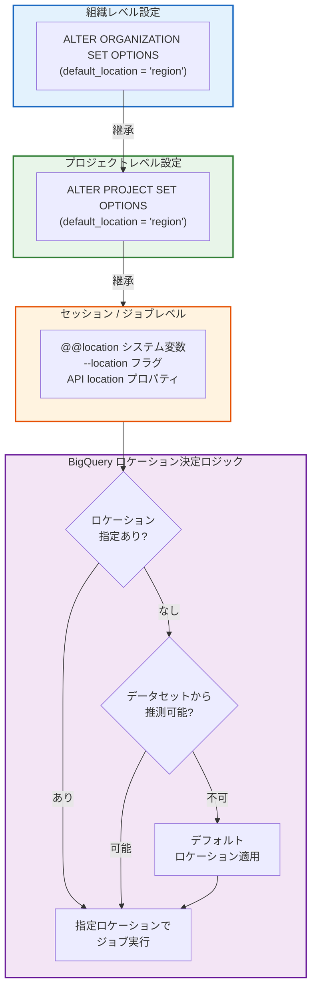

# BigQuery: グローバルデフォルトロケーション構成の GA リリース

**リリース日**: 2026-03-16

**サービス**: BigQuery

**機能**: グローバルデフォルトロケーション構成 (Global Default Location Configuration)

**ステータス**: Feature (GA)

📊 [このアップデートのインフォグラフィックを見る](https://takech9203.github.io/google-cloud-news-summary/20260316-bigquery-global-default-location.html)

## 概要

BigQuery において、グローバルデフォルトロケーションを構成できる機能が General Availability (GA) としてリリースされた。この機能により、BigQuery 管理者は組織レベルまたはプロジェクトレベルでデフォルトのロケーションを設定できるようになり、リクエストでロケーションが明示的に指定されていない場合や推測できない場合に、この設定が適用される。

従来、BigQuery ではクエリやジョブのロケーションは参照するデータセットの場所から推測されるか、ユーザーが個別に指定する必要があった。今回のアップデートにより、組織全体またはプロジェクト単位で一貫したデフォルトロケーションを設定できるようになり、データガバナンスとコンプライアンス管理が大幅に簡素化される。

この機能は、複数リージョンにまたがるデータ基盤を管理する BigQuery 管理者、データガバナンス担当者、およびセキュリティアーキテクトを主な対象としている。

**アップデート前の課題**

- ロケーションが指定されていないクエリやジョブは、データセットの場所から推測されるか、US マルチリージョンがデフォルトとして使用されるため、意図しないリージョンでの処理が発生する可能性があった
- 組織全体で一貫したロケーションポリシーを適用するには、各ユーザーやアプリケーションが個別にロケーションを指定する必要があり、管理コストが高かった
- Gemini in BigQuery のデータ処理ロケーションの制御が困難で、データレジデンシー要件を満たすために個別対応が必要であった

**アップデート後の改善**

- 組織レベルまたはプロジェクトレベルで `default_location` を設定することで、ロケーション未指定時のフォールバック先を一元管理できるようになった
- Gemini in BigQuery のデータ処理ロケーションも、このデフォルトロケーション設定に従うため、AI 機能利用時のデータガバナンスが強化された
- セッションレベルやジョブレベルでのオーバーライドも引き続き可能で、柔軟性を維持しつつデフォルトの安全性を確保できる

## アーキテクチャ図



BigQuery のロケーション決定は階層的に行われる。組織レベルのデフォルトをプロジェクトレベルで上書きでき、さらにセッションレベルやジョブレベルで個別に指定することも可能である。明示的な指定がない場合はデータセットの場所から推測を試み、それも不可能な場合にデフォルトロケーションが適用される。

## サービスアップデートの詳細

### 主要機能

1. **組織レベルのデフォルトロケーション設定**
   - `ALTER ORGANIZATION SET OPTIONS` DDL ステートメントを使用して、組織全体のデフォルトロケーションを設定
   - 組織配下のすべてのプロジェクトに継承される
   - BigQuery Admin ロール (`roles/bigquery.admin`) が必要

2. **プロジェクトレベルのデフォルトロケーション設定**
   - `ALTER PROJECT SET OPTIONS` DDL ステートメントを使用して、プロジェクト単位でデフォルトロケーションを設定
   - 組織レベルの設定をプロジェクトごとに上書き可能
   - プロジェクト ID を省略した場合、現在のプロジェクトに適用

3. **Gemini in BigQuery との統合**
   - SQL エディタやデータキャンバスでの Gemini 処理ロケーションの制御にも使用される
   - デフォルトロケーション設定により、Gemini のデータ処理が指定したリージョンの管轄境界内で実行される
   - ユーザーは BigQuery Studio のクエリロケーション設定で管理者設定をオーバーライド可能

4. **INFORMATION_SCHEMA による設定確認**
   - `INFORMATION_SCHEMA.ORGANIZATION_OPTIONS` で組織レベルの設定を確認
   - `INFORMATION_SCHEMA.PROJECT_OPTIONS` でプロジェクトレベルの設定を確認
   - `INFORMATION_SCHEMA.EFFECTIVE_PROJECT_OPTIONS` で実効的な設定（継承含む）を確認

## 技術仕様

### 設定の優先順位

| 優先度 | レベル | 設定方法 |
|--------|--------|----------|
| 最高 | ジョブレベル | API の `location` プロパティ、`--location` フラグ |
| 高 | セッションレベル | `@@location` システム変数 |
| 中 | プロジェクトレベル | `ALTER PROJECT SET OPTIONS` |
| 低 | 組織レベル | `ALTER ORGANIZATION SET OPTIONS` |

### 必要な IAM ロールと権限

| 操作 | ロール | 権限 |
|------|--------|------|
| デフォルトロケーションの設定 | BigQuery Admin (`roles/bigquery.admin`) | `bigquery.config.update` |
| 設定の参照 | BigQuery Job User (`roles/bigquery.jobUser`) | `bigquery.config.get` |

## 設定方法

### 前提条件

1. BigQuery Admin ロール (`roles/bigquery.admin`) が付与されていること
2. Google Cloud コンソールまたは BigQuery SQL エディタへのアクセス権があること

### 手順

#### ステップ 1: 組織レベルのデフォルトロケーションを設定

```sql
ALTER ORGANIZATION SET OPTIONS (
  default_location = 'asia-northeast1'
);
```

組織全体のデフォルトロケーションを東京リージョン (`asia-northeast1`) に設定する例である。

#### ステップ 2: プロジェクトレベルのデフォルトロケーションを設定（必要に応じて）

```sql
ALTER PROJECT my_project SET OPTIONS (
  default_location = 'us-central1'
);
```

特定のプロジェクトに対してデフォルトロケーションをオーバーライドする例である。プロジェクト ID を省略すると、現在のプロジェクトに適用される。

#### ステップ 3: 設定の確認

```sql
-- 組織レベルの設定を確認
SELECT * FROM INFORMATION_SCHEMA.ORGANIZATION_OPTIONS
WHERE option_name = 'default_location';

-- プロジェクトの実効設定を確認（組織設定の継承を含む）
SELECT * FROM INFORMATION_SCHEMA.EFFECTIVE_PROJECT_OPTIONS
WHERE option_name = 'default_location';
```

#### ステップ 4: 設定のクリア（必要に応じて）

```sql
-- プロジェクトレベルの設定をクリア（組織レベルの設定にフォールバック）
ALTER PROJECT SET OPTIONS (
  default_location = NULL
);
```

## メリット

### ビジネス面

- **データレジデンシーコンプライアンスの強化**: 組織ポリシーとして特定のリージョンをデフォルトに設定することで、GDPR や各国のデータ保護規制への準拠を組織的に担保できる
- **運用管理の一元化**: 各ユーザーやアプリケーションが個別にロケーションを指定する必要がなくなり、管理オーバーヘッドが削減される

### 技術面

- **意図しないリージョンでの処理を防止**: ロケーション未指定時のフォールバック先を明示的に制御でき、予期しないデータ移動やコスト増を回避できる
- **Gemini 処理ロケーションの一元管理**: AI 機能のデータ処理ロケーションもデフォルト設定に従うため、セキュリティポリシーの一貫性が向上する
- **階層的なオーバーライド**: 組織、プロジェクト、セッション、ジョブの各レベルで柔軟に設定を変更できるため、グローバル組織の多様な要件に対応可能

## デメリット・制約事項

### 制限事項

- 設定の反映には数分かかる場合があり、`INFORMATION_SCHEMA` ビューへの反映にもタイムラグがある
- デフォルトロケーション設定は新しいリクエストに適用され、既存のデータセットやテーブルのロケーションは変更されない
- 組織ポリシーとの併用が推奨されるが、デフォルトロケーション設定単体ではロケーション制限を強制するものではない（ユーザーがジョブレベルでオーバーライド可能）

### 考慮すべき点

- 組織レベルの設定変更は全プロジェクトに影響するため、変更前に影響範囲を十分に確認する必要がある
- デフォルトロケーションの設定と組織ポリシーの `constraints/gcp.resourceLocations` を組み合わせることで、より強固なロケーション制御を実現できる
- Gemini in BigQuery のロケーション制御を目的とする場合、ユーザーが BigQuery Studio で個別にクエリロケーションを設定するとオーバーライドされる点に留意

## ユースケース

### ユースケース 1: 日本国内のデータレジデンシー要件への対応

**シナリオ**: 金融機関が日本国内でのデータ処理を組織全体のデフォルトとして設定し、データレジデンシー要件を満たす。

**実装例**:
```sql
-- 組織レベルで東京リージョンをデフォルトに設定
ALTER ORGANIZATION SET OPTIONS (
  default_location = 'asia-northeast1'
);

-- 組織ポリシーと併用してロケーション制限を強制
-- (Resource Manager の組織ポリシーで設定)
```

**効果**: ロケーション未指定のクエリやジョブが自動的に東京リージョンで実行され、意図しない海外リージョンでのデータ処理を防止できる。

### ユースケース 2: グローバル組織でのリージョン別プロジェクト管理

**シナリオ**: 多国籍企業がリージョンごとに異なるプロジェクトを運用し、各プロジェクトのデフォルトロケーションを個別に設定する。

**実装例**:
```sql
-- EU 向けプロジェクト
ALTER PROJECT eu_analytics SET OPTIONS (
  default_location = 'EU'
);

-- アジア太平洋向けプロジェクト
ALTER PROJECT apac_analytics SET OPTIONS (
  default_location = 'asia-northeast1'
);

-- 米国向けプロジェクト
ALTER PROJECT us_analytics SET OPTIONS (
  default_location = 'US'
);
```

**効果**: 各リージョンのデータレジデンシー要件に合わせたデフォルトロケーションが自動適用され、クロスリージョンのデータ処理リスクを低減できる。

## 料金

BigQuery のデフォルトロケーション構成機能自体には追加料金は発生しない。ただし、BigQuery のコンピュート（クエリ処理）およびストレージの料金はロケーションによって異なる場合があるため、デフォルトロケーションの選択はコストに間接的に影響する。詳細は BigQuery の料金ページを参照のこと。

## 利用可能リージョン

デフォルトロケーションとして設定可能なリージョンは、BigQuery がサポートするすべてのリージョンおよびマルチリージョンである。主要なロケーションは以下の通り。

| 種別 | リージョン名 | 説明 |
|------|-------------|------|
| マルチリージョン | `US` | 米国内のデータセンター |
| マルチリージョン | `EU` | EU 加盟国内のデータセンター |
| シングルリージョン | `asia-northeast1` | 東京 |
| シングルリージョン | `asia-northeast2` | 大阪 |
| シングルリージョン | `us-central1` | アイオワ |
| シングルリージョン | `europe-west1` | ベルギー |

全リージョンの一覧は BigQuery ロケーションのドキュメントを参照のこと。

## 関連サービス・機能

- **BigQuery デフォルト構成管理**: デフォルトロケーション以外にも、タイムゾーン、KMS キー、クエリタイムアウト、ストレージ課金モデルなど、組織レベルおよびプロジェクトレベルで管理できる構成設定群
- **Gemini in BigQuery**: SQL エディタやデータキャンバスにおける AI 支援機能のデータ処理ロケーションがデフォルトロケーション設定に連動
- **BigQuery グローバルクエリ**: 複数リージョンにまたがるクエリ実行機能。デフォルトロケーション設定と併用することで、グローバルクエリの起点リージョンを制御可能
- **VPC Service Controls**: デフォルトロケーション設定と組み合わせることで、データの処理場所とネットワーク境界の両面からデータ保護を強化

## 参考リンク

- 📊 [インフォグラフィック](https://takech9203.github.io/google-cloud-news-summary/20260316-bigquery-global-default-location.html)
- [公式リリースノート](https://cloud.google.com/release-notes#March_16_2026)
- [ドキュメント: デフォルト構成管理](https://cloud.google.com/bigquery/docs/default-configuration)
- [ドキュメント: BigQuery ロケーション](https://cloud.google.com/bigquery/docs/locations)
- [ドキュメント: Gemini in BigQuery のデータ処理ロケーション](https://cloud.google.com/bigquery/docs/gemini-locations)
- [料金ページ](https://cloud.google.com/bigquery/pricing)

## まとめ

BigQuery のグローバルデフォルトロケーション構成が GA となったことで、組織レベルおよびプロジェクトレベルでのデータ処理ロケーションの一元管理が可能になった。データレジデンシー要件を持つ組織は、まず組織レベルでデフォルトロケーションを設定し、必要に応じてプロジェクト単位でオーバーライドする構成を推奨する。特に Gemini in BigQuery を利用している場合、AI 処理のデータロケーション制御にも直結するため、早期の設定を検討すべきである。

---

**タグ**: #BigQuery #Location #DataGovernance #Compliance #GA #Configuration #GeminiInBigQuery
