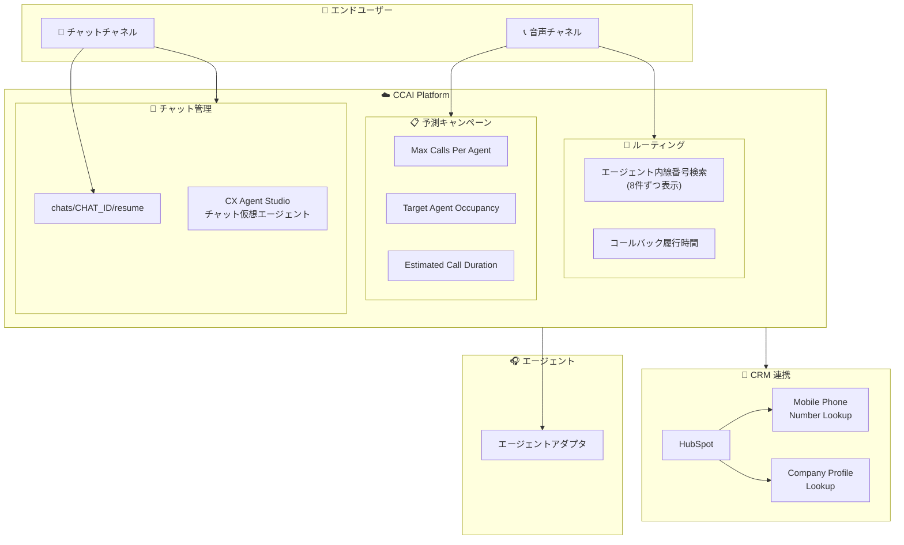

# Google Cloud CCaaS: 予測キャンペーン改善・チャット機能強化・HubSpot 連携拡張

**リリース日**: 2026-03-16

**サービス**: Google Cloud Contact Center AI Platform (CCaaS)

**機能**: 予測キャンペーンの制御強化、チャットセッション再開 API、HubSpot 連携拡張、CX Agent Studio チャット仮想エージェント、コールバック履行時間設定、エージェント内線番号検索改善、バグ修正

**ステータス**: Feature / Fixed

:bar_chart: [このアップデートのインフォグラフィックを見る](https://takech9203.github.io/google-cloud-news-summary/20260316-ccaas-predictive-campaigns-chat-features.html)

## 概要

Google Cloud CCaaS (Contact Center AI Platform) の 2026 年 3 月 16 日リリースでは、予測キャンペーンの精度向上、チャットセッション管理の柔軟性強化、HubSpot CRM 連携の拡張など、複数の重要な機能強化が行われた。これらのアップデートは、コンタクトセンター運営の効率化とカスタマーエクスペリエンスの向上を目的としている。

特に注目すべきは、予測キャンペーンにおける新しいダイヤル制御パラメータ (Max Calls Per Agent、Target Agent Occupancy) の追加と、チャットセッションを再開できる新しい API エンドポイント (chats/CHAT_ID/resume) の導入である。また、CX Agent Studio を使用したチャット仮想エージェントの作成サポートにより、ノーコード/ローコードでのチャットボット構築が可能になった。

対象ユーザーは、CCAI Platform を利用するコンタクトセンター管理者、開発者、および Solutions Architect である。

**アップデート前の課題**

- 予測キャンペーンでは過剰ダイヤルによる通話放棄のリスクを細かく制御する手段が限られていた
- チャットセッションが dismissed または va_dismissed ステータスになると再開する方法がなく、エンドユーザーは新規セッションを開始する必要があった
- HubSpot 連携では携帯電話番号フィールドの検索や Company プロファイルに対するルックアップがサポートされていなかった
- チャット仮想エージェントの作成には Dialogflow の直接操作が必要で、非技術者にとってハードルが高かった
- コールバックの履行時間を制限する手段がなく、営業時間外にもコールバックが発生する可能性があった
- エージェント内線番号検索で複数の一致がある場合、全件を一度に読み上げるため、正しいエージェントにたどり着くまでに時間がかかっていた

**アップデート後の改善**

- Max Calls Per Agent と Target Agent Occupancy により、ダイヤルレートをより自然かつ一貫して制御可能になった
- chats/CHAT_ID/resume エンドポイントにより、過去のチャット履歴を保持したままセッションを再開可能になった
- HubSpot の Mobile Phone Number Lookup と Company プロファイルルックアップにより、発信者の正確な識別が向上した
- CX Agent Studio でチャット仮想エージェントを直接作成でき、ノーコード開発が可能になった
- コールバック履行時間を設定し、翌日への繰り越しも制御可能になった
- エージェント内線番号の一致結果が 8 件ずつのグループで読み上げられ、正しいエージェントへの到達が高速化した

## アーキテクチャ図



CCAI Platform の今回のアップデートにおける主要コンポーネントの関係を示す。エンドユーザーからの音声・チャットチャネルは CCAI Platform 内の各機能モジュールを経由し、CRM 連携やエージェントへのルーティングが行われる。

## サービスアップデートの詳細

### 主要機能

1. **予測キャンペーンの制御強化**
   - **Max Calls Per Agent**: エージェントあたりの最大同時発信数を設定し、過剰ダイヤルを抑制
   - **Target Agent Occupancy**: 目標エージェント稼働率を設定し、ダイヤルレートをより自然に調整
   - **Estimated Call Duration の計算方法変更**: より正確な通話時間予測に基づくダイヤル制御
   - **Max Abandonment % の任意化**: 最大放棄率の設定が任意になり、放棄率管理が不要なキャンペーンでは省略可能
   - 管理者は Campaigns > Add Campaign > Mode > Predictive で新しい制御パラメータを設定可能

2. **チャットセッション再開エンドポイント (Resume Chat)**
   - 新しい `chats/CHAT_ID/resume` エンドポイントで、dismissed または va_dismissed ステータスのチャットセッションを再開
   - 再開されたセッションでは、エンドユーザーとエージェントの両方にチャット履歴が表示される
   - 既存の Chat Platform API に追加される新しいエンドポイント

3. **CX Agent Studio によるチャット仮想エージェント作成**
   - CCAI Platform で CX Agent Studio を使用してチャット仮想エージェントを直接作成可能
   - CX Agent Studio は AI 支援のローコード会話エージェントビルダーであり、Agent Development Kit (ADK) 上に構築されている
   - 非技術者でもビジュアルビルダーを使用してチャットボットを構築可能

4. **HubSpot: Mobile Phone Number Lookup**
   - Settings > Developer Settings > CRM の Phone Number Lookup セクションで Mobile phone number lookup を有効化
   - 有効化すると、着信時に HubSpot の "Phone number" と "Mobile phone number" の両方のフィールドを自動検索
   - 音声セッションとチャットセッションの両方で動作

5. **HubSpot: Company プロファイルルックアップ**
   - HubSpot 連携で Company プロファイルに対するルックアップをサポート
   - プライマリおよびセカンダリのルックアップオブジェクトを設定可能
   - Contacts と Companies の両方でエンドユーザーを検索し、正確な識別を実現

6. **コールバック履行時間 (Callback Fulfillment Hours)**
   - コールバックを履行する時間帯を設定可能
   - コールバックの翌日繰り越し (rollover) を有効/無効に設定可能
   - 繰り越しを無効にした場合、営業時間外のコールバックはキャンセルされる
   - デフォルトでは利用不可。利用するには Google の担当者にインスタンスでの有効化を依頼する必要がある

7. **エージェント内線番号検索の改善**
   - 複数のエージェントが一致する場合、8 件ずつのグループで読み上げ
   - 新しい内線ディレクトリメッセージの追加: "Multiple agents found"、"Search results next page"、"End of search results"
   - エンドユーザーが正しいエージェントにより早く到達可能

8. **バグ修正**
   - Zendesk の click-to-dial が正しく動作しない問題を修正
   - Brightspeed の CRM リンクに関する問題を修正

## 技術仕様

### 予測キャンペーンの新しい制御パラメータ

| パラメータ | 説明 | 用途 |
|-----------|------|------|
| Max Calls Per Agent | エージェントあたりの最大同時発信数 | 過剰ダイヤルの直接的な制限 |
| Target Agent Occupancy | 目標エージェント稼働率 | ダイヤルレートの最適化 |
| Max Abandonment % (任意化) | 最大通話放棄率 | 放棄率の上限管理 (米国では 30 日間で 3% 以下が推奨) |
| Overdial Adjustment Multiplier | オーバーダイヤル調整倍率 (1-10) | アルゴリズムの調整速度 |

### Resume Chat API エンドポイント

| 項目 | 詳細 |
|------|------|
| エンドポイント | `chats/CHAT_ID/resume` |
| 対象ステータス | `dismissed`, `va_dismissed` |
| 動作 | チャット履歴を保持したままセッションを再開 |
| 履歴表示 | エンドユーザーとエージェントの両方に表示 |

### HubSpot 連携の拡張

| 機能 | 設定場所 | 検索対象 |
|------|---------|---------|
| Mobile Phone Number Lookup | Settings > Developer Settings > CRM | Phone number + Mobile phone number |
| Company Profile Lookup | CRM 連携設定 | Contacts + Companies (プライマリ/セカンダリ) |

## 設定方法

### 前提条件

1. CCAI Platform インスタンスが稼働していること
2. 管理者権限を持つアカウントでポータルにアクセスできること
3. コールバック履行時間機能については Google 担当者による有効化が必要

### 手順

#### ステップ 1: 予測キャンペーンの制御設定

CCAI Platform ポータルで Campaigns > Add Campaign を選択し、Mode で Predictive を選択する。新しい制御パラメータ (Max Calls Per Agent、Target Agent Occupancy) がダイアログに表示されるので、運用要件に応じて値を設定する。

#### ステップ 2: HubSpot Mobile Phone Number Lookup の有効化

CCAI Platform ポータルで Settings > Developer Settings > CRM に移動し、Phone Number Lookup セクションの "Mobile phone number lookup" チェックボックスを有効にする。

#### ステップ 3: HubSpot Company プロファイルルックアップの設定

CRM 連携設定でプライマリおよびセカンダリのルックアップオブジェクトを設定し、Contacts と Companies の両方を検索対象にする。

#### ステップ 4: Resume Chat API の利用

```
POST /chats/{CHAT_ID}/resume
```

dismissed または va_dismissed ステータスのチャットセッションに対して上記エンドポイントを呼び出すことで、セッションを再開できる。

## メリット

### ビジネス面

- **通話放棄率の低減**: 予測キャンペーンの新しい制御パラメータにより、過剰ダイヤルによる通話放棄を削減し、コンプライアンスリスクを低減
- **カスタマーエクスペリエンスの向上**: チャットセッション再開により、エンドユーザーが同じ内容を繰り返す必要がなくなり、顧客満足度が向上
- **CRM 連携の精度向上**: HubSpot の Mobile Phone Number Lookup と Company ルックアップにより、発信者の正確な識別が可能になり、パーソナライズされた対応が実現
- **コールバック運用の最適化**: 履行時間の制御により、営業時間外の不要なコールバック発信を防止

### 技術面

- **API の拡張性**: Resume Chat エンドポイントにより、チャットセッションのライフサイクル管理がプログラマブルに制御可能
- **ノーコード開発**: CX Agent Studio によるチャット仮想エージェント作成で、Dialogflow の直接操作が不要
- **ルーティング効率の改善**: エージェント内線番号検索の 8 件ずつのグループ表示により、IVR の操作効率が向上

## デメリット・制約事項

### 制限事項

- コールバック履行時間機能はデフォルトでは利用不可。Google 担当者にインスタンスでの有効化を依頼する必要がある
- Resume Chat API は dismissed と va_dismissed ステータスのセッションのみが対象
- API レート制限は 10 リクエスト/秒/カスタマー

### 考慮すべき点

- 予測キャンペーンの新しいパラメータは既存のキャンペーン設定に影響する可能性があるため、段階的に導入することを推奨
- HubSpot の Mobile Phone Number Lookup を有効にすると、検索対象フィールドが増えるため、重複コンタクトの検出に注意が必要
- CX Agent Studio で作成したチャット仮想エージェントは、既存の Dialogflow ベースの仮想エージェントと併用する場合のキュー設計を検討する必要がある

## ユースケース

### ユースケース 1: アウトバウンドセールスキャンペーンの最適化

**シナリオ**: アウトバウンドセールスチームが大量のリードリストに対して予測キャンペーンを実施しているが、過剰ダイヤルにより通話放棄率が規制上限に近づいている。

**実装例**:
- Max Calls Per Agent を 2 に設定し、エージェントあたりの同時発信を制限
- Target Agent Occupancy を 85% に設定し、エージェントの稼働率を最適化
- Estimated Call Duration の改善された計算により、より正確なダイヤルタイミングを実現

**効果**: 通話放棄率を規制上限以下に維持しながら、エージェントの待機時間を最小化し、キャンペーン効率を向上

### ユースケース 2: チャットサポートの継続性向上

**シナリオ**: EC サイトのカスタマーサポートで、エンドユーザーがチャット中にブラウザを閉じてしまい、後から問い合わせを再開したいケースが頻発している。

**実装例**:
```
POST /chats/{CHAT_ID}/resume
```
エンドユーザーが再訪問した際に、前回の CHAT_ID を使用して resume エンドポイントを呼び出し、チャット履歴を表示した状態でセッションを再開する。

**効果**: エンドユーザーが同じ問題を最初から説明し直す必要がなくなり、解決時間の短縮と顧客満足度の向上を実現

### ユースケース 3: HubSpot を活用した顧客識別の精度向上

**シナリオ**: B2B コンタクトセンターで、HubSpot に登録された顧客が携帯電話から問い合わせるケースが多く、固定電話番号のみの検索では正しいコンタクトと紐付けられない。

**効果**: Mobile Phone Number Lookup と Company Profile Lookup を組み合わせることで、個人と企業の両方のレベルで正確な顧客識別が可能になり、パーソナライズされた対応が実現

## 料金

CCAI Platform の料金はインスタンスサイズと課金モデルに基づく。課金モデルは以下の 3 種類がある。

| 課金モデル | 説明 |
|-----------|------|
| Concurrent agents | 月間の最大同時ログインエージェント数 |
| Named agents | エージェントロールを持つユーザー総数 |
| Minutes used | エージェントロールのユーザーのログイン分数 |

テレフォニー料金は使用量に応じて別途課金される。非本番インスタンス (Trial、Sandbox、Dev) はテレフォニーを除き無料で利用可能。

詳細な料金については Google Cloud 営業担当または [Google Cloud Partner](https://cloud.google.com/find-a-partner/?specializations=Contact%20Center%20AI%20-%20Services) に問い合わせが必要。

## 利用可能リージョン

CCAI Platform の利用可能な国とリージョンについては、[公式ロケーションページ](https://cloud.google.com/contact-center/ccai-platform/docs/localities)を参照。

## 関連サービス・機能

- **CX Agent Studio (Customer Experience Agent Studio)**: AI 支援のローコード会話エージェントビルダー。Agent Development Kit (ADK) 上に構築され、チャットおよび音声の仮想エージェントを作成可能
- **Dialogflow CX**: 高度な仮想エージェント構築のためのプラットフォーム。CX Agent Studio はその進化形として位置づけられる
- **Customer Experience Insights (CCAI Insights)**: 自然言語処理を使用して通話ドライバー、感情分析、顧客インタラクションの情報を分析
- **Agent Assist**: 通話やチャット中にリアルタイムでエージェントを支援し、インテントの特定やステップバイステップのガイダンスを提供
- **HubSpot CRM**: CCAI Platform と連携する CRM プラットフォーム。今回のアップデートで Mobile Phone Number Lookup と Company Profile Lookup が追加

## 参考リンク

- :bar_chart: [インフォグラフィック](https://takech9203.github.io/google-cloud-news-summary/20260316-ccaas-predictive-campaigns-chat-features.html)
- [公式リリースノート](https://cloud.google.com/contact-center/ccai-platform/docs/release-notes)
- [CCAI Platform 概要](https://cloud.google.com/contact-center/ccai-platform/docs)
- [予測キャンペーン ドキュメント](https://cloud.google.com/contact-center/ccai-platform/docs/campaign-predictive)
- [Chat Platform API エンドポイント](https://cloud.google.com/contact-center/ccai-platform/docs/chat-platform-api-endpoints)
- [仮想エージェント ドキュメント](https://cloud.google.com/contact-center/ccai-platform/docs/virtual-agent)
- [CX Agent Studio 概要](https://cloud.google.com/customer-engagement-ai/conversational-agents/ps)
- [営業時間設定](https://cloud.google.com/contact-center/ccai-platform/docs/hours-of-operation)
- [利用開始ガイド](https://cloud.google.com/contact-center/ccai-platform/docs/get-started)

## まとめ

今回の CCAI Platform アップデートは、予測キャンペーンの制御精度向上、チャットセッション管理の柔軟性強化、CRM 連携の拡張と、コンタクトセンター運営の多方面にわたる改善を提供する。特に、Max Calls Per Agent と Target Agent Occupancy による予測キャンペーンの細かな制御と、Resume Chat API によるチャットセッションの継続性向上は、顧客体験とオペレーション効率の両面で大きな価値をもたらす。CCAI Platform を利用中の管理者は、予測キャンペーンの新しい制御パラメータの導入と HubSpot 連携の拡張設定を優先的に検討することを推奨する。

---

**タグ**: #GoogleCloud #CCaaS #CCAI-Platform #ContactCenter #PredictiveCampaign #ChatAPI #HubSpot #CXAgentStudio #VirtualAgent #Callback
