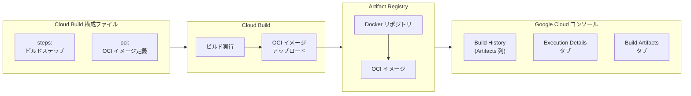

# Cloud Build: OCI イメージの Artifact Registry へのアップロード対応

**リリース日**: 2026-03-16

**サービス**: Cloud Build

**機能**: OCI イメージの Artifact Registry へのアップロード

**ステータス**: Feature

📊 [このアップデートのインフォグラフィックを見る](https://takech9203.github.io/google-cloud-news-summary/20260316-cloud-build-oci-image-artifact-registry.html)

## 概要

Cloud Build がビルドプロセス中に OCI (Open Container Initiative) イメージを Artifact Registry にアップロードする機能をサポートした。これにより、ビルド構成ファイル内で `oci` フィールドを使用して、OCI 準拠のイメージをビルド完了後に自動的に Artifact Registry へ保存できるようになった。

OCI は、コンテナイメージのフォーマットとランタイムに関するオープンな業界標準仕様であり、Docker イメージフォーマットに代わる標準として広く採用が進んでいる。今回のアップデートにより、Cloud Build のネイティブ機能として OCI イメージの管理が可能となり、マルチプラットフォーム対応やサプライチェーンセキュリティの強化を目指す開発チームにとって有用な機能拡張となる。

ビルドで生成された OCI アーティファクトは、Google Cloud コンソール上のビルド履歴ページの「Artifacts」列、ビルド詳細ページの「Execution details」タブ、およびビルド詳細ページの「Build artifacts」タブの 3 箇所で確認できる。

**アップデート前の課題**

- Cloud Build のビルド構成ファイルで OCI イメージを直接指定してアップロードする標準的な手段が提供されていなかった
- OCI イメージを Artifact Registry に保存するには、ビルドステップ内で明示的に `docker push` や `crane`、`oras` などの外部ツールを使用する必要があった
- 外部ツールを使用した場合、ビルド結果画面に OCI アーティファクト情報が表示されず、成果物の追跡が困難だった

**アップデート後の改善**

- ビルド構成ファイルの `oci` フィールドを使用して、宣言的に OCI イメージのアップロードを指定できるようになった
- ビルド完了後に自動的に OCI イメージが Artifact Registry に保存され、ビルド結果画面でアーティファクト情報が確認可能になった
- Google Cloud コンソール上の 3 箇所 (ビルド履歴、実行詳細、ビルドアーティファクト) で OCI アーティファクトの状態を可視化できるようになった

## アーキテクチャ図



Cloud Build がビルド構成ファイルの `oci` フィールドに基づいて OCI イメージをビルドし、Artifact Registry の Docker リポジトリにアップロードする流れを示している。アップロードされた OCI アーティファクトは Google Cloud コンソールの複数の画面から確認可能である。

## サービスアップデートの詳細

### 主要機能

1. **ビルド構成ファイルでの `oci` フィールドサポート**
   - Cloud Build の構成ファイル (cloudbuild.yaml / cloudbuild.json) に新しい `oci` フィールドが追加された
   - 宣言的にOCI イメージのアップロード先リポジトリやイメージ名を指定可能
   - 既存の `images` フィールドや `artifacts` フィールドと同様の使い勝手で OCI イメージを管理できる

2. **ビルド完了後の自動アップロード**
   - ビルドプロセス完了時に、指定した OCI イメージが自動的に Artifact Registry にアップロードされる
   - ビルドステップ内で手動の push コマンドを記述する必要がなくなった
   - アップロード結果がビルドの成果物として正式に記録される

3. **Google Cloud コンソールでのアーティファクト表示**
   - ビルド履歴ページの「Artifacts」列に OCI アーティファクト情報が表示される
   - ビルド詳細ページの「Execution details」タブでアーティファクトの詳細を確認できる
   - ビルド詳細ページの「Build artifacts」タブでアーティファクト一覧を閲覧できる

## 技術仕様

### OCI (Open Container Initiative) の概要

| 項目 | 詳細 |
|------|------|
| 仕様 | OCI Image Format Specification |
| ベース | Docker Image Manifest V2, Schema 2 |
| 対応リポジトリ | Artifact Registry の Docker リポジトリ |
| 設定フィールド | ビルド構成ファイルの `oci` フィールド |
| 表示箇所 | Build History、Execution Details、Build Artifacts |

### Cloud Build 構成ファイルでの OCI 設定

既存の `images` フィールドとの関係を含め、Cloud Build 構成ファイルのアーティファクト関連フィールドは以下の通りである。

```yaml
steps:
  - name: 'gcr.io/cloud-builders/docker'
    args: ['build', '-t', 'LOCATION-docker.pkg.dev/PROJECT_ID/REPOSITORY/IMAGE', '.']

# 従来の Docker イメージ保存
images:
  - 'LOCATION-docker.pkg.dev/PROJECT_ID/REPOSITORY/IMAGE'

# 新機能: OCI イメージの保存
oci:
  # OCI イメージの設定 (詳細はドキュメント参照)
```

## 設定方法

### 前提条件

1. Cloud Build API が有効化されていること
2. Artifact Registry に Docker リポジトリが作成済みであること
3. Cloud Build サービスアカウントに Artifact Registry Writer ロールが付与されていること (同一プロジェクト内であればデフォルトで付与済み)

### 手順

#### ステップ 1: Artifact Registry リポジトリの作成

```bash
gcloud artifacts repositories create REPOSITORY \
  --repository-format=docker \
  --location=LOCATION \
  --description="OCI image repository"
```

対象の Docker リポジトリが存在しない場合は、先にリポジトリを作成する。`LOCATION` にはリージョン (例: `us-central1`) またはマルチリージョン (例: `us`) を指定する。

#### ステップ 2: ビルド構成ファイルの作成

```yaml
steps:
  - name: 'gcr.io/cloud-builders/docker'
    args:
      - 'build'
      - '-t'
      - 'LOCATION-docker.pkg.dev/PROJECT_ID/REPOSITORY/IMAGE_NAME'
      - '.'
```

ビルド構成ファイルに OCI イメージのビルドステップと `oci` フィールドの設定を追加する。詳細な `oci` フィールドのスキーマ定義については、Cloud Build 構成ファイルスキーマのドキュメントを参照すること。

#### ステップ 3: ビルドの実行

```bash
gcloud builds submit --config=cloudbuild.yaml .
```

ビルドを実行すると、OCI イメージが自動的に Artifact Registry にアップロードされる。

## メリット

### ビジネス面

- **運用効率の向上**: ビルドパイプライン内で OCI イメージの保存を宣言的に管理できるため、CI/CD パイプラインの構成がシンプルになり、メンテナンスコストが削減される
- **可視性の向上**: Google Cloud コンソールの複数箇所で OCI アーティファクトを確認できるため、ビルド成果物の追跡と監査が容易になる

### 技術面

- **標準準拠**: OCI 標準に準拠したイメージ管理により、ベンダーロックインのリスクを低減し、マルチクラウド環境での互換性を確保できる
- **ビルドパイプラインの簡素化**: 外部ツール (`crane`、`oras` 等) を使用したカスタムビルドステップが不要になり、構成ファイルのみで完結する
- **成果物の一元管理**: `images` フィールドによる Docker イメージと同様に、OCI イメージもビルド結果に紐付けて管理できる

## デメリット・制約事項

### 制限事項

- Artifact Registry の Docker リポジトリのみが対象であり、他の形式のリポジトリには OCI イメージを保存できない
- Artifact Registry はチャンクアップロードをサポートしておらず、モノリシックアップロードを使用する必要がある。大容量イメージの場合はアップロード時間に影響する可能性がある

### 考慮すべき点

- 既存のビルドパイプラインで `docker push` を使用して OCI イメージをアップロードしている場合は、`oci` フィールドへの移行を検討する必要がある
- `oci` フィールドの詳細なスキーマ定義については公式ドキュメントで最新情報を確認すること

## ユースケース

### ユースケース 1: マルチプラットフォームコンテナイメージの配布

**シナリオ**: 開発チームが AMD64 と ARM64 の両方のアーキテクチャ向けにコンテナイメージをビルドし、OCI Image Index として Artifact Registry に保存する。

**実装例**:
```yaml
steps:
  - name: 'gcr.io/cloud-builders/docker'
    args:
      - 'buildx'
      - 'build'
      - '--platform=linux/amd64,linux/arm64'
      - '-t'
      - 'us-central1-docker.pkg.dev/my-project/my-repo/my-app:latest'
      - '.'
```

**効果**: OCI 標準のマルチプラットフォームイメージを Cloud Build のネイティブ機能で管理でき、GKE のマルチアーキテクチャクラスタへのデプロイが効率化される。

### ユースケース 2: サプライチェーンセキュリティの強化

**シナリオ**: セキュリティ要件が厳格な組織が、ビルド成果物の来歴 (provenance) を追跡するために、OCI イメージとしてビルドアーティファクトを Artifact Registry に保存し、Artifact Analysis と連携させる。

**効果**: ビルド結果画面での OCI アーティファクトの可視化により、どのビルドからどのイメージが生成されたかを正確に追跡でき、Binary Authorization との統合も容易になる。

## 料金

Cloud Build での OCI イメージアップロード機能自体には追加料金は発生しない。ただし、以下の既存サービスの料金が適用される。

| サービス | 料金体系 |
|----------|----------|
| Cloud Build | ビルド時間に基づく従量課金 (120 ビルド分/日の無料枠あり) |
| Artifact Registry ストレージ | 保存容量に基づく従量課金 (0.10 USD/GiB) |
| Artifact Registry ネットワーク | データ転送量に基づく従量課金 |

詳細は [Cloud Build の料金ページ](https://cloud.google.com/build/pricing) および [Artifact Registry の料金ページ](https://cloud.google.com/artifact-registry/pricing) を参照すること。

## 関連サービス・機能

- **Artifact Registry**: OCI イメージの保存先となるフルマネージドのアーティファクト管理サービス。Docker イメージ、OCI イメージ、言語パッケージなど複数のフォーマットをサポートする
- **Artifact Analysis**: コンテナイメージの脆弱性スキャンやメタデータ管理を提供し、OCI イメージに対する SBOM (Software Bill of Materials) の生成や脆弱性情報の付与が可能
- **Binary Authorization**: ビルド来歴の検証とデプロイポリシーの適用により、信頼されたイメージのみが本番環境にデプロイされることを保証する
- **Google Kubernetes Engine (GKE)**: Artifact Registry に保存された OCI イメージを直接プルしてコンテナワークロードを実行する。イメージストリーミング機能により大容量イメージの起動時間を短縮可能

## 参考リンク

- 📊 [インフォグラフィック](https://takech9203.github.io/google-cloud-news-summary/20260316-cloud-build-oci-image-artifact-registry.html)
- [公式リリースノート](https://cloud.google.com/release-notes#March_16_2026)
- [Cloud Build でのアーティファクト保存](https://cloud.google.com/build/docs/building/store-artifacts-in-artifact-registry)
- [Cloud Build 構成ファイルスキーマ](https://cloud.google.com/build/docs/build-config-file-schema)
- [Artifact Registry でのコンテナイメージ管理](https://cloud.google.com/artifact-registry/docs/docker)
- [OCI 仕様 (Artifact Registry 対応フォーマット)](https://cloud.google.com/artifact-registry/docs/supported-formats)
- [Cloud Build の料金](https://cloud.google.com/build/pricing)
- [Artifact Registry の料金](https://cloud.google.com/artifact-registry/pricing)

## まとめ

Cloud Build に OCI イメージの Artifact Registry へのアップロード機能が追加されたことで、OCI 標準に準拠したコンテナイメージをビルドパイプライン内で宣言的に管理できるようになった。この機能は、マルチプラットフォーム対応やサプライチェーンセキュリティの強化を推進する組織にとって重要なアップデートである。既存のビルドパイプラインで外部ツールを使用して OCI イメージを管理している場合は、新しい `oci` フィールドへの移行を検討することを推奨する。

---

**タグ**: Cloud Build, Artifact Registry, OCI, コンテナイメージ, CI/CD, DevOps
