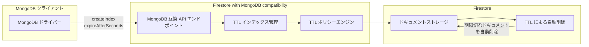

# Firestore with MongoDB compatibility: MongoDB API による TTL インデックス管理のサポート

**リリース日**: 2026-03-16

**サービス**: Firestore with MongoDB compatibility

**機能**: MongoDB API による TTL インデックス管理のサポート

**ステータス**: GA

📊 [このアップデートのインフォグラフィックを見る](https://takech9203.github.io/google-cloud-news-summary/20260316-firestore-mongodb-ttl-indexes.html)

## 概要

Firestore with MongoDB compatibility において、MongoDB API を通じた TTL (Time-To-Live) インデックスの管理が新たにサポートされた。これにより、MongoDB の標準的なドライバーやツールから直接 TTL インデックスを作成・管理できるようになり、既存の MongoDB アプリケーションコードをより少ない変更で Firestore に移行できるようになった。

TTL インデックスは、指定されたフィールドの有効期限に基づいてドキュメントを自動的に削除する機能である。セッションデータ、一時キャッシュ、ログデータなど、一定期間後に不要となるデータの管理に広く使われている。これまで Firestore with MongoDB compatibility では TTL ポリシー自体は Google Cloud コンソールや gcloud CLI から設定可能であったが、MongoDB API 経由での TTL インデックス管理はサポートされていなかった。

本アップデートの対象ユーザーは、MongoDB 互換 API を使用して Firestore にアクセスしているアプリケーション開発者、および MongoDB から Firestore への移行を検討している組織である。

**アップデート前の課題**

- MongoDB API の `createIndexes` コマンドにおいて TTL インデックスプロパティがサポートされておらず、MongoDB ドライバーから TTL インデックスを作成できなかった
- TTL ポリシーの設定には Google Cloud コンソールまたは gcloud CLI を使用する必要があり、MongoDB の標準的なワークフローから外れた操作が必要だった
- 既存の MongoDB アプリケーションで TTL インデックスを使用している場合、移行時にインデックス管理コードの書き換えが必要だった

**アップデート後の改善**

- MongoDB API の標準的なコマンド (`createIndex` / `createIndexes`) を使用して TTL インデックスを作成できるようになった
- 既存の MongoDB アプリケーションの TTL インデックス管理コードをそのまま Firestore with MongoDB compatibility で利用可能になった
- MongoDB ドライバーを通じた統一的なインデックス管理が実現し、運用の一貫性が向上した

## アーキテクチャ図



MongoDB ドライバーから `createIndex` コマンドで `expireAfterSeconds` オプションを指定することにより、Firestore with MongoDB compatibility 上で TTL インデックスが作成され、期限切れドキュメントが自動的に削除される。

## サービスアップデートの詳細

### 主要機能

1. **MongoDB API 経由の TTL インデックス作成**
   - MongoDB の `createIndex()` メソッドで `expireAfterSeconds` オプションを指定して TTL インデックスを作成可能
   - 既存の MongoDB ドライバー (pymongo, mongosh, Node.js driver 等) からそのまま利用可能

2. **TTL による自動ドキュメント削除**
   - 指定されたフィールドの値 (Date 型) に基づいて、有効期限を過ぎたドキュメントが自動的に削除される
   - 削除は通常、有効期限から 24 時間以内に実行される
   - TTL 削除はデータベースの他の操作への影響を最小限に抑えるよう低優先度で処理される

3. **TTL インデックスの管理操作**
   - `listIndexes` コマンドで TTL インデックスの確認が可能
   - `dropIndexes` コマンドで TTL インデックスの削除が可能
   - Google Cloud コンソールおよび gcloud CLI からも引き続き管理可能

## 技術仕様

### TTL インデックスの制約

| 項目 | 詳細 |
|------|------|
| TTL フィールド数 | コレクションあたり 1 フィールドのみ |
| フィールドレベル TTL 設定数上限 | 最大 500 |
| 対応フィールド型 | Date and time / BSON Date 値、または Date 値を含む配列 |
| 削除タイミング | 有効期限から通常 24 時間以内 |
| 削除の順序保証 | 有効期限のタイムスタンプ順での削除は保証されない |
| トランザクション削除 | TTL 削除はトランザクショナルではない |

### TTL フィールドとインデックスの関係

TTL フィールドはインデックス付きまたはインデックスなしのいずれでも使用可能である。ただし、TTL フィールドはタイムスタンプであるため、インデックスを付与するとトラフィック量が多い場合にホットスポットが発生する可能性がある点に注意が必要である。

## 設定方法

### 前提条件

1. Firestore with MongoDB compatibility が有効なプロジェクトが存在すること
2. 以下のいずれかの IAM ロールが付与されていること: `roles/datastore.owner`、`roles/datastore.indexAdmin`、`roles/editor`、`roles/owner`

### 手順

#### ステップ 1: MongoDB ドライバーで TTL インデックスを作成

```javascript
// mongosh または MongoDB ドライバーを使用
db.sessions.createIndex(
  { "lastAccess": 1 },
  { expireAfterSeconds: 3600 }  // 1時間後に期限切れ
)
```

`expireAfterSeconds` に秒数を指定することで、対象フィールドの値から指定秒数後にドキュメントが自動削除される。

#### ステップ 2: TTL インデックスの確認

```javascript
// インデックス一覧の確認
db.sessions.getIndexes()
```

作成した TTL インデックスが一覧に表示されることを確認する。

#### ステップ 3: (代替) gcloud CLI での TTL ポリシー確認

```bash
# TTL ポリシーの一覧表示
gcloud firestore fields ttls list --collection-group=sessions
```

Google Cloud 側からも TTL ポリシーの状態を確認できる。

## メリット

### ビジネス面

- **移行コストの削減**: 既存の MongoDB アプリケーションで使用している TTL インデックス管理コードをそのまま利用できるため、移行に伴うコード変更が削減される
- **ストレージコストの最適化**: 不要なデータを自動削除することで、ストレージ使用量を抑制し、コストを削減できる

### 技術面

- **運用の統一**: MongoDB API を通じてインデックス管理を一元化でき、Google Cloud コンソールと MongoDB ツールを行き来する必要がなくなる
- **MongoDB エコシステムとの互換性向上**: TTL インデックスは MongoDB で広く使われている機能であり、互換性の範囲が拡大したことで、より多くの MongoDB ワークロードの移行が可能になる

## デメリット・制約事項

### 制限事項

- コレクションあたり TTL フィールドは 1 つのみに限定される
- フィールドレベルの TTL 設定はデータベース全体で最大 500 まで
- 削除は即時ではなく、通常有効期限から 24 時間以内に実行される
- TTL 削除はトランザクショナルではないため、同じ有効期限のドキュメントが同時に削除される保証はない

### 考慮すべき点

- TTL フィールドにインデックスを付与する場合、タイムスタンプフィールドのインデックスはホットスポットの原因となる可能性がある
- 既存コレクションに TTL ポリシーを適用すると、既に期限切れとなっているデータの一括削除が発生する
- TTL 削除操作はドキュメント削除コストとして課金される

## ユースケース

### ユースケース 1: セッション管理の自動クリーンアップ

**シナリオ**: Web アプリケーションのセッションデータを Firestore に保存しており、非アクティブなセッションを自動的に削除したい。

**実装例**:
```javascript
// セッションコレクションに TTL インデックスを作成
// 最終アクセスから 30 分後にセッションを自動削除
db.sessions.createIndex(
  { "lastActivity": 1 },
  { expireAfterSeconds: 1800 }
)

// セッションドキュメントの挿入
db.sessions.insertOne({
  sessionId: "abc123",
  userId: "user456",
  lastActivity: new Date(),
  data: { cart: [...] }
})
```

**効果**: セッション管理のクリーンアップ処理を自前で実装する必要がなくなり、ストレージコストも自動的に最適化される。

### ユースケース 2: 一時データ・キャッシュの有効期限管理

**シナリオ**: API レスポンスのキャッシュデータを一定期間保持した後、自動的に削除したい。MongoDB からの移行プロジェクトで、既存の TTL インデックス設定をそのまま利用する。

**効果**: 既存の MongoDB アプリケーションコードを変更することなく、Firestore with MongoDB compatibility 上で同じ TTL ベースのキャッシュ管理が実現できる。

## 料金

TTL による削除操作は、ドキュメント削除コストとして課金される。Firestore with MongoDB compatibility は Firestore Enterprise edition の一部であり、Enterprise edition の料金体系が適用される。

### 料金例 (us-central1 リージョン)

| 項目 | 料金 |
|------|------|
| 書き込みユニット (削除を含む) | $0.26 / 100 万書き込みユニット |
| 読み取りユニット | $0.05 / 100 万読み取りユニット |
| ストレージ | $0.00032 / GiB 時間 |

TTL 削除はマネージド削除サービスとして `document/billable_managed_delete_write_units` メトリクスで追跡される。

## 利用可能リージョン

Firestore with MongoDB compatibility は以下のリージョンで利用可能である。

**マルチリージョン**: eur3 (ヨーロッパ)、nam5 (米国中部)、nam7 (米国中部・東部)

**リージョン** (一部抜粋): us-central1 (アイオワ)、us-east1 (サウスカロライナ)、us-east4 (バージニア北部)、europe-west1 (ベルギー)、europe-west4 (オランダ)、asia-northeast1 (東京)、asia-northeast2 (大阪)、asia-south1 (ムンバイ)、asia-southeast1 (シンガポール) 他、全 30 以上のリージョンに対応

## 関連サービス・機能

- **Firestore Enterprise edition**: Firestore with MongoDB compatibility の基盤となるエディション。ユニットベースの料金体系とパイプライン操作をサポート
- **Cloud Monitoring**: TTL 削除の件数や削除遅延を監視するメトリクス (`ttl_deletion_count`、`ttl_expiration_to_deletion_delays`) を提供
- **Firestore ネイティブモード**: MongoDB 互換ではない標準の Firestore API。TTL ポリシーは同様にサポートされている

## 参考リンク

- 📊 [インフォグラフィック](https://takech9203.github.io/google-cloud-news-summary/20260316-firestore-mongodb-ttl-indexes.html)
- [公式リリースノート](https://cloud.google.com/release-notes#March_16_2026)
- [Firestore with MongoDB compatibility - TTL ドキュメント](https://cloud.google.com/firestore/mongodb-compatibility/docs/ttl)
- [Firestore with MongoDB compatibility - インデックス管理](https://cloud.google.com/firestore/mongodb-compatibility/docs/indexing)
- [Firestore Enterprise edition 料金](https://cloud.google.com/firestore/enterprise/pricing)

## まとめ

Firestore with MongoDB compatibility における MongoDB API 経由の TTL インデックス管理サポートは、MongoDB からの移行をさらに容易にする重要なアップデートである。既存の MongoDB アプリケーションで TTL インデックスを使用しているワークロードは、コードの変更なく Firestore に移行できるようになった。TTL インデックスを活用したデータのライフサイクル管理を必要とするアプリケーションの移行を検討している場合は、本機能の導入を推奨する。

---

**タグ**: #Firestore #MongoDB #TTL #インデックス #データベース #移行 #Firestore-Enterprise
