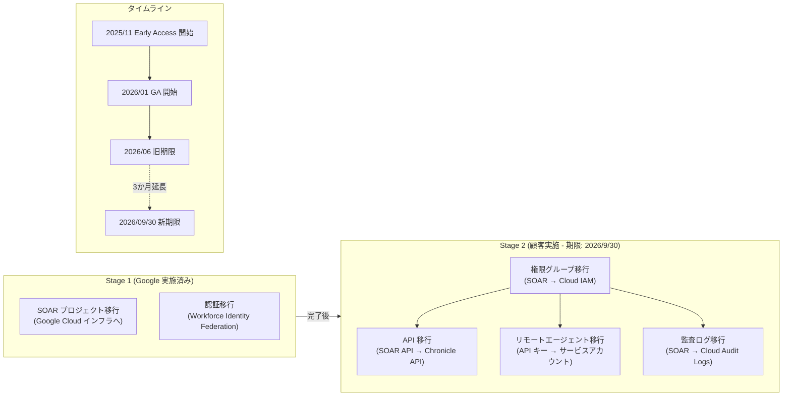

# Google SecOps: SOAR マイグレーション Phase 2 期限延長 (2026年9月30日まで)

**リリース日**: 2026-03-16

**サービス**: Google SecOps (Google Security Operations)

**機能**: SOAR マイグレーション Phase 2 完了期限の延長

**ステータス**: Announcement

[このアップデートのインフォグラフィックを見る](https://takech9203.github.io/google-cloud-news-summary/20260316-google-secops-soar-migration-phase2-extension.html)

## 概要

Google は、SOAR (Security Orchestration, Automation, and Response) インフラストラクチャの Google Cloud への移行における Stage 2 (Phase 2) の完了期限を、当初の 2026年6月30日から 2026年9月30日に延長することを発表した。この延長は、Google SecOps 統合顧客および SOAR スタンドアロン顧客の両方に適用される。

SOAR マイグレーションは、SOAR インフラストラクチャを Google Cloud に移行し、信頼性の向上、セキュリティの強化、コンプライアンスの改善、よりきめ細かいアクセス制御を実現するための重要な取り組みである。Stage 2 では、権限グループの IAM 移行、SOAR API の Chronicle API への統合、リモートエージェントの移行、監査ログの移行という 4 つの主要コンポーネントの移行が含まれており、顧客側での作業が必要となる。今回の期限延長により、これらの移行作業を計画的に進めるための追加の時間が確保された。

**アップデート前の課題**

- Stage 2 の完了期限が 2026年6月30日に設定されており、権限移行、API 移行、リモートエージェント移行、監査ログ移行の 4 つの作業を限られた期間内に完了する必要があった
- 特に大規模な組織や MSSP (マネージドセキュリティサービスプロバイダー) では、スクリプトやインテグレーションの更新に十分な時間を確保することが困難だった
- レガシー SOAR API および API キーの廃止に向けた移行テストと検証の時間が不足する懸念があった

**アップデート後の改善**

- Stage 2 の完了期限が 2026年9月30日まで 3 か月延長され、移行作業に余裕が生まれた
- レガシー SOAR API、API キー、リモートエージェント、旧 URL の利用可能期間も延長される見込み
- 顧客は移行計画を見直し、より慎重なテストと段階的な移行が可能になった

## アーキテクチャ図

SOAR マイグレーションの全体像と Stage 2 の各コンポーネント間の依存関係を示す。権限グループの IAM 移行が他のすべての Stage 2 移行タスクの前提条件となっている。

## サービスアップデートの詳細

### 主要機能

1. **Stage 2 完了期限の延長**
   - 当初の期限: 2026年6月30日
   - 新しい期限: 2026年9月30日
   - 3 か月の猶予期間が追加された

2. **Stage 2 に含まれる移行タスク**
   - **権限グループの IAM 移行**: SOAR 権限グループを Google Cloud IAM に移行。ワンクリックの移行スクリプトまたは Terraform による移行が可能
   - **SOAR API の Chronicle API 移行**: レガシー SOAR API エンドポイントを Chronicle API v1 エンドポイントに置き換え
   - **リモートエージェントの移行**: API キーからサービスアカウントへの切り替えとメジャーバージョンアップグレード
   - **監査ログの移行**: SOAR ログを Cloud Audit Logs に統合

3. **移行の前提条件**
   - Stage 1 が完了していること (Google 側で実施)
   - 権限グループの IAM 移行は、API 移行やリモートエージェント移行の前に完了する必要がある

## 技術仕様

### Stage 2 移行コンポーネントの詳細

| コンポーネント | 内容 | 移行方法 | 前提条件 |
|------|------|------|------|
| 権限グループ | SOAR 権限 → Cloud IAM | 移行スクリプト / Terraform | Stage 1 完了 |
| SOAR API | SOAR API → Chronicle API v1 | エンドポイント書き換え | 権限グループ移行完了 |
| リモートエージェント | API キー → サービスアカウント | メジャーバージョンアップグレード | Stage 1 完了 |
| 監査ログ | SOAR ログ → Cloud Audit Logs | 権限移行後に自動有効化 | 権限グループ移行完了 |

### タイムラインの変更

| マイルストーン | 日付 |
|------|------|
| Stage 2 Early Access 開始 | 2025年11月24日 |
| Stage 2 GA (全顧客利用可能) | 2026年1月26日 |
| Stage 2 旧完了期限 | 2026年6月30日 |
| Stage 2 新完了期限 | 2026年9月30日 |

## 設定方法

### 前提条件

1. Stage 1 のマイグレーションが完了していること
2. Google Cloud プロジェクトが設定済みであること
3. Chronicle API が有効化されていること

### 手順

#### ステップ 1: 権限グループの IAM 移行

Google Cloud コンソール上の移行スクリプトをワンクリックで実行するか、Terraform を使用して移行を実施する。移行スクリプトは、各権限グループに対応するカスタムロールを作成し、ユーザーまたは IdP グループに割り当てる。

詳細手順: [Migrate SOAR permissions to Google Cloud IAM](https://cloud.google.com/chronicle/docs/soar/admin-tasks/advanced/migrate-soar-permissions-iam)

#### ステップ 2: SOAR API の Chronicle API 移行

既存のスクリプトとインテグレーションにおいて、レガシー SOAR API エンドポイントを対応する Chronicle API エンドポイントに置き換える。

詳細手順: [Migrate endpoints to Chronicle API](https://cloud.google.com/chronicle/docs/soar/admin-tasks/advanced/api-migration-guide)

#### ステップ 3: リモートエージェントの移行

API キーの代わりにサービスアカウントを作成し、リモートエージェントのメジャーバージョンアップグレードを実施する。

詳細手順: [Migrate Remote Agents to Google Cloud](https://cloud.google.com/chronicle/docs/soar/working-with-remote-agents/migrate-remote-agent-to-google)

## メリット

### ビジネス面

- **移行計画の柔軟性向上**: 3 か月の追加猶予により、組織のリソース計画や変更管理プロセスに合わせた移行スケジュールの策定が可能になる
- **リスクの低減**: 十分なテスト期間を確保でき、移行に伴う運用中断リスクを最小化できる

### 技術面

- **段階的な移行の実現**: 権限移行、API 移行、リモートエージェント移行を段階的に実施し、各ステップでの検証を十分に行える
- **Google Cloud ネイティブ機能の活用**: 移行完了後は IAM によるきめ細かいアクセス制御、Cloud Monitoring、Cloud Audit Logs、VPC Service Controls、CMEK など Google Cloud のセキュリティ・コンプライアンス機能を活用可能
- **Agentic AI 機能へのアクセス**: Model Context Protocol (MCP) 統合による AI 機能が利用可能になる

## デメリット・制約事項

### 制限事項

- Stage 1 が完了していない顧客は Stage 2 を開始できない (移行スクリプトが表示されない場合は Stage 1 未完了の可能性がある)
- 権限グループの IAM 移行は、API 移行やリモートエージェント移行の前に完了する必要がある (順序の依存関係あり)
- 移行中のダウンタイムが発生する (SOAR スタンドアロン顧客: 最大 2 時間、SecOps 統合顧客: 最大 1.5 時間)

### 考慮すべき点

- 期限が延長されたとはいえ、早期の移行着手が推奨される。新期限の 2026年9月30日を過ぎるとレガシー SOAR API、API キー、リモートエージェントが機能しなくなる
- SOAR API を利用しているスクリプトやインテグレーションの棚卸しと更新計画を早めに策定すべきである
- MSSP の場合、テナントごとの移行計画が必要であり、追加の調整時間が求められる

## ユースケース

### ユースケース 1: 大規模エンタープライズの段階的移行

**シナリオ**: 数百のプレイブックと複数のリモートエージェントを運用する大規模企業が、業務への影響を最小限に抑えながら段階的に移行を進める。

**効果**: 延長された期限により、四半期ごとに 1 コンポーネントずつ移行を進めることが可能。Q2 で権限移行、Q3 で API 移行とリモートエージェント移行を実施する計画が立てられる。

### ユースケース 2: MSSP のマルチテナント移行

**シナリオ**: 複数の顧客テナントを管理する MSSP が、各テナントの移行を順次実施する。

**効果**: 顧客ごとに異なるスケジュールで移行を進めることが可能になり、各顧客との調整や検証に十分な時間を確保できる。

## 関連サービス・機能

- **Google Cloud IAM**: SOAR 権限グループの移行先。ロールベースのアクセス制御 (RBAC) を提供
- **Chronicle API**: レガシー SOAR API の移行先。統合された API エンドポイントを提供
- **Cloud Audit Logs**: SOAR 監査ログの移行先。詳細なログ管理と監視を提供
- **Cloud Monitoring**: 移行後の SOAR インフラストラクチャの監視に使用
- **VPC Service Controls**: 移行後に利用可能になるセキュリティ境界の設定
- **Workforce Identity Federation**: SOAR スタンドアロン顧客の認証基盤 (Stage 1 で移行済み)

## 参考リンク

- [インフォグラフィック](https://takech9203.github.io/google-cloud-news-summary/20260316-google-secops-soar-migration-phase2-extension.html)
- [公式リリースノート](https://docs.cloud.google.com/release-notes#March_16_2026)
- [SOAR migration overview](https://cloud.google.com/chronicle/docs/soar/admin-tasks/advanced/migrate-to-gcp)
- [SOAR migration FAQ](https://cloud.google.com/chronicle/docs/soar/admin-tasks/advanced/migrate-soar-faq)
- [Migrate SOAR permissions to Google Cloud IAM](https://cloud.google.com/chronicle/docs/soar/admin-tasks/advanced/migrate-soar-permissions-iam)
- [Migrate endpoints to Chronicle API](https://cloud.google.com/chronicle/docs/soar/admin-tasks/advanced/api-migration-guide)
- [Migrate Remote Agents to Google Cloud](https://cloud.google.com/chronicle/docs/soar/working-with-remote-agents/migrate-remote-agent-to-google)
- [SOAR migration for MSSPs](https://cloud.google.com/chronicle/docs/soar/admin-tasks/advanced/migrate-soar-mssp-instance)

## まとめ

Google SecOps の SOAR マイグレーション Phase 2 の完了期限が 2026年9月30日まで延長されたことにより、顧客はより計画的かつ段階的な移行が可能になった。ただし、期限延長は移行の必要性をなくすものではないため、権限グループの IAM 移行から順に着手し、API 移行、リモートエージェント移行を計画的に進めることが推奨される。特にレガシー SOAR API やリモートエージェントに依存しているワークフローの棚卸しと移行計画の策定を早期に開始すべきである。

---

**タグ**: #GoogleSecOps #SOAR #Migration #IAM #ChronicleAPI #SecurityOperations #GoogleCloud
