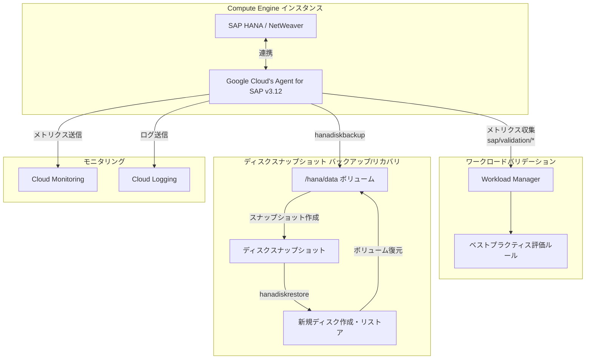

# SAP on Google Cloud: Agent for SAP バージョン 3.12 GA

**リリース日**: 2026-03-16

**サービス**: SAP on Google Cloud

**機能**: Google Cloud's Agent for SAP v3.12 - ワークロードバリデーション強化およびディスクスナップショットベースリカバリ改善

**ステータス**: GA (一般提供)

[このアップデートのインフォグラフィックを見る](https://takech9203.github.io/google-cloud-news-summary/20260316-sap-agent-v3-12.html)

## 概要

Google Cloud's Agent for SAP のバージョン 3.12 が一般提供 (GA) となった。本バージョンでは、SAP ワークロードバリデーション機能の強化と、SAP HANA 向けディスクスナップショットベースリカバリの改善が主な変更点として導入されている。

Agent for SAP は、Google Cloud 上で SAP システムを運用するために必須のエージェントであり、SAP Host Agent メトリクスの収集、Workload Manager によるベストプラクティス評価、SAP HANA のバックアップ・リカバリ、プロセスモニタリングなど多岐にわたる機能を提供する。バージョン 3.12 では、これらの中核機能がさらに成熟し、SAP ワークロードの運用管理がより堅牢になった。

本アップデートは、Google Cloud 上で SAP S/4HANA、SAP BW/4HANA、SAP ECC などを運用する Basis 管理者、インフラエンジニア、Solutions Architect を主な対象としている。

**アップデート前の課題**

- Workload Manager のバリデーション評価で収集されるメトリクスやルールが限定的であり、SAP ワークロードの構成がベストプラクティスに準拠しているかを包括的に検証するには追加の手動確認が必要だった
- ディスクスナップショットベースの SAP HANA リカバリにおいて、特定のデプロイメントシナリオや構成パターンでの対応が不十分だった
- バージョン 3.11 までのエージェントでは、一部のワークロード検証シナリオで最新のベストプラクティスルールが反映されていなかった

**アップデート後の改善**

- SAP ワークロードバリデーション機能が強化され、Workload Manager による評価ルールのカバレッジが拡大した
- ディスクスナップショットベースの SAP HANA リカバリが改善され、より多くのデプロイメントパターンに対応可能になった
- エージェント全体の安定性と信頼性が向上し、本番環境での運用がより堅牢になった

## アーキテクチャ図



Agent for SAP v3.12 は、SAP システムと連携してワークロードバリデーション用メトリクスを Workload Manager に送信し、ディスクスナップショットによる SAP HANA のバックアップ・リカバリを実行する。

## サービスアップデートの詳細

### 主要機能

1. **SAP ワークロードバリデーションの強化**
   - Workload Manager 評価メトリクス (`sap/validation/*` シリーズ) の収集項目が拡充された
   - SAP HANA、Pacemaker、Corosync、NetWeaver の構成検証がより詳細になった
   - ベストプラクティスに対する準拠状況をより包括的に評価可能になった
   - `fetch_latest_config` パラメータにより、エージェント更新なしで最新の評価ルールを自動取得する仕組みが引き続きサポートされている

2. **ディスクスナップショットベース リカバリの改善**
   - `hanadiskbackup` / `hanadiskrestore` コマンドによる SAP HANA データベースのバックアップ・リカバリ機能が改善された
   - スケールアップ (単一ディスクおよびストライプディスク) とスケールアウト構成の両方をサポート
   - HA (高可用性) クラスタ環境および DR (災害復旧) デプロイメントでの利用が可能
   - Persistent Disk および Hyperdisk ボリュームに対応

3. **エージェント全体の安定性向上**
   - Linux (RHEL、SLES) および Windows 環境での動作安定性が改善
   - systemd サービスとしての自動起動・自動再起動が引き続きサポート
   - 構成ファイルの変更が 30 秒以内に自動反映される仕組み (v3.7 以降) が引き続き有効

## 技術仕様

### ワークロードバリデーション メトリクス

| メトリクスカテゴリ | メトリクス名 | 説明 |
|------|------|------|
| System | `sap/validation/system` | OS・インスタンス・エージェントバージョン情報 |
| Corosync | `sap/validation/corosync` | Corosync HA クラスタ構成の検証 |
| Pacemaker | `sap/validation/pacemaker` | Pacemaker HA クラスタ構成の検証 |
| SAP HANA | `sap/validation/hana` | SAP HANA システム構成 (global.ini、ディスク情報) |
| HANA Security | `sap/validation/hanasecurity` | SAP HANA データベース設定・セキュリティ評価 |
| SAP NetWeaver | `sap/validation/netweaver` | SAP NetWeaver システム構成の検証 |

### ディスクスナップショット バックアップ/リカバリ メトリクス

| メトリクス | 説明 |
|------|------|
| `sap/agent/hanadiskbackup/status` | バックアップ操作の成功/失敗を示すブール値 |
| `sap/agent/hanadiskbackup/totaltime` | スナップショット作成の所要時間 (秒) |
| `sap/agent/hanadiskbackup/dbfreezetime` | SAP HANA ファイルシステムのフリーズ時間 (秒) |

### 必要な IAM ロール

```json
{
  "workload_validation": [
    "roles/compute.viewer",
    "roles/workloadmanager.insightWriter",
    "roles/secretmanager.secretAccessor"
  ],
  "disk_snapshot_backup": [
    "roles/compute.storageAdmin",
    "roles/compute.viewer"
  ]
}
```

## 設定方法

### 前提条件

1. Compute Engine インスタンスまたは Bare Metal Solution サーバーで SAP システムが稼働していること
2. Workload Manager API が有効化されていること
3. サービスアカウントに必要な IAM ロールが付与されていること

### 手順

#### ステップ 1: エージェントの更新

```bash
# RHEL の場合
sudo yum update google-cloud-sap-agent

# SLES 15 の場合
sudo zypper update google-cloud-sap-agent
```

バージョン 3.12 に更新されたことを確認する。

#### ステップ 2: エージェントの動作確認

```bash
# エージェントのステータス確認
sudo systemctl status google-cloud-sap-agent

# バージョン確認
sudo /usr/bin/google_cloud_sap_agent version
```

#### ステップ 3: ワークロードバリデーションの有効化

構成ファイル `/etc/google-cloud-sap-agent/configuration.json` で `collect_workload_validation_metrics` を `true` に設定する。

```bash
# 構成例
cat /etc/google-cloud-sap-agent/configuration.json
```

```json
{
  "provide_sap_host_agent_metrics": true,
  "log_level": "INFO",
  "log_to_cloud": true,
  "collection_configuration": {
    "collect_workload_validation_metrics": true,
    "collect_process_metrics": true,
    "sap_system_discovery": true
  }
}
```

#### ステップ 4: ディスクスナップショット バックアップの実行

```bash
# SAP HANA ディスクスナップショット バックアップの作成
sudo /usr/bin/google_cloud_sap_agent hanadiskbackup \
  -port=30015 \
  -sid=HDB \
  -hana-db-user=SYSTEM \
  -password-secret=my-hana-password-secret \
  -project=my-project \
  -disk=/dev/sdb
```

## メリット

### ビジネス面

- **運用リスクの低減**: ワークロードバリデーションの強化により、SAP システムがベストプラクティスに準拠しているかを自動的かつ包括的に確認でき、構成ミスによる障害リスクを早期に検知できる
- **RTO の短縮**: ディスクスナップショットベースのリカバリ改善により、SAP HANA データベースの復旧時間を短縮し、ビジネス継続性を向上させる

### 技術面

- **自動化された構成検証**: Workload Manager との統合により、手動での構成レビューを削減し、継続的なコンプライアンス監視が可能になる
- **柔軟なリカバリオプション**: スケールアップ (単一ディスク/ストライプディスク)、スケールアウト、HA クラスタ、DR デプロイメントなど、多様な構成パターンに対応したリカバリが可能

## デメリット・制約事項

### 制限事項

- ワークロードバリデーション メトリクスの収集は Linux のみでサポートされており、Windows 環境では利用できない
- ディスクスナップショット機能はスケールアウト構成においてホスト自動フェイルオーバーソリューションを使用しているシステムでは利用できない
- `sap/validation/hanasecurity` メトリクスの収集には、SAP HANA データベースへのアクセス設定 (DB ユーザー、Secret Manager) が別途必要

### 考慮すべき点

- バージョン 2 のサポートは 2025 年 7 月 31 日に終了しているため、まだ移行していない場合は早急にバージョン 3.x への移行が必要
- エージェント更新後、SAP Host Agent のメトリクス連携が正常に動作していることを SAP トランザクション ST06 で確認すること
- HA クラスタ環境では、プライマリノードとスタンバイノードの両方でエージェントを更新する必要がある

## ユースケース

### ユースケース 1: SAP HANA HA クラスタのベストプラクティス検証

**シナリオ**: SAP S/4HANA を Pacemaker ベースの HA クラスタで運用している企業が、構成のベストプラクティス準拠状況を定期的に確認したい。

**実装例**:
```json
{
  "collection_configuration": {
    "collect_workload_validation_metrics": true,
    "workload_validation_db_metrics_config": {
      "hana_db_user": "MONITOR",
      "sid": "HDB",
      "hana_db_password_secret_name": "hdb-monitor-password",
      "hostname": "localhost",
      "port": "30015"
    }
  }
}
```

**効果**: Workload Manager のダッシュボードで Pacemaker、Corosync、SAP HANA の構成がベストプラクティスに準拠しているかを一元的に確認でき、構成ドリフトを早期に検知できる。

### ユースケース 2: SAP HANA ディスクスナップショットによる迅速なリカバリ

**シナリオ**: 大規模な SAP BW/4HANA 環境で、Backint ベースのバックアップに加えてディスクスナップショットによる高速リカバリを実装したい。

**効果**: ディスクスナップショットは Backint ベースのリストアと比較してリカバリ時間を大幅に短縮できる。特に数 TB 規模のデータボリュームでは、ディスク全体のスナップショットからの復元が Backint のストリーミングリストアよりも高速に完了する。

## 料金

Agent for SAP 自体の利用は無料だが、エージェントが収集するメトリクスに対して Cloud Monitoring の課金が発生する。

### 料金例

| 機能 | インスタンス数 | 月額料金 (概算) |
|--------|-----------------|-----------------|
| SAP Host Agent メトリクス収集 | 100 | $209 |
| Process Monitoring メトリクス収集 | 100 | $202.70 |
| SAP HANA Monitoring メトリクス収集 | 500 | $280.30 |
| Workload Manager 評価メトリクス | - | 追加費用なし (v3.2 以降) |

Backint 機能を使用した SAP HANA バックアップの場合は、Cloud Storage の料金が別途発生する。ディスクスナップショットの場合は、Compute Engine のスナップショットストレージ料金が適用される。

## 利用可能リージョン

Agent for SAP は Google Cloud のすべてのリージョンで利用可能。SAP HANA が認定されている Compute Engine マシンタイプが利用可能なリージョンであれば、エージェントの全機能を使用できる。Bare Metal Solution サーバーでも利用可能。

## 関連サービス・機能

- **[Workload Manager](https://cloud.google.com/workload-manager/docs/overview)**: SAP ワークロードのベストプラクティス評価とオブザーバビリティダッシュボードを提供
- **[Cloud Monitoring](https://cloud.google.com/monitoring/docs)**: エージェントが収集したメトリクスの可視化とアラート設定
- **[Cloud Logging](https://cloud.google.com/logging/docs)**: エージェントのログ収集と分析
- **[Secret Manager](https://cloud.google.com/secret-manager/docs)**: SAP HANA データベースパスワードの安全な管理
- **[Compute Engine ディスクスナップショット](https://cloud.google.com/compute/docs/disks/create-snapshots)**: SAP HANA データボリュームのバックアップ基盤
- **[Backup and DR Service](https://cloud.google.com/backup-disaster-recovery/docs)**: SAP HANA スケールアウト環境向けの代替バックアップソリューション

## 参考リンク

- [このアップデートのインフォグラフィック](https://takech9203.github.io/google-cloud-news-summary/20260316-sap-agent-v3-12.html)
- [公式リリースノート](https://cloud.google.com/release-notes#March_16_2026)
- [Agent for SAP リリース履歴](https://cloud.google.com/sap/docs/agent-for-sap/whats-new)
- [Agent for SAP インストールガイド](https://cloud.google.com/sap/docs/agent-for-sap/latest/install-config-on-vm)
- [ディスクスナップショット バックアップ・リカバリ](https://cloud.google.com/sap/docs/agent-for-sap/latest/disk-snapshot-backup-recovery)
- [Workload Manager 評価メトリクスの構成](https://cloud.google.com/sap/docs/agent-for-sap/latest/configure-workload-manager-evaluation)
- [Agent for SAP 料金概算](https://cloud.google.com/sap/docs/agent-for-sap/latest/planning#monthly_cost_estimates)

## まとめ

Google Cloud's Agent for SAP v3.12 は、SAP ワークロードバリデーションとディスクスナップショットベースリカバリの両面で強化が行われた GA リリースである。SAP on Google Cloud を運用する組織は、エージェントを v3.12 に更新し、Workload Manager との統合を活用してベストプラクティスへの準拠状況を継続的に監視することを推奨する。また、ディスクスナップショットベースのリカバリを既存のバックアップ戦略に組み込むことで、RTO の短縮とデータ保護の強化が期待できる。

---

**タグ**: #SAP #AgentForSAP #SAPHANA #WorkloadManager #DiskSnapshot #BackupRecovery #GA #v3.12
