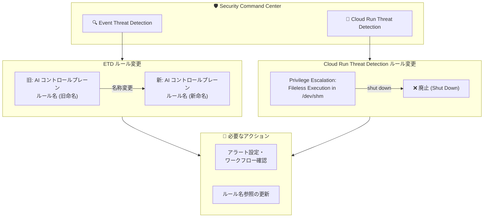

# Security Command Center: Event Threat Detection ルール名変更および Cloud Run Threat Detection ルール廃止

**リリース日**: 2026-03-16

**サービス**: Security Command Center

**機能**: Event Threat Detection AI コントロールプレーンルール名変更、Cloud Run Threat Detection ルール廃止

**ステータス**: Changed

📊 [このアップデートのインフォグラフィックを見る](https://takech9203.github.io/google-cloud-news-summary/20260316-security-command-center-etd-rule-changes.html)

## 概要

Security Command Center において、2 つの重要な変更が行われた。まず、Event Threat Detection (ETD) の AI コントロールプレーンに関連するルール名が変更された。これは AI ワークロード保護のための検出ルールの体系的な整理を目的としたものである。次に、Cloud Run Threat Detection のルール「Privilege Escalation: Fileless Execution in /dev/shm」が廃止 (shut down) された。

AI コントロールプレーンのルール名変更は、Vertex AI Agent Engine Runtime や一般的な AI ワークロードに対する脅威検出ルールの命名規則を統一・改善するためのものと考えられる。Security Command Center では、AI 関連の脅威検出として「General AI threats」カテゴリと「Agent Engine Threat Detection」カテゴリの 2 系統が提供されており、これらのルール名がより明確かつ一貫性のある形に更新された。

Cloud Run Threat Detection の「Privilege Escalation: Fileless Execution in /dev/shm」ルールは、/dev/shm ディレクトリからのファイルレス実行を検出するランタイムルールであった。このルールの廃止により、今後は同ルールによる検出結果 (Finding) は生成されなくなる。

**アップデート前の課題**

- AI コントロールプレーン関連の ETD ルール名が現在のサービス体系と整合していなかった
- Cloud Run Threat Detection の「Privilege Escalation: Fileless Execution in /dev/shm」ルールが冗長化、または関連性が低下していた可能性がある

**アップデート後の改善**

- AI コントロールプレーン関連のルール名がより明確で一貫性のある命名に更新され、ルール管理・参照が容易になった
- 不要になった Cloud Run Threat Detection ルールが廃止され、検出ルールセットが合理化された
- セキュリティ運用チームは、ルール名変更に伴い既存のアラート設定やワークフローの確認が必要となる

## アーキテクチャ図



Event Threat Detection の AI コントロールプレーンルールの名称変更と、Cloud Run Threat Detection ルールの廃止の影響範囲を示す。セキュリティ運用チームは既存の設定・ワークフローの確認が必要となる。

## サービスアップデートの詳細

### 主要機能

1. **Event Threat Detection AI コントロールプレーンルール名の変更**
   - AI ワークロードに関連する脅威検出ルールの名称が更新された
   - 対象となるルールには、Vertex AI Agent Engine Runtime 向けのコントロールプレーン検出器や、一般的な AI 脅威検出ルールが含まれる
   - 一般的な AI 脅威 (General AI threats) のルールには、「Initial Access: Dormant Service Account Activity in AI Service」「Persistence: New AI API Method」「Persistence: New Geography for AI Service」などがある
   - Agent Engine 向けコントロールプレーンルールには、「Credential Access: Agent Engine Anomalous Access to Metadata Service」「Exfiltration: Agent Engine Initiated BigQuery Data Exfiltration」などがある

2. **Cloud Run Threat Detection ルール「Privilege Escalation: Fileless Execution in /dev/shm」の廃止**
   - API 名: `CLOUD_RUN_FILELESS_EXECUTION_DETECTION_SHM`
   - /dev/shm (共有メモリ) ディレクトリからのプロセス実行を検出するランタイムルールであった
   - 攻撃者が /dev/shm からの実行により、セキュリティツールの検出を回避しつつ権限昇格やプロセスインジェクションを行う手法を検出していた
   - 検出ルールの廃止は、マネージドサービスとして管理されており、冗長化または関連性の低下によるものである

3. **既存ルールへの影響**
   - Cloud Run Threat Detection には引き続き他のランタイムルール (Reverse Shell、Unexpected Child Shell、Malicious Binary Executed など) が有効
   - Cloud Run のコントロールプレーン検出器 (Cryptomining Commands、Cryptomining Docker Image、Default Compute Engine Service Account SetIAMPolicy) は影響を受けない

## 技術仕様

### 廃止されたルール

| 項目 | 詳細 |
|------|------|
| サービス | Cloud Run Threat Detection |
| 表示名 | Privilege Escalation: Fileless Execution in /dev/shm |
| API 名 | CLOUD_RUN_FILELESS_EXECUTION_DETECTION_SHM |
| 検出対象 | /dev/shm からのファイルレスプロセス実行 |
| MITRE ATT&CK | T1055 (Process Injection) |
| ステータス | Shut Down |

### 影響を受ける可能性のある設定

- Security Command Center のカスタムアラートルールで廃止されたルール名を参照している場合
- SIEM/SOAR 連携で特定のルール名に基づくフィルタリングを行っている場合
- Cloud Logging エクスポートで ETD ルール名によるフィルタを設定している場合
- Pub/Sub を介した Finding のエクスポートパイプラインで旧ルール名を使用している場合

## メリット

### ビジネス面

- **ルール体系の明確化**: AI コントロールプレーンルールの名称統一により、セキュリティポリシーの文書化やコンプライアンス報告が容易になる
- **運用の合理化**: 冗長なルールの廃止により、アラートノイズが削減され、セキュリティチームがより重要な脅威に集中できる

### 技術面

- **命名規則の一貫性**: ルール名の統一により、API を介した自動化スクリプトでのルール参照が体系的になる
- **検出ルールセットの最適化**: 不要なルールの廃止により、検出パイプラインが最適化される

## デメリット・制約事項

### 制限事項

- ルール名変更に伴い、旧ルール名を参照しているカスタム設定は手動で更新が必要
- 廃止されたルール「Fileless Execution in /dev/shm」に依存していた検出は代替手段を検討する必要がある

### 考慮すべき点

- 既存の SIEM/SOAR 連携、Pub/Sub エクスポート、Cloud Logging フィルタでルール名を直接参照している場合は更新が必要
- Container Threat Detection には同名のルール「Fileless Execution in /dev/shm」が別途存在する (GKE 向け) ため、Cloud Run 固有のルール廃止と混同しないよう注意が必要
- 検出ルールの廃止は Google Cloud の非推奨ポリシーとは別に管理されるマネージドサービスの変更であり、冗長化や関連性低下を理由に実施される

## ユースケース

### ユースケース 1: セキュリティ自動化パイプラインの更新

**シナリオ**: Pub/Sub と Cloud Functions を使用して Security Command Center の Finding を自動処理するパイプラインを運用している場合

**対応例**:
```python
# 旧ルール名から新ルール名へのマッピングを更新
# ETD AI コントロールプレーンルール名の変更に対応

# Cloud Logging フィルタの更新例
# 旧: resource.type="security_command_center" AND jsonPayload.finding.category="旧ルール名"
# 新: resource.type="security_command_center" AND jsonPayload.finding.category="新ルール名"
```

**効果**: 自動化パイプラインの中断を防ぎ、引き続き正確な脅威検出・対応を維持できる

### ユースケース 2: Cloud Run セキュリティ監視の見直し

**シナリオ**: Cloud Run ワークロードのセキュリティ監視で「Fileless Execution in /dev/shm」ルールに依存していた場合

**効果**: 他の有効な Cloud Run Threat Detection ルール (Malicious Binary Executed、Reverse Shell、Container Escape など) による検出カバレッジを確認し、必要に応じてカスタム検出ルールで補完できる

## 料金

Security Command Center の Event Threat Detection および Cloud Run Threat Detection は Premium ティアおよび Enterprise ティアで利用可能。今回のルール変更自体に追加料金は発生しない。

- **Standard ティア**: 無料 (Event Threat Detection、Cloud Run Threat Detection は利用不可)
- **Premium ティア**: 従量課金またはサブスクリプション
- **Enterprise ティア**: サブスクリプション (Google Cloud 営業に問い合わせ)

詳細は [Security Command Center の料金ページ](https://cloud.google.com/security-command-center/pricing) を参照。

## 関連サービス・機能

- **Event Threat Detection**: Cloud Logging ストリームを監視し、ほぼリアルタイムで脅威を検出する SCC のビルトインサービス
- **Cloud Run Threat Detection**: Cloud Run リソースのランタイム攻撃を検出する SCC のビルトインサービス
- **Agent Engine Threat Detection**: Vertex AI Agent Engine Runtime にデプロイされた AI エージェントの脅威を検出するサービス (Preview)
- **Container Threat Detection**: GKE コンテナのランタイム脅威を検出するサービス (同名の「Fileless Execution in /dev/shm」ルールが引き続き有効)
- **Cloud Logging**: ETD および Cloud Run Threat Detection のログソース
- **Google Security Operations (SecOps)**: Finding の調査・対応に使用

## 参考リンク

- 📊 [インフォグラフィック](https://takech9203.github.io/google-cloud-news-summary/20260316-security-command-center-etd-rule-changes.html)
- [公式リリースノート](https://cloud.google.com/release-notes#March_16_2026)
- [Event Threat Detection の概要](https://cloud.google.com/security-command-center/docs/concepts-event-threat-detection-overview)
- [Cloud Run Threat Detection の概要](https://cloud.google.com/security-command-center/docs/cloud-run-threat-detection-overview)
- [AI 脅威検出ルール一覧](https://cloud.google.com/security-command-center/docs/ai-threats)
- [Security Command Center の非推奨・廃止ルール](https://cloud.google.com/security-command-center/docs/deprecations)
- [料金ページ](https://cloud.google.com/security-command-center/pricing)

## まとめ

今回のアップデートは、Security Command Center の脅威検出ルールの体系整備に関する変更である。AI コントロールプレーン関連の ETD ルール名変更については、既存のアラート設定やセキュリティ自動化パイプラインで旧ルール名を参照している場合に更新が必要となる。Cloud Run Threat Detection の「Fileless Execution in /dev/shm」ルール廃止については、同ルールに依存した検出カバレッジに影響がないか確認し、必要に応じて他のルールやカスタム検出で補完することを推奨する。

---

**タグ**: #SecurityCommandCenter #EventThreatDetection #CloudRunThreatDetection #AIセキュリティ #脅威検出 #ルール変更 #セキュリティ運用
