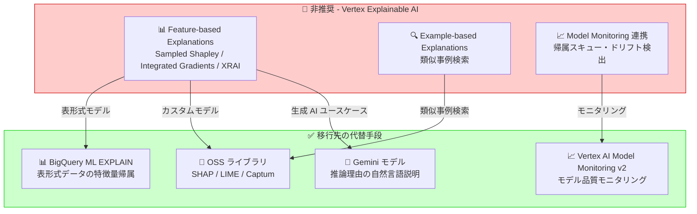

# Vertex AI: Explainable AI の非推奨化

**リリース日**: 2026-03-16

**サービス**: Vertex AI

**機能**: Explainable AI (説明可能な AI)

**ステータス**: Deprecated (非推奨)

📊 [このアップデートのインフォグラフィックを見る](https://takech9203.github.io/google-cloud-news-summary/20260316-vertex-ai-explainable-ai-deprecated.html)

## 概要

Vertex Explainable AI が非推奨 (Deprecated) となった。Vertex Explainable AI は、ML モデルの推論結果に対して特徴量の寄与度 (Feature Attribution) や類似事例 (Example-based Explanation) を提供し、モデルの判断根拠を理解するためのサービスであった。

Vertex Explainable AI は、Sampled Shapley、Integrated Gradients、XRAI の 3 つの特徴量帰属手法を提供し、表形式データ、画像データ、テキストデータに対応していた。AutoML モデルおよびカスタムトレーニングモデル (TensorFlow、scikit-learn、XGBoost) の両方をサポートし、BigQuery ML モデルにも対応していた。非推奨化に伴い、既存ユーザーは代替手段への移行を計画する必要がある。

**アップデート前の課題**

- Vertex Explainable AI はモデルの解釈可能性を提供する主要なサービスとして広く利用されていた
- Feature Attribution と Example-based Explanation の 2 つの説明手法がサービスに統合されていた
- Model Monitoring と連携して、特徴量帰属のスキューやドリフトを検出する機能が提供されていた

**アップデート後の改善**

- 非推奨化に伴い、Google Cloud の廃止ポリシーに基づき一定期間はサービスが継続される
- 詳細なシャットダウン日程と移行ガイダンスについては Vertex AI の非推奨ページで確認が必要
- Vertex AI Model Monitoring v2 や、BigQuery ML の Explain 機能、OSS ライブラリ (SHAP、LIME) など代替手段への移行を検討する期間が確保される

## アーキテクチャ図



Vertex Explainable AI から代替手段への移行パスを示す。ユースケースに応じて適切な移行先を選択する必要がある。

## サービスアップデートの詳細

### 主要機能

1. **非推奨対象: Feature-based Explanations (特徴量ベースの説明)**
   - Sampled Shapley: 非微分可能モデル (アンサンブルツリーなど) 向け。特徴量の組み合わせを考慮して各特徴量に推論結果への寄与を割り当てる
   - Integrated Gradients: 微分可能モデル (ニューラルネットワーク) 向け。勾配に基づく効率的な特徴量帰属計算
   - XRAI: 画像分類モデル向け。画像の領域ごとのヒートマップによる説明を生成

2. **非推奨対象: Example-based Explanations (事例ベースの説明)**
   - トレーニングデータ内の類似事例を検索して推論結果の根拠を提示
   - 異常検知、アクティブラーニング、新規データの解釈に活用

3. **影響を受ける連携機能: Model Monitoring との統合**
   - Vertex AI Model Monitoring v1 で特徴量帰属のスキューやドリフトを検出する機能が影響を受ける
   - Model Monitoring v2 への移行が推奨される

## 技術仕様

### 非推奨化される主な API とリソース

| 項目 | 詳細 |
|------|------|
| ExplanationSpec | モデルアップロード時に設定する説明パラメータ |
| ExplanationParameters | Sampled Shapley / Integrated Gradients / XRAI の設定 |
| Feature Attribution API | オンライン/バッチ推論時の説明リクエスト |
| Example-based Explanation API | 類似事例検索リクエスト |

### 対応していたモデルタイプ

| モデルタイプ | 対応フレームワーク | 利用可能な手法 |
|-------------|-------------------|---------------|
| AutoML 表形式 | - | Sampled Shapley |
| AutoML 画像 | - | Integrated Gradients, XRAI |
| カスタムトレーニング (TensorFlow) | TensorFlow | 全手法 |
| カスタムトレーニング (その他) | scikit-learn, XGBoost | Sampled Shapley |
| BigQuery ML | BigQuery | Sampled Shapley |

## メリット

### 移行を機に得られるメリット

- **最新ツールへの統合**: OSS の SHAP や LIME はコミュニティの継続的な改善を受けており、Vertex Explainable AI では対応していなかった最新の説明手法を利用できる
- **コスト最適化**: 説明リクエストは追加の推論コストが発生していたため、移行先の選択によってはコスト削減の機会がある

### 技術面

- **柔軟性の向上**: OSS ライブラリを使用することで、特定のクラウドサービスへの依存を減らし、マルチクラウド環境での運用が容易になる
- **BigQuery ML EXPLAIN の活用**: 表形式データの場合、BigQuery ML の EXPLAIN 機能でデータパイプライン内で直接説明を生成できる

## デメリット・制約事項

### 制限事項

- 非推奨化のタイムラインに沿って移行を完了する必要がある (具体的なシャットダウン日は Vertex AI 非推奨ページで確認)
- Google Cloud の廃止ポリシーにより、非推奨後も一定期間はサービスが継続されるが、新機能の追加やバグ修正は期待できない
- Model Monitoring v1 と Explainable AI を組み合わせて使用していた場合、モニタリングの再設計が必要

### 考慮すべき点

- 既存のパイプラインで Explainable AI を使用している場合、推論リクエストの変更が必要
- コンプライアンス要件 (金融、医療など) でモデルの説明可能性が求められる場合、代替手段の選定と検証に十分な時間を確保すべき
- Example-based Explanation の直接的な代替は Google Cloud 上には存在しないため、OSS ツールの導入が必要になる可能性がある

## ユースケース

### ユースケース 1: 表形式データの特徴量帰属を BigQuery ML に移行

**シナリオ**: 信用スコアリングモデルで Vertex Explainable AI の Sampled Shapley を使用して特徴量の寄与度を算出していたケース

**実装例**:
```sql
-- BigQuery ML で特徴量帰属を取得
SELECT *
FROM ML.EXPLAIN_PREDICT(
  MODEL `project.dataset.credit_scoring_model`,
  (SELECT * FROM `project.dataset.new_applications`),
  STRUCT(3 AS top_k_features)
)
```

**効果**: データウェアハウス内で完結する説明生成が可能になり、別途 Vertex AI エンドポイントを管理する必要がなくなる

### ユースケース 2: カスタムモデルの説明を SHAP に移行

**シナリオ**: TensorFlow カスタムモデルで Integrated Gradients を使用していたケース

**実装例**:
```python
import shap

# モデルの説明器を作成
explainer = shap.DeepExplainer(model, background_data)

# 特徴量帰属を計算
shap_values = explainer.shap_values(test_data)

# 結果を可視化
shap.summary_plot(shap_values, test_data)
```

**効果**: クラウドサービスに依存しない説明生成が可能になり、ローカル環境での開発・テストが容易になる

## 料金

Vertex Explainable AI は非推奨となったため、新規導入は推奨されない。既存の利用については、シャットダウン日まで従来通りの料金体系が適用される。

移行先の料金:
- **BigQuery ML EXPLAIN**: BigQuery の標準料金 (オンデマンドまたはスロット予約) に含まれる
- **OSS ライブラリ (SHAP/LIME)**: Compute Engine や GKE 上での実行コストのみ
- **Vertex AI Model Monitoring v2**: Model Monitoring の料金体系に準拠

詳細は [Vertex AI 料金ページ](https://cloud.google.com/vertex-ai/pricing) を参照。

## 関連サービス・機能

- **Vertex AI Model Monitoring**: モデルのスキューとドリフトを監視するサービス。v2 では Explainable AI に依存しないモニタリング機能を提供
- **BigQuery ML**: SQL ベースの機械学習サービス。EXPLAIN_PREDICT 関数で特徴量帰属を提供
- **Vertex AI Model Registry**: モデルの登録・管理サービス。ExplanationSpec の設定が影響を受ける
- **Vertex AI Prediction**: オンライン/バッチ推論サービス。説明リクエスト機能が影響を受ける
- **Cloud Monitoring**: 移行後のモデルモニタリング基盤として活用可能

## 参考リンク

- 📊 [インフォグラフィック](https://takech9203.github.io/google-cloud-news-summary/20260316-vertex-ai-explainable-ai-deprecated.html)
- [公式リリースノート](https://cloud.google.com/release-notes#March_16_2026)
- [Vertex AI 非推奨一覧](https://cloud.google.com/vertex-ai/docs/deprecations)
- [Vertex Explainable AI 概要](https://cloud.google.com/vertex-ai/docs/explainable-ai/overview)
- [Vertex AI Model Monitoring 概要](https://cloud.google.com/vertex-ai/docs/model-monitoring/overview)
- [BigQuery ML EXPLAIN_PREDICT](https://cloud.google.com/bigquery/docs/reference/standard-sql/bigqueryml-syntax-explain-predict)
- [料金ページ](https://cloud.google.com/vertex-ai/pricing)

## まとめ

Vertex Explainable AI の非推奨化は、モデルの解釈可能性を提供するためのアプローチを見直す契機となる。既存ユーザーは、ユースケースに応じて BigQuery ML EXPLAIN、OSS ライブラリ (SHAP/LIME)、Vertex AI Model Monitoring v2 などの代替手段への移行を早期に計画すべきである。特にコンプライアンス要件でモデルの説明可能性が必須となる金融・医療分野では、シャットダウン日に向けた移行スケジュールの策定を推奨する。

---

**タグ**: #VertexAI #ExplainableAI #Deprecated #MLOps #FeatureAttribution #ModelInterpretability #移行計画
