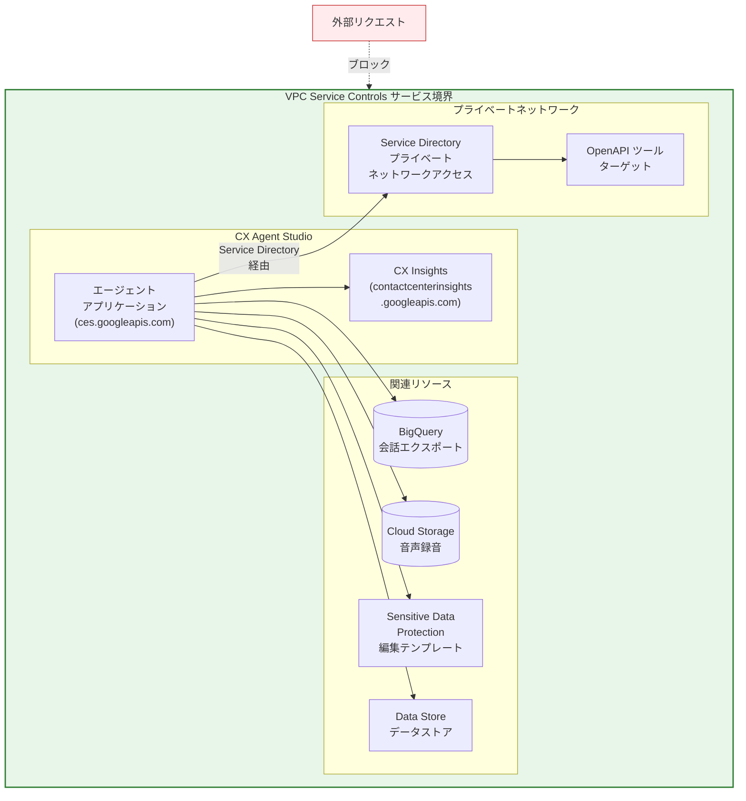

# VPC Service Controls: CX Agent Studio インテグレーションの GA サポート

**リリース日**: 2026-03-16

**サービス**: VPC Service Controls

**機能**: CX Agent Studio インテグレーションの General Availability (GA)

**ステータス**: Feature (GA)

[このアップデートのインフォグラフィックを見る](https://takech9203.github.io/google-cloud-news-summary/20260316-vpc-service-controls-cx-agent-studio.html)

## 概要

VPC Service Controls における CX Agent Studio (Customer Experience Agent Studio) インテグレーションが General Availability (GA) に昇格した。これにより、CX Agent Studio で構築した会話型 AI エージェントアプリケーションを VPC Service Controls のサービス境界で保護し、データ漏洩リスクを軽減する機能が本番環境で完全にサポートされる。

CX Agent Studio は Dialogflow CX の進化形として位置づけられるローコードの会話型エージェントビルダーであり、Agent Development Kit (ADK) を基盤としている。今回の GA 昇格により、規制要件の厳しい金融、医療、公共セクターなどの組織が、VPC Service Controls による境界保護のもとで CX Agent Studio を安心して本番運用できるようになった。

対象ユーザーは、セキュリティ要件の高い環境で会話型 AI エージェントを構築・運用するセキュリティアーキテクト、プラットフォームエンジニア、および Solutions Architect である。

**アップデート前の課題**

- CX Agent Studio と VPC Service Controls のインテグレーションは Preview 段階であり、本番環境での完全なサポートが保証されていなかった
- Preview ステータスのため、規制要件の厳しい組織では CX Agent Studio の本番採用に慎重な判断が必要であった
- SLA やサポート面での不確実性があり、ミッションクリティカルなユースケースへの適用が難しかった

**アップデート後の改善**

- VPC Service Controls による CX Agent Studio の保護が GA として完全サポートされ、本番環境での利用に SLA が適用される
- エージェントアプリケーションデータや runSession リクエスト/レスポンスがサービス境界外に流出することを防止できる
- 規制要件の厳しい環境でも安心して CX Agent Studio を本番運用に採用できるようになった

## アーキテクチャ図



VPC Service Controls のサービス境界内で CX Agent Studio (ces.googleapis.com) と CX Insights (contactcenterinsights.googleapis.com) を保護し、BigQuery、Cloud Storage、Sensitive Data Protection、Data Store などの関連リソースも同一境界内に配置する構成を示している。外部ツールへのアクセスは Service Directory によるプライベートネットワークアクセス経由で行う。

## サービスアップデートの詳細

### 主要機能

1. **サービス境界によるデータ保護**
   - CX Agent Studio のエージェントアプリケーションデータがサービス境界外に流出することを防止
   - runSession API のリクエストおよびレスポンスをサービス境界内に制限
   - エージェントのインポート/エクスポート操作も境界制御の対象

2. **Service Directory によるプライベートネットワークアクセス**
   - OpenAPI ツールのターゲットに VPC ネットワーク内からプライベートに接続可能
   - トラフィックを Google Cloud ネットワーク内に維持し、IAM と VPC Service Controls を強制適用
   - Service Directory のプライベートネットワーク構成と連携

3. **関連サービスとの境界統合**
   - BigQuery (会話エクスポート)、Cloud Storage (音声録音)、Sensitive Data Protection (編集テンプレート) を同一境界内で保護
   - Data Store、Integration Connectors との連携も境界内で動作

## 技術仕様

### 保護対象サービス

| 項目 | 詳細 |
|------|------|
| サービス名 | `ces.googleapis.com` |
| 追加必須サービス | `contactcenterinsights.googleapis.com` (CX Insights) |
| ステータス | GA (General Availability) |
| ペリメータで保護可能 | はい |

### Service Directory 設定に必要なロール

| ロール | 説明 |
|--------|------|
| `servicedirectory.viewer` | Service Directory のリソース参照権限 |
| `servicedirectory.pscAuthorizedService` | Private Service Connect の認可サービス権限 |

上記ロールは Customer Engagement Suite Service Agent サービスアカウント (`service-<PROJECT_NUMBER>@gcp-sa-ces.iam.gserviceaccount.com`) に付与する。

## 設定方法

### 前提条件

1. VPC Service Controls が有効な Google Cloud 組織
2. Access Context Manager の管理権限
3. CX Agent Studio のエージェントアプリケーションが作成済み

### 手順

#### ステップ 1: サービス境界の作成

```bash
# サービス境界を作成し、CX Agent Studio と CX Insights を保護対象に含める
gcloud access-context-manager perimeters create CX_AGENT_PERIMETER \
    --title="CX Agent Studio Perimeter" \
    --resources="projects/PROJECT_NUMBER" \
    --restricted-services="ces.googleapis.com,contactcenterinsights.googleapis.com" \
    --policy=POLICY_ID
```

CX Agent Studio API (`ces.googleapis.com`) を制限する際は、CX Insights API (`contactcenterinsights.googleapis.com`) も必ず制限サービスリストに追加する。

#### ステップ 2: 関連サービスの追加 (必要に応じて)

```bash
# BigQuery、Cloud Storage などの関連サービスも同一境界に追加
gcloud access-context-manager perimeters update CX_AGENT_PERIMETER \
    --add-restricted-services="storage.googleapis.com,bigquery.googleapis.com" \
    --policy=POLICY_ID
```

エージェントが使用する BigQuery (会話エクスポート)、Cloud Storage (音声録音) なども同じ境界内に含める。

#### ステップ 3: Service Directory の構成 (外部ツール使用時)

```bash
# Service Directory エンドポイントの作成
gcloud service-directory endpoints create ENDPOINT_NAME \
    --service=SERVICE_NAME \
    --namespace=NAMESPACE_NAME \
    --location=LOCATION \
    --address=INTERNAL_IP \
    --port=PORT

# Customer Engagement Suite Service Agent にロールを付与
gcloud projects add-iam-policy-binding PROJECT_ID \
    --member="serviceAccount:service-PROJECT_NUMBER@gcp-sa-ces.iam.gserviceaccount.com" \
    --role="roles/servicedirectory.viewer"
```

VPC Service Controls 有効時、ツールやコールバックは任意の HTTP エンドポイントにリクエストを送信できないため、Service Directory によるプライベートネットワークアクセスの構成が必要となる。

## メリット

### ビジネス面

- **コンプライアンス対応の強化**: GA サポートにより、金融 (FISC)、医療 (HIPAA)、公共セクターなどの規制要件を満たす環境で CX Agent Studio を正式に採用可能
- **本番運用の信頼性向上**: Preview から GA への昇格により SLA が適用され、ミッションクリティカルな会話型 AI のユースケースに適用可能

### 技術面

- **データ漏洩防止**: サービス境界により、エージェントデータ、会話ログ、音声録音などの機密データが組織外に流出するリスクを最小化
- **統合されたセキュリティモデル**: IAM、VPC Service Controls、Service Directory を組み合わせた多層防御により、エンドツーエンドのセキュリティを実現

## デメリット・制約事項

### 制限事項

- VPC Service Controls 有効時、ツールやコールバックは任意の HTTP エンドポイントにリクエストを送信できない。Service Directory によるプライベートネットワークアクセスの構成が必須
- 音声録音は境界外の Cloud Storage バケットに書き込めない
- 会話データは境界外の BigQuery データセットに書き込めない
- 境界外の Sensitive Data Protection 編集テンプレートを使用すると、会話内容の編集が失敗する
- OpenAPI ツールは境界外の Secret Manager シークレットを認証キーとして参照できない
- 境界外のデータストアを指定した Datastore ツールは実行に失敗する
- 境界外のエージェントリソースを指定した Flow ベースのエージェントは呼び出し時に失敗する
- 境界外の Cloud Storage バケットからのエージェントインポートおよびエクスポートは失敗する

### 考慮すべき点

- サービス境界の設計時に、CX Agent Studio が連携するすべてのリソース (BigQuery、Cloud Storage、Data Store など) を同一境界内に含める必要がある
- 既存の VPC Service Controls 環境に CX Agent Studio を追加する場合、ドライランモードでの事前検証を推奨

## ユースケース

### ユースケース 1: 金融機関の顧客対応 AI エージェント

**シナリオ**: 銀行が口座残高照会や取引履歴確認のための会話型 AI エージェントを CX Agent Studio で構築。顧客の個人情報や金融データが外部に流出しないよう、VPC Service Controls で保護する。

**効果**: 金融規制 (FISC ガイドラインなど) に準拠しながら、AI エージェントによる顧客体験の向上を実現。エージェントデータ、会話ログ、BigQuery へのエクスポートデータすべてがサービス境界内に留まる。

### ユースケース 2: 医療機関の患者問い合わせエージェント

**シナリオ**: 医療機関が予約管理や症状トリアージのための会話型 AI エージェントを運用。患者の健康情報 (PHI) を含む会話データを VPC Service Controls で保護し、HIPAA 準拠を確保する。

**効果**: 患者データがサービス境界外に流出するリスクを排除しつつ、24 時間対応の AI エージェントによる患者体験の向上を実現。

## 料金

VPC Service Controls 自体は追加料金なしで利用可能。CX Agent Studio の料金は Dialogflow CX と同じ料金体系が適用され、プレイブック、データストア、ジェネレーターなどの生成 AI 機能を使用するリクエストは生成リクエストとして課金される。

詳細は [Conversational Agents 料金ページ](https://cloud.google.com/products/conversational-agents/pricing) を参照。

## 関連サービス・機能

- **[Dialogflow CX](/dialogflow/cx/docs)**: CX Agent Studio の前身となる会話型 AI プラットフォーム。既存の Dialogflow CX フローは CX Agent Studio の Flow ベースエージェントとして再利用可能
- **[Service Directory](/service-directory/docs)**: VPC Service Controls 有効時のプライベートネットワークアクセスに使用。OpenAPI ツールターゲットへのプライベート接続を提供
- **[Sensitive Data Protection](/sensitive-data-protection/docs)**: 会話内容の機密データ編集に使用。同一境界内に配置が必要
- **[BigQuery](/bigquery/docs)**: 会話データのエクスポート先として使用。分析やレポーティングに活用
- **[Integration Connectors](/integration-connectors/docs)**: CX Agent Studio と外部システムの連携に使用。VPC Service Controls 対応の構成が可能

## 参考リンク

- [インフォグラフィック](https://takech9203.github.io/google-cloud-news-summary/20260316-vpc-service-controls-cx-agent-studio.html)
- [公式リリースノート](https://docs.google.com/release-notes#March_16_2026)
- [CX Agent Studio VPC Service Controls ドキュメント](https://cloud.google.com/customer-engagement-ai/conversational-agents/ps/vpc-service-controls)
- [VPC Service Controls サポート対象プロダクト](https://cloud.google.com/vpc-service-controls/docs/supported-products)
- [CX Agent Studio 概要](https://cloud.google.com/customer-engagement-ai/conversational-agents/ps)
- [VPC Service Controls 概要](https://cloud.google.com/vpc-service-controls/docs/overview)
- [サービス境界の作成](https://cloud.google.com/vpc-service-controls/docs/create-service-perimeters)
- [Conversational Agents 料金](https://cloud.google.com/products/conversational-agents/pricing)

## まとめ

VPC Service Controls における CX Agent Studio インテグレーションの GA 昇格は、セキュリティ要件の厳しい環境で会話型 AI エージェントを本番運用する組織にとって重要なマイルストーンである。CX Agent Studio を検討している組織は、サービス境界の設計時に CX Agent Studio が連携するすべてのリソースを同一境界内に含めること、また VPC Service Controls 有効時のツール制限 (Service Directory 経由のプライベートアクセスが必須) を考慮した上で、ドライランモードでの事前検証から着手することを推奨する。

---

**タグ**: #VPCServiceControls #CXAgentStudio #セキュリティ #GA #会話型AI #データ保護 #ConversationalAgents #ServicePerimeter
