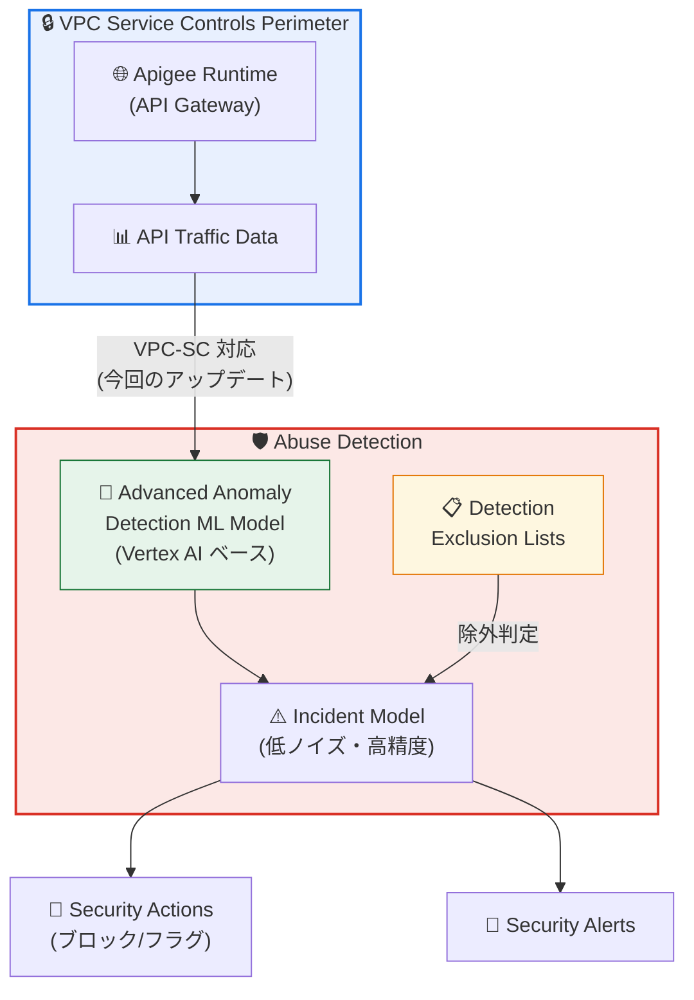

# Apigee Advanced API Security: VPC Service Controls 対応の不正利用検出

**リリース日**: 2026-03-17

**サービス**: Apigee Advanced API Security

**機能**: VPC-SC 対応の不正利用検出 (Abuse Detection)

**ステータス**: Feature

📊 [このアップデートのインフォグラフィックを見る](https://takech9203.github.io/google-cloud-news-summary/20260317-apigee-advanced-api-security-vpc-sc.html)

## 概要

2026 年 3 月 17 日、Apigee Advanced API Security の不正利用検出 (Abuse Detection) が更新され、VPC Service Controls (VPC-SC) 環境での完全サポートが実現した。これにより、VPC-SC を有効化している組織でも、Advanced Anomaly Detection ML モデルによる不正利用検出および検出除外リストの機能が利用可能になった。

これまで VPC-SC を有効化した Apigee 組織では、Abuse Detection の主要機能が利用できないという大きな制約があった。2024 年 6 月に導入された Vertex AI ベースの Advanced Anomaly Detection ML モデル、2025 年 10 月に導入された検出除外リスト (Exclusion Lists)、そしてインシデントモデルの改善など、いずれも VPC-SC 環境では利用不可とされていた。今回のリリースにより、セキュリティ要件の高い VPC-SC 環境においても、これらの機能をフルに活用できるようになった。

対象ユーザーは、VPC-SC を使用してデータ漏洩防止やコンプライアンス要件を満たしている企業のセキュリティチーム、および API プラットフォームの管理者である。

**アップデート前の課題**

- VPC-SC を有効化した Apigee 組織では Advanced Anomaly Detection ML モデルが利用できなかった
- VPC-SC 環境では検出除外リスト (Exclusion Lists) による安全なトラフィックの除外ができなかった
- VPC-SC 環境ではインシデントモデルの改善 (低ノイズ・高精度) が適用されなかった
- セキュリティ要件の高い組織ほど VPC-SC を利用するが、その組織こそ高度な不正利用検出を必要としていた

**アップデート後の改善**

- VPC-SC 環境で Advanced Anomaly Detection ML モデルによる不正利用検出が利用可能になった
- VPC-SC 環境で検出除外リストを作成・管理し、安全なトラフィック (自動テストなど) を除外できるようになった
- セキュリティ境界を維持しながら、ML ベースの高精度な不正利用検出を活用できるようになった

## アーキテクチャ図



VPC Service Controls のセキュリティ境界内で動作する Apigee Runtime から収集された API トラフィックデータが、VPC-SC に対応した Advanced Anomaly Detection ML モデルに送信され、不正利用の検出が行われる。検出除外リストも VPC-SC 環境で利用可能になり、安全なトラフィックを除外した上でインシデントが生成される。

## サービスアップデートの詳細

### 主要機能

1. **VPC-SC 対応の Advanced Anomaly Detection ML モデル**
   - Vertex AI ベースのカスタム機械学習モデルが VPC-SC 環境で動作
   - 組織固有の API トラフィックパターンで学習し、精度が向上
   - オプトインによるモデル学習への同意が必要 (データは他の顧客と共有されない)
   - オプトイン後、約 6 時間で異常検出が開始される

2. **VPC-SC 対応の検出除外リスト (Exclusion Lists)**
   - CIDR レンジおよび IP アドレスを指定して安全なトラフィックを除外可能
   - 複数の除外リストを作成・管理可能
   - 自動テストや既知の安全なリクエストを除外することでノイズを低減
   - Terraform による管理にも対応済み

3. **VPC-SC 環境での完全な Abuse Detection 体験**
   - インシデントの検出と詳細表示
   - 検出されたトラフィックの分析
   - Security Actions によるブロック・フラグ付与
   - Security Alerts による通知

## 技術仕様

### Advanced Anomaly Detection ML モデル

| 項目 | 詳細 |
|------|------|
| モデル基盤 | Vertex AI ベースのカスタム ML モデル |
| 学習データ | 組織固有の API トラフィック履歴データ |
| 学習方式 | 継続学習 (トラフィックパターンの変化に適応) |
| データ共有 | なし (組織間でのデータ共有は行われない) |
| 検出開始時間 | オプトイン後 約 6 時間 |
| VPC-SC 対応 | 完全対応 (今回のリリース) |

### 検出除外リスト

| 項目 | 詳細 |
|------|------|
| 除外対象 | CIDR レンジ、IP アドレス |
| 管理方法 | Apigee UI、API、Terraform |
| 複数リスト | 対応 (リストごとに除外理由を設定可能) |
| VPC-SC 対応 | 完全対応 (今回のリリース) |

## 設定方法

### 前提条件

1. Apigee の有料組織 (Subscription または Pay-as-you-go) がプロビジョニング済みであること
2. Advanced API Security アドオンが有効化されていること
3. VPC Service Controls のサービス境界が構成済みであること

### 手順

#### ステップ 1: VPC-SC 環境で Abuse Detection の有効化を確認

Apigee コンソールの Advanced API Security セクションから Abuse Detection にアクセスし、VPC-SC 環境で機能が利用可能であることを確認する。ロールアウトには本番インスタンスへの展開開始から 4 営業日以上かかる場合がある。

#### ステップ 2: Advanced Anomaly Detection ML モデルのオプトイン

```
モデル学習にトラフィックデータの使用を許可するオプトインを実施。
以前のバージョンのモデルで既にオプトイン済みの場合、再度のオプトインは不要。
```

#### ステップ 3: 検出除外リストの作成 (必要に応じて)

自動テストや既知の安全なトラフィックを除外するため、除外リストを作成する。CIDR レンジまたは IP アドレスを指定し、除外理由を記録する。

## メリット

### ビジネス面

- **コンプライアンス要件との両立**: VPC-SC によるデータ漏洩防止とML ベースの不正利用検出を同時に実現でき、金融・医療・公共機関などの規制の厳しい業界での API セキュリティが強化される
- **運用効率の向上**: 検出除外リストにより誤検知を低減し、セキュリティチームが真の脅威に集中できる

### 技術面

- **高精度な異常検出**: 組織固有のトラフィックパターンで学習する ML モデルにより、VPC-SC 環境でも従来と同等の検出精度を実現
- **IaC 対応**: Terraform による検出除外リストの管理が可能で、Infrastructure as Code のワークフローに統合できる

## デメリット・制約事項

### 制限事項

- ロールアウトは段階的に行われ、すべての Google Cloud ゾーンへの展開に 4 営業日以上かかる場合がある
- Apigee Adapter for Envoy で動作する API は Advanced API Security の対象外
- VPC-SC が有効な場合、Apigee Runtime からインターネットへのアクセスが無効化されるため、カスタムルートの設定が必要

### 考慮すべき点

- Advanced Anomaly Detection ML モデルの利用にはトラフィックデータの使用に対するオプトインが必要
- 検出精度はトラフィック量と学習期間に依存するため、導入直後は十分な精度が得られない場合がある

## ユースケース

### ユースケース 1: 金融機関の API セキュリティ強化

**シナリオ**: 金融機関が VPC-SC を使用してデータ漏洩防止を実現している環境で、オープンバンキング API への不正アクセスや悪用を検出したい。

**効果**: VPC-SC のセキュリティ境界を維持しながら、ML ベースの異常検出により、通常の API 利用パターンからの逸脱をリアルタイムに検出し、Security Actions で自動的にブロックできる。

### ユースケース 2: 大規模テスト環境のノイズ除去

**シナリオ**: CI/CD パイプラインから大量の自動テストリクエストが発生する環境で、テストトラフィックを不正利用として誤検知しないようにしたい。

**効果**: 検出除外リストにテスト環境の CIDR レンジを登録することで、正当な自動テストトラフィックを除外し、実際の不正利用のみをインシデントとして検出できる。

## 料金

Apigee Advanced API Security は有料アドオンとして提供されている。

| プラン | 料金 |
|--------|------|
| Pay-as-you-go (Intermediate/Comprehensive 環境) | $350 / 100 万 API コール |
| Subscription | 契約内容による (Apigee Sales に問い合わせ) |

詳細は [Apigee 料金ページ](https://cloud.google.com/apigee/pricing) を参照。

## 利用可能リージョン

Apigee がサポートするすべてのリージョンで利用可能。VPC-SC のサービス境界はリージョンに依存しないため、既存の VPC-SC 構成で利用できる。詳細は [Apigee のリージョン一覧](https://cloud.google.com/apigee/docs/locations) を参照。

## 関連サービス・機能

- **VPC Service Controls**: サービス境界によるデータ漏洩防止機能。Apigee と統合して API プラットフォームのセキュリティを強化
- **Vertex AI**: Advanced Anomaly Detection ML モデルの基盤として使用されるマネージド AI プラットフォーム
- **Cloud Monitoring**: Security Alerts と連携してインシデント通知を提供
- **Terraform**: 検出除外リストの Infrastructure as Code 管理に対応
- **Apigee Risk Assessment v2**: API 構成のセキュリティリスク評価機能。Abuse Detection と合わせて包括的なセキュリティ管理を実現

## 参考リンク

- 📊 [インフォグラフィック](https://takech9203.github.io/google-cloud-news-summary/20260317-apigee-advanced-api-security-vpc-sc.html)
- [公式リリースノート](https://cloud.google.com/release-notes#March_17_2026)
- [Abuse Detection ドキュメント](https://cloud.google.com/apigee/docs/api-security/abuse-detection)
- [Advanced API Security リリースノート](https://cloud.google.com/apigee/docs/api-security/release-notes)
- [VPC Service Controls と Apigee の連携](https://cloud.google.com/apigee/docs/api-platform/security/vpc-sc)
- [Apigee 料金ページ](https://cloud.google.com/apigee/pricing)

## まとめ

今回のアップデートにより、VPC-SC を有効化した Apigee 組織でも Advanced Anomaly Detection ML モデルと検出除外リストの両方が利用可能になった。これは、セキュリティ要件の高い環境ほど高度な不正利用検出が必要であるという実態に対応する重要な改善である。VPC-SC を使用している組織は、Abuse Detection の設定を確認し、ML モデルのオプトインと除外リストの構成を行うことを推奨する。

---

**タグ**: #Apigee #AdvancedAPISecurity #VPC-SC #AbuseDetection #AnomalyDetection #MachineLearning #APIセキュリティ #VPCServiceControls
