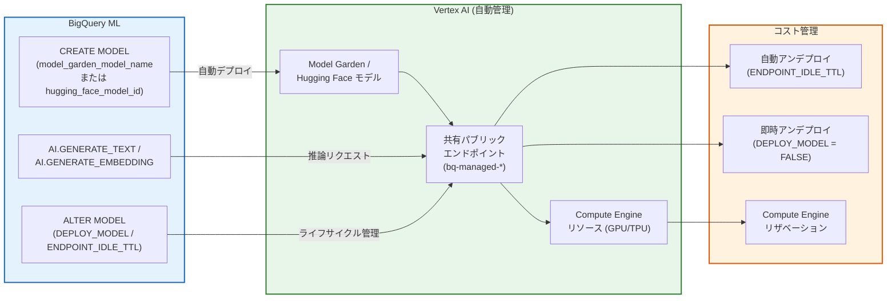

# BigQuery ML: オープンモデルの Vertex AI エンドポイントへの自動デプロイ

**リリース日**: 2026-03-17

**サービス**: BigQuery ML

**機能**: オープンモデルの Vertex AI エンドポイントへの自動デプロイ (Auto Deploy Open Models to Vertex AI)

**ステータス**: Feature

📊 [このアップデートのインフォグラフィックを見る](https://takech9203.github.io/google-cloud-news-summary/20260317-bigquery-ml-auto-deploy-vertex-ai.html)

## 概要

BigQuery ML において、オープンモデルを Vertex AI エンドポイントに自動的にデプロイできる機能がリリースされた。この機能により、Vertex AI Model Garden や Hugging Face のオープンモデルを BigQuery ML の `CREATE MODEL` ステートメントで作成する際に、BigQuery が Vertex AI リソースの作成・管理を自動的に行うようになる。

従来、BigQuery ML でオープンモデルを利用するには、ユーザーが Vertex AI 側でモデルのデプロイやエンドポイントの管理を手動で行い、そのエンドポイント URL を BigQuery ML のリモートモデル作成時に指定する必要があった。今回のアップデートにより、`CREATE MODEL` ステートメント内で `model_garden_model_name` や `hugging_face_model_id` を指定するだけで、BigQuery が自動的に Vertex AI 共有パブリックエンドポイントへのデプロイを実行し、リソースのライフサイクル管理も一元的に行う。

この機能は、BigQuery ML を活用してテキスト生成やエンベディング生成を行う ML エンジニア、データサイエンティスト、および BigQuery ベースの AI パイプラインを構築するソリューションアーキテクトを主な対象としている。

**アップデート前の課題**

- オープンモデルを利用するには、まず Vertex AI 側でモデルをデプロイし、エンドポイントを手動で作成・管理する必要があった
- Vertex AI リソース（モデル、エンドポイント）のライフサイクル管理が BigQuery ML とは独立しており、不要になったリソースの削除漏れによるコスト増加リスクがあった
- モデルを使用していないアイドル時間中もエンドポイントが稼働し続け、不必要な課金が発生する可能性があった

**アップデート後の改善**

- `CREATE MODEL` ステートメントのみで Vertex AI エンドポイントへの自動デプロイが完了し、Vertex AI コンソールでの手動操作が不要になった
- BigQuery ML モデルの変更・削除に連動して Vertex AI リソースも自動的に管理されるため、リソースの管理漏れを防止できる
- `ENDPOINT_IDLE_TTL` オプションによるアイドル時の自動アンデプロイや、`DEPLOY_MODEL = FALSE` による即座のアンデプロイでコスト最適化が可能になった

## アーキテクチャ図



BigQuery ML の `CREATE MODEL` ステートメントにより、Vertex AI Model Garden または Hugging Face のオープンモデルが自動的に Vertex AI 共有パブリックエンドポイントにデプロイされる。BigQuery がリソースのライフサイクルを一元管理し、アイドル時の自動アンデプロイや Compute Engine リザベーションとの連携によるコスト最適化も実現する。

## サービスアップデートの詳細

### 主要機能

1. **Vertex AI リソースの自動管理**
   - `CREATE MODEL` ステートメントで指定したオープンモデルが、Vertex AI 共有パブリックエンドポイントに自動デプロイされる
   - Vertex AI のリソース ID は `bq-managed-` プレフィックスで管理される
   - BigQuery ML モデルの `ALTER` や `DELETE` に連動して、Vertex AI 側のリソースも自動的に変更・削除される

2. **Compute Engine リザベーションとの連携**
   - Compute Engine リザベーションを使用して、オープンモデルの推論用リソース (VM) の可用性を確保できる
   - `RESERVATION_AFFINITY_TYPE`、`RESERVATION_AFFINITY_KEY`、`RESERVATION_AFFINITY_VALUES` オプションで設定
   - リザベーションにより、推論リクエスト時のリソース確保が保証され、安定した推論パフォーマンスを実現

3. **自動・即時アンデプロイによるコスト管理**
   - `ENDPOINT_IDLE_TTL` オプションでアイドル時間のしきい値を設定し、指定時間経過後にモデルを自動アンデプロイ
   - `ALTER MODEL` で `DEPLOY_MODEL = FALSE` を設定することで、即座にモデルをアンデプロイし課金を停止
   - アンデプロイ後も BigQuery ML モデルオブジェクトとメタデータは保持され、`DEPLOY_MODEL = TRUE` で再デプロイ可能

## 技術仕様

### サポート対象モデル

| カテゴリ | モデル例 |
|---------|---------|
| Vertex AI Model Garden (テキスト生成) | Gemma 3, Gemma 2, Llama 4, Llama 3.3, DeepSeek R1, DeepSeek V3, Mistral, Phi-4, Qwen3.5 など |
| Vertex AI Model Garden (エンベディング) | E5 Text Embedding, Qwen3 Embedding, EmbeddingGemma |
| Hugging Face | Text Generation Inference API または Text Embeddings Inference API 対応モデル |

### エンドポイントのロケーション決定ルール

| BigQuery データセットのロケーション | Vertex AI エンドポイントのリージョン |
|-----------------------------------|------------------------------------|
| シングルリージョン | 同一リージョン |
| US マルチリージョン | us-central1 |
| EU マルチリージョン | europe-west4 |

### 主要オプション

| オプション | 説明 | 例 |
|-----------|------|-----|
| `model_garden_model_name` | Model Garden モデルの指定 | `'publishers/google/models/gemma3@gemma-3-1b-it'` |
| `hugging_face_model_id` | Hugging Face モデル ID | `'intfloat/multilingual-e5-small'` |
| `ENDPOINT_IDLE_TTL` | アイドル後の自動アンデプロイ時間 | `INTERVAL 8 HOUR` |
| `DEPLOY_MODEL` | デプロイ状態の手動制御 | `TRUE` / `FALSE` |
| `MAX_REPLICA_COUNT` | 最大レプリカ数 | `10` |

## 設定方法

### 前提条件

1. BigQuery Admin ロール (`roles/bigquery.admin`) および Vertex AI Administrator ロール (`roles/aiplatform.admin`) が付与されていること
2. BigQuery Connection API および Vertex AI API が有効化されていること
3. BigQuery の接続 (Connection) が作成済みであること（`DEFAULT` 接続も使用可能）

### 手順

#### ステップ 1: Model Garden モデルの自動デプロイ

```sql
CREATE MODEL `project_id.mydataset.my_model_garden_model`
REMOTE WITH CONNECTION DEFAULT
OPTIONS (
  model_garden_model_name = 'publishers/google/models/gemma3@gemma-3-1b-it',
  endpoint_idle_ttl = INTERVAL 8 HOUR
);
```

Vertex AI Model Garden の Gemma 3 モデルを自動デプロイし、8 時間アイドル後に自動アンデプロイする設定例である。

#### ステップ 2: Hugging Face モデルの自動デプロイ（大規模エンベディング生成向け）

```sql
CREATE MODEL `project_id.mydataset.my_hugging_face_model`
REMOTE WITH CONNECTION DEFAULT
OPTIONS (
  hugging_face_model_id = 'intfloat/multilingual-e5-small',
  max_replica_count = 10
);
```

Hugging Face モデルを 10 レプリカで自動デプロイし、大規模なエンベディング生成に対応する設定例である。

#### ステップ 3: 推論の実行

```sql
SELECT * FROM AI.GENERATE_TEXT(
  MODEL `project_id.mydataset.my_model_garden_model`,
  (SELECT 'What is the purpose of dreams?' AS prompt)
);
```

#### ステップ 4: コスト管理のためのアンデプロイ

```sql
-- 推論完了後に即座にアンデプロイしてコストを停止
ALTER MODEL `project_id.mydataset.my_model_garden_model`
SET OPTIONS (deploy_model = FALSE);

-- 再度使用する際に再デプロイ
ALTER MODEL `project_id.mydataset.my_model_garden_model`
SET OPTIONS (deploy_model = TRUE);
```

## メリット

### ビジネス面

- **運用コストの削減**: Vertex AI リソースの手動管理が不要になり、ML エンジニアの運用負荷が大幅に軽減される。アイドル時の自動アンデプロイにより、不要なコストを自動的に抑制できる
- **ML 導入の加速**: BigQuery SQL のみでオープンモデルの活用が可能になり、Vertex AI の専門知識がなくてもデータアナリストが生成 AI 機能を利用できる

### 技術面

- **リソース管理の自動化**: BigQuery ML モデルのライフサイクルと Vertex AI リソースが自動連動し、リソースの管理漏れ（削除忘れ等）による不必要な課金を防止
- **安定した推論パフォーマンス**: Compute Engine リザベーションとの連携により、推論リクエスト時の VM 可用性を確保でき、バースト的な推論ワークロードにも対応
- **SQL ベースの一元管理**: モデルのデプロイ、推論、アンデプロイまでを SQL ステートメントで完結でき、CI/CD パイプラインへの組み込みが容易

## デメリット・制約事項

### 制限事項

- オープンモデルではテキストデータのみ処理可能であり、マルチモーダルデータはサポートされていない
- モデル作成・更新ジョブをキャンセルしても、Vertex AI 側のリソースはクリーンアップされない（Vertex AI が進行中のデプロイのキャンセルをサポートしていないため）
- タイムトラベルは自動デプロイされたオープンモデルでサポートされておらず、モデルに関連付けられた Vertex AI リソースは復元されない
- BigQuery ML モデルが含まれるデータセットを削除する場合、先にモデルを削除する必要がある。そうしないと Vertex AI リソースがアクティブなまま残り、手動削除が必要になる

### 考慮すべき点

- BigQuery が管理する Vertex AI リソース（`bq-managed-*`）を Vertex AI 側から直接変更しないこと。推論中にモデルを手動アンデプロイすると、クエリ全体が失敗する可能性がある
- 自動デプロイされたモデルはマシン時間単位で課金されるため、エンドポイント設定完了後から課金が開始される。`ENDPOINT_IDLE_TTL` の適切な設定によるコスト管理が重要
- 本機能は Preview ステータスであり、Pre-GA Offerings Terms が適用される。本番ワークロードでの利用時はサポート範囲を確認すること

## ユースケース

### ユースケース 1: バッチテキスト生成パイプライン

**シナリオ**: 毎日定時に BigQuery 内の顧客フィードバックデータに対してテキスト生成（要約・分類）を実行し、完了後にモデルをアンデプロイしてコストを最適化する。

**実装例**:
```sql
-- モデル作成（初回のみ）
CREATE MODEL IF NOT EXISTS `project.dataset.feedback_summarizer`
REMOTE WITH CONNECTION DEFAULT
OPTIONS (
  model_garden_model_name = 'publishers/google/models/gemma3@gemma-3-1b-it',
  endpoint_idle_ttl = INTERVAL 2 HOUR
);

-- バッチ推論
SELECT feedback_id, ml_generate_text_result
FROM AI.GENERATE_TEXT(
  MODEL `project.dataset.feedback_summarizer`,
  TABLE `project.dataset.daily_feedback`
);
```

**効果**: 推論完了後 2 時間で自動アンデプロイされ、バッチ処理に必要な時間のみ課金が発生する。

### ユースケース 2: 大規模エンベディング生成によるベクトル検索基盤構築

**シナリオ**: BigQuery に格納された大量のドキュメントデータに対してエンベディングを生成し、BigQuery のベクトル検索機能と組み合わせてセマンティック検索基盤を構築する。

**実装例**:
```sql
-- Hugging Face エンベディングモデルの自動デプロイ
CREATE MODEL `project.dataset.doc_embedder`
REMOTE WITH CONNECTION DEFAULT
OPTIONS (
  hugging_face_model_id = 'intfloat/multilingual-e5-small',
  max_replica_count = 10
);

-- 大規模エンベディング生成
SELECT * FROM AI.GENERATE_EMBEDDING(
  MODEL `project.dataset.doc_embedder`,
  TABLE `project.dataset.documents`
);
```

**効果**: 10 レプリカの並列処理により大規模データのエンベディング生成を高速に完了でき、BigQuery のベクトル検索と組み合わせたセマンティック検索が SQL のみで実現できる。

## 料金

自動デプロイされたオープンモデルは、Vertex AI のマシン時間単位で課金される。エンドポイントが完全にセットアップされた時点から課金が開始され、モデルがアンデプロイされるまで継続する。BigQuery ML のデータ処理料金も別途発生する。

| 課金項目 | 説明 |
|---------|------|
| Vertex AI 推論 | マシン時間単位の課金（GPU/TPU タイプにより異なる） |
| BigQuery ML | データ処理量に基づく課金 |
| Compute Engine リザベーション | リザベーション利用時の確約利用割引適用可能 |

詳細は Vertex AI 料金ページおよび BigQuery ML 料金ページを参照のこと。

## 利用可能リージョン

自動デプロイされたモデルの Vertex AI エンドポイントは、BigQuery データセットのロケーションに基づいて自動的に決定される。BigQuery ML がサポートするすべてのリージョンで利用可能。シングルリージョンのデータセットでは同一リージョン、US マルチリージョンでは us-central1、EU マルチリージョンでは europe-west4 にデプロイされる。

## 関連サービス・機能

- **Vertex AI Model Garden**: Gemma、Llama、DeepSeek 等のオープンモデルを提供するモデルカタログ。自動デプロイの対象モデルはここから選択する
- **Vertex AI Model Registry**: BigQuery ML モデルの登録・バージョン管理・デプロイを行うサービス。自動デプロイは Model Registry を経由した管理とは別のアプローチとなる
- **Compute Engine リザベーション**: 推論用 VM の可用性を確保するためのリソース予約サービス。自動デプロイモデルと連携して安定した推論を実現
- **BigQuery AI 関数**: `AI.GENERATE_TEXT`、`AI.GENERATE_EMBEDDING` 等の SQL 関数。自動デプロイされたモデルに対して推論リクエストを送信する際に使用

## 参考リンク

- 📊 [インフォグラフィック](https://takech9203.github.io/google-cloud-news-summary/20260317-bigquery-ml-auto-deploy-vertex-ai.html)
- [公式リリースノート](https://cloud.google.com/release-notes#March_17_2026)
- [ドキュメント: CREATE REMOTE MODEL (Open Models)](https://cloud.google.com/bigquery/docs/reference/standard-sql/bigqueryml-syntax-create-remote-model-open)
- [ドキュメント: Manage BigQuery ML models in Vertex AI](https://cloud.google.com/bigquery/docs/managing-models-vertex)
- [ドキュメント: BigQuery ML の概要](https://cloud.google.com/bigquery/docs/bqml-introduction)
- [料金ページ: Vertex AI](https://cloud.google.com/vertex-ai/pricing#prediction-prices)
- [料金ページ: BigQuery ML](https://cloud.google.com/bigquery/pricing#bqml)

## まとめ

BigQuery ML のオープンモデル自動デプロイ機能により、Vertex AI Model Garden や Hugging Face のモデルを SQL ステートメントだけで Vertex AI エンドポイントにデプロイし、推論を実行できるようになった。Vertex AI リソースの自動管理、Compute Engine リザベーションによるリソース確保、アイドル時の自動アンデプロイによるコスト最適化が主な利点である。BigQuery ML でオープンモデルを利用している場合は、`ENDPOINT_IDLE_TTL` オプションを活用したコスト管理を組み込みつつ、手動デプロイからの移行を検討すべきである。

---

**タグ**: #BigQuery #BigQueryML #VertexAI #OpenModels #AutoDeploy #ModelGarden #HuggingFace #MachineLearning #CostOptimization
