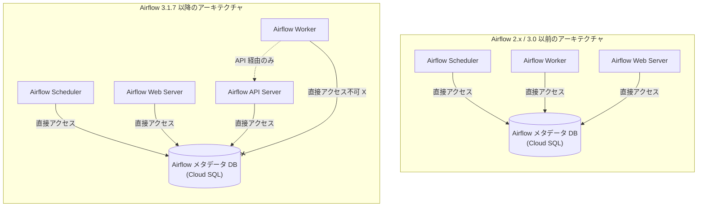

# Cloud Composer: 2026 年 3 月リリース (Airflow 3.1.7、新ビルド、非推奨化)

**リリース日**: 2026-03-17

**サービス**: Cloud Composer

**機能**: 2026 年 3 月リリース - Airflow 3.1.7 対応、新ビルド追加、アーキテクチャ変更 (Breaking Change)

**ステータス**: CHANGE / BREAKING / DEPRECATED

[このアップデートのインフォグラフィックを見る](https://takech9203.github.io/google-cloud-news-summary/20260317-cloud-composer-march-2026-release.html)

## 概要

Cloud Composer の 2026 年 3 月リリースでは、Cloud Composer 3 および Cloud Composer 2 の両方で新しいビルドとイメージが提供されました。特に注目すべき点として、Airflow 3.1.7 に対応した新ビルド `composer-3-airflow-3.1.7-build.1` が追加され、Airflow ワーカーがデータベースに直接アクセスできなくなるという重大な Breaking Change が含まれています。

この Breaking Change は、Airflow 3.0 で導入されたアーキテクチャおよびセキュリティの改善に基づくものです。従来、Airflow ワーカーは Airflow メタデータデータベースに直接クエリを実行できましたが、`composer-3-airflow-3.1.7-build.1` 以降ではこのアクセスが遮断されます。DAG 内でデータベースへの直接クエリを実行しているユーザーは、Airflow 3.1.7 へのアップグレード前にコードの修正が必要です。

また、apache-airflow-providers-cncf-kubernetes が v10.13.0 に、apache-airflow-providers-google が v20.0.0 にアップグレードされ、複数の旧ビルドおよびイメージが非推奨化されました。

**アップデート前の課題**

- Airflow 2.x 系ではワーカーが Airflow メタデータデータベースに直接アクセスでき、セキュリティ上のリスクが存在していた
- DAG コード内からデータベースに直接 SQL クエリを実行する慣行が可能であり、意図しないデータ漏洩やデータベース負荷の原因となり得た
- 旧バージョンのプロバイダーパッケージでは最新の Kubernetes および Google Cloud サービスとの互換性に制約があった

**アップデート後の改善**

- Airflow 3.1.7 ではワーカーからのデータベース直接アクセスが遮断され、セキュリティが強化された
- ワーカーは Airflow API を通じてメタデータにアクセスする設計に変更され、関心の分離が徹底された
- apache-airflow-providers-google v20.0.0 および apache-airflow-providers-cncf-kubernetes v10.13.0 により、最新の Google Cloud サービスとの統合が改善された

## アーキテクチャ図



Airflow 3.1.7 以降では、ワーカーはメタデータデータベースへの直接接続が遮断され、Airflow API を介してのみメタデータにアクセスします。スケジューラや Web サーバーは引き続きデータベースに直接アクセスします。

## サービスアップデートの詳細

### 主要機能

1. **Airflow 3.1.7 対応ビルド (Breaking Change)**
   - `composer-3-airflow-3.1.7-build.1` が Cloud Composer 3 で利用可能
   - Airflow ワーカーからメタデータデータベースへの直接アクセスが遮断される重大な変更を含む
   - Airflow 3.0 で導入されたアーキテクチャおよびセキュリティ改善に基づく変更

2. **Cloud Composer 3 の新ビルド**
   - `composer-3-airflow-3.1.7-build.1` (Airflow 3.1.7 系の最新)
   - `composer-3-airflow-2.10.5-build.30` (デフォルト)
   - `composer-3-airflow-2.9.3-build.50`

3. **Cloud Composer 2 の新イメージ**
   - `composer-2.16.7-airflow-2.10.5` (デフォルト)
   - `composer-2.16.7-airflow-2.9.3`

4. **プロバイダーパッケージのアップグレード**
   - `apache-airflow-providers-cncf-kubernetes` が v10.13.0 にアップグレード
   - `apache-airflow-providers-google` が v20.0.0 にアップグレード

5. **非推奨化されたビルド・イメージ**
   - `composer-3-airflow-2.9.3-build.18`
   - `composer-3-airflow-2.9.3-build.17`
   - `composer-2.11.5-*` (全イメージ)
   - `composer-2.11.4-*` (全イメージ)

## 技術仕様

### Cloud Composer 3 ビルド一覧

| ビルド | Airflow バージョン | 備考 |
|--------|-------------------|------|
| composer-3-airflow-3.1.7-build.1 | 3.1.7 | 新規追加、Breaking Change 含む |
| composer-3-airflow-2.10.5-build.30 | 2.10.5 | デフォルト |
| composer-3-airflow-2.9.3-build.50 | 2.9.3 | - |

### Cloud Composer 2 イメージ一覧

| イメージ | Airflow バージョン | 備考 |
|----------|-------------------|------|
| composer-2.16.7-airflow-2.10.5 | 2.10.5 | デフォルト |
| composer-2.16.7-airflow-2.9.3 | 2.9.3 | - |

### プロバイダーパッケージ変更

| パッケージ | 新バージョン |
|-----------|-------------|
| apache-airflow-providers-cncf-kubernetes | v10.13.0 |
| apache-airflow-providers-google | v20.0.0 |

### 非推奨化されたバージョン

| バージョン / ビルド | 種別 |
|-------------------|------|
| composer-3-airflow-2.9.3-build.18 | Cloud Composer 3 ビルド |
| composer-3-airflow-2.9.3-build.17 | Cloud Composer 3 ビルド |
| composer-2.11.5-* | Cloud Composer 2 イメージ (全 Airflow バージョン) |
| composer-2.11.4-* | Cloud Composer 2 イメージ (全 Airflow バージョン) |

## 設定方法

### 前提条件

1. Google Cloud プロジェクトで Cloud Composer API が有効化されていること
2. Cloud Composer 環境を管理するための適切な IAM 権限 (roles/composer.admin) を持つこと

### 手順

#### ステップ 1: 現在の環境バージョンの確認

```bash
gcloud composer environments describe ENVIRONMENT_NAME \
    --location LOCATION \
    --format="value(config.softwareConfig.imageVersion)"
```

現在のビルドまたはイメージバージョンを確認し、非推奨化対象に該当するか確認します。

#### ステップ 2: Cloud Composer 3 環境のアップグレード (Airflow 3.1.7 へ)

```bash
gcloud composer environments update ENVIRONMENT_NAME \
    --location LOCATION \
    --airflow-version 3.1.7
```

Airflow 3.1.7 へアップグレードする前に、DAG 内でデータベースへの直接クエリを実行していないことを確認してください。

#### ステップ 3: Cloud Composer 2 環境のアップグレード

```bash
gcloud composer environments update ENVIRONMENT_NAME \
    --location LOCATION \
    --image-version composer-2.16.7-airflow-2.10.5
```

Cloud Composer 2 環境を最新のイメージに更新します。

## メリット

### セキュリティ面

- **データベースアクセスの制限**: Airflow 3.1.7 でワーカーからのデータベース直接アクセスが遮断されることにより、DAG コードによる意図しないデータベース操作のリスクが低減される
- **関心の分離**: ワーカーが API 経由でのみメタデータにアクセスする設計により、各コンポーネントの責任範囲が明確化される

### 技術面

- **最新プロバイダーパッケージ**: apache-airflow-providers-google v20.0.0 と apache-airflow-providers-cncf-kubernetes v10.13.0 により、最新の Google Cloud サービスおよび Kubernetes との統合が改善される
- **継続的なバージョンサポート**: 新しいビルドとイメージの定期リリースにより、セキュリティパッチや機能改善が継続的に提供される

## デメリット・制約事項

### 制限事項

- Airflow 3.1.7 の Breaking Change により、DAG 内でデータベースに直接クエリを実行しているコードは動作しなくなる
- apache-airflow-providers-google v20.0.0 はメジャーバージョンアップであり、非推奨化されたオペレーターが削除されている可能性がある
- 非推奨化されたビルド・イメージを使用している環境は、サポート終了前にアップグレードが必要

### 考慮すべき点

- Airflow 3.1.7 へのアップグレード前に、全ての DAG コードを精査し、データベースへの直接アクセスパターンを特定・修正する必要がある
- プロバイダーパッケージのメジャーアップグレードに伴い、使用しているオペレーターの互換性を確認する必要がある
- Cloud Composer 2 の `composer-2.11.4-*` および `composer-2.11.5-*` はサポート終了となるため、早期のアップグレード計画が推奨される

## ユースケース

### ユースケース 1: Airflow 3.1.7 へのアップグレード前のコード監査

**シナリオ**: 本番環境で Cloud Composer 3 (Airflow 2.x) を運用しており、Airflow 3.1.7 へのアップグレードを計画しているチーム。

**実装例**:
```python
# NG: Airflow 3.1.7 以降では動作しないパターン
from airflow.models import DagRun
from airflow.utils.session import provide_session

@provide_session
def query_dag_runs(session=None):
    # ワーカーからデータベースへの直接クエリ
    runs = session.query(DagRun).filter(...).all()
    return runs

# OK: Airflow API を使用するパターン
import requests

def query_dag_runs_via_api():
    response = requests.get(
        "http://airflow-webserver:8080/api/v1/dags/my_dag/dagRuns",
        headers={"Authorization": "Bearer <token>"}
    )
    return response.json()
```

**効果**: Breaking Change による本番障害を未然に防止し、Airflow 3.x のセキュリティモデルに準拠したコードベースを維持できる。

### ユースケース 2: 非推奨バージョンからの移行

**シナリオ**: `composer-2.11.4-*` または `composer-2.11.5-*` を使用している環境を運用しており、サポート終了前にアップグレードが必要。

**効果**: `composer-2.16.7-airflow-2.10.5` へのアップグレードにより、最新のセキュリティパッチと機能改善が適用され、継続的なサポートが受けられる。

## 関連サービス・機能

- **Apache Airflow**: Cloud Composer の基盤となるワークフローオーケストレーションエンジン。Airflow 3.x ではアーキテクチャの大幅な改善が行われている
- **Cloud SQL**: Cloud Composer 環境の Airflow メタデータデータベースをホストするマネージドデータベースサービス
- **Google Kubernetes Engine (GKE)**: Cloud Composer 2 の環境クラスタを実行する基盤。apache-airflow-providers-cncf-kubernetes のアップグレードにより連携が改善
- **Cloud Composer バージョン管理**: ビルドおよびイメージのライフサイクル管理。サポート終了日までにアップグレードを完了する必要がある

## 参考リンク

- [インフォグラフィック](https://takech9203.github.io/google-cloud-news-summary/20260317-cloud-composer-march-2026-release.html)
- [公式リリースノート](https://cloud.google.com/release-notes#March_17_2026)
- [Cloud Composer バージョン一覧](https://cloud.google.com/composer/docs/composer-versions)
- [Cloud Composer 3 環境アーキテクチャ](https://cloud.google.com/composer/docs/composer-3/environment-architecture)
- [Cloud Composer セキュリティプラクティス](https://cloud.google.com/composer/docs/composer-3/security-practices)
- [Cloud Composer 2 から 3 への移行ガイド](https://cloud.google.com/composer/docs/composer-2/migrate-composer-3)
- [Cloud Composer 料金](https://cloud.google.com/composer/pricing)

## まとめ

今回の Cloud Composer 2026 年 3 月リリースで最も重要な変更は、Airflow 3.1.7 におけるワーカーからのデータベース直接アクセス遮断です。この Breaking Change は、Airflow 3.0 以降のセキュリティ改善の一環であり、全てのユーザーは Airflow 3.1.7 へのアップグレード前に DAG コードを精査し、データベースへの直接クエリパターンを API 経由のアクセスに移行する必要があります。また、非推奨化されたビルド・イメージを使用している環境は、サポート終了前のアップグレード計画を早急に策定することを推奨します。

---

**タグ**: #CloudComposer #Airflow #BreakingChange #Airflow3 #セキュリティ #バージョンアップデート #非推奨化 #GCP
