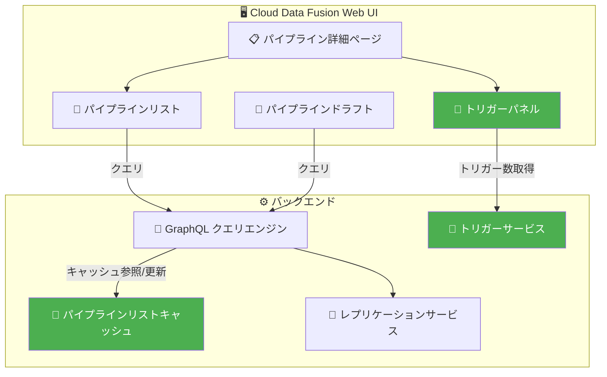

# Cloud Data Fusion: バージョン 6.11.1.2 パッチリリース (バグ修正)

**リリース日**: 2026-03-17

**サービス**: Cloud Data Fusion

**機能**: バージョン 6.11.1.2 パッチリビジョン (トリガーパネル修正・GraphQL クエリキャッシュ改善)

**ステータス**: GA (一般提供)

📊 [このアップデートのインフォグラフィックを見る](https://takech9203.github.io/google-cloud-news-summary/20260317-cloud-data-fusion-v6-11-1-2.html)

## 概要

Cloud Data Fusion バージョン 6.11.1.2 が一般提供 (GA) として公開された。本リリースは、パイプライン管理の UI およびバックエンドに関する 2 つのバグ修正を含むパッチリビジョンである。

1 つ目の修正は、パイプライン詳細ページのトリガーパネルにおいて、初回ロード時にトリガー数が正しく表示されない問題 (CDAP-21230) の解消である。2 つ目の修正は、GraphQL クエリメカニズムの改善で、パイプラインリストのキャッシュ機能が追加され、パイプラインドラフトおよびレプリケーションジョブに関連するバグが修正された。

Cloud Data Fusion を利用してデータ統合パイプラインを運用しているユーザー、特にトリガーベースのパイプラインオーケストレーションやパイプラインドラフト管理を行っているチームに影響するアップデートである。

**アップデート前の課題**

- パイプライン詳細ページのトリガーパネルが初回ロード時に正しいトリガー数を表示せず、実際のトリガー設定状況を正確に把握できなかった
- GraphQL クエリがパイプラインリストをキャッシュしていなかったため、パフォーマンスに影響があった可能性がある
- パイプラインドラフトおよびレプリケーションジョブに関連するバグが存在していた

**アップデート後の改善**

- トリガーパネルが初回ロード時から正確なトリガー数を表示するようになり、パイプラインのオーケストレーション状態を正しく把握できるようになった
- GraphQL クエリメカニズムにパイプラインリストのキャッシュが導入され、UI のレスポンスが改善された
- パイプラインドラフトおよびレプリケーションジョブに関連するバグが修正され、安定性が向上した

## アーキテクチャ図



本図は、今回のパッチで修正された箇所を示している。緑色で強調された「トリガーパネル」「パイプラインリストキャッシュ」「トリガーサービス」が修正対象のコンポーネントである。

## サービスアップデートの詳細

### 主要機能

1. **トリガーパネルの表示修正 (CDAP-21230)**
   - パイプライン詳細ページのトリガーパネルが、初回ロード時に正しいトリガー数を表示するように修正された
   - 以前はページを手動でリロードしないとトリガー数が正しく反映されないケースがあった
   - Cloud Data Fusion のトリガー機能は、上流パイプラインの完了 (成功・失敗・停止) をトリガーとして下流パイプラインを自動実行するオーケストレーション機能であり、その設定状況の正確な表示は運用上重要である

2. **GraphQL クエリメカニズムのキャッシュ導入**
   - パイプラインリストの取得にキャッシュ機能が追加され、繰り返しのクエリ実行時のパフォーマンスが改善された
   - Web UI でのパイプライン一覧表示やナビゲーションの体感速度が向上する

3. **パイプラインドラフト・レプリケーションジョブのバグ修正**
   - パイプラインドラフト (未デプロイのパイプライン設定) に関連するバグが修正された
   - レプリケーションジョブに関連するバグが修正され、データレプリケーションパイプラインの信頼性が向上した

## 技術仕様

### バージョン情報

| 項目 | 詳細 |
|------|------|
| バージョン | 6.11.1.2 |
| ベースバージョン | 6.11.1 (2025 年 8 月 27 日 GA) |
| リリースタイプ | パッチリビジョン (バグ修正) |
| ステータス | GA (一般提供) |
| 修正チケット | CDAP-21230 |

### 前バージョンからの変更履歴

| バージョン | リリース日 | 主な変更 |
|-----------|-----------|---------|
| 6.11.0 | 2025-03-17 | Preview リリース、高可用性、エラー分類機能 |
| 6.11.1 | 2025-08-27 | GA リリース、Bitbucket HTTP トークン対応、Java 11 移行 |
| 6.11.1.2 | 2026-03-17 | トリガーパネル修正、GraphQL キャッシュ導入 |

## 設定方法

### 前提条件

1. Cloud Data Fusion インスタンスが作成済みであること
2. インスタンスが 6.11.x 系で稼働していること

### 手順

#### ステップ 1: パッチリビジョンの確認

Google Cloud コンソールで Cloud Data Fusion インスタンスの詳細を確認し、利用可能なパッチリビジョンを確認する。

```bash
# gcloud CLI でインスタンスの現在のバージョンを確認
gcloud beta data-fusion instances describe INSTANCE_ID \
  --location=REGION \
  --project=PROJECT_ID \
  --format="value(version)"
```

#### ステップ 2: パッチリビジョンへのアップグレード

```bash
# パッチリビジョン 6.11.1.2 にアップグレード
gcloud beta data-fusion instances update INSTANCE_ID \
  --location=REGION \
  --project=PROJECT_ID \
  --patch_revision=6.11.1.2
```

## メリット

### ビジネス面

- **運用効率の改善**: トリガーパネルの正確な表示により、パイプラインオーケストレーションの監視が容易になる
- **信頼性向上**: パイプラインドラフトおよびレプリケーションジョブのバグ修正により、データ統合ワークフローの安定性が向上する

### 技術面

- **UI パフォーマンスの向上**: GraphQL クエリのキャッシュ導入により、パイプラインリストの表示速度が改善される
- **正確なトリガー情報**: 初回ロード時から正しいトリガー数が表示され、画面リロードの手間が不要になる

## デメリット・制約事項

### 制限事項

- パッチリビジョンの適用にはインスタンスのアップグレードが必要であり、一時的なダウンタイムが発生する可能性がある
- 6.11.x 系以外のバージョンからの直接アップグレードパスについては公式ドキュメントを確認する必要がある

### 考慮すべき点

- パッチリビジョン適用前に、既存パイプラインのバックアップやテスト環境での動作確認を推奨する
- 6.11.1 で導入された Java 8 から Java 11 への移行や Dataproc 2.0 の非サポートなど、ベースバージョンの変更点にも注意が必要である

## ユースケース

### ユースケース 1: トリガーベースのパイプラインオーケストレーション

**シナリオ**: 複数のデータ統合パイプラインをトリガーで連鎖させ、上流パイプラインの成功完了を契機に下流パイプラインを自動実行している環境。トリガーパネルの表示不具合により、運用チームがパイプライン間の依存関係を正確に把握しづらかった。

**効果**: 6.11.1.2 へのアップグレードにより、パイプライン詳細ページで初回ロード時から正確なトリガー数が表示され、オーケストレーション設定の確認が効率化される。

### ユースケース 2: 大規模パイプライン管理

**シナリオ**: 数百のパイプラインを管理する組織で、パイプラインリストの表示に時間がかかり、ドラフトの管理にも問題が発生していた。

**効果**: GraphQL クエリのキャッシュ機能により、パイプラインリストの表示速度が改善される。また、ドラフト関連のバグ修正により、パイプラインの設計・テスト作業がスムーズになる。

## 料金

Cloud Data Fusion の料金はエディション (Developer、Basic、Enterprise) とインスタンスの稼働時間に基づく。今回のパッチリビジョン適用に伴う追加料金は発生しない。

詳細は [Cloud Data Fusion 料金ページ](https://cloud.google.com/data-fusion/pricing) を参照。

## 関連サービス・機能

- **Cloud Data Fusion トリガー機能**: パイプライン間のオーケストレーションを実現する機能。今回のパッチで表示の正確性が改善された
- **Cloud Data Fusion レプリケーション**: データソース間のレプリケーションを管理する機能。関連バグが修正された
- **Cloud Dataproc**: Cloud Data Fusion がパイプライン実行環境として使用するマネージド Spark/Hadoop サービス
- **Cloud Monitoring**: Cloud Data Fusion インスタンスおよびパイプラインのメトリクス監視に使用
- **Cloud Logging**: パイプラインログおよびインスタンスログの確認に使用

## 参考リンク

- 📊 [インフォグラフィック](https://takech9203.github.io/google-cloud-news-summary/20260317-cloud-data-fusion-v6-11-1-2.html)
- [公式リリースノート](https://cloud.google.com/data-fusion/docs/release-notes)
- [Cloud Data Fusion ドキュメント](https://cloud.google.com/data-fusion/docs/concepts/overview)
- [パイプラインオーケストレーション (トリガー)](https://cloud.google.com/data-fusion/docs/concepts/orchestrate-pipelines)
- [パッチリビジョンの管理](https://cloud.google.com/data-fusion/docs/how-to/upgrade-to-patch-revision)
- [料金ページ](https://cloud.google.com/data-fusion/pricing)
- [バージョンサポートポリシー](https://cloud.google.com/data-fusion/docs/version-support-policy)

## まとめ

Cloud Data Fusion 6.11.1.2 は、パイプライン管理 UI の信頼性とパフォーマンスを改善するパッチリリースである。特にトリガーベースのオーケストレーションを利用している環境では、トリガーパネルの表示修正により運用効率が向上する。6.11.1.x 系を利用中のユーザーは、パッチリビジョンの適用を推奨する。

---

**タグ**: #CloudDataFusion #CDAP #パイプライン #トリガー #バグ修正 #GraphQL #データ統合 #GA
