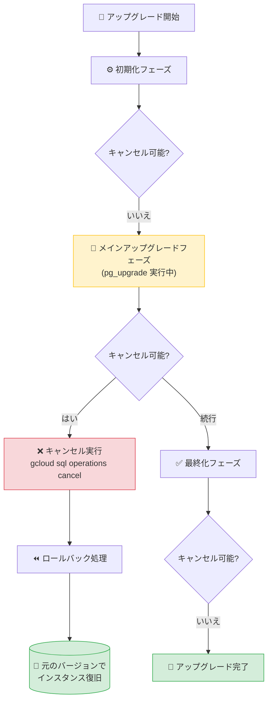

# Cloud SQL for PostgreSQL: メジャーバージョンアップグレードのキャンセル機能

**リリース日**: 2026-03-17

**サービス**: Cloud SQL for PostgreSQL

**機能**: インプレースメジャーバージョンアップグレードのキャンセル

**ステータス**: Feature

📊 [このアップデートのインフォグラフィックを見る](https://takech9203.github.io/google-cloud-news-summary/20260317-cloud-sql-postgresql-cancel-major-upgrade.html)

## 概要

Cloud SQL for PostgreSQL において、インプレースメジャーバージョンアップグレード操作を「メインアップグレードフェーズ」中にキャンセルできる機能が追加された。これにより、アップグレード処理の実行中に問題を検知した場合、完了を待たずに操作を中断し、インスタンスを元のバージョンに戻すことが可能になる。

この機能は、大規模データベースのアップグレードなど長時間を要するケースにおいて特に有用である。アップグレードログの出力開始をトリガーにキャンセル可能なウィンドウを判断でき、gcloud CLI または REST API からキャンセル操作を実行できる。

ただし、リードレプリカを含めたアップグレードの場合はキャンセルできないという制約がある。キャンセル機能を利用するには、プライマリインスタンス単体でアップグレードを実行する必要がある。

**アップデート前の課題**

- アップグレードを開始すると途中で中断できず、完了または失敗まで待つ必要があった
- 大量のデータベースやテーブルを持つインスタンスではアップグレードに数時間かかる場合があり、問題を検知しても中断手段がなかった
- アップグレード中はインスタンスが利用不可となるため、想定外の長時間ダウンタイムが発生するリスクがあった

**アップデート後の改善**

- メインアップグレードフェーズ中にキャンセル操作を実行し、インスタンスを元のバージョンにロールバックできるようになった
- アップグレードログの出力状況からキャンセル可能なタイミングを判断できるようになった
- gcloud CLI および REST API の両方からキャンセル操作が可能になり、自動化にも組み込みやすくなった

## アーキテクチャ図



Cloud SQL のインプレースメジャーバージョンアップグレードは 3 つのフェーズで構成される。キャンセルが可能なのはメインアップグレードフェーズのみであり、初期化フェーズおよび最終化フェーズではキャンセルできない。

## サービスアップデートの詳細

### 主要機能

1. **キャンセルウィンドウの提供**
   - アップグレード処理は「初期化」「メインアップグレード」「最終化」の 3 フェーズに分かれる
   - キャンセルが可能なのはメインアップグレードフェーズのみ
   - メインアップグレードフェーズでは内部的に `pg_upgrade` ユーティリティが実行されている

2. **アップグレードログによるフェーズ判定**
   - アップグレードログは `projects/PROJECT_ID/logs/cloudsql.googleapis.com%2Fpostgres-upgrade.log` に出力される
   - ログエントリの出力開始がメインアップグレードフェーズの開始を示す
   - このログを監視することでキャンセル可能なタイミングを判断できる

3. **自動ロールバック**
   - キャンセルが受理されると、Cloud SQL はアップグレード処理を停止しインスタンスを元の状態に戻す
   - キャンセルは即時ではなく、ロールバック処理中もインスタンスは利用不可
   - ロールバックが失敗した場合は、アップグレード開始時に自動取得されたバックアップから復元が必要

## 技術仕様

### アップグレードフェーズとキャンセル可否

| フェーズ | 説明 | キャンセル可否 |
|---------|------|--------------|
| 初期化 | インスタンスとリソースの準備 | 不可 |
| メインアップグレード | `pg_upgrade` によるデータ移行 | 可能 |
| 最終化 | 最終検証と完了処理 | 不可 |

### キャンセルの制約事項

| 条件 | キャンセル可否 |
|------|--------------|
| プライマリインスタンス単体のアップグレード | 可能 |
| リードレプリカを含むアップグレード | 不可 |

## 設定方法

### 前提条件

1. Cloud SQL for PostgreSQL インスタンスのインプレースメジャーバージョンアップグレードが進行中であること
2. リードレプリカを含めずにアップグレードを開始していること
3. `gcloud` CLI がインストール済みであること、または REST API を利用可能であること

### 手順

#### ステップ 1: アップグレードログを確認してキャンセル可能か判断

```bash
# アップグレードログの出力を確認
# ログエントリが出力されていればメインアップグレードフェーズに入っている
gcloud logging read "logName=projects/PROJECT_ID/logs/cloudsql.googleapis.com%2Fpostgres-upgrade.log" --limit=5
```

ログエントリが表示されればキャンセル可能なフェーズである。

#### ステップ 2: アップグレードオペレーション ID を取得

```bash
# インスタンスのオペレーション一覧を取得
gcloud sql operations list --instance=INSTANCE_NAME
```

進行中のアップグレードオペレーションの ID を確認する。

#### ステップ 3: アップグレードをキャンセル

```bash
# gcloud CLI でキャンセル
gcloud sql operations cancel OPERATION_ID
```

REST API を使用する場合:

```bash
# REST API (v1) でキャンセル
curl -X POST \
  -H "Authorization: Bearer $(gcloud auth print-access-token)" \
  -H "Content-Type: application/json; charset=utf-8" \
  -d "" \
  "https://sqladmin.googleapis.com/v1/projects/PROJECT_ID/operations/OPERATION_ID/cancel"
```

#### ステップ 4: キャンセル状態を確認

```bash
# オペレーションの状態を確認
gcloud sql operations describe OPERATION_ID
```

## メリット

### ビジネス面

- **ダウンタイムの制御**: アップグレード中に想定外の問題が発生した場合、完了を待たずに中断してサービスを復旧できる
- **リスク軽減**: メジャーバージョンアップグレードという影響の大きい操作に対して、追加の安全策が提供される

### 技術面

- **運用の柔軟性**: アップグレード中にアプリケーション互換性の問題を検知した場合など、ロールバック判断を迅速に行える
- **自動化対応**: gcloud CLI および REST API から操作可能なため、アップグレード監視スクリプトにキャンセルロジックを組み込める
- **アップグレードログの活用**: ログ出力によりフェーズを判定できるため、モニタリングとの統合が容易

## デメリット・制約事項

### 制限事項

- リードレプリカを含めたアップグレードではキャンセルできない
- キャンセルは即時完了ではなく、ロールバック処理中もインスタンスは利用不可のまま
- 初期化フェーズおよび最終化フェーズではキャンセルできない
- キャンセル可能なウィンドウが過ぎた場合、エラーメッセージが返されキャンセルは受け付けられない

### 考慮すべき点

- キャンセル可能なタイミングを正確に把握するためにアップグレードログの監視が必要
- キャンセル後のロールバックが失敗した場合は、アップグレード開始時の自動バックアップからの手動復元が必要になる
- アップグレード中のキャンセル後にインスタンスが復旧するまでの時間はデータ量やインスタンスサイズに依存する

## ユースケース

### ユースケース 1: 大規模データベースのアップグレード監視

**シナリオ**: 数百 GB のデータベースを持つ Cloud SQL インスタンスを PostgreSQL 14 から 16 にアップグレードする際、アップグレードログを監視してエラーや異常な遅延を検知した場合にキャンセルしたい。

**実装例**:
```bash
# アップグレード開始
gcloud sql instances patch INSTANCE_NAME --database-version=POSTGRES_16

# アップグレードログを監視 (別ターミナル)
gcloud logging tail "logName=projects/PROJECT_ID/logs/cloudsql.googleapis.com%2Fpostgres-upgrade.log"

# 問題を検知した場合、オペレーション ID を取得してキャンセル
gcloud sql operations list --instance=INSTANCE_NAME
gcloud sql operations cancel OPERATION_ID
```

**効果**: アップグレードの長時間ダウンタイムを回避し、問題の調査と修正を行った上で再度アップグレードを試行できる。

### ユースケース 2: メンテナンスウィンドウ超過時の安全策

**シナリオ**: 計画メンテナンスウィンドウ内にアップグレードを完了させる必要があるが、想定以上に時間がかかっている場合にキャンセルして次のメンテナンスウィンドウに再スケジュールする。

**効果**: メンテナンスウィンドウを超過するリスクを低減し、ビジネスへの影響を最小化できる。

## 料金

アップグレードのキャンセル操作自体に追加料金は発生しない。Cloud SQL for PostgreSQL の料金は通常のインスタンス料金体系に従い、vCPU 数、メモリ量、ストレージ容量、リージョンによって決定される。

- Cloud SQL Enterprise Plus edition: 高性能・高可用性向け (99.99% SLA)
- Cloud SQL Enterprise edition: 標準ワークロード向け (99.95% SLA)
- Committed Use Discount (CUD): 1 年契約で 25% 割引、3 年契約で 52% 割引

詳細は [Cloud SQL 料金ページ](https://cloud.google.com/sql/pricing) を参照。

## 利用可能リージョン

Cloud SQL for PostgreSQL が利用可能なすべてのリージョンで使用可能。詳細は [Cloud SQL のリージョン可用性](https://cloud.google.com/sql/docs/postgres/locations) を参照。

## 関連サービス・機能

- **Cloud SQL インプレースメジャーバージョンアップグレード**: 今回キャンセル機能が追加された本体機能。`pg_upgrade` ユーティリティを使用してインスタンスを新しいメジャーバージョンに移行する
- **Cloud SQL 自動バックアップ**: アップグレード開始時に自動的にバックアップが取得される。キャンセル後のロールバック失敗時の復元手段となる
- **Cloud Logging**: アップグレードログ (`cloudsql.googleapis.com/postgres-upgrade.log`) を通じてキャンセル可能なフェーズの判定に使用
- **Cloud Monitoring**: アップグレード中のインスタンス状態やオペレーション進行状況の監視に活用可能

## 参考リンク

- 📊 [インフォグラフィック](https://takech9203.github.io/google-cloud-news-summary/20260317-cloud-sql-postgresql-cancel-major-upgrade.html)
- [公式リリースノート](https://cloud.google.com/release-notes#March_17_2026)
- [メジャーバージョンのインプレースアップグレード](https://cloud.google.com/sql/docs/postgres/upgrade-major-db-version-inplace)
- [Cloud SQL for PostgreSQL の料金](https://cloud.google.com/sql/pricing)
- [Cloud SQL エディション概要](https://cloud.google.com/sql/docs/postgres/editions-intro)

## まとめ

Cloud SQL for PostgreSQL のインプレースメジャーバージョンアップグレードにキャンセル機能が追加されたことで、アップグレード操作の安全性と運用の柔軟性が大幅に向上した。特に大規模データベースを運用しているユーザーにとって、アップグレード中に問題を検知した際のロールバック手段が確保されたことは重要な改善である。この機能を活用するには、リードレプリカを含めずにアップグレードを実行し、アップグレードログを監視してキャンセル可能なウィンドウを把握することが推奨される。

---

**タグ**: Cloud SQL, PostgreSQL, メジャーバージョンアップグレード, キャンセル, インプレースアップグレード, データベース管理
