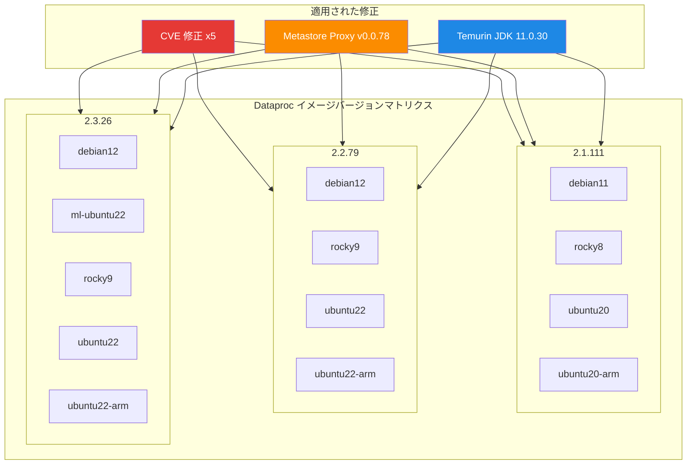

# Dataproc: サブマイナーイメージバージョン更新と CVE 修正

**リリース日**: 2026-03-17

**サービス**: Dataproc on Compute Engine

**機能**: 新サブマイナーイメージバージョン (2.1.111 / 2.2.79 / 2.3.26) + セキュリティ修正 + JDK デフォルト変更

**ステータス**: GA (一般提供)

📊 [このアップデートのインフォグラフィックを見る](https://takech9203.github.io/google-cloud-news-summary/20260317-dataproc-image-updates-cve-fixes.html)

## 概要

Dataproc on Compute Engine の新しいサブマイナーイメージバージョン (2.1.111、2.2.79、2.3.26) が 2026 年 3 月 17 日にリリースされた。本リリースでは、5 件の CVE 修正、Dataproc Metastore Proxy のアップグレード、および全イメージにおけるデフォルト JDK の Temurin JDK 11.0.30 への統一が含まれている。

先行リリース (2026 年 3 月 8 日) の 2.1.110、2.2.78、2.3.25 は 3 月 11 日にロールバックされていたため、今回のリリースは同等のセキュリティ修正を含む再リリースに加え、JDK のデフォルトバージョン変更が追加された形となっている。

セキュリティパッチの適用と JDK の標準化により、Dataproc クラスタを運用するすべてのユーザーに影響するアップデートである。特にセキュリティコンプライアンス要件のある環境では、速やかなイメージバージョンの更新が推奨される。

**アップデート前の課題**

- CVE-2025-58057、CVE-2025-53864、CVE-2025-68161、CVE-2025-48924、CVE-2025-33042 の脆弱性が存在していた
- Dataproc Metastore Proxy に CVE に関連する脆弱性が含まれていた
- 先行リリース (2.1.110 / 2.2.78 / 2.3.25) がロールバックされ、修正が適用できない状態であった

**アップデート後の改善**

- 5 件の CVE が修正され、クラスタのセキュリティが強化された
- Dataproc Metastore Proxy が v0.0.78 にアップグレードされ、関連する CVE が解消された
- デフォルト JDK が Temurin JDK 11.0.30 に統一され、全 2.1 / 2.2 / 2.3 イメージで一貫した Java 環境が提供されるようになった

## アーキテクチャ図



本図は、今回リリースされた 3 つのメジャーバージョン系列と各 OS バリアントの組み合わせ、およびすべてのイメージに共通して適用された 3 種類の修正 (CVE 修正、Metastore Proxy アップグレード、JDK 変更) を示している。

## サービスアップデートの詳細

### 主要機能

1. **新サブマイナーイメージバージョンのリリース**
   - 2.1 系: 2.1.111-debian11、2.1.111-rocky8、2.1.111-ubuntu20、2.1.111-ubuntu20-arm
   - 2.2 系: 2.2.79-debian12、2.2.79-rocky9、2.2.79-ubuntu22、2.2.79-ubuntu22-arm
   - 2.3 系: 2.3.26-debian12、2.3.26-ml-ubuntu22、2.3.26-rocky9、2.3.26-ubuntu22、2.3.26-ubuntu22-arm
   - 3 月 8 日リリース (2.1.110 / 2.2.78 / 2.3.25) のロールバックを受けた後続リリースとして提供

2. **CVE 修正 (5 件)**
   - CVE-2025-58057: 修正済み
   - CVE-2025-53864: 修正済み
   - CVE-2025-68161: 修正済み
   - CVE-2025-48924: 修正済み
   - CVE-2025-33042: 修正済み

3. **Dataproc Metastore Proxy のアップグレード**
   - Dataproc Metastore Proxy (hms-proxy) を v0.0.78 にアップグレード
   - Metastore Proxy に存在していた CVE が修正された

4. **デフォルト JDK の変更**
   - 全 2.1、2.2、2.3 イメージにおいてデフォルト JDK が Temurin JDK 11.0.30 に設定された
   - Eclipse Temurin は Adoptium プロジェクトが提供する OpenJDK ビルドであり、Dataproc では以前から temurin-11-jdk が採用されている

## 技術仕様

### イメージバージョンマトリクス

| メジャーバージョン | サブマイナーバージョン | OS バリアント |
|---|---|---|
| 2.1 | 2.1.111 | debian11, rocky8, ubuntu20, ubuntu20-arm |
| 2.2 | 2.2.79 | debian12, rocky9, ubuntu22, ubuntu22-arm |
| 2.3 | 2.3.26 | debian12, ml-ubuntu22, rocky9, ubuntu22, ubuntu22-arm |

### CVE 修正一覧

| CVE ID | ステータス |
|---|---|
| CVE-2025-58057 | 修正済み |
| CVE-2025-53864 | 修正済み |
| CVE-2025-68161 | 修正済み |
| CVE-2025-48924 | 修正済み |
| CVE-2025-33042 | 修正済み |

### JDK 仕様

| 項目 | 詳細 |
|---|---|
| JDK ディストリビューション | Eclipse Temurin |
| バージョン | 11.0.30 |
| 対象イメージ | 2.1、2.2、2.3 全系列 |

### ロールバック履歴

| 日付 | イベント |
|---|---|
| 2026-03-08 | 2.1.110 / 2.2.78 / 2.3.25 リリース (CVE 修正含む) |
| 2026-03-11 | 2.1.110 / 2.2.78 / 2.3.25 ロールバック |
| 2026-03-17 | 2.1.111 / 2.2.79 / 2.3.26 リリース (CVE 修正 + JDK 変更) |

## 設定方法

### 前提条件

1. Google Cloud プロジェクトで Dataproc API が有効化されていること
2. クラスタ作成に必要な IAM 権限 (roles/dataproc.editor 以上) を持っていること

### 手順

#### ステップ 1: 新しいイメージバージョンでクラスタを作成

```bash
# 例: 2.2.79-debian12 イメージでクラスタを作成
gcloud dataproc clusters create my-cluster \
  --region=us-central1 \
  --image-version=2.2.79-debian12 \
  --num-workers=2
```

#### ステップ 2: 既存クラスタのイメージバージョンを確認

```bash
# 既存クラスタのイメージバージョンを確認
gcloud dataproc clusters describe my-cluster \
  --region=us-central1 \
  --format="value(config.softwareConfig.imageVersion)"
```

既存クラスタのイメージバージョンを変更するには、新しいイメージバージョンでクラスタを再作成する必要がある。Dataproc ではインプレースでのイメージバージョンアップグレードはサポートされていない。

## メリット

### ビジネス面

- **セキュリティコンプライアンスの維持**: 5 件の CVE 修正により、セキュリティ監査やコンプライアンス要件を満たしやすくなる
- **運用の安定性**: ロールバックされた先行リリースの修正が安定したバージョンとして再提供され、計画的なアップグレードが可能になった

### 技術面

- **脆弱性の解消**: CVE-2025-58057 をはじめとする 5 件の脆弱性が修正され、クラスタのセキュリティが強化された
- **Metastore Proxy の安全性向上**: hms-proxy v0.0.78 への更新により、Hive Metastore 接続に関連する脆弱性が解消された
- **JDK の標準化**: Temurin JDK 11.0.30 がデフォルトとなり、全イメージ系列で一貫した Java ランタイム環境が提供される

## デメリット・制約事項

### 制限事項

- 既存クラスタのイメージバージョンをインプレースでアップグレードすることはできないため、クラスタの再作成が必要となる
- 新しいイメージバージョンのロールアウトには最大 1 週間を要する場合があり、一部のリージョンでは即座に利用できない可能性がある

### 考慮すべき点

- JDK のデフォルトバージョン変更 (Temurin JDK 11.0.30) により、Java アプリケーションの動作に影響が出る可能性がある。アップグレード前にテスト環境での動作確認を推奨する
- 先行リリース (2.1.110 / 2.2.78 / 2.3.25) がロールバックされた経緯があるため、本リリースの安定性についてもリリースノートを継続的に確認することを推奨する

## ユースケース

### ユースケース 1: セキュリティパッチの適用

**シナリオ**: 金融機関や医療機関など、セキュリティコンプライアンス要件が厳しい環境で Dataproc クラスタを運用しており、CVE が公開された場合に迅速にパッチを適用する必要がある。

**実装例**:
```bash
# セキュリティ修正済みの最新イメージでクラスタを再作成
gcloud dataproc clusters delete old-cluster --region=us-central1 --quiet

gcloud dataproc clusters create new-cluster \
  --region=us-central1 \
  --image-version=2.3.26-debian12 \
  --num-workers=4 \
  --properties="dataproc:dataproc.allow.zero.workers=false"
```

**効果**: 5 件の CVE および Metastore Proxy の脆弱性が解消され、セキュリティ監査要件を満たすことができる。

### ユースケース 2: JDK 統一による環境標準化

**シナリオ**: 複数のイメージバージョン (2.1 / 2.2 / 2.3) を混在して利用しており、Java ランタイムの一貫性を確保したい。

**効果**: 全系列で Temurin JDK 11.0.30 がデフォルトとなることで、Java アプリケーションの動作が全クラスタで統一され、テストやデバッグの効率が向上する。

## 関連サービス・機能

- **Dataproc Metastore**: Hive Metastore のマネージドサービス。今回 Metastore Proxy (hms-proxy) が v0.0.78 にアップグレードされ、セキュリティが強化された
- **Dataproc on Compute Engine イメージバージョニング**: Dataproc はサブマイナーバージョン単位でイメージを管理しており、OS バリアントとの組み合わせで提供される
- **Eclipse Temurin (Adoptium)**: OpenJDK の本番品質ビルドを提供するプロジェクト。Dataproc の標準 Java ランタイムとして採用されている

## 参考リンク

- 📊 [インフォグラフィック](https://takech9203.github.io/google-cloud-news-summary/20260317-dataproc-image-updates-cve-fixes.html)
- [公式リリースノート](https://cloud.google.com/release-notes#March_17_2026)
- [Dataproc リリースノート](https://cloud.google.com/dataproc/docs/release-notes)
- [Dataproc イメージバージョン一覧](https://cloud.google.com/dataproc/docs/concepts/versioning/dataproc-version-clusters#supported-dataproc-image-versions)
- [Dataproc バージョニングの概要](https://cloud.google.com/dataproc/docs/concepts/versioning/overview)
- [料金ページ](https://cloud.google.com/dataproc/pricing)

## まとめ

Dataproc on Compute Engine の新サブマイナーイメージバージョン (2.1.111 / 2.2.79 / 2.3.26) は、5 件の CVE 修正、Metastore Proxy のセキュリティアップグレード、およびデフォルト JDK の Temurin JDK 11.0.30 への統一を含む重要なセキュリティ・メンテナンスリリースである。特にセキュリティ要件のある環境では、新しいイメージバージョンへの移行を速やかに検討することを推奨する。

---

**タグ**: #Dataproc #ComputeEngine #セキュリティ #CVE #イメージバージョン #TemurinJDK #MetastoreProxy #GA
