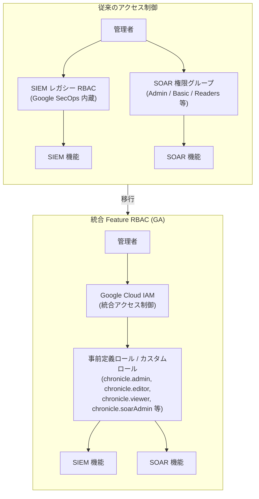

# Google SecOps: 統合 Feature RBAC (IAM ベース) が GA

**リリース日**: 2026-03-17

**サービス**: Google SecOps (Google Security Operations)

**機能**: Unified Feature Role-based Access Control (RBAC) - SIEM/SOAR 統合 IAM アクセス制御

**ステータス**: General Availability (GA)

[このアップデートのインフォグラフィックを見る](https://takech9203.github.io/google-cloud-news-summary/20260317-google-secops-unified-rbac-ga.html)

## 概要

Google SecOps の統合 Feature RBAC (Role-based Access Control) が General Availability (GA) となった。これにより、管理者は Google Cloud IAM を使用して、SIEM と SOAR の両方を含む Google SecOps 全体の機能アクセス制御を一元的に管理できるようになった。従来は SIEM と SOAR でそれぞれ個別にアクセス制御を設定・管理する必要があったが、今回の GA により Google Cloud IAM という単一のプラットフォームで統合的な権限管理が実現された。

あわせて、SOAR Permission Groups の Google Cloud IAM への移行も GA となった。これにより、レガシーの SOAR 権限グループから Google Cloud IAM への移行が本番環境で正式にサポートされ、きめ細かいアクセス制御を IAM のネイティブ機能として活用できるようになった。移行はレガシーの SOAR 権限グループおよびパーミッションを Google Cloud IAM に移行することで有効化できる。

この統合は、Google SecOps の SOAR インフラストラクチャの Google Cloud への移行 (Stage 2) の一環であり、2026年9月30日の最終期限までに完了する必要がある。

**アップデート前の課題**

- SIEM と SOAR で別々のアクセス制御システムを管理する必要があり、管理者の運用負荷が大きかった
- SOAR のアクセス制御はレガシーの権限グループ (Admin、Basic、Readers、View Only、Collaborators、Managed、Managed-Plus) を使用しており、Google Cloud IAM との統合がなかった
- SIEM 側と SOAR 側で権限設定の一貫性を保つことが困難で、セキュリティポリシーの統一的な適用が難しかった
- レガシーの SOAR 権限グループは Google Cloud の他サービスとの連携やポリシー管理に制約があった

**アップデート後の改善**

- Google Cloud IAM を使用して SIEM と SOAR の両方の機能アクセスを一元管理できるようになった
- IAM の事前定義ロール (chronicle.admin、chronicle.editor、chronicle.viewer、chronicle.limitedViewer、chronicle.soarAdmin) やカスタムロールを活用した、きめ細かいアクセス制御が可能になった
- Google Cloud の他サービスと統一された IAM ポリシーでセキュリティガバナンスを強化できるようになった
- 移行ツールによる自動化されたマイグレーションスクリプトが提供され、既存の権限設定を IAM に安全に移行できるようになった

## アーキテクチャ図



従来は SIEM と SOAR で個別にアクセス制御を管理していたが、統合 Feature RBAC により Google Cloud IAM で一元管理する構成に移行する。移行ツールが既存の権限設定を IAM ロールに自動変換する。

## サービスアップデートの詳細

### 主要機能

1. **統合 Feature RBAC (Unified Feature RBAC)**
   - SIEM と SOAR の両方を含む Google SecOps 全体の機能アクセス制御を Google Cloud IAM で一元管理
   - 従来の SIEM レガシー RBAC と SOAR 権限グループを統合し、単一の IAM ポリシーで制御
   - GA ステータスにより本番環境での利用が正式にサポート

2. **SOAR Permission Groups の IAM 移行**
   - レガシーの SOAR 権限グループ (Admin、Basic、Readers、View Only、Collaborators、Managed、Managed-Plus) を IAM ロールに移行
   - 移行ツールが既存の権限構成を読み取り、同等のカスタム IAM ロールを自動生成
   - Google Cloud CLI または Terraform による移行をサポート

3. **事前定義 IAM ロール**
   - `roles/chronicle.admin` - Google SecOps アプリケーションおよび API への完全アクセス
   - `roles/chronicle.editor` - リソースの変更アクセス
   - `roles/chronicle.viewer` - 読み取り専用アクセス
   - `roles/chronicle.limitedViewer` - 制限付き読み取りアクセス (検出ルール、レトロハントを除く)
   - `roles/chronicle.soarAdmin` - SOAR 設定および管理への完全管理アクセス

## 技術仕様

### IAM ロールマッピング

| レガシー SOAR 権限グループ | 対応する IAM ロール |
|---|---|
| Admin | `roles/chronicle.admin` + `roles/chronicle.soarAdmin` |
| Basic | `roles/chronicle.editor` |
| Readers | `roles/chronicle.viewer` |
| View Only | `roles/chronicle.limitedViewer` |
| Collaborators / Managed / Managed-Plus | カスタム IAM ロール (移行ツールが自動生成) |

### 必要な権限 (移行実行者)

| 項目 | 詳細 |
|------|------|
| Chronicle API Admin | `roles/chronicle.admin` |
| Chronicle Service Admin | `roles/chroniclesm.admin` |
| Chronicle SOAR Admin | `roles/chronicle.soarAdmin` |

### IAM 統合の仕組み

```
1. ユーザーが Google SecOps にログオン
2. Google SecOps が IAM ポリシーを検証
3. IAM が認可情報を返却
4. ユーザーに許可された機能のみアクセス可能
   - Web UI: 許可された機能のみ表示
   - API: 権限がない場合はエラーレスポンス
```

## 設定方法

### 前提条件

1. Google SecOps インスタンスが Google Cloud プロジェクトにバインドされていること
2. Cloud Identity、Google Workspace、または Workforce Identity Federation による認証が構成されていること
3. SIEM 側の IAM 移行が既に完了していること (統合顧客の場合)
4. IdP グループマッピングまたはメールグループマッピングが設定されていること

### 手順

#### ステップ 1: Google Cloud コンソールで移行タブを確認

Google Cloud コンソールの Google SecOps 管理設定ページで「SOAR IAM Migration」タブを開く。

#### ステップ 2: 移行スクリプトの実行 (Google Cloud CLI)

```bash
# Google Cloud コンソールの SOAR IAM Migration タブから
# 移行スクリプトをコピーし、Cloud Shell で実行
# スクリプトは以下を自動実行:
# - 既存の権限構成の読み取り
# - カスタム IAM ロールの生成
# - ユーザー/グループへのロールバインディング
# - IAM ポリシーの作成
```

#### ステップ 3: IAM の有効化

```bash
# スクリプト実行が成功したら、Google Cloud コンソールに戻り
# 「Finished with this task」セクションの「Enable IAM」をクリック
```

#### ステップ 4: Terraform による移行 (代替手順)

```hcl
# Terraform を使用した移行も可能
# 詳細は公式ドキュメント参照
# https://cloud.google.com/chronicle/docs/soar/admin-tasks/advanced/migrate-soar-permissions-iam
```

## メリット

### ビジネス面

- **運用コスト削減**: SIEM と SOAR の権限管理を一元化することで、管理者の運用負荷を大幅に軽減
- **コンプライアンス強化**: Google Cloud IAM の監査ログと統合され、アクセス制御の監査証跡が一元的に取得可能
- **組織ガバナンスの向上**: Google Cloud の組織ポリシーと連携した統一的なセキュリティポリシーの適用が可能

### 技術面

- **きめ細かいアクセス制御**: IAM のカスタムロール機能により、レガシーの定義済みグループよりも柔軟な権限設定が可能
- **API レベルの統合**: Chronicle API と IAM の統合により、プログラマティックなアクセス制御が実現
- **他サービスとの統一性**: Google Cloud の他のセキュリティサービス (Security Command Center、Cloud Armor 等) と同じ IAM フレームワークで管理可能

## デメリット・制約事項

### 制限事項

- Feature RBAC は機能レベルのアクセス制御であり、特定の UDM レコードやフィールドレベルのアクセス制御には対応していない
- 移行完了後、SOAR Settings の Permissions ページは 2026年9月30日まで後方互換性のために残されるが、変更を加えてはならない
- 移行後の権限管理はすべて IAM 経由で行う必要がある

### 考慮すべき点

- 移行前に IdP グループマッピングまたはメールグループマッピングが正しく設定されていることを確認する必要がある
- IAM ポリシーはプロジェクトレベルで定義することが推奨されており、他の Google Cloud サービスが同じプロジェクトに存在する場合は IAM 条件を追加して SecOps リソースのみに制限する必要がある
- レガシー SOAR API および API キーは 2026年9月30日以降に機能停止するため、Chronicle API への移行も並行して計画する必要がある

## ユースケース

### ユースケース 1: 大規模 SOC チームの統一アクセス管理

**シナリオ**: 複数のアナリストチーム (Tier 1、Tier 2、Tier 3) を持つ SOC で、SIEM での脅威ハンティングと SOAR でのインシデント対応の両方に対するアクセス権限を効率的に管理したい。

**効果**: Google Cloud IAM の単一のポリシーで SIEM と SOAR の両方の権限を定義でき、チームメンバーの追加・変更時の管理工数が大幅に削減される。

### ユースケース 2: MSSP (マネージドセキュリティサービスプロバイダー) のマルチテナント管理

**シナリオ**: MSSP が複数の顧客環境の Google SecOps インスタンスを管理しており、各顧客に適切な権限レベルを設定する必要がある。

**効果**: IAM のカスタムロールとポリシーバインディングにより、顧客ごとに異なる権限セットを効率的に管理でき、Workforce Identity Federation との統合で外部 IdP との連携も容易になる。

## 料金

統合 Feature RBAC 機能自体は Google SecOps の標準機能として追加料金なしで利用可能。Google SecOps の料金は、パッケージ (Standard、Enterprise、Enterprise Plus) に基づくサブスクリプションモデルで、データ取り込み量に応じた課金となる。

詳細な料金については、[Google SecOps の料金ページ](https://cloud.google.com/security/products/security-operations)を参照。

## 利用可能リージョン

Google SecOps はリージョン固有の SKU を使用しており、データレジデンシー要件に準拠している。統合 Feature RBAC は Google SecOps が利用可能なすべてのリージョンで使用可能。詳細は [Google SecOps ドキュメント](https://cloud.google.com/chronicle/docs)を参照。

## 関連サービス・機能

- **Google Cloud IAM**: 統合 Feature RBAC の基盤となるアクセス制御サービス。事前定義ロール、カスタムロール、ポリシーバインディングを提供
- **Workforce Identity Federation**: 外部 IdP との連携を可能にし、SOAR の権限グループマッピングで使用
- **Cloud Audit Logs**: IAM 移行後の監査ログを統合的に管理。SOAR の操作ログも Cloud Audit Logs に統合される
- **Security Command Center**: Google Cloud の統合セキュリティプラットフォーム。Google Unified Security パッケージでは SecOps と SCC が統合される
- **Chronicle API**: SOAR API の移行先。IAM による API レベルのアクセス制御と連携

## 参考リンク

- [このアップデートのインフォグラフィック](https://takech9203.github.io/google-cloud-news-summary/20260317-google-secops-unified-rbac-ga.html)
- [公式リリースノート](https://cloud.google.com/release-notes#March_17_2026)
- [Configure feature access control using IAM](https://cloud.google.com/chronicle/docs/onboard/configure-feature-access)
- [Migrate SOAR permissions to Google Cloud IAM](https://cloud.google.com/chronicle/docs/soar/admin-tasks/advanced/migrate-soar-permissions-iam)
- [SOAR migration overview](https://cloud.google.com/chronicle/docs/soar/admin-tasks/advanced/migrate-to-gcp)
- [Google SecOps RBAC User Guide](https://cloud.google.com/chronicle/docs/administration/rbac)
- [Google SecOps packages and pricing](https://cloud.google.com/chronicle/docs/secops/secops-packages)

## まとめ

Google SecOps の統合 Feature RBAC の GA は、SIEM と SOAR のアクセス制御を Google Cloud IAM に統合する重要なマイルストーンである。管理者はレガシーの権限グループから移行ツールを使用して IAM に移行することで、統一的かつきめ細かいアクセス制御を実現できる。2026年9月30日の最終期限までに移行を計画的に進めることが推奨される。

---

**タグ**: #GoogleSecOps #RBAC #IAM #SOAR #SIEM #SecurityOperations #GA #AccessControl #Migration
