# Looker: 2026 年 3 月機能ロールアウト

**リリース日**: 2026-03-17

**サービス**: Looker

**機能**: 2026 年 3 月機能ロールアウト (Gemini AI 強化、Self-service Explores GA、Content Certification GA ほか)

**ステータス**: GA / Preview (機能により異なる)

📊 [このアップデートのインフォグラフィックを見る](https://takech9203.github.io/google-cloud-news-summary/20260317-looker-march-2026-feature-rollout.html)

## 概要

2026 年 3 月 17 日より、Looker の大規模な機能ロールアウトが開始された。今回のリリースでは 12 の機能が含まれ、Gemini を活用した AI アシスタント機能の GA 昇格や新規 Preview 機能の追加、データガバナンス機能の強化、可視化の制限緩和など、多岐にわたるアップデートが提供されている。

特に注目すべきは、Visualization Assistant の GA 昇格により自然言語でのグラフカスタマイズが正式に利用可能になった点、Self-service Explores が GA となり Google Sheets からのデータアップロードに対応した点、そして Content Certification が GA となり LookML Explores の認証や自動認証機能が追加された点である。

このロールアウトは、BI ツールとしての Looker にセルフサービス分析と AI 支援を全面的に統合する方向性を強く示しており、データアナリスト、BI 開発者、Looker 管理者の全レイヤーに影響するアップデートとなっている。

**アップデート前の課題**

- ビジュアライゼーションのフォーマット変更には JSON 設定の手動編集が必要で、非技術者にはハードルが高かった
- テーブル計算やカスタムフィールドの Looker Expression 記述には専門知識が必要だった
- Self-service Explores は Preview 段階であり、Google Sheets からの直接データアップロードに対応していなかった
- コンテンツの認証機能は限定的で、LookML Explores の認証や一括自動認証はサポートされていなかった
- Explore の行数制限が 5,000 行で、大量データの地図やテーブルでの可視化に制約があった
- 検索機能はキーワードベースの単純マッチングに限定されていた

**アップデート後の改善**

- 自然言語で Gemini にビジュアライゼーションのカスタマイズを指示できるようになった (GA)
- Gemini が Looker Expression の記述を支援し、テーブル計算やカスタムフィールドの作成が容易になった (Preview)
- Self-service Explores が GA となり、Google Drive ナビゲーション (OAuth) を使った Google Sheets アップロードに対応
- Content Certification が GA となり、LookML Explores の認証、LookML ダッシュボードと Explores の自動認証が可能に
- 管理者が地図、散布図、テーブルチャートの行数制限を最大 50,000 行まで設定可能に (Preview)
- Gemini を活用した Enhanced Search により、概念的な意味を解釈するセマンティック検索が可能に (Preview)

## アーキテクチャ図

```mermaid
flowchart TD
    subgraph GA["GA 機能"]
        VA["🤖 Visualization Assistant\n自然言語でグラフカスタマイズ"]
        SSE["📊 Self-service Explores\nGoogle Sheets アップロード対応"]
        CC["✅ Content Certification\nLookML Explores 認証対応"]
    end

    subgraph Preview["Preview 機能"]
        QS["⚡ Quick Start Analyses\nExplore 自動分析生成"]
        EA["📝 Expression Assistant\nLooker Expression 記述支援"]
        ES["🔍 Enhanced Search\nセマンティック検索"]
        CAL["📅 Custom Calendars\n会計/リテールカレンダー"]
        RL["📈 Increased Row Limit\n最大 50,000 行"]
    end

    subgraph Other["その他の改善"]
        DC["🔌 Disable Connection\n接続無効化オプション"]
        LPA["💡 LookML Parameter Assistant\n個別有効化対応"]
        CI["🔄 CI Feature Update\n新バージョン移行"]
        CAM["💬 Conversational Analytics\nFast / Thinking モード"]
    end

    Gemini["🧠 Gemini AI"] --> VA
    Gemini --> QS
    Gemini --> EA
    Gemini --> ES
    Gemini --> LPA
    Gemini --> CAM

    BQ["☁️ BigQuery"] --> SSE
    BQ --> CAL
    SF["❄️ Snowflake"] --> CAL
```



今回のロールアウトに含まれる 12 機能の全体像を示す。Gemini AI を基盤とする 6 つの AI 支援機能、BigQuery / Snowflake と連携するデータ機能、および管理者向け改善で構成されている。

## サービスアップデートの詳細

### GA 機能

1. **Visualization Assistant (GA)**
   - Gemini を活用し、自然言語プロンプトで Looker ビジュアライゼーションのフォーマットオプションをカスタマイズできる
   - Gemini がテキストベースのプロンプトから JSON フォーマットオプションを生成し、ビジュアライゼーションに適用する
   - テンプレートやパターンの作成起点としても利用可能で、より複雑なカスタマイズの手動編集にも展開できる
   - `can_override_vis_config` 権限を持つ Looker ロールが必要
   - Looker Assistants 設定の有効化が前提条件

2. **Self-service Explores (GA)**
   - LookML モデルの設定や Git バージョン管理なしで、データファイルをアップロードして Explore でクエリ・可視化が可能
   - CSV、Excel (XLS/XLSX)、Google Sheets ファイルに対応
   - 新たに Google Drive ナビゲーション (OAuth) を使った Google Sheets からのデータアップロードをサポート
   - Google Sheets アップロードには Looker 26.2 以降が必要で、BigQuery データベースを収容する Google Cloud プロジェクトで必要な API の有効化が前提
   - アップロードデータは BigQuery に永続化される
   - `upload_data` 権限が必要

3. **Content Certification (GA)**
   - ダッシュボード、Look、Self-service Explores に加えて、LookML Explores の認証が可能になった
   - 管理者が現在および将来のすべての LookML ダッシュボードと Explores を自動認証する機能を追加
   - 認証ステータスに基づくコンテンツのソート機能が Enhanced Search に統合
   - 認証されていない Self-service Explores に基づくコンテンツには「ungoverned」バッジが表示される
   - 認証済みコンテンツには緑色の「Certified」バッジが表示され、認証者名、日時、メモが確認可能
   - `certify_content` 権限を持つ Looker 管理者が認証操作を実行

### Preview 機能

4. **Quick Start Analyses (Preview)**
   - Gemini が Explore に対して Quick Start 分析を自動生成する
   - ユーザーがデータ探索の出発点として利用でき、セルフサービス分析の導入障壁を下げる

5. **Expression Assistant (Preview)**
   - Gemini を活用して Looker Expression (テーブル計算やカスタムフィールド) の記述を支援
   - 自然言語で計算ロジックを説明するだけで、適切な Looker Expression を提案

6. **Enhanced Search (Preview)**
   - Gemini を活用して検索クエリの概念的な意味を解釈し、キーワードマッチングを超えたセマンティック検索を実現
   - Content Certification と統合され、認証ステータスによるコンテンツの絞り込みが可能

7. **Custom Calendars (Preview)**
   - Snowflake または BigQuery 接続において、会計カレンダーやリテールカレンダーをサポート
   - 企業独自の会計年度やリテール業界の特殊なカレンダー体系に対応

8. **Increased Row Limit (Preview)**
   - 管理者が地図チャート、散布図チャート、テーブルチャートの行数制限を最大 50,000 行まで設定可能
   - 従来の 5,000 行制限から大幅に緩和され、より多くのデータポイントの可視化が可能に

### その他の改善

9. **Disable Connection オプション**
   - Connections Settings ページに新しいオプションが追加され、ダウンストリームのデータベース障害発生時に接続を無効化可能
   - 障害切り分けやメンテナンス時に接続を一時的に停止できる

10. **LookML Parameter Assistant**
    - 自然言語プロンプトに基づいて LookML パラメータを生成する機能
    - 個別に有効化できるようになり、管理者が必要な機能のみ選択的に導入可能

11. **CI Feature Update**
    - Continuous Integration が新バージョンに移行
    - UI 統合が改善され、より直感的な CI ワークフローを提供

12. **Conversational Analytics モード追加**
    - **Fast モード**: より迅速な回答を提供し、シンプルな質問に最適
    - **Thinking モード**: 複雑な質問に対して深い分析と推論を行い、より正確な回答を生成

## 技術仕様

### Gemini AI 機能の要件

| 機能 | 必要な権限 | 有効化設定 | 最低バージョン |
|------|-----------|-----------|--------------|
| Visualization Assistant | `can_override_vis_config` | Looker Assistants | 25.2+ |
| Quick Start Analyses | Explore アクセス権限 | Gemini in Looker | 26.2+ |
| Expression Assistant | テーブル計算権限 | Gemini in Looker | 26.2+ |
| Enhanced Search | コンテンツアクセス権限 | Gemini in Looker | 26.2+ |
| LookML Parameter Assistant | `develop` | LookML Assistant | 25.2+ |
| Conversational Analytics | `access_data` | Conversational Analytics | 25.0+ |

### Self-service Explores の対応ファイル形式

| ファイル形式 | 拡張子 | 備考 |
|-------------|--------|------|
| CSV | .csv | 先頭行がカラム名 |
| Excel | .xls, .xlsx | 複数ワークシート対応 |
| Google Sheets | URL 指定 | OAuth / Google Drive ナビゲーション (Looker 26.2+) |

### 行数制限の変更 (Preview)

| チャートタイプ | 従来の上限 | 新しい上限 (管理者設定可能) |
|--------------|-----------|--------------------------|
| 地図チャート | 5,000 行 | 最大 50,000 行 |
| 散布図チャート | 5,000 行 | 最大 50,000 行 |
| テーブルチャート | 5,000 行 | 最大 50,000 行 |

## 設定方法

### 前提条件

1. Looker インスタンスが Looker 26.2 以降であること (Google Sheets アップロードや新しい Preview 機能の利用に必要)
2. Gemini in Looker が管理パネルで有効化されていること
3. Looker (Google Cloud core) の場合、`roles/looker.admin` IAM ロールを持つユーザーが Google Cloud コンソールで設定

### 手順

#### ステップ 1: Gemini in Looker の有効化

Looker (original) インスタンスの場合、Admin パネルの Platform セクションにある「Gemini in Looker」ページから各機能を個別に有効化する。

#### ステップ 2: 個別機能の有効化

各 Gemini 機能は個別に有効化が可能。

- **Looker Assistants**: Visualization Assistant を有効化
- **Conversational Analytics**: Conversational Analytics (Fast / Thinking モード) を有効化
- **LookML Assistant**: LookML Parameter Assistant を有効化
- **Explore NL Summary**: Explore サマリー機能を有効化

#### ステップ 3: Self-service Explores の Google Sheets 連携設定

```
1. BigQuery データベースを収容する Google Cloud プロジェクトで必要な API を有効化
2. Admin パネルで Self-service Explores を有効化
3. ユーザーに upload_data 権限を付与
```

#### ステップ 4: Content Certification の有効化

Admin パネルの General セクション > Settings ページから Content Certification を有効化し、自動認証の対象範囲を設定する。

## メリット

### ビジネス面

- **セルフサービス分析の民主化**: Self-service Explores の GA と Google Sheets 連携により、技術者でなくてもデータ分析の起点を自ら作成可能に
- **データガバナンスの強化**: Content Certification の GA により、組織全体で信頼できるコンテンツを明確に識別・管理可能に
- **分析導入障壁の低下**: Quick Start Analyses や Expression Assistant により、Looker 初心者でも効率的にデータ探索を開始可能

### 技術面

- **AI 支援の全面統合**: Visualization Assistant、Expression Assistant、Enhanced Search、LookML Parameter Assistant により、開発・分析の各フェーズで Gemini の支援を活用可能
- **可視化の表現力向上**: 行数制限の 50,000 行への緩和により、大規模データセットの地図・散布図表示が実用的に
- **運用管理の柔軟性**: Disable Connection オプションにより、障害時の切り分けやメンテナンスがより迅速に

## デメリット・制約事項

### 制限事項

- Preview 機能は「Pre-GA Offerings Terms」に基づき提供され、サポートが限定的な場合がある
- Gemini in Looker の Preview 機能は現在無料で提供されているが、Preview 期間終了後は追加料金が発生する可能性がある
- Google Sheets アップロードは Looker 26.2 以降が必要であり、それ以前のバージョンでは利用不可
- Self-service Explores のデータは BigQuery に書き込まれるため、BigQuery 管理者がアップロードデータを閲覧可能
- Increased Row Limit は地図チャート、散布図チャート、テーブルチャートのみが対象で、すべてのチャートタイプに適用されるわけではない

### 考慮すべき点

- Conversational Analytics は FedRAMP High / Medium の認可境界に含まれていないため、規制対象のワークロードでの利用には注意が必要
- Self-service Explores はインスタンス移行やシステムバックアップ・リカバリ時に失われる可能性がある
- Custom Calendars は Snowflake または BigQuery 接続のみ対応であり、他のデータベース接続では利用不可
- Content Certification のステータスはコンテンツへの重要な編集時に自動的に取り消される

## ユースケース

### ユースケース 1: 非技術者による営業データの可視化

**シナリオ**: 営業チームのマネージャーが Google Sheets で管理している顧客リストと売上データを Looker で分析したい。LookML やデータベースの知識はない。

**実装例**:
1. Self-service Explores で Google Sheets URL を指定してデータをアップロード
2. Looker が自動的にデータ型を検出し、Explore を生成
3. Visualization Assistant を使って「売上を月別の棒グラフで表示して、上位 5 社を色分けして」と自然言語で指示
4. 管理者が Content Certification で信頼性を認証し、チーム全体で共有

**効果**: BI 開発者への依頼を待つことなく、営業チーム自身が即座にデータ分析を開始でき、認証済みコンテンツとして組織的に活用可能

### ユースケース 2: 大規模データの地理的可視化

**シナリオ**: 物流チームが全国の配送拠点 30,000 件の所在地データを地図上に表示し、配送効率を分析したい。

**実装例**:
1. 管理者が Increased Row Limit を有効化し、地図チャートの行数制限を 50,000 行に設定
2. Explore で配送拠点データをクエリし、地図チャートで可視化
3. Conversational Analytics の Thinking モードで「配送効率が低い地域のパターンを分析して」と質問

**効果**: 従来の 5,000 行制限では表示できなかった全拠点データを一度に可視化し、AI 分析と組み合わせた高度なインサイト取得が可能

## 料金

Gemini in Looker の各機能の料金は、利用するプラットフォーム (Looker (Google Cloud core) / Looker (original)) と契約形態により異なる。Preview 機能は現在無料で提供されているが、Preview 期間終了後は追加料金が発生する可能性がある。

詳細は [Looker 料金ページ](https://cloud.google.com/looker/pricing) を参照。

## 利用可能リージョン

Looker (Google Cloud core) インスタンスのリージョン可用性に準拠する。Conversational Analytics のデータ保存はインスタンスのリージョン内に制限されるが、転送中のデータはグローバルサービスで処理される場合がある。

詳細は [Looker ドキュメント](https://cloud.google.com/looker/docs) を参照。

## 関連サービス・機能

- **Gemini for Google Cloud**: Looker の AI 機能の基盤となる生成 AI プラットフォーム
- **BigQuery**: Self-service Explores のデータ永続化先、Custom Calendars の対応データベース
- **Snowflake**: Custom Calendars の対応データベース
- **Google Sheets / Google Drive**: Self-service Explores の新しいデータソース (OAuth 連携)
- **Looker Studio Pro**: Gemini in Looker 機能の一部は Looker Studio でも利用可能
- **Cloud IAM**: Looker (Google Cloud core) での Gemini 機能の権限管理

## 参考リンク

- 📊 [インフォグラフィック](https://takech9203.github.io/google-cloud-news-summary/20260317-looker-march-2026-feature-rollout.html)
- [公式リリースノート](https://cloud.google.com/looker/docs/release-notes)
- [Gemini in Looker 概要](https://cloud.google.com/looker/docs/gemini-overview-looker)
- [Self-service Explores ドキュメント](https://cloud.google.com/looker/docs/exploring-self-service)
- [Content Certification ドキュメント](https://cloud.google.com/looker/docs/content-certification)
- [Conversational Analytics 概要](https://cloud.google.com/looker/docs/conversational-analytics-overview)
- [Looker 料金ページ](https://cloud.google.com/looker/pricing)

## まとめ

今回の Looker 2026 年 3 月ロールアウトは、Gemini AI の全面的な統合とセルフサービス分析機能の成熟を象徴する大規模アップデートである。特に Visualization Assistant、Self-service Explores、Content Certification の 3 機能が GA に昇格したことで、AI 支援による分析の民主化とデータガバナンスの強化を本番環境で活用できる段階に入った。Looker 管理者は各機能の有効化設定を確認し、組織のニーズに合わせて段階的に導入を進めることを推奨する。

---

**タグ**: #Looker #Gemini #AI #Visualization #SelfServiceExplores #ContentCertification #ConversationalAnalytics #EnhancedSearch #CustomCalendars #RowLimit #LookML #GA #Preview
