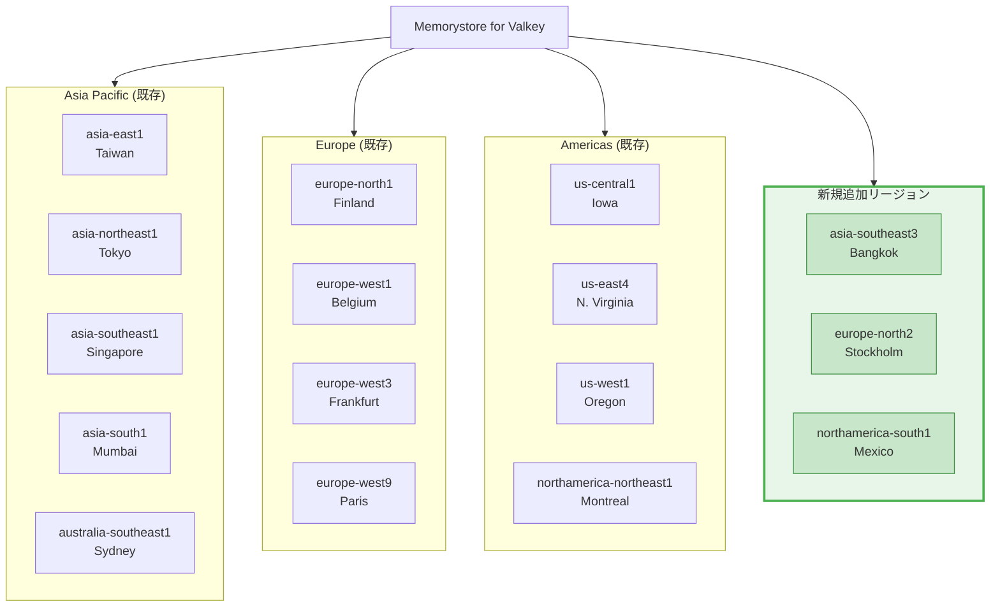

# Memorystore for Valkey: 3 つの新リージョン (バンコク、ストックホルム、メキシコ) が利用可能に

**リリース日**: 2026-03-17

**サービス**: Memorystore for Valkey

**機能**: 新リージョン追加 (asia-southeast3, europe-north2, northamerica-south1)

**ステータス**: Feature

:bar_chart: [このアップデートのインフォグラフィックを見る](https://takech9203.github.io/google-cloud-news-summary/20260317-memorystore-valkey-new-regions.html)

## 概要

Memorystore for Valkey が新たに 3 つのリージョンでインスタンスのデプロイに対応した。追加されたリージョンは asia-southeast3 (バンコク)、europe-north2 (ストックホルム)、northamerica-south1 (メキシコ) の 3 つである。

Memorystore for Valkey は Google Cloud のフルマネージド Valkey サービスであり、Cluster Mode Enabled と Cluster Mode Disabled の両方のインスタンスをサポートしている。今回のリージョン拡張により、東南アジア、北欧、中米地域のユーザーがより低レイテンシでキャッシュサービスを利用できるようになった。

これにより、Memorystore for Valkey の利用可能リージョン数は合計で約 43 リージョンに拡大し、グローバル展開を行う企業にとってデータ所在地やコンプライアンス要件への対応がさらに容易になった。

**アップデート前の課題**

- タイ (バンコク) リージョンで Memorystore for Valkey を利用できず、東南アジアの一部ユーザーは asia-southeast1 (シンガポール) など他のリージョンを使用する必要があった
- スウェーデン (ストックホルム) リージョンが未対応で、北欧のデータレジデンシー要件を満たせないケースがあった
- メキシコリージョンが利用できず、中米・ラテンアメリカ北部のワークロードでは us-south1 (ダラス) など米国リージョンに依存する必要があった

**アップデート後の改善**

- asia-southeast3 (バンコク) でのインスタンスデプロイが可能となり、タイおよび周辺地域からの低レイテンシアクセスが実現
- europe-north2 (ストックホルム) の追加により、北欧地域でのデータレジデンシー要件への対応と低レイテンシアクセスが可能に
- northamerica-south1 (メキシコ) の追加により、中米地域に近いロケーションでのキャッシュサービス利用が可能に

## アーキテクチャ図



今回のアップデートで追加された 3 つの新リージョン (緑色) と、既存の主要リージョンを示したアーキテクチャ図。Memorystore for Valkey は合計約 43 リージョンでグローバルに展開されている。

## サービスアップデートの詳細

### 主要機能

1. **asia-southeast3 (バンコク) リージョン対応**
   - タイのバンコクに位置するリージョンでインスタンスのデプロイが可能に
   - 東南アジア地域、特にタイ、カンボジア、ミャンマー、ラオスなど周辺国のワークロードに最適
   - Cluster Mode Enabled / Disabled の両方をサポート

2. **europe-north2 (ストックホルム) リージョン対応**
   - スウェーデンのストックホルムに位置するリージョンでインスタンスのデプロイが可能に
   - 北欧諸国 (スウェーデン、ノルウェー、デンマーク、フィンランド) のデータレジデンシー要件に対応
   - 既存の europe-north1 (フィンランド) と合わせて北欧地域での冗長構成が可能

3. **northamerica-south1 (メキシコ) リージョン対応**
   - メキシコに位置するリージョンでインスタンスのデプロイが可能に
   - 中米・ラテンアメリカ北部のワークロードのレイテンシ削減に貢献
   - メキシコのデータ保護規制への対応が容易に

## 技術仕様

### 新規リージョンの仕様

| 項目 | 詳細 |
|------|------|
| 対応リージョン | asia-southeast3, europe-north2, northamerica-south1 |
| サポートモード | Cluster Mode Enabled / Cluster Mode Disabled |
| サポートバージョン | Valkey 7.2, 8.0, 9.0 |
| レプリカ数 | シャードあたり 0-5 |
| 高可用性 | マルチゾーン構成をサポート |
| クロスリージョンレプリケーション | サポート (他リージョンとのレプリケーション可能) |

### 既存リージョンとの機能差異

新規追加された 3 リージョンは、既存リージョンと同等の機能セットを提供する。Cluster Mode、レプリケーション、バックアップ管理、クロスリージョンレプリケーションなどの全機能が利用可能である。

## 設定方法

### 前提条件

1. Google Cloud プロジェクトで Memorystore API が有効化されていること
2. ネットワーキングの前提条件 (VPC ネットワーク、PSC/PSA 接続) が設定済みであること

### 手順

#### ステップ 1: gcloud CLI でインスタンスを作成

```bash
# asia-southeast3 (バンコク) にインスタンスを作成する例
gcloud memorystore instances create my-valkey-instance \
    --region=asia-southeast3 \
    --network=projects/PROJECT_ID/global/networks/NETWORK_NAME \
    --node-type=standard-small \
    --shard-count=3 \
    --replica-count=1
```

#### ステップ 2: インスタンスの確認

```bash
# 作成したインスタンスの詳細を確認
gcloud memorystore instances describe my-valkey-instance \
    --region=asia-southeast3
```

## メリット

### ビジネス面

- **データレジデンシー要件への対応**: タイ、スウェーデン、メキシコの各国でデータを保管・処理する必要がある規制要件に対応可能
- **グローバル展開の柔軟性向上**: 東南アジア、北欧、中米の 3 地域で新たにキャッシュサービスを利用でき、グローバルなアプリケーション展開がさらに容易に

### 技術面

- **レイテンシの削減**: 各地域のエンドユーザーに近いロケーションにキャッシュを配置することで、応答時間を短縮
- **災害復旧オプションの拡充**: クロスリージョンレプリケーションの対象リージョンが増加し、DR 構成の選択肢が広がる

## デメリット・制約事項

### 制限事項

- 新規リージョンの料金は、既存リージョンと異なる場合がある (料金ページで確認が必要)
- リージョン間のデータ転送にはネットワーク料金 (Egress) が発生する

### 考慮すべき点

- 新規リージョンでは初期のキャパシティが限られる可能性があるため、大規模なデプロイを計画する場合は事前に確認を推奨
- 既存のインスタンスは自動的に新リージョンに移行されないため、新リージョンを利用するには新規にインスタンスを作成する必要がある

## ユースケース

### ユースケース 1: タイ国内向け EC サイトのセッション管理

**シナリオ**: タイ国内でオンラインショッピングサイトを運営しており、ユーザーセッションの管理にインメモリキャッシュを使用している。これまで asia-southeast1 (シンガポール) を利用していたが、バンコクリージョンの追加によりレイテンシを削減できる。

**効果**: シンガポール経由と比較して、タイ国内ユーザーのセッション読み書きレイテンシを数ミリ秒短縮。ユーザー体験の向上と離脱率の低減が期待できる。

### ユースケース 2: 北欧企業の GDPR 準拠キャッシュ構成

**シナリオ**: スウェーデンに本社を置く企業が、GDPR およびスウェーデンの国内規制に準拠するため、キャッシュデータを北欧リージョン内に保持する必要がある。europe-north2 (ストックホルム) の追加により、europe-north1 (フィンランド) と組み合わせた冗長構成が可能になる。

**効果**: 北欧 2 リージョンでのクロスリージョンレプリケーションにより、データレジデンシー要件を満たしつつ高可用性を確保。

## 料金

Memorystore for Valkey の料金はノード単位の時間課金制である。料金はリージョンとノードタイプにより異なる。

Committed Use Discount (CUD) を利用することで、1 年契約で 20%、3 年契約で 40% の割引が適用される。CUD は Memorystore for Valkey、Redis Cluster、Redis、Memcached の各サービス間で共用可能である。

新規追加リージョンの具体的な料金は、公式料金ページを参照のこと。

### 料金例 (参考: us-central1 の場合)

| 構成 | 月額料金 (概算) |
|------|-----------------|
| highmem-medium ノード x 30 (10 シャード、2 レプリカ) | 約 $4,212/月 (オンデマンド) |
| 同上 (1 年 CUD 適用) | 約 $3,370/月 (20% 割引) |
| 同上 (3 年 CUD 適用) | 約 $2,527/月 (40% 割引) |

## 利用可能リージョン

今回の追加により、Memorystore for Valkey は以下を含む約 43 リージョンで利用可能となった。

| 地域 | 新規追加リージョン | 既存の主要リージョン |
|------|-------------------|---------------------|
| アジア太平洋 | **asia-southeast3 (バンコク)** | asia-east1 (台湾), asia-northeast1 (東京), asia-southeast1 (シンガポール), asia-south1 (ムンバイ) 他 |
| ヨーロッパ | **europe-north2 (ストックホルム)** | europe-north1 (フィンランド), europe-west1 (ベルギー), europe-west3 (フランクフルト) 他 |
| アメリカ | **northamerica-south1 (メキシコ)** | us-central1 (アイオワ), us-east4 (北バージニア), us-west1 (オレゴン) 他 |

全リージョンの一覧は [Memorystore for Valkey Locations](https://cloud.google.com/memorystore/docs/valkey/locations) を参照。

## 関連サービス・機能

- **Memorystore for Redis Cluster**: 同じく Google Cloud のフルマネージドインメモリデータストアサービス。Redis 互換が必要な場合に利用
- **Cloud Monitoring / Cloud Logging**: Memorystore インスタンスのモニタリングとログ管理
- **VPC / Private Service Connect**: Memorystore for Valkey のネットワーキング接続に使用
- **クロスリージョンレプリケーション**: 新規リージョンを含むリージョン間でのデータレプリケーションによる DR 構成

## 参考リンク

- :bar_chart: [インフォグラフィック](https://takech9203.github.io/google-cloud-news-summary/20260317-memorystore-valkey-new-regions.html)
- [公式リリースノート](https://cloud.google.com/release-notes#March_17_2026)
- [Memorystore for Valkey ドキュメント](https://cloud.google.com/memorystore/docs/valkey/product-overview)
- [利用可能ロケーション](https://cloud.google.com/memorystore/docs/valkey/locations)
- [料金ページ](https://cloud.google.com/memorystore/valkey/pricing)
- [クロスリージョンレプリケーション](https://cloud.google.com/memorystore/docs/valkey/about-cross-region-replication)

## まとめ

Memorystore for Valkey に asia-southeast3 (バンコク)、europe-north2 (ストックホルム)、northamerica-south1 (メキシコ) の 3 リージョンが追加された。これにより、東南アジア、北欧、中米地域でのインメモリキャッシュサービスの利用が可能となり、レイテンシ削減とデータレジデンシー要件への対応が強化された。対象地域でワークロードを運用している場合は、新リージョンへのインスタンス作成を検討することを推奨する。

---

**タグ**: #Memorystore #Valkey #NewRegions #asia-southeast3 #europe-north2 #northamerica-south1 #InMemoryCache
