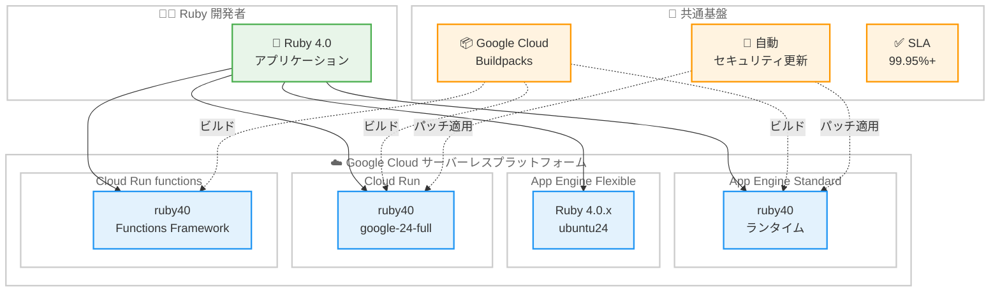

# Google Cloud サーバーレスサービス: Ruby 4.0 ランタイム GA

**リリース日**: 2026-03-17

**サービス**: App Engine (standard / flexible) / Cloud Run / Cloud Run functions

**機能**: Ruby 4.0 ランタイムの一般提供開始

**ステータス**: GA (Generally Available)

[このアップデートのインフォグラフィックを見る](https://takech9203.github.io/google-cloud-news-summary/20260317-ruby-4-0-runtime-ga.html)

## 概要

Google Cloud は 2026 年 3 月 17 日、Ruby 4.0 ランタイムのサポートが 4 つのサーバーレスサービスにおいて一般提供 (GA) となったことを発表した。対象サービスは App Engine flexible environment、App Engine standard environment、Cloud Run、Cloud Run functions の 4 つである。

Ruby 4.0 は Ruby 言語のメジャーバージョンアップであり、パフォーマンス改善や新機能が多数含まれている。今回の GA により、Google Cloud の主要なサーバーレスプラットフォームすべてにおいて、Ruby 4.0 を使用した本番ワークロードの実行が SLA 付きで正式にサポートされることになる。これにより、Ruby 開発者は Google Cloud 上で最新の Ruby バージョンを活用したアプリケーション開発と運用が可能になった。

Ruby 4.0 ランタイムは、Cloud Run および Cloud Run functions ではランタイム ID `ruby40` として、google-24-full スタック上で提供される。App Engine standard environment では `runtime: ruby40` として、App Engine flexible environment では Gemfile および .ruby-version ファイルで Ruby 4.0.x を指定する形で利用できる。

**アップデート前の課題**

- Ruby 4.0 ランタイムは Preview 段階であり、本番環境での利用には SLA が適用されなかった
- Ruby 3.4 以前のバージョンでは Ruby 4.0 の新機能やパフォーマンス改善を活用できなかった
- Preview 段階のランタイムを使用する場合、予告なしに破壊的変更が入る可能性があり、本番ワークロードでの採用が困難だった

**アップデート後の改善**

- 4 つのサーバーレスサービスすべてで Ruby 4.0 が GA となり、SLA 付きで本番利用が正式にサポートされた
- Ruby 4.0 の最新機能とパフォーマンス改善を本番環境で安心して活用できるようになった
- App Engine standard / flexible、Cloud Run、Cloud Run functions のいずれでも統一的に Ruby 4.0 を利用でき、サービス間でランタイムバージョンを揃えることが可能になった

## アーキテクチャ図



この図は Ruby 4.0 アプリケーションを Google Cloud の 4 つのサーバーレスプラットフォームにデプロイする構成を示している。いずれのサービスでも Ruby 4.0 ランタイムが GA となり、Google Cloud Buildpacks による自動ビルドと自動セキュリティ更新の恩恵を受けることができる。

## サービスアップデートの詳細

### 主要機能

1. **App Engine standard environment での Ruby 4.0 サポート**
   - `app.yaml` に `runtime: ruby40` を指定するだけでデプロイ可能
   - 自動スケーリング (ゼロインスタンスへのスケールダウンを含む) に対応
   - インスタンス起動時間は数秒と高速
   - 自動セキュリティパッチが適用される

2. **App Engine flexible environment での Ruby 4.0 サポート**
   - Gemfile に `ruby "4.0.x"` を指定し、`app.yaml` の `runtime_config` で `operating_system: "ubuntu24"` を設定
   - Docker コンテナベースの実行環境で、カスタムの C ライブラリ拡張にも対応
   - SSH デバッグやバックグラウンドプロセスの実行が可能

3. **Cloud Run での Ruby 4.0 サポート**
   - ランタイム ID `ruby40` として google-24-full スタック上で提供
   - ソースデプロイ (`--base-image ruby40`) による簡易なデプロイフロー
   - Cloud Run の自動ベースイメージ更新機能との連携によるセキュリティ維持

4. **Cloud Run functions での Ruby 4.0 サポート**
   - ランタイム ID `ruby40` で Functions Framework を使用
   - HTTP 関数および CloudEvent 関数に対応
   - `gcloud run deploy` コマンドで `--base-image ruby40` を指定してデプロイ

## 技術仕様

### ランタイム仕様の比較

| 項目 | App Engine Standard | App Engine Flexible | Cloud Run | Cloud Run functions |
|------|-------------------|-------------------|-----------|-------------------|
| ランタイム指定 | `runtime: ruby40` | Gemfile に `ruby "4.0.x"` | `--base-image ruby40` | `--base-image ruby40` |
| ベース OS | Ubuntu 24 LTS | Ubuntu 24 LTS | Ubuntu 24 LTS (google-24-full) | Ubuntu 24 LTS (google-24-full) |
| ランタイム ID | ruby40 | N/A (バージョン指定) | ruby40 | ruby40 |
| スケールダウン | ゼロまで可能 | 最小 1 インスタンス | ゼロまで可能 | ゼロまで可能 |
| カスタムバイナリ | 制限あり | 対応 | 対応 | 制限あり |
| 依存関係管理 | Bundler | Bundler | Bundler | Bundler |

### App Engine standard environment の設定例

```yaml
# app.yaml
runtime: ruby40
entrypoint: bundle exec rails server -p $PORT
```

### App Engine flexible environment の設定例

```yaml
# app.yaml
runtime: ruby
env: flex
entrypoint: bundle exec rails server -p $PORT
runtime_config:
  operating_system: "ubuntu24"
```

```ruby
# Gemfile
source "https://rubygems.org"
ruby "4.0.0"
gem "rack"
gem "puma"
```

## 設定方法

### 前提条件

1. Google Cloud プロジェクトが作成済みであること
2. 対象サービスの API が有効化されていること (App Engine Admin API、Cloud Run Admin API など)
3. `gcloud` CLI が最新バージョンにインストールされていること
4. Ruby 4.0 と Bundler がローカル開発環境にインストールされていること

### 手順

#### ステップ 1: App Engine standard environment へのデプロイ

```bash
# app.yaml を作成 (runtime: ruby40 を指定)
gcloud app deploy
```

`app.yaml` に `runtime: ruby40` を指定するだけで、Ruby 4.0 ランタイムでアプリケーションがデプロイされる。

#### ステップ 2: Cloud Run へのソースデプロイ

```bash
gcloud run deploy my-ruby-service \
  --source . \
  --base-image ruby40 \
  --region asia-northeast1
```

`--base-image ruby40` を指定することで、Ruby 4.0 ランタイムを使用した Cloud Run サービスがデプロイされる。

#### ステップ 3: Cloud Run functions へのデプロイ

```bash
gcloud run deploy my-ruby-function \
  --source . \
  --function my_function_entrypoint \
  --base-image ruby40 \
  --region asia-northeast1
```

`--function` フラグでエントリポイントを指定し、`--base-image ruby40` で Ruby 4.0 ランタイムを使用する。

## メリット

### ビジネス面

- **本番環境での安定運用**: GA ステータスにより SLA が適用され、本番ワークロードでの利用が正式にサポートされる
- **サービス間の統一性**: 4 つのサーバーレスサービスすべてで Ruby 4.0 が利用可能となり、チーム内でランタイムバージョンを統一できる
- **最新技術の活用**: Ruby 4.0 の新機能を活用した開発が可能になり、開発生産性の向上が期待できる

### 技術面

- **パフォーマンス向上**: Ruby 4.0 のパフォーマンス改善により、アプリケーションのレスポンス時間やスループットの改善が期待できる
- **セキュリティ**: 最新の Ruby バージョンに含まれるセキュリティ修正が適用され、google-24-full スタック (Ubuntu 24 LTS) による OS レベルのセキュリティも確保される
- **柔軟なデプロイオプション**: 用途に応じて App Engine (standard / flexible)、Cloud Run、Cloud Run functions から最適なプラットフォームを選択可能

## デメリット・制約事項

### 制限事項

- Ruby 4.0 ランタイムは google-24-full スタック上でのみ提供され、旧スタック (google-22、google-18-full) では利用できない
- App Engine standard environment ではファイルシステムへの書き込みが `/tmp` ディレクトリに制限される
- Cloud Run functions の Ruby ランタイムでは、イベント駆動関数は CloudEvent 関数のみがサポートされる

### 考慮すべき点

- Ruby 3.x から 4.0 へのメジャーバージョンアップに伴い、既存のアプリケーションで非互換性が発生する可能性がある。移行前に十分なテストが必要
- Ruby 4.0 で非推奨となった機能や削除された機能がある場合、Gem の互換性確認が必要
- App Engine flexible environment では最小 1 インスタンスが常時起動するため、トラフィックが少ない場合はコストに注意が必要

## ユースケース

### ユースケース 1: Rails アプリケーションの App Engine デプロイ

**シナリオ**: Ruby on Rails で構築した Web アプリケーションを、Ruby 4.0 の最新機能を活用しつつ App Engine standard environment で運用したい場合。

**実装例**:
```yaml
# app.yaml
runtime: ruby40
entrypoint: bundle exec rails server Puma -p $PORT

env_variables:
  RAILS_ENV: production
  SECRET_KEY_BASE: your-secret-key
```

**効果**: App Engine standard environment のゼロスケーリングにより、トラフィックがないときはインスタンスがゼロになりコストを最小化できる。Ruby 4.0 のパフォーマンス改善により、リクエスト処理の高速化も期待できる。

### ユースケース 2: Cloud Run functions によるイベント駆動処理

**シナリオ**: Cloud Storage へのファイルアップロードをトリガーに、Ruby 4.0 で記述した関数で画像処理やデータ変換を実行したい場合。

**実装例**:
```ruby
# app.rb
require "functions_framework"

FunctionsFramework.cloud_event "process_file" do |event|
  file_name = event.data["name"]
  bucket = event.data["bucket"]
  # ファイル処理ロジック
  logger.info "Processing #{file_name} from #{bucket}"
end
```

```bash
gcloud run deploy process-file \
  --source . \
  --function process_file \
  --base-image ruby40 \
  --region asia-northeast1
```

**効果**: Cloud Run functions のゼロスケーリングにより、イベントがないときはコストが発生しない。Ruby 4.0 の処理性能向上により、関数の実行時間短縮とコスト削減が見込める。

## 料金

Ruby 4.0 ランタイム自体には追加料金は発生しない。各サービスの標準料金体系が適用される。

- **App Engine standard environment**: インスタンス時間に基づく課金。無料枠あり (28 インスタンス時間/日)
- **App Engine flexible environment**: vCPU、メモリ、永続ディスクの使用量に基づく課金
- **Cloud Run**: vCPU 時間、メモリ時間、リクエスト数に基づく課金。無料枠あり
- **Cloud Run functions**: 呼び出し回数、コンピューティング時間、ネットワークに基づく課金。無料枠あり

詳細は各サービスの料金ページを参照。

- [App Engine の料金](https://cloud.google.com/appengine/pricing)
- [Cloud Run の料金](https://cloud.google.com/run/pricing)

## 利用可能リージョン

Ruby 4.0 ランタイムは各サービスが利用可能なすべてのリージョンで使用できる。Cloud Run は Tier 1 および Tier 2 の料金帯に分かれた 40 以上のリージョンで利用可能であり、主要なリージョンは以下の通りである。

- asia-northeast1 (東京)
- asia-northeast2 (大阪)
- us-central1 (アイオワ)
- us-east1 (サウスカロライナ)
- europe-west1 (ベルギー)

App Engine のリージョンについては [App Engine のロケーション](https://cloud.google.com/appengine/docs/standard/locations) を参照。

## 関連サービス・機能

- **Google Cloud Buildpacks**: Ruby 4.0 アプリケーションのソースコードからコンテナイメージを自動ビルドする。Cloud Run および Cloud Run functions でのソースデプロイに使用される
- **Ruby Functions Framework**: Cloud Run functions で Ruby 関数を実行するためのフレームワーク。HTTP 関数と CloudEvent 関数をサポートする
- **Cloud Build**: ソースデプロイ時のビルドステップで使用される。Ruby 4.0 の依存関係解決と Gem のインストールを実行する
- **Artifact Registry**: ビルドされたコンテナイメージの保存先として使用される
- **Cloud Run 自動ベースイメージ更新**: Ruby 4.0 ランタイムの OS レベルのセキュリティパッチをゼロダウンタイムで自動適用する

## 参考リンク

- [インフォグラフィック](https://takech9203.github.io/google-cloud-news-summary/20260317-ruby-4-0-runtime-ga.html)
- [公式リリースノート (App Engine flexible environment Ruby)](https://cloud.google.com/appengine/docs/flexible/ruby/release-notes#March_17_2026)
- [公式リリースノート (App Engine standard environment Ruby)](https://cloud.google.com/appengine/docs/standard/ruby/release-notes#March_17_2026)
- [公式リリースノート (Cloud Run)](https://cloud.google.com/run/docs/release-notes#March_17_2026)
- [App Engine standard environment Ruby ランタイム](https://cloud.google.com/appengine/docs/standard/ruby/runtime)
- [App Engine flexible environment Ruby ランタイム](https://cloud.google.com/appengine/docs/flexible/ruby/runtime)
- [Cloud Run Ruby ランタイム](https://cloud.google.com/run/docs/runtimes/ruby)
- [App Engine の料金](https://cloud.google.com/appengine/pricing)
- [Cloud Run の料金](https://cloud.google.com/run/pricing)

## まとめ

Ruby 4.0 ランタイムが App Engine (standard / flexible)、Cloud Run、Cloud Run functions の 4 つのサーバーレスサービスで GA となったことで、Ruby 開発者は Google Cloud 上で最新の Ruby バージョンを本番環境で安心して利用できるようになった。Ruby 3.x からの移行を検討する場合は、まずテスト環境で互換性を確認し、Gem の対応状況を検証した上で、段階的に本番環境への適用を進めることを推奨する。

---

**タグ**: #ruby #ruby-4-0 #app-engine #cloud-run #cloud-run-functions #serverless #runtime #ga
