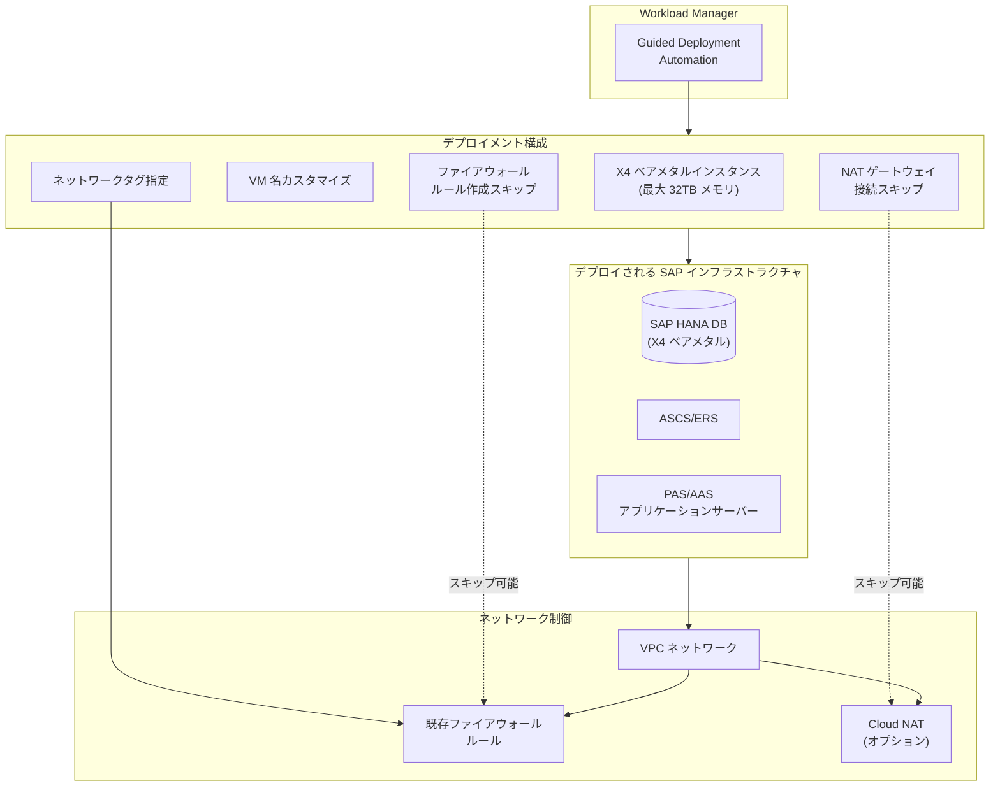

# Workload Manager: SAP S/4HANA デプロイメント機能の拡張 (X4 インスタンス対応・ネットワーク制御強化)

**リリース日**: 2026-03-17

**サービス**: Workload Manager

**機能**: SAP S/4HANA デプロイメントの機能拡張

**ステータス**: Feature

[このアップデートのインフォグラフィックを見る](https://takech9203.github.io/google-cloud-news-summary/20260317-workload-manager-sap-x4-instances.html)

## 概要

Workload Manager の Guided Deployment Automation ツールにおいて、SAP S/4HANA ワークロードのデプロイメント機能が大幅に拡張された。最大 32 TB のメモリを搭載する X4 メモリ最適化ベアメタルインスタンスへのデプロイが可能となり、アプリケーションサーバー VM の名前カスタマイズ、ネットワークタグの指定、自動ファイアウォールルール作成のスキップ、Cloud NAT ゲートウェイ接続のスキップといったネットワーク制御機能も追加された。

これらの機能強化により、大規模な SAP HANA ワークロードを Google Cloud 上で柔軟にデプロイできるようになり、エンタープライズ環境で求められるネットワークセキュリティポリシーへの準拠やインフラストラクチャ命名規則への対応が容易になる。SAP Basis 管理者、クラウドインフラストラクチャチーム、セキュリティチームにとって重要なアップデートである。

**アップデート前の課題**

- Workload Manager の Guided Deployment Automation では X4 ベアメタルインスタンスを選択してデプロイすることができなかった
- アプリケーションサーバー VM の名前は自動生成されるため、組織の命名規則に合わせたカスタマイズができなかった
- デプロイされるインスタンスにネットワークタグを指定できず、既存のファイアウォールルールとの連携が制限されていた
- ファイアウォールルールが自動的に作成されるため、既に厳格なネットワークポリシーを持つ環境では不要なルールが追加された
- Cloud NAT ゲートウェイの接続が自動で行われるため、外部 IP アドレスによるインターネットアクセスを使用する場合に不要な NAT 構成が作成された

**アップデート後の改善**

- X4 メモリ最適化ベアメタルインスタンス (最大 32 TB メモリ) での SAP S/4HANA デプロイが可能になった
- アプリケーションサーバー VM の名前を組織の命名規則に合わせてカスタマイズできるようになった
- ネットワークタグを指定してデプロイインスタンスに適用し、既存のファイアウォールルールとシームレスに連携できるようになった
- 自動ファイアウォールルール作成をスキップし、組織のネットワークセキュリティポリシーに準拠した構成が可能になった
- Cloud NAT ゲートウェイの接続をスキップし、外部 IP アドレスなど別の方法でインターネットアクセスを提供する環境に対応できるようになった

## アーキテクチャ図

Workload Manager の Guided Deployment Automation が SAP S/4HANA インフラストラクチャをデプロイする際の構成を示している。新たに追加された X4 インスタンス対応、VM 名カスタマイズ、ネットワークタグ、ファイアウォール/NAT スキップの各機能が、デプロイメントの柔軟性を高めている。

## サービスアップデートの詳細

### 主要機能

1. **X4 ベアメタルインスタンスでの SAP S/4HANA デプロイ**
   - Intel Sapphire Rapids プロセッサ搭載の X4 メモリ最適化ベアメタルマシンタイプに対応
   - 最大 1,920 vCPU、32 TB (32,768 GB) メモリの構成が選択可能
   - SAP 認定済みマシンタイプとして、OLAP および OLTP ワークロードの両方をサポート
   - ストレージは Hyperdisk Extreme および Hyperdisk Balanced に対応

2. **アプリケーションサーバー VM 名のカスタマイズ**
   - PAS (Primary Application Server) および AAS (Additional Application Server) の VM 名を任意に指定可能
   - 組織の命名規則やサーバー管理ポリシーに準拠したデプロイが可能

3. **ネットワークタグの指定**
   - デプロイされるインスタンスにネットワークタグを付与可能
   - 既存の VPC ファイアウォールルールをタグベースで適用でき、ネットワークポリシーとの統合が容易

4. **自動ファイアウォールルール作成のスキップ**
   - Workload Manager がデプロイ時に自動作成するファイアウォールルールの生成を無効化可能
   - 組織独自のファイアウォールポリシーを適用する環境に対応
   - スキップする場合は、VM 間通信を許可するファイアウォールルールを手動で設定する必要がある

5. **Cloud NAT ゲートウェイ接続のスキップ**
   - リージョナルサブネットワークへの Cloud NAT ゲートウェイの自動接続をスキップ可能
   - 外部 IP アドレスや既存のネットワーク構成を使用してインターネットアクセスを提供する環境に対応

## 技術仕様

### 対応 X4 マシンタイプ

| マシンタイプ | vCPU | メモリ | CPU プラットフォーム | 対応ワークロード |
|---|---|---|---|---|
| x4-480-6t-metal | 480 | 6,144 GB (6 TB) | Intel Sapphire Rapids | OLAP / OLTP |
| x4-480-8t-metal | 480 | 8,192 GB (8 TB) | Intel Sapphire Rapids | OLAP / OLTP |
| x4-960-12t-metal | 960 | 12,288 GB (12 TB) | Intel Sapphire Rapids | OLAP / OLTP |
| x4-960-16t-metal | 960 | 16,384 GB (16 TB) | Intel Sapphire Rapids | OLAP / OLTP |
| x4-1440-24t-metal | 1,440 | 24,576 GB (24 TB) | Intel Sapphire Rapids | OLAP / OLTP |
| x4-1920-32t-metal | 1,920 | 32,768 GB (32 TB) | Intel Sapphire Rapids | OLAP / OLTP |

### X4 インスタンスの制約事項

| 項目 | 詳細 |
|---|---|
| ストレージ | Hyperdisk のみ対応 (ブートボリューム含む) |
| リージョン | 一部のリージョン・ゾーンのみで利用可能 |
| マシン構成 | 事前定義タイプのみ (カスタム構成不可) |
| OS | 一部の OS バージョンのみ対応 (RHEL 8.10+、SLES 15 SP4+) |

### ネットワーク構成オプション

| 設定項目 | 説明 | デフォルト |
|---|---|---|
| ネットワークタグ | デプロイされる VM に適用するタグ | なし (新規オプション) |
| ファイアウォールルール自動作成 | VM 間通信用ルールの自動生成 | 有効 (スキップ可能) |
| Cloud NAT ゲートウェイ | サブネットへの NAT 接続 | 有効 (スキップ可能) |
| インターネットアクセス方式 | Cloud NAT または外部 IP | Cloud NAT |

## 設定方法

### 前提条件

1. Google Cloud プロジェクトで Workload Manager API が有効化されていること
2. 必要な IAM ロールが付与されたサービスアカウントが存在すること
3. X4 インスタンスを使用する場合、対象リージョン・ゾーンで十分なクォータがあること
4. SAP インストールメディアが Cloud Storage バケットにアップロードされていること
5. VPC ネットワークとサブネットが作成されていること

### 手順

#### ステップ 1: Workload Manager コンソールでデプロイメントを作成

Google Cloud コンソールの Workload Manager から「Guided Deployment Automation」を選択し、SAP S/4HANA デプロイメントの作成を開始する。

#### ステップ 2: マシンタイプとして X4 を選択

SAP HANA データベースのマシンタイプとして X4 ベアメタルインスタンスを選択する。ワークロードのサイジング要件に応じて適切なマシンタイプを選ぶ。

#### ステップ 3: ネットワーク設定のカスタマイズ

「Location & networking」タブで以下を設定する:
- **Network tags**: デプロイされるインスタンスに適用するネットワークタグを指定
- **Skip automatic firewall setup**: チェックボックスを選択して自動ファイアウォールルール作成をスキップ
- **Internet access**: Cloud NAT を使用せず外部 IP を使用する場合は「Allow External IP」を選択

#### ステップ 4: VM 名のカスタマイズ

アプリケーションサーバー (PAS/AAS) の VM 名を組織の命名規則に合わせて指定する。

## メリット

### ビジネス面

- **大規模 SAP ワークロードの移行促進**: X4 インスタンス対応により、最大 32 TB メモリを必要とする大規模 SAP HANA 環境の Google Cloud への移行が可能になる
- **コンプライアンス対応の簡素化**: ネットワークタグやファイアウォールルールのカスタマイズにより、組織のセキュリティポリシーに準拠したデプロイが容易になる
- **運用効率の向上**: VM 名のカスタマイズにより、既存の運用ツールやプロセスとの統合がスムーズになる

### 技術面

- **高性能インフラストラクチャ**: Intel Sapphire Rapids ベースの X4 ベアメタルインスタンスにより、最高水準の SAP HANA パフォーマンスを実現
- **ネットワーク制御の柔軟性**: ファイアウォールルールや NAT 構成を既存のネットワークアーキテクチャに合わせて調整可能
- **IaC との連携**: Guided Deployment Automation が生成する Terraform/Ansible コードをエクスポートしてカスタマイズ可能

## デメリット・制約事項

### 制限事項

- X4 インスタンスは一部のリージョン・ゾーンでのみ利用可能
- X4 インスタンスのストレージは Hyperdisk のみ対応 (ブートボリューム含む)
- X4 インスタンスのカスタムマシン構成は不可 (事前定義タイプのみ)
- 自動ファイアウォールルール作成をスキップした場合、VM 間通信を許可するルールを手動で設定する必要がある

### 考慮すべき点

- X4 ベアメタルインスタンスはコストが高いため、ワークロードのサイジングを慎重に行うこと
- ネットワークタグやファイアウォールルールのスキップ設定は、既存のネットワークセキュリティ構成を十分に理解した上で行うこと
- デプロイ後の変更は Google Cloud コンソールから直接行えないため、Terraform/Ansible の IaC エクスポートを活用すること

## ユースケース

### ユースケース 1: 大規模 SAP HANA OLTP ワークロードの移行

**シナリオ**: オンプレミスで 16 TB 以上のメモリを使用する SAP S/4HANA 本番環境を Google Cloud に移行する。組織のセキュリティポリシーにより、ファイアウォールルールはネットワークチームが一元管理している。

**効果**: x4-960-16t-metal インスタンスを選択し、ネットワークタグを指定して自動ファイアウォールルール作成をスキップすることで、既存のネットワークセキュリティポリシーに準拠しつつ、大規模 SAP HANA 環境を迅速にデプロイできる。

### ユースケース 2: マルチシステム SAP ランドスケープの構築

**シナリオ**: 開発・テスト・本番の SAP S/4HANA システムを Google Cloud 上に構築する。各システムは VM 名で識別し、環境ごとに異なるネットワークタグを適用してアクセス制御を行う。

**効果**: VM 名のカスタマイズ機能により「sap-prod-app01」「sap-dev-app01」のような命名規則を適用でき、ネットワークタグにより環境間のアクセス制御を既存のファイアウォールルールで管理できる。

## 料金

Workload Manager の Guided Deployment Automation は無料で利用できる。課金はデプロイされるリソース (VM インスタンス、Persistent Disk / Hyperdisk、ライセンスなど) に対して発生する。X4 ベアメタルインスタンスの料金は通常の Compute Engine 料金に従う。詳細な料金見積もりについては Google アカウントチームに問い合わせが推奨される。

## 利用可能リージョン

X4 インスタンスは一部のリージョン・ゾーンでのみ利用可能。利用可能なリージョンの最新情報は [Compute Engine リージョンとゾーン](https://cloud.google.com/compute/docs/regions-zones#available) を参照。

## 関連サービス・機能

- **Compute Engine (X4 マシンシリーズ)**: SAP HANA 向けメモリ最適化ベアメタルインスタンスを提供
- **Infrastructure Manager**: Workload Manager が使用する Terraform デプロイメントの自動化基盤
- **Cloud Build**: Infrastructure Manager が Terraform コマンドの実行に使用
- **Cloud Storage**: SAP インストールメディアの保管および Terraform State ファイルの保存
- **Secret Manager**: SAP システムのデータベースおよびアプリケーション資格情報の安全な管理
- **Cloud DNS**: SAP デプロイメント用プライベート DNS ゾーンの構成
- **Cloud NAT**: VM へのアウトバウンドインターネットアクセスの提供 (オプション)
- **Google Cloud's Agent for SAP**: Workload Manager 評価メトリクスの収集と SAP システムの監視

## 参考リンク

- [インフォグラフィック](https://takech9203.github.io/google-cloud-news-summary/20260317-workload-manager-sap-x4-instances.html)
- [公式リリースノート](https://cloud.google.com/release-notes#March_17_2026)
- [SAP S/4HANA デプロイメントガイド](https://cloud.google.com/workload-manager/docs/deploy/sap/deploy-sap)
- [SAP S/4HANA デプロイメント概要](https://cloud.google.com/workload-manager/docs/deploy/sap/sap-hana-overview)
- [SAP デプロイメントの前提条件](https://cloud.google.com/workload-manager/docs/deploy/sap/prerequisites-sap)
- [Guided Deployment Automation の概要](https://cloud.google.com/workload-manager/docs/deploy/about-wlm-deployment)
- [X4 マシンシリーズ](https://cloud.google.com/compute/docs/memory-optimized-machines#x4_series)
- [SAP HANA 認定マシンタイプ](https://cloud.google.com/sap/docs/certifications-sap-hana)

## まとめ

今回のアップデートにより、Workload Manager の SAP S/4HANA デプロイメント機能が大幅に強化され、X4 ベアメタルインスタンスへの対応で最大 32 TB メモリの大規模 SAP HANA 環境のデプロイが可能になった。加えて、VM 名のカスタマイズ、ネットワークタグ、ファイアウォール/NAT 構成のスキップといった機能により、エンタープライズ環境のネットワークポリシーやインフラ管理要件に柔軟に対応できるようになった。大規模 SAP ワークロードの Google Cloud 移行を検討している組織は、X4 インスタンスの利用可能リージョンとクォータを確認し、デプロイメント計画に反映することを推奨する。

---

**タグ**: #WorkloadManager #SAP #S4HANA #X4 #ベアメタル #GuidedDeploymentAutomation #ネットワークタグ #ファイアウォール #ComputeEngine
