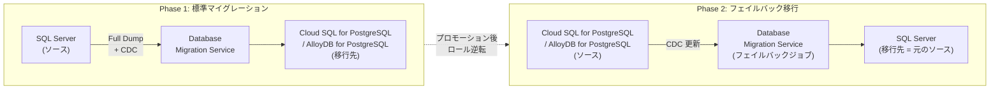

# Cloud Database Migration Service: SQL Server 異種マイグレーションにおけるフェイルバック移行ジョブ (Preview)

**リリース日**: 2026-03-18

**サービス**: Cloud Database Migration Service

**機能**: Failback migration jobs for heterogeneous SQL Server migrations

**ステータス**: Preview

[このアップデートのインフォグラフィックを見る](https://takech9203.github.io/google-cloud-news-summary/20260318-dms-sql-server-failback-migration.html)

## 概要

Database Migration Service (DMS) の SQL Server 異種マイグレーションにおいて、フェイルバック移行ジョブ機能が Preview としてリリースされました。フェイルバック移行 (リバースレプリケーションとも呼ばれる) は、標準のマイグレーション完了後に、移行先の PostgreSQL データベースから元の SQL Server ソースへ Change Data Capture (CDC) の更新を逆方向にプッシュする機能です。

この機能により、マイグレーション後も元の SQL Server ソースデータベースを最新の状態に保つことができ、必要に応じてアプリケーションを元の SQL Server データベースに切り戻すことが可能になります。対象となる移行先は Cloud SQL for PostgreSQL および AlloyDB for PostgreSQL の両方です。

フェイルバック移行は、大規模なエンタープライズ環境で SQL Server から PostgreSQL への移行を計画しているデータベース管理者やクラウドアーキテクトにとって、移行リスクを大幅に低減する重要な機能です。

**アップデート前の課題**

- 標準の異種マイグレーションでは一方向のデータ移行のみがサポートされ、移行先から元のソースへのデータ同期ができなかった
- マイグレーション後に元の SQL Server に切り戻す場合、データの再同期を手動で行う必要があった
- 移行の不可逆性がリスク要因となり、大規模な本番環境での異種マイグレーション採用に慎重にならざるを得なかった

**アップデート後の改善**

- マイグレーション完了後も CDC を通じて PostgreSQL から SQL Server へデータ変更を逆方向に同期可能になった
- 元の SQL Server ソースデータベースを常に最新の状態に維持でき、切り戻しが容易になった
- 移行リスクが低減され、段階的な本番移行やパラレルラン期間の設定が現実的になった

## アーキテクチャ図



標準マイグレーション完了後、ソースとデスティネーションのロールが逆転し、PostgreSQL からの CDC 更新が元の SQL Server へ同期されます。

## サービスアップデートの詳細

### 主要機能

1. **フェイルバック移行ジョブ (リバースレプリケーション)**
   - 標準マイグレーション完了後に、移行先 PostgreSQL から元の SQL Server ソースへ CDC 更新をプッシュ
   - 標準のマイグレーションと同様のフローで設定可能 (接続プロファイル作成、移行ジョブ実行)
   - 元の移行ジョブとコンバージョンワークスペースへのアクセスが必要

2. **CDC ベースの継続的データ同期**
   - Change Data Capture を利用して、PostgreSQL 側のデータ変更 (INSERT、UPDATE、DELETE) を SQL Server に反映
   - フルバックフィルは非対応であり、CDC 操作のみを実行
   - 元の移行ジョブに含まれるテーブルのみがレプリケーション対象

3. **Private Service Connect を使用した接続**
   - フェイルバック移行は Private Service Connect (PSC) のみをサポート
   - PSC 対応の Cloud SQL インスタンスの場合は DNS 名フィールドを使用
   - その他のプロバイダ (Amazon RDS、Azure SQL 等) の場合はプロキシ経由の接続が必要

### 対象移行パス

| ソース (フェイルバック時) | デスティネーション (フェイルバック時 = 元のソース) |
|---|---|
| Cloud SQL for PostgreSQL 12, 13, 14, 15, 16, 17 | SQL Server (Enterprise 2008+、Standard 2016 SP1+、Developer 2008+) |
| AlloyDB for PostgreSQL 14, 15, 16 | Amazon RDS for SQL Server |
| | Azure SQL Managed Instance |
| | Cloud SQL for SQL Server |
| | セルフマネージド SQL Server |

## 技術仕様

### 必要な IAM ロール

| ロール | 説明 |
|------|------|
| `roles/datamigration.admin` | Database Migration Service の管理権限 (Gemini 変換機能用の `cloudaicompanion.entitlements.get` を含む) |
| `roles/cloudsql.admin` | Cloud SQL インスタンスの管理権限 |

### gcloud CLI によるフェイルバック移行ジョブの設定

フェイルバック移行ジョブは Google Cloud CLI でのみ作成可能です。

**ソース接続プロファイル (PostgreSQL) の作成:**

```bash
gcloud database-migration connection-profiles \
  create postgresql SRC_CONNECTION_PROFILE_ID \
  --no-async \
  --display-name=CONNECTION_PROFILE_NAME \
  --region=SRC_REGION \
  --password=SRC_PASSWORD \
  --username=SRC_USER \
  --host=SRC_HOST \
  --port=5432 \
  --database=SRC_DATABASE_NAME \
  --role=SOURCE
```

**デスティネーション接続プロファイル (SQL Server) の作成:**

```bash
gcloud database-migration connection-profiles \
  create sqlserver DEST_CONNECTION_PROFILE_ID \
  --no-async \
  --display-name=DEST_CONNECTION_PROFILE_NAME \
  --region=DEST_PROFILE_REGION \
  --password=DEST_PASSWORD \
  --username=DEST_USER \
  --database=DATABASE \
  --host=DEST_HOST \
  --port=1433 \
  --psc-service-attachment=SERVICE_ATTACHMENT_URI \
  --role=DESTINATION
```

## 設定方法

### 前提条件

1. 標準の SQL Server から PostgreSQL への異種マイグレーションが完了していること
2. 元の移行ジョブをプロモーションする前にフェイルバック移行ジョブを作成・テストすること (推奨)
3. 元の移行ジョブおよびコンバージョンワークスペースを削除しないこと
4. Private Service Connect のネットワーク接続が構成されていること

### 手順

#### ステップ 1: 標準マイグレーションの完了

SQL Server から Cloud SQL for PostgreSQL (または AlloyDB for PostgreSQL) への標準マイグレーションを実行します。プロモーションはまだ行わないでください。

#### ステップ 2: フェイルバック移行ジョブの準備

ソースとデスティネーションのロールが逆転するため、以下を設定します:
- PostgreSQL インスタンスをソースとする接続プロファイルの作成
- 元の SQL Server をデスティネーションとする接続プロファイルの作成
- ユーザーアカウントとネットワーク接続をロール逆転に合わせて構成

#### ステップ 3: 元の移行ジョブのプロモーション

フェイルバック移行ジョブの準備が完了したら、元の移行ジョブをプロモーションします。

#### ステップ 4: フェイルバックプロセスの開始

プロモーション完了後、フェイルバック移行プロセスを開始し、PostgreSQL から SQL Server への CDC レプリケーションを開始します。

## メリット

### ビジネス面

- **移行リスクの大幅な低減**: 問題発生時に元の SQL Server への切り戻しが可能なため、本番環境の異種マイグレーションに伴うビジネスリスクが軽減される
- **段階的移行の実現**: パラレルラン期間を設けて両システムの動作を検証しながら、安全に移行を進められる
- **ダウンタイムの最小化**: CDC ベースの継続的同期により、切り戻し時のデータ損失とダウンタイムを最小限に抑えられる

### 技術面

- **CDC ベースの効率的なレプリケーション**: 変更データのみを同期するため、ネットワーク帯域幅の消費を抑制
- **既存のマイグレーションフローとの統合**: 標準マイグレーションと同じフローで設定できるため、追加の学習コストが低い
- **Private Service Connect による安全な接続**: プライベートネットワーク経由での安全なデータ転送

## デメリット・制約事項

### 制限事項

- フェイルバック移行は **Private Service Connect のみ** をネットワーク接続方法としてサポート
- フェイルバック移行ジョブの作成は **Google Cloud CLI のみ** で可能 (コンソール UI は非対応)
- 元の移行ジョブとフェイルバック移行ジョブは **同一プロジェクト内** に存在する必要がある
- フェイルバック移行ジョブは **CDC 操作のみ** を実行し、フルバックフィルは非対応
- 元の移行ジョブに含まれるテーブルのみがレプリケーション対象 (移行先 PostgreSQL で新規作成されたテーブルは対象外)
- レプリケーション対象テーブルの **スキーマ変更は非対応**
- Cloud SQL for PostgreSQL の **メジャーバージョンアップグレード** はフェイルバック移行中に実行不可
- Cloud SQL の **リードレプリカ** からのデータ読み取りは不可
- AlloyDB のクラスタ Auth Proxy が必要なインスタンスではフェイルバック移行ジョブは非対応

### 考慮すべき点

- 主キーまたはユニークインデックスを持たない SQL Server テーブルでは、フェイルバック移行は **追記のみ (append-only)** モードで動作し、INSERT と UPDATE は共に INSERT として実行される
- ポイントインタイムの一貫性は SQL Server インスタンス上では維持されない (SQL Server ライターは整合性エラーを避けるため外部キー検証をバイパスする)
- フェイルバック移行ジョブは SQL Server インスタンスの `NOT FOR REPLICATION` トリガーを発火しない
- 移行ジョブを停止すると DMS はレプリケーションスロットを消費しなくなり、WAL ファイルの増大によるインスタンス障害のリスクがある (`max_slot_wal_keep_size` 設定で監視推奨)

## ユースケース

### ユースケース 1: 大規模基幹システムの段階的移行

**シナリオ**: エンタープライズ企業が基幹業務システムの SQL Server データベースを Cloud SQL for PostgreSQL に移行する際、一定期間のパラレルラン期間を設けて両システムの動作を検証したい。

**効果**: フェイルバック移行により、PostgreSQL 側での変更が SQL Server に自動同期されるため、問題が検出された場合でもデータ損失なく SQL Server に切り戻すことが可能。移行プロジェクトのリスクを大幅に低減できる。

### ユースケース 2: マルチクラウド環境での段階的移行

**シナリオ**: Amazon RDS for SQL Server または Azure SQL Managed Instance から Google Cloud の AlloyDB for PostgreSQL への移行において、クラウド間の切り替えを安全に実施したい。

**効果**: 異なるクラウドプロバイダ間のマイグレーションにおいても、フェイルバック機能により元のクラウド環境への切り戻しパスを維持できる。マルチクラウド戦略を採用する企業にとって、移行の柔軟性が向上する。

## 料金

Database Migration Service のフェイルバック移行ジョブ自体の料金に関する具体的な情報は、現時点で公式ドキュメントに明記されていません。ただし、公式ガイドによると以下のコンポーネントが課金対象となります:

- **Cloud SQL**: Cloud SQL for PostgreSQL インスタンスの利用料金 ([Cloud SQL 料金ページ](https://cloud.google.com/sql/pricing) 参照)
- **Cloud Storage**: CMEK (顧客管理暗号鍵) を使用する場合のストレージ料金 ([Cloud Storage 料金ページ](https://cloud.google.com/storage/pricing) 参照)

料金の見積もりには [Google Cloud 料金計算ツール](https://cloud.google.com/products/calculator) を使用してください。

## 関連サービス・機能

- **Cloud SQL for PostgreSQL**: SQL Server からの異種マイグレーションの移行先データベース
- **AlloyDB for PostgreSQL**: SQL Server からの異種マイグレーションのもう一つの移行先データベース
- **DMS コンバージョンワークスペース**: SQL Server スキーマの PostgreSQL 構文への変換を支援するインタラクティブエディタ
- **Gemini アシスト変換機能**: コード変換における Gemini 支援ワークフロー
- **Private Service Connect**: フェイルバック移行で使用される唯一のネットワーク接続方法

## 参考リンク

- [このアップデートのインフォグラフィック](https://takech9203.github.io/google-cloud-news-summary/20260318-dms-sql-server-failback-migration.html)
- [公式リリースノート](https://cloud.google.com/release-notes#March_18_2026)
- [SQL Server to Cloud SQL for PostgreSQL フェイルバック移行概要](https://cloud.google.com/database-migration/docs/sqlserver-to-csql-pgsql/failback-migration)
- [SQL Server to Cloud SQL for PostgreSQL フェイルバック移行ガイド](https://cloud.google.com/database-migration/docs/sqlserver-to-csql-pgsql/guide-failback-migration)
- [SQL Server to AlloyDB for PostgreSQL フェイルバック移行概要](https://cloud.google.com/database-migration/docs/sqlserver-to-alloydb/failback-migration)
- [SQL Server to AlloyDB for PostgreSQL フェイルバック移行ガイド](https://cloud.google.com/database-migration/docs/sqlserver-to-alloydb/guide-failback-migration)
- [Database Migration Service ドキュメント](https://cloud.google.com/database-migration/docs)
- [Database Migration Service 料金](https://cloud.google.com/database-migration/pricing)

## まとめ

Database Migration Service のフェイルバック移行ジョブは、SQL Server から PostgreSQL への異種マイグレーションにおけるリスク管理を大幅に改善する機能です。CDC ベースのリバースレプリケーションにより、移行後も元の SQL Server データベースを最新の状態に維持し、必要に応じた切り戻しを可能にします。Preview ステータスであるため本番環境での利用には注意が必要ですが、大規模な異種マイグレーションを計画している組織は、この機能を活用した段階的移行戦略の検討を推奨します。

---

**タグ**: #CloudDatabaseMigrationService #SQLServer #PostgreSQL #CloudSQL #AlloyDB #フェイルバック #CDC #異種マイグレーション #Preview
