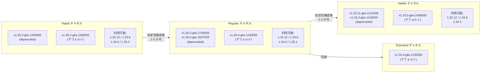

# Google Kubernetes Engine (GKE): バージョンアップデート (2026-R11)

**リリース日**: 2026-03-18

**サービス**: Google Kubernetes Engine (GKE)

**機能**: クラスタバージョンアップデート (2026-R11) - 全リリースチャネルのデフォルトバージョン更新

**ステータス**: GA (一般提供)

📊 [このアップデートのインフォグラフィックを見る](https://takech9203.github.io/google-cloud-news-summary/20260318-gke-version-updates-2026-r11.html)

## 概要

GKE の全リリースチャネル (Rapid、Regular、Stable、Extended) において、クラスタバージョンが更新された (2026-R11)。各チャネルのデフォルトバージョンが変更され、新しいバージョンが利用可能になるとともに、一部の古いパッチバージョンが非推奨 (deprecated) となった。

今回のアップデートでは、Rapid チャネルで v1.35.2-gke.1269001 がデフォルトに、Regular チャネルで v1.34.4-gke.1130000 がデフォルトに、Stable チャネルで v1.33.5-gke.2469000 がデフォルトにそれぞれ設定された。Extended チャネルは Regular チャネルと同じ v1.34.4-gke.1130000 がデフォルトとなっている。

GKE クラスタを運用するすべてのユーザーに影響するアップデートであり、特に自動アップグレードを有効にしているクラスタでは、各チャネルの新しいデフォルトバージョンへのアップグレードが順次実行される。

## アーキテクチャ図



本図は、各リリースチャネルにおけるデフォルトバージョンと利用可能バージョンの関係を示している。GKE はバージョンを Rapid チャネルで最初にリリースし、安定性が確認された後に Regular、Stable の順に展開する。

## サービスアップデートの詳細

### 主要機能

1. **Rapid チャネルのバージョン更新**
   - デフォルトバージョンが v1.35.2-gke.1269001 に変更された
   - 利用可能なマイナーバージョン: 1.32.13、1.33.9、1.34.5、1.35.2
   - 非推奨: 1.35.2-gke.1269000 (新しいパッチバージョンへの置き換え)
   - 自動アップグレードターゲットが更新された

2. **Regular チャネルのバージョン更新**
   - デフォルトバージョンが v1.34.4-gke.1130000 に変更された
   - 利用可能なマイナーバージョン: 1.32.12、1.33.8、1.34.4、1.35.1
   - 非推奨: 1.35.0-gke.2745005、1.35.0-gke.3047002
   - 自動アップグレードターゲットが更新された

3. **Stable チャネルのバージョン更新**
   - デフォルトバージョンが v1.33.5-gke.2469000 に変更された
   - 利用可能なマイナーバージョン: 1.32.12、1.33.8、1.34.4
   - 非推奨: 1.32.11-gke.1211000、1.34.3-gke.1318000
   - 自動アップグレードターゲットが更新された

4. **Extended チャネルのバージョン更新**
   - デフォルトバージョンが v1.34.4-gke.1130000 に変更された (Regular チャネルと同一)
   - 自動アップグレードターゲットが更新された

## 技術仕様

### チャネル別バージョン一覧

| チャネル | デフォルトバージョン | 利用可能マイナーバージョン |
|----------|---------------------|---------------------------|
| Rapid | v1.35.2-gke.1269001 | 1.32.13, 1.33.9, 1.34.5, 1.35.2 |
| Regular | v1.34.4-gke.1130000 | 1.32.12, 1.33.8, 1.34.4, 1.35.1 |
| Stable | v1.33.5-gke.2469000 | 1.32.12, 1.33.8, 1.34.4 |
| Extended | v1.34.4-gke.1130000 | - |

### 非推奨バージョン一覧

| チャネル | 非推奨バージョン |
|----------|-----------------|
| Rapid | 1.35.2-gke.1269000 |
| Regular | 1.35.0-gke.2745005, 1.35.0-gke.3047002 |
| Stable | 1.32.11-gke.1211000, 1.34.3-gke.1318000 |

### リリースチャネルの特性

| チャネル | 特性 | 推奨用途 |
|----------|------|----------|
| Rapid | 最新バージョンを最も早く提供。GKE SLA の対象外となる場合がある | プリプロダクション環境、新機能の早期検証 |
| Regular (デフォルト) | Rapid で 2-3 か月の安定性確認後に提供 | 大多数のワークロード (推奨) |
| Stable | Regular で 2-3 か月の追加安定性確認後に提供 | 安定性を最優先するワークロード |
| Extended | Regular チャネルと同期。最大 24 か月のサポート | 長期サポートが必要なワークロード |

### パッチバージョンの非推奨ポリシー

非推奨となったパッチバージョンは、90 日間または当該マイナーバージョンのサポート終了日まで引き続き利用可能である。ただし、非推奨バージョンはコントロールプレーンの利用可能バージョンとしてリストされなくなるため、新しいパッチバージョンへの早期アップグレードが推奨される。

## 設定方法

### 前提条件

1. GKE クラスタが作成済みであること
2. 適切な IAM 権限 (container.clusters.update) を持つこと

### 手順

#### ステップ 1: 現在のクラスタバージョンとチャネルの確認

```bash
# クラスタの現在のバージョンとリリースチャネルを確認
gcloud container clusters describe CLUSTER_NAME \
  --location=LOCATION \
  --format="table(name, currentMasterVersion, releaseChannel.channel)"
```

#### ステップ 2: 利用可能なアップグレードバージョンの確認

```bash
# クラスタで利用可能なアップグレードバージョンを確認
gcloud container get-server-config \
  --location=LOCATION \
  --format="yaml(channels)"
```

#### ステップ 3: 手動アップグレード (必要な場合)

```bash
# コントロールプレーンを特定のバージョンにアップグレード
gcloud container clusters upgrade CLUSTER_NAME \
  --location=LOCATION \
  --master \
  --cluster-version=TARGET_VERSION
```

自動アップグレードが有効な場合、新しいデフォルトバージョンへのアップグレードはリリース日から 4 営業日以上かけて全ゾーンに順次展開される。

#### ステップ 4: ノードプールのアップグレード (Standard クラスタの場合)

```bash
# ノードプールを特定のバージョンにアップグレード
gcloud container clusters upgrade CLUSTER_NAME \
  --location=LOCATION \
  --node-pool=NODE_POOL_NAME \
  --cluster-version=TARGET_VERSION
```

Autopilot クラスタの場合、ノードはコントロールプレーンのバージョンに自動的にアップグレードされる。

## メリット

### ビジネス面

- **セキュリティの強化**: 最新パッチバージョンにはセキュリティ修正が含まれており、クラスタの安全性が向上する
- **安定性の向上**: 各チャネルでの安定性確認プロセスを経たバージョンが提供されるため、ワークロードの信頼性が確保される

### 技術面

- **最新機能へのアクセス**: Rapid チャネルでは Kubernetes 1.35 系の最新パッチが利用可能になり、新しい Kubernetes 機能を活用できる
- **バグ修正の適用**: 非推奨バージョンから新しいパッチバージョンへの移行により、既知のバグが修正される
- **バージョンスキューの防止**: 自動アップグレードターゲットの更新により、コントロールプレーンとノード間のバージョンスキューが適切に管理される

## デメリット・制約事項

### 制限事項

- バージョンのロールアウトはリリース日から 4 営業日以上かけて全 Google Cloud ゾーンに展開されるため、即時に全クラスタに反映されるわけではない
- コントロールプレーンのマイナーバージョンスキップはサポートされていない (例: 1.33 から 1.35 への直接アップグレードは不可)
- Rapid チャネルのバージョンは GKE SLA の対象外となる場合がある

### 考慮すべき点

- 非推奨バージョンを使用中のクラスタは、90 日以内に新しいパッチバージョンへのアップグレードを計画する必要がある
- 自動アップグレードが有効な場合、メンテナンスウィンドウとメンテナンス除外を適切に設定して、アップグレードのタイミングを制御することが推奨される
- 本番環境へのアップグレード前に、プリプロダクション環境での動作検証が推奨される
- ノードのバージョンはコントロールプレーンの 2 マイナーバージョン以内である必要がある (バージョンスキューポリシー)

## ユースケース

### ユースケース 1: 段階的なバージョンアップグレード戦略

**シナリオ**: 複数の環境 (開発、ステージング、本番) で GKE クラスタを運用しており、各環境で異なるリリースチャネルを使用している。

**実装例**:
```bash
# 開発環境: Rapid チャネル (最新バージョンの早期検証)
gcloud container clusters create dev-cluster \
  --release-channel=rapid \
  --location=us-central1

# ステージング環境: Regular チャネル (バランスの取れた安定性)
gcloud container clusters create staging-cluster \
  --release-channel=regular \
  --location=us-central1

# 本番環境: Stable チャネル (最大限の安定性)
gcloud container clusters create prod-cluster \
  --release-channel=stable \
  --location=us-central1
```

**効果**: Rapid チャネルの開発環境で新バージョンを検証した後、Regular、Stable と段階的に本番環境へ展開することで、リスクを最小化しながら最新機能を活用できる。

### ユースケース 2: 長期サポートが必要なワークロード

**シナリオ**: コンプライアンス要件により、クラスタバージョンの頻繁な変更を避けたい。Extended チャネルを使用して、マイナーバージョンを最大 24 か月間維持する。

**効果**: Extended チャネルでは同一マイナーバージョン内でのパッチアップグレードのみが自動適用され、セキュリティ修正を受けながらマイナーバージョンを長期間維持できる。

## 関連サービス・機能

- **GKE リリースチャネル**: クラスタのバージョン管理を安定性レベルに基づいて自動化する機能。今回のアップデートで全チャネルのバージョンが更新された
- **GKE 自動アップグレード**: コントロールプレーンとノードを自動的に新しいバージョンにアップグレードする機能。今回のアップデートで自動アップグレードターゲットが更新された
- **メンテナンスウィンドウ/除外**: 自動アップグレードのタイミングを制御する機能。アップグレードの影響を最小限に抑えるために活用できる
- **ロールアウトシーケンシング**: リリースチャネルに登録されたクラスタ間でアップグレードの順序を管理する機能

## 参考リンク

- 📊 [インフォグラフィック](https://takech9203.github.io/google-cloud-news-summary/20260318-gke-version-updates-2026-r11.html)
- [公式リリースノート](https://cloud.google.com/release-notes#March_18_2026)
- [GKE バージョニングとサポート](https://cloud.google.com/kubernetes-engine/versioning)
- [リリースチャネルの概要](https://cloud.google.com/kubernetes-engine/docs/concepts/release-channels)
- [GKE リリーススケジュール](https://cloud.google.com/kubernetes-engine/docs/release-schedule)
- [クラスタのアップグレード](https://cloud.google.com/kubernetes-engine/docs/how-to/upgrading-a-cluster)
- [クラスタアップグレードのベストプラクティス](https://cloud.google.com/kubernetes-engine/docs/best-practices/upgrading-clusters)

## まとめ

GKE 2026-R11 バージョンアップデートにより、全リリースチャネルのデフォルトバージョンと自動アップグレードターゲットが更新された。非推奨バージョンを使用中のクラスタ運用者は、新しいパッチバージョンへのアップグレード計画を確認し、メンテナンスウィンドウの設定やプリプロダクション環境でのテストを通じて、計画的なバージョン移行を進めることが推奨される。

---

**タグ**: #GKE #Kubernetes #リリースチャネル #バージョンアップデート #自動アップグレード #Rapid #Regular #Stable #Extended #GA
