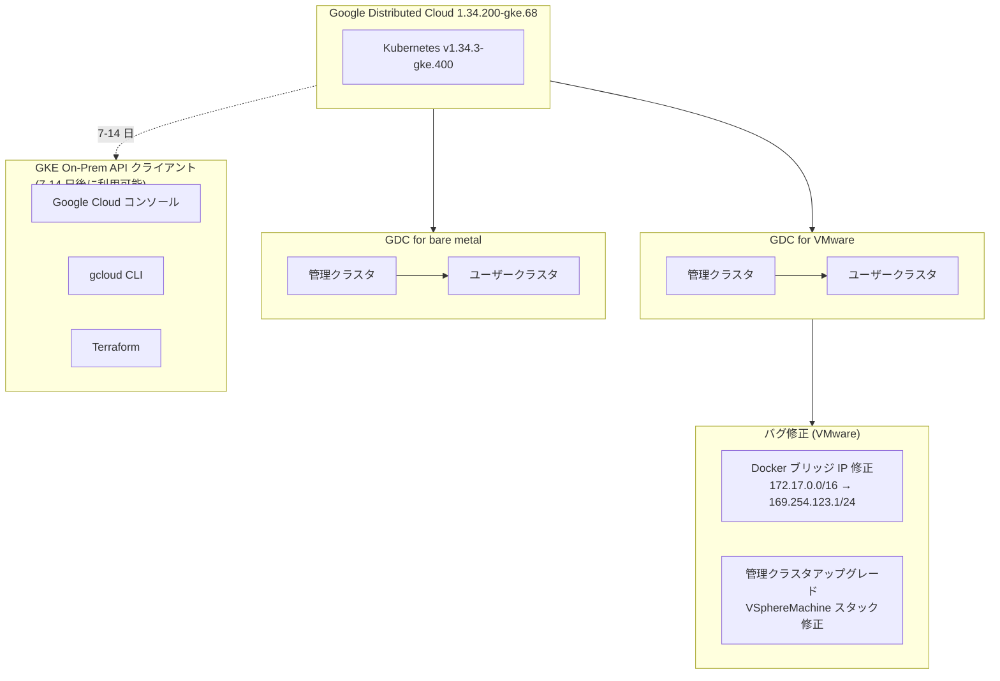

# Google Distributed Cloud (software only): バージョン 1.34.200-gke.68 リリースおよびバグ修正

**リリース日**: 2026-03-18

**サービス**: Google Distributed Cloud (software only) for VMware / bare metal

**機能**: バージョン 1.34.200-gke.68 リリースおよびバグ修正

**ステータス**: GA (Generally Available)

[このアップデートのインフォグラフィックを見る](https://takech9203.github.io/google-cloud-news-summary/20260318-google-distributed-cloud-1-34-200.html)

## 概要

Google は 2026 年 3 月 18 日、Google Distributed Cloud (software only) for VMware および for bare metal のバージョン 1.34.200-gke.68 をリリースした。本バージョンは Kubernetes v1.34.3-gke.400 上で動作する。VMware 版・bare metal 版の両方が同時にダウンロード可能となっている。

今回のリリースでは、VMware 版において 2 つの重要なバグ修正が含まれている。1 つ目は、V2 (Advanced Clusters) のバージョン 1.31 以前でノード起動スクリプトに Docker デフォルトブリッジ IP レンジの設定が欠落していた問題の修正である。2 つ目は、管理クラスタのアップグレード時に VSphereMachine が Creating フェーズで停止し、アクションにつながるエラーメッセージが表示されないまま無期限にスタックする問題の修正である。

なお、リリース後、GKE On-Prem API クライアント (Google Cloud コンソール、gcloud CLI、Terraform) で利用可能になるまでに約 7 日から 14 日かかる。

**アップデート前の課題**

- VMware V2 (Advanced Clusters) バージョン 1.31 以前では、ノード起動スクリプトに Docker デフォルトブリッジ IP レンジの設定ステップが欠落しており、Docker が 172.17.0.0/16 (場合によっては 172.16.0.0/16) をデフォルトで使用していた。これが顧客のネットワークインフラストラクチャと重複すると、クラスタ作成時や運用時に接続障害が発生する可能性があった
- 管理クラスタのアップグレード時に VSphereMachine が Creating フェーズで停止し、進行状況やエラーの原因が不明のまま無期限にスタックする問題があった

**アップデート後の改善**

- Docker デフォルトブリッジ IP が 169.254.123.1/24 に明示的に設定されるようになり、顧客ネットワークとの IP アドレス競合リスクが解消された
- 管理クラスタのアップグレード時に VSphereMachine が Creating フェーズで停止する問題が修正され、アップグレードプロセスの信頼性が向上した
- Kubernetes v1.34.3-gke.400 ベースとなり、最新の Kubernetes 機能とセキュリティ修正が利用可能になった

## アーキテクチャ図



Google Distributed Cloud 1.34.200-gke.68 は VMware 環境と bare metal 環境の両方に対応し、共通の Kubernetes v1.34.3-gke.400 基盤上で動作する。VMware 版では 2 つの重要なバグ修正が含まれている。

## サービスアップデートの詳細

### 主要機能

1. **バージョン 1.34.200-gke.68 リリース (VMware)**
   - Google Distributed Cloud (software only) for VMware 1.34.200-gke.68 がダウンロード可能になった
   - Kubernetes v1.34.3-gke.400 上で動作する
   - サードパーティストレージベンダーを使用している場合は、GDC Ready ストレージパートナーのドキュメントで対象リリースの認定状況を確認する必要がある

2. **バージョン 1.34.200-gke.68 リリース (bare metal)**
   - Google Distributed Cloud (software only) for bare metal 1.34.200-gke.68 も同時にダウンロード可能になった
   - VMware 版と同じ Kubernetes v1.34.3-gke.400 上で動作する

3. **Docker デフォルトブリッジ IP レンジの修正 (VMware)**
   - VMware V2 (Advanced Clusters) バージョン 1.31 以前で、ノード起動スクリプトに Docker デフォルトブリッジ IP レンジを定義する設定ステップが欠落していた
   - Docker がデフォルトで 172.17.0.0/16 (場合によっては 172.16.0.0/16) を使用し、顧客ネットワークインフラストラクチャと重複した場合にクラスタ作成時や運用時に接続障害が発生する可能性があった
   - 修正後、Advanced Clusters のクラスタノードの Docker デフォルトブリッジ IP は 169.254.123.1/24 に明示的に設定されるようになった

4. **管理クラスタアップグレードのスタック問題修正 (VMware)**
   - 管理クラスタのアップグレードが無期限にスタックしているように見え、VSphereMachine が Creating フェーズのまま停止する問題が修正された
   - 以前はこの状態でアクションにつながるエラーメッセージが表示されなかった

## 技術仕様

### バージョン情報

| 項目 | 詳細 |
|------|------|
| GDC バージョン | 1.34.200-gke.68 |
| Kubernetes バージョン | v1.34.3-gke.400 |
| 対象プラットフォーム | VMware / bare metal |
| GKE On-Prem API 利用可能時期 | リリース後 約 7-14 日 |

### Docker ブリッジ IP 修正詳細

| 項目 | 修正前 | 修正後 |
|------|--------|--------|
| Docker ブリッジ IP レンジ | 172.17.0.0/16 (デフォルト) | 169.254.123.1/24 (明示的設定) |
| 影響バージョン | V2 (Advanced Clusters) 1.31 以前 | 1.34.200-gke.68 で修正済み |
| 影響範囲 | 顧客ネットワークとの IP 競合による接続障害 | リンクローカルアドレス使用により競合回避 |

## 設定方法

### 前提条件

1. gkectl のバージョンがターゲットバージョンと一致していること
2. 管理ワークステーションが適切にセットアップされていること
3. サードパーティストレージベンダーを使用している場合は、GDC Ready ストレージパートナーのドキュメントで認定状況を確認すること

### 手順

#### ステップ 1: バンドルのダウンロードと準備 (VMware)

```bash
gkectl prepare \
  --bundle-path /var/lib/gke/bundles/gke-onprem-vsphere-1.34.200-gke.68.tgz \
  --kubeconfig ADMIN_CLUSTER_KUBECONFIG
```

管理ワークステーションで OS イメージを vSphere にインポートする。

#### ステップ 2: 管理クラスタのアップグレード (VMware)

```bash
gkectl upgrade admin \
  --kubeconfig ADMIN_CLUSTER_KUBECONFIG \
  --config ADMIN_CLUSTER_CONFIG_FILE
```

管理クラスタを先にアップグレードする。アップグレード中にプリフライトチェックが自動実行される。

#### ステップ 3: ユーザークラスタのアップグレード (VMware)

```bash
gkectl upgrade cluster \
  --kubeconfig ADMIN_CLUSTER_KUBECONFIG \
  --config USER_CLUSTER_CONFIG \
  --dry-run
```

まず `--dry-run` フラグでプリフライトチェックを実行し、問題がないことを確認してから本番アップグレードを実行する。

```bash
gkectl upgrade cluster \
  --kubeconfig ADMIN_CLUSTER_KUBECONFIG \
  --config USER_CLUSTER_CONFIG
```

#### ステップ 4: bare metal クラスタのアップグレード

bare metal 環境では bmctl を使用してアップグレードを実行する。詳細は公式ドキュメントの「Upgrade clusters」を参照のこと。

## メリット

### ビジネス面

- **運用リスクの低減**: Docker ブリッジ IP 競合による予期しない接続障害のリスクが解消され、オンプレミス環境での安定運用が期待できる
- **アップグレード作業の効率化**: 管理クラスタアップグレード時のスタック問題が解消され、メンテナンスウィンドウ内での作業完了の確実性が向上した

### 技術面

- **ネットワーク競合の根本的解決**: Docker ブリッジ IP にリンクローカルアドレス (169.254.123.1/24) を使用することで、顧客ネットワークとの IP アドレス空間の競合を根本的に回避できるようになった
- **最新 Kubernetes 基盤**: Kubernetes v1.34.3-gke.400 ベースにより、最新のセキュリティ修正と機能改善が含まれている

## デメリット・制約事項

### 制限事項

- リリース後、GKE On-Prem API クライアント (Google Cloud コンソール、gcloud CLI、Terraform) で利用可能になるまでに約 7 日から 14 日の遅延がある
- サードパーティストレージベンダーを使用している場合は、ベンダーがこのリリースの認定を取得しているか事前に確認する必要がある

### 考慮すべき点

- 管理クラスタを先にアップグレードし、その後ユーザークラスタをアップグレードする順序を守る必要がある
- Advanced Clusters へのアップグレードの場合、gkectl のバージョンはターゲットバージョンと完全に一致している必要がある

## 関連サービス・機能

- **GKE Enterprise**: Google Distributed Cloud は GKE Enterprise の一部として提供されており、ハイブリッド・マルチクラウド環境での Kubernetes クラスタ管理を実現する
- **GKE On-Prem API**: Google Cloud コンソール、gcloud CLI、Terraform を通じたクラスタライフサイクル管理を提供する
- **Connect Gateway**: オンプレミスクラスタと Google Cloud 間の接続を管理する

## 参考リンク

- [インフォグラフィック](https://takech9203.github.io/google-cloud-news-summary/20260318-google-distributed-cloud-1-34-200.html)
- [公式リリースノート](https://cloud.google.com/release-notes#March_18_2026)
- [GDC for VMware リリースノート](https://cloud.google.com/kubernetes-engine/distributed-cloud/vmware/docs/release-notes)
- [GDC for bare metal リリースノート](https://cloud.google.com/kubernetes-engine/distributed-cloud/bare-metal/docs/release-notes)
- [GDC for VMware アップグレード手順](https://cloud.google.com/kubernetes-engine/distributed-cloud/vmware/docs/how-to/upgrading)
- [GDC for bare metal アップグレード手順](https://cloud.google.com/kubernetes-engine/distributed-cloud/bare-metal/docs/how-to/upgrade)
- [GDC for VMware ダウンロード](https://cloud.google.com/kubernetes-engine/distributed-cloud/vmware/docs/downloads)
- [GDC for bare metal ダウンロード](https://cloud.google.com/kubernetes-engine/distributed-cloud/bare-metal/docs/downloads)

## まとめ

Google Distributed Cloud (software only) 1.34.200-gke.68 は、VMware 環境と bare metal 環境の両方を対象としたパッチリリースであり、特に VMware 版では Docker ブリッジ IP 競合と管理クラスタアップグレードのスタックという 2 つの重要なバグ修正が含まれている。オンプレミスや edge 環境で Google Distributed Cloud を運用しているユーザーは、リリースノートの内容を確認のうえ、計画的なアップグレードを検討することを推奨する。

---

**タグ**: Google Distributed Cloud, VMware, bare metal, GKE Enterprise, Kubernetes, バグ修正, アップグレード, Docker, ネットワーク, オンプレミス
