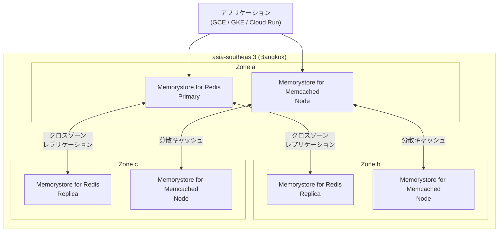

# Memorystore: asia-southeast3 (Bangkok) リージョンのサポート開始

**リリース日**: 2026-03-18

**サービス**: Memorystore for Memcached, Memorystore for Redis

**機能**: asia-southeast3 (Bangkok) リージョンでのインスタンスデプロイが可能に

**ステータス**: GA (一般提供)

[このアップデートのインフォグラフィックを見る](https://takech9203.github.io/google-cloud-news-summary/20260318-memorystore-asia-southeast3-bangkok.html)

## 概要

Google Cloud は Memorystore for Memcached および Memorystore for Redis のインスタンスを asia-southeast3 (Bangkok) リージョンにデプロイできるようになったことを発表しました。これにより、タイおよび東南アジア地域のユーザーは、より低レイテンシでインメモリキャッシュおよびデータストアサービスを利用できるようになります。

Memorystore は、Redis および Memcached プロトコルに対応したフルマネージドのインメモリデータストアサービスです。今回のリージョン拡張により、タイを拠点とする企業やタイ市場向けのアプリケーションを運用する組織は、データレジデンシー要件を満たしながら、高パフォーマンスなキャッシュインフラストラクチャを構築できます。

Bangkok リージョンには asia-southeast3-a、asia-southeast3-b、asia-southeast3-c の 3 つのゾーンが用意されており、高可用性構成でのデプロイが可能です。

**アップデート前の課題**

- タイのユーザーは Singapore (asia-southeast1) や Jakarta (asia-southeast2) など近隣リージョンの Memorystore を利用する必要があり、ネットワークレイテンシが発生していた
- タイ国内でのデータレジデンシー要件を満たすことが困難だった
- 東南アジア大陸部 (タイ、ベトナム、ミャンマーなど) からの最寄りの Memorystore リージョンまでの物理的距離が大きかった

**アップデート後の改善**

- Bangkok リージョンで直接 Memorystore インスタンスをデプロイでき、タイ国内のワークロードに対するレイテンシが大幅に削減された
- タイのデータレジデンシー要件に対応可能になった
- 3 つのゾーンを利用した高可用性構成が可能になり、東南アジア大陸部向けのサービス信頼性が向上した

## アーキテクチャ図



Bangkok リージョンの 3 つのゾーンにまたがる Memorystore for Redis (レプリケーション構成) と Memorystore for Memcached (分散キャッシュ構成) のデプロイアーキテクチャを示しています。

## サービスアップデートの詳細

### 主要機能

1. **Memorystore for Redis の Bangkok リージョン対応**
   - Basic Tier および Standard Tier の両方のインスタンスをデプロイ可能
   - Standard Tier ではクロスゾーンレプリケーションによる自動フェイルオーバーをサポート
   - リードレプリカの利用により読み取りスループットの向上が可能

2. **Memorystore for Memcached の Bangkok リージョン対応**
   - 分散キャッシュノードを Bangkok リージョン内にデプロイ可能
   - 複数ノード構成による水平スケーリングをサポート

3. **3 ゾーン構成による高可用性**
   - asia-southeast3-a、asia-southeast3-b、asia-southeast3-c の 3 ゾーンが利用可能
   - ゾーン間でのレプリケーションにより、単一ゾーン障害時のサービス継続性を確保

## 技術仕様

### Memorystore for Redis 仕様

| 項目 | 詳細 |
|------|------|
| リージョン | asia-southeast3 (Bangkok) |
| 利用可能ゾーン | asia-southeast3-a, asia-southeast3-b, asia-southeast3-c |
| サービスティア | Basic Tier / Standard Tier |
| 最大インスタンスサイズ | 300 GB |
| 最大ネットワーク帯域幅 | 16 Gbps |
| クロスゾーンレプリケーション | Standard Tier でサポート |
| 自動フェイルオーバー | Standard Tier でサポート |
| 転送中の暗号化 | サポート |

### Memorystore for Memcached 仕様

| 項目 | 詳細 |
|------|------|
| リージョン | asia-southeast3 (Bangkok) |
| 利用可能ゾーン | asia-southeast3-a, asia-southeast3-b, asia-southeast3-c |
| ノード構成 | vCPU + メモリの組み合わせ |
| スケーリング | ノード数による水平スケーリング |

## 設定方法

### 前提条件

1. Google Cloud プロジェクトが有効であること
2. Memorystore API が有効化されていること
3. 適切な IAM 権限 (roles/redis.admin または roles/memcache.admin) があること

### 手順

#### ステップ 1: Memorystore for Redis インスタンスの作成 (Bangkok リージョン)

```bash
gcloud redis instances create my-redis-instance \
    --size=1 \
    --region=asia-southeast3 \
    --zone=asia-southeast3-a \
    --tier=standard \
    --redis-version=redis_7_2
```

Bangkok リージョンに Standard Tier の Redis インスタンスを作成します。Standard Tier を選択することで、クロスゾーンレプリケーションと自動フェイルオーバーが有効になります。

#### ステップ 2: Memorystore for Memcached インスタンスの作成 (Bangkok リージョン)

```bash
gcloud memcache instances create my-memcached-instance \
    --region=asia-southeast3 \
    --node-count=3 \
    --node-cpu=1 \
    --node-memory=1024MB
```

Bangkok リージョンに 3 ノード構成の Memcached インスタンスを作成します。

## メリット

### ビジネス面

- **レイテンシの削減**: タイおよび東南アジア大陸部のエンドユーザーに対して、キャッシュアクセスのレイテンシが大幅に削減され、アプリケーションの応答速度が向上する
- **データレジデンシーの対応**: タイ国内にデータを保持する必要があるコンプライアンス要件に対応可能になる
- **コスト削減の可能性**: Committed Use Discounts (CUDs) を活用することで、1 年契約で 20%、3 年契約で 40% の割引が適用される

### 技術面

- **高可用性**: 3 ゾーン構成により、ゾーン障害時でもサービス継続が可能
- **低レイテンシアクセス**: 同一リージョン内の Compute Engine、GKE、Cloud Run からのアクセスにより、ネットワークレイテンシを最小化
- **フルマネージド運用**: パッチ適用、モニタリング、フェイルオーバーが自動化されており、運用負荷を軽減

## デメリット・制約事項

### 制限事項

- Memorystore for Redis の Committed Use Discounts (CUDs) は 5 GB 以上のインスタンスにのみ適用される (M1 容量ティアは対象外)
- リージョン間のレプリケーションは Memorystore for Redis 単体ではサポートされない

### 考慮すべき点

- 新しいリージョンのため、既存の asia-southeast1 (Singapore) や asia-southeast2 (Jakarta) からのマイグレーションにはデータ移行作業が必要
- リージョン固有の料金設定がある可能性があるため、料金ページで最新の価格を確認すること

## ユースケース

### ユースケース 1: タイ向け E コマースプラットフォームのセッション管理

**シナリオ**: タイ国内向けに EC サイトを運営しており、ユーザーセッションとショッピングカートデータをインメモリキャッシュで管理したい場合。

**実装例**:
```bash
gcloud redis instances create ecommerce-session-cache \
    --size=5 \
    --region=asia-southeast3 \
    --tier=standard \
    --redis-version=redis_7_2 \
    --transit-encryption-mode=SERVER_AUTHENTICATION
```

**効果**: Bangkok リージョンに Redis インスタンスを配置することで、タイ国内のユーザーに対するセッション読み取りレイテンシが数十ミリ秒から数ミリ秒に短縮される。

### ユースケース 2: 東南アジア向けモバイルアプリのコンテンツキャッシュ

**シナリオ**: タイ、ベトナム、ミャンマーなど東南アジア大陸部のユーザー向けモバイルアプリで、API レスポンスや頻繁にアクセスされるコンテンツをキャッシュしたい場合。

**効果**: Bangkok リージョンの Memorystore for Memcached を利用することで、東南アジア大陸部のユーザーへのコンテンツ配信速度が向上し、バックエンドデータベースへの負荷が軽減される。

## 料金

Memorystore の料金はリージョンやティアによって異なります。以下は参考価格です (最新の正確な料金は公式料金ページを参照してください)。

### Memorystore for Redis 料金参考

| 項目 | 詳細 |
|------|------|
| 課金単位 | プロビジョニング容量 (GB/時間) |
| Basic Tier (参考: us-central1) | $0.016/GB/時間 |
| Standard Tier (参考: us-central1) | $0.024/GB/時間 |
| CUD 1 年契約割引 | 20% |
| CUD 3 年契約割引 | 40% |

### Memorystore for Memcached 料金参考

| 項目 | 詳細 |
|------|------|
| メモリ課金 (参考: us-central1) | $0.000712/GB/時間 |
| vCPU 課金 (参考: us-central1) | $0.04/vCPU/時間 |
| CUD 1 年契約割引 | 20% |
| CUD 3 年契約割引 | 40% |

> **注**: 上記は参考値です。asia-southeast3 リージョンの正確な料金は [Memorystore for Redis 料金ページ](https://cloud.google.com/memorystore/docs/redis/pricing) および [Memorystore for Memcached 料金ページ](https://cloud.google.com/memorystore/docs/memcached/pricing) を参照してください。

## 利用可能リージョン

今回の追加により、Memorystore は東南アジアで以下の 3 リージョンで利用可能になりました。

| リージョン名 | ロケーション | ゾーン |
|-------------|------------|-------|
| asia-southeast1 | Singapore | asia-southeast1-a, -b, -c |
| asia-southeast2 | Jakarta | asia-southeast2-a, -b, -c |
| asia-southeast3 | **Bangkok (新規)** | asia-southeast3-a, -b, -c |

Memorystore for Redis および Memorystore for Memcached は、グローバルで 40 以上のリージョンで利用可能です。全リージョンの一覧は公式ドキュメントを参照してください。

## 関連サービス・機能

- **Memorystore for Valkey**: Memorystore ファミリーの新しいメンバーで、Valkey プロトコルに対応。asia-southeast3 でも利用可能
- **Memorystore for Redis Cluster**: 大規模ワークロード向けのクラスタ構成オプション
- **VPC ネットワーク**: Memorystore インスタンスは VPC ネットワーク内にデプロイされ、プライベート IP 経由でアクセス
- **Cloud Monitoring**: Memorystore のメトリクスを Cloud Monitoring で可視化し、パフォーマンスを監視可能

## 参考リンク

- [インフォグラフィック](https://takech9203.github.io/google-cloud-news-summary/20260318-memorystore-asia-southeast3-bangkok.html)
- [公式リリースノート](https://cloud.google.com/release-notes#March_18_2026)
- [Memorystore for Redis リージョン一覧](https://cloud.google.com/memorystore/docs/redis/regions)
- [Memorystore for Memcached リージョン一覧](https://cloud.google.com/memorystore/docs/memcached/regions)
- [Memorystore for Redis 料金](https://cloud.google.com/memorystore/docs/redis/pricing)
- [Memorystore for Memcached 料金](https://cloud.google.com/memorystore/docs/memcached/pricing)

## まとめ

Memorystore for Memcached および Memorystore for Redis の asia-southeast3 (Bangkok) リージョン対応は、タイおよび東南アジア大陸部でワークロードを展開する組織にとって重要なアップデートです。低レイテンシのインメモリキャッシュをタイ国内で利用できるようになることで、アプリケーションパフォーマンスの向上とデータレジデンシー要件への対応が同時に実現します。Bangkok リージョンでの Memorystore 利用を検討している場合は、まず小規模な検証インスタンスを作成し、既存のワークロードからの移行計画を策定することを推奨します。

---

**タグ**: #Memorystore #Redis #Memcached #asia-southeast3 #Bangkok #リージョン拡張 #インメモリキャッシュ #東南アジア
