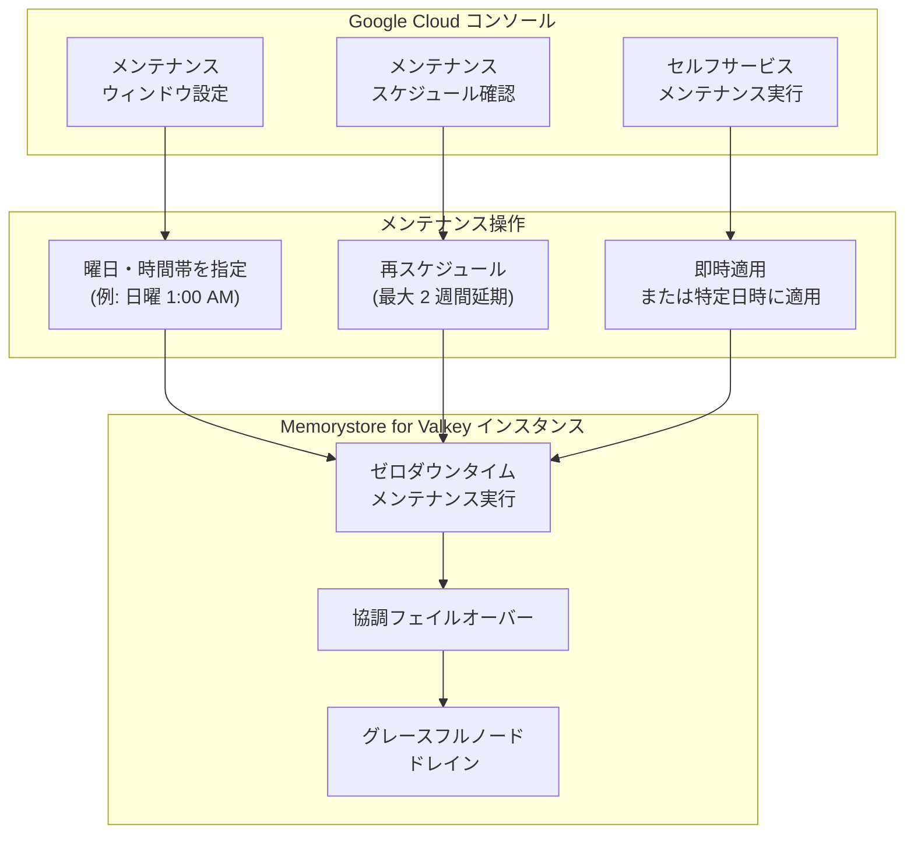

# Memorystore for Valkey: メンテナンスウィンドウとセルフサービスメンテナンスの Google Cloud コンソール対応 (GA)

**リリース日**: 2026-03-18

**サービス**: Memorystore for Valkey

**機能**: Maintenance windows and self-service maintenance via Google Cloud console

**ステータス**: GA (Generally Available)

[このアップデートのインフォグラフィックを見る](https://takech9203.github.io/google-cloud-news-summary/20260318-memorystore-valkey-maintenance-windows-ga.html)

## 概要

Memorystore for Valkey において、Google Cloud コンソールからメンテナンスウィンドウの検索・設定、およびセルフサービスメンテナンスの実行が可能になりました。これまで gcloud CLI を通じてのみ利用可能だったメンテナンス管理機能が、GUI ベースの操作で完結できるようになり、運用効率が大幅に向上します。

この機能は GA (Generally Available) としてリリースされ、本番環境での利用が推奨されます。メンテナンスウィンドウを設定することで、インスタンスのメンテナンスをトラフィックが少ない時間帯にスケジュールし、アプリケーションへの影響を最小限に抑えることができます。また、セルフサービスメンテナンスにより、次回のスケジュールメンテナンスを待たずに、セキュリティパッチや脆弱性対応を即座に適用することが可能です。

対象ユーザーは、Memorystore for Valkey を利用しているインフラエンジニア、SRE、データベース管理者です。特に、複数インスタンスのメンテナンス管理を効率化したいチームや、FedRAMP コンプライアンス要件に対応する必要がある組織にとって有用な機能です。

**アップデート前の課題**

- メンテナンスウィンドウの設定や確認は gcloud CLI でのみ可能であり、GUI での操作ができなかった
- スケジュールされたメンテナンスの確認にコマンドライン操作が必要で、運用担当者の学習コストが高かった
- セルフサービスメンテナンスの利用可能バージョン確認や適用も CLI ベースの操作に限られていた

**アップデート後の改善**

- Google Cloud コンソールからメンテナンスウィンドウの検索・設定・変更が可能になった
- スケジュールされたメンテナンスの確認や再スケジュールを GUI で直感的に操作できるようになった
- セルフサービスメンテナンスの利用可能バージョンの確認と適用がコンソール上で完結できるようになった

## アーキテクチャ図



Google Cloud コンソールからのメンテナンス管理操作がインスタンスに適用されるまでの全体フローを示しています。メンテナンスは create-before-destroy 方式により、ゼロダウンタイムで実行されます。

## サービスアップデートの詳細

### 主要機能

1. **メンテナンスウィンドウの設定と検索**
   - Google Cloud コンソールからインスタンスごとにメンテナンスの曜日と開始時刻を設定可能
   - スケジュールされたメンテナンスの開始時刻・終了時刻・期限を GUI で確認可能
   - メンテナンスウィンドウは 1 時間の枠で、曜日 (月曜日から日曜日) と開始時刻 (UTC 0-23 時) を指定

2. **メンテナンスの再スケジュール**
   - スケジュールされたメンテナンスを最大 2 週間延期可能
   - 即時実行 (IMMEDIATE) または特定日時への変更 (SPECIFIC_TIME) を選択可能
   - 一括再スケジュールの場合はバッチサイズを 100 インスタンス以下に制限することを推奨

3. **セルフサービスメンテナンス**
   - 利用可能なメンテナンスバージョンをコンソール上で確認可能
   - 次回のスケジュールメンテナンスを待たずに、新しいバージョンを即座に適用可能
   - FedRAMP コンプライアンスに必要な CVE パッチの迅速な適用に対応

4. **メンテナンス通知**
   - Google Cloud コンソールの Communication ページからメンテナンス通知をオンに設定可能
   - メンテナンス実施の少なくとも 1 週間前にメール通知を受信
   - 通知はプロジェクトレベルで設定し、各メールアドレスごとに個別にオプトインが必要

## 技術仕様

### メンテナンスウィンドウの設定

| 項目 | 詳細 |
|------|------|
| 曜日 | 月曜日から日曜日まで選択可能 |
| 開始時刻 | UTC 0-23 時から選択 |
| ウィンドウ時間 | 1 時間 (超過する場合あり) |
| デフォルト (平日) | 22:00 - 翌 6:00 (インスタンスのタイムゾーン) |
| デフォルト (週末) | 金曜 22:00 - 月曜 6:00 (インスタンスのタイムゾーン) |
| 再スケジュール猶予期間 | 最大 2 週間 |

### ゼロダウンタイムメンテナンスの仕組み

| 項目 | 詳細 |
|------|------|
| デプロイ方式 | Create-before-destroy ライフサイクル |
| フェイルオーバー | 協調フェイルオーバー (通常ミリ秒単位) |
| ノード除去 | グレースフルドレイン (数分間のドレイン期間) |
| 可用性 | HA 構成時、一度に 1 つのフォルトドメイン/ゾーンのみ更新 |
| エンドポイント | Private Service Connect エンドポイントはメンテナンスの影響を受けない |

### gcloud CLI での設定例

```bash
# インスタンス作成時にメンテナンスウィンドウを指定
gcloud memorystore instances create my-instance \
  --project=my-project \
  --location=us-central1 \
  --psc-auto-connections=network=projects/my-project/global/networks/default \
  --shard-count=8 \
  --maintenance-policy-weekly-window=day=SUNDAY,startTime=hours=1

# 既存インスタンスにメンテナンスウィンドウを設定
gcloud memorystore instances update my-instance \
  --project=my-project \
  --location=us-central1 \
  --maintenance-policy-weekly-window=day=SUNDAY,startTime=hours=1

# メンテナンスの再スケジュール (即時実行)
gcloud memorystore instances reschedule-maintenance my-instance \
  --project=my-project \
  --location=us-central1 \
  --reschedule-type=IMMEDIATE

# セルフサービスメンテナンスのバージョン確認
gcloud memorystore instances describe my-instance \
  --location=us-central1 \
  --project=my-project
```

## 設定方法

### 前提条件

1. Google Cloud プロジェクトで Memorystore for Valkey API が有効化されていること
2. インスタンスのメンテナンスウィンドウ管理に必要な IAM 権限が付与されていること
3. Memorystore for Valkey インスタンスが作成済みであること

### 手順

#### ステップ 1: メンテナンスウィンドウの設定

Google Cloud コンソールで Memorystore for Valkey のインスタンス詳細ページを開き、メンテナンスセクションからメンテナンスウィンドウの曜日と開始時刻を設定します。

```bash
# gcloud CLI で設定する場合
gcloud memorystore instances update my-instance \
  --project=my-project \
  --location=us-central1 \
  --maintenance-policy-weekly-window=day=SUNDAY,startTime=hours=1
```

トラフィックが最も少ない時間帯 (例: 日曜深夜) を選択することを推奨します。

#### ステップ 2: メンテナンス通知の有効化

Google Cloud コンソールの [Communication](https://console.cloud.google.com/user-preferences/communication) ページから、Memorystore のメール通知をオンに設定します。通知を受け取りたい各ユーザーが個別にオプトインする必要があります。

#### ステップ 3: セルフサービスメンテナンスの適用 (任意)

利用可能な新しいメンテナンスバージョンがある場合、コンソール上で確認して即座に適用できます。

```bash
# gcloud CLI でメンテナンスバージョンを更新する場合
gcloud memorystore instances update my-instance \
  --location=us-central1 \
  --project=my-project \
  --maintenance-version=MAINTENANCE_VERSION
```

## メリット

### ビジネス面

- **運用コスト削減**: GUI ベースの管理により、CLI スキルに依存せずにメンテナンス管理が可能になり、チーム全体の運用効率が向上
- **ダウンタイム最小化**: トラフィックの少ない時間帯にメンテナンスをスケジュールすることで、エンドユーザーへの影響を最小限に抑制
- **コンプライアンス対応**: セルフサービスメンテナンスにより、FedRAMP 等のコンプライアンス要件に対応した迅速な脆弱性パッチ適用が可能

### 技術面

- **ゼロダウンタイム**: Create-before-destroy 方式と協調フェイルオーバーにより、メンテナンス中もサービス継続が可能
- **柔軟なスケジューリング**: 曜日・時間帯の指定に加え、最大 2 週間の延期が可能で、本番環境の運用スケジュールに合わせた調整が容易
- **段階的デプロイ**: メンテナンスはフリート全体で段階的にロールアウトされ、問題の早期検出と影響範囲の最小化を実現

## デメリット・制約事項

### 制限事項

- メンテナンスウィンドウは 1 時間だが、メンテナンスがウィンドウ内に完了しない場合がある
- メンテナンスのオプトアウトや、インスタンス間のメンテナンス順序の制御はできない
- 複数インスタンスの一括再スケジュール機能は提供されていない (プログラマティックなバッチ処理は可能)
- メンテナンス通知のメールは Google アカウントに紐づくアドレスにのみ送信され、カスタムエイリアス (チームメールなど) への配信は不可

### 考慮すべき点

- メンテナンス通知はメンテナンスウィンドウが設定されているインスタンスに対してのみ送信される
- 再スケジュールの猶予は元のスケジュールから最大 2 週間であり、無期限の延期はできない
- インフライトデータの量やインスタンスサイズによって、フェイルオーバーのレイテンシが増加する可能性がある

## ユースケース

### ユースケース 1: EC サイトのキャッシュ基盤メンテナンス管理

**シナリオ**: EC サイトでセッション管理やカート情報のキャッシュに Memorystore for Valkey を使用している運用チームが、売上への影響を最小限にメンテナンスを管理したい。

**実装例**:
```bash
# 日曜深夜 1:00 (UTC) にメンテナンスウィンドウを設定
gcloud memorystore instances update cart-cache-instance \
  --project=ecommerce-prod \
  --location=asia-northeast1 \
  --maintenance-policy-weekly-window=day=SUNDAY,startTime=hours=16
```

**効果**: 日本時間の月曜早朝 (UTC 日曜 16:00 = JST 月曜 1:00) にメンテナンスがスケジュールされ、ピーク時間帯のサービス影響を回避。セールイベント前に再スケジュールで延期することも可能。

### ユースケース 2: セキュリティパッチの迅速適用

**シナリオ**: FedRAMP 対応が必要な金融系サービスで、CVE パッチが公開された際にスケジュールメンテナンスを待たずに即座に適用したい。

**効果**: セルフサービスメンテナンスにより、まずテスト環境のインスタンスに新しいバージョンを適用して影響を確認し、問題がなければ本番環境にも即時適用できる。コンプライアンス監査への対応期間を短縮可能。

## 料金

メンテナンスウィンドウの設定およびセルフサービスメンテナンスの利用に追加料金は発生しません。Memorystore for Valkey の料金はインスタンスのノード数、ノードタイプ、リージョンに基づいて課金されます。

### 料金例 (us-central1 リージョン)

| 構成 | 月額料金 (概算) |
|------|-----------------|
| highmem-medium / 3 シャード / レプリカなし (3 ノード) | 約 $337 |
| highmem-medium / 10 シャード / 2 レプリカ (30 ノード) | 約 $3,370 |

確定使用割引 (CUD) を利用すると、1 年契約で 20%、3 年契約で 40% の割引が適用されます。

## 利用可能リージョン

Memorystore for Valkey がサポートする全リージョンでメンテナンスウィンドウとセルフサービスメンテナンスを利用可能です。主要リージョンには asia-northeast1 (東京)、asia-northeast2 (大阪)、us-central1、us-east1、europe-west1 などが含まれます。

## 関連サービス・機能

- **Memorystore for Redis Cluster**: 同様のメンテナンスウィンドウ機能とセルフサービスメンテナンスを提供
- **Memorystore for Redis**: Standard Tier ではフェイルオーバー方式、Basic Tier では短時間のサービス中断を伴うメンテナンスを提供
- **Cloud Monitoring**: メンテナンス前後のインスタンスのパフォーマンスメトリクスを監視
- **Private Service Connect**: メンテナンス中も影響を受けないインスタンスエンドポイントを提供

## 参考リンク

- [インフォグラフィック](https://takech9203.github.io/google-cloud-news-summary/20260318-memorystore-valkey-maintenance-windows-ga.html)
- [公式リリースノート](https://cloud.google.com/release-notes#March_18_2026)
- [メンテナンスウィンドウの検索と設定](https://cloud.google.com/memorystore/docs/valkey/find-and-set-maintenance-windows)
- [メンテナンスについて](https://cloud.google.com/memorystore/docs/valkey/about-maintenance)
- [セルフサービスメンテナンス](https://cloud.google.com/memorystore/docs/valkey/self-service-maintenance)
- [料金ページ](https://cloud.google.com/memorystore/valkey/pricing)

## まとめ

Memorystore for Valkey のメンテナンスウィンドウとセルフサービスメンテナンスが Google Cloud コンソールから管理可能になったことで、GUI ベースでの直感的なメンテナンス管理が実現しました。本番環境を運用するチームは、メンテナンスウィンドウをトラフィックの少ない時間帯に設定し、メンテナンス通知を有効化することを推奨します。セキュリティパッチの迅速な適用が求められる環境では、セルフサービスメンテナンスの活用を検討してください。

---

**タグ**: #Memorystore #Valkey #Maintenance #GA #GoogleCloudConsole #ZeroDowntime #SelfServiceMaintenance
