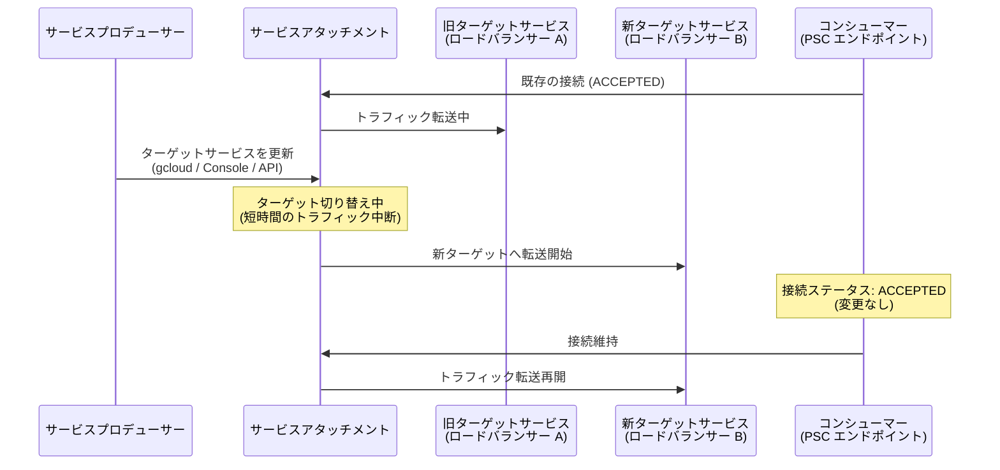

# Virtual Private Cloud: サービスアタッチメントのターゲットサービス更新機能

**リリース日**: 2026-03-18

**サービス**: Virtual Private Cloud

**機能**: サービスアタッチメントのターゲットサービスをインプレース更新

**ステータス**: GA (一般提供)

[このアップデートのインフォグラフィックを見る](https://takech9203.github.io/google-cloud-news-summary/20260318-vpc-service-attachment-target-update.html)

## 概要

Google Cloud は、Private Service Connect のサービスアタッチメントにおけるターゲットサービスのインプレース更新機能を一般提供 (GA) として発表しました。これにより、サービスプロデューサーはサービスアタッチメントを再作成することなく、ターゲットサービスを別のサービスに変更できるようになります。

この機能は、マルチテナント環境でサービスを提供するプロデューサーや、ロードバランサーの移行・アップグレードを行う運用チームにとって重要なアップデートです。更新中にトラフィックが一時的に中断されますが、コンシューマーの接続は維持されるため、サービスの継続性を確保しながらインフラストラクチャの変更が可能になります。

**アップデート前の課題**

- ターゲットサービスを変更するにはサービスアタッチメントの削除と再作成が必要だった
- サービスアタッチメントを再作成するとコンシューマーの接続が切断され、再接続の手動調整が必要だった
- ロードバランサーの種類変更やバックエンドの移行時にダウンタイムが長期化するリスクがあった

**アップデート後の改善**

- サービスアタッチメントを再作成せずにターゲットサービスを直接更新できるようになった
- コンシューマーの接続ステータスが維持され、再接続の手動調整が不要になった
- トラフィックの中断が短時間に限定され、サービスの可用性が向上した

## アーキテクチャ図



サービスプロデューサーがターゲットサービスを更新すると、サービスアタッチメントは新しいターゲットへの切り替えを行います。この間トラフィックは短時間中断されますが、コンシューマーの接続ステータスは ACCEPTED のまま維持されます。

## サービスアップデートの詳細

### 主要機能

1. **ターゲットサービスのインプレース更新**
   - サービスアタッチメントの削除・再作成なしでターゲットサービスを変更可能
   - Google Cloud コンソール、gcloud CLI、REST API の全てのインターフェースから操作可能
   - 内部プロトコル転送ターゲットへの変更またはそこからの変更には gcloud CLI または API の使用が必要

2. **コンシューマー接続の維持**
   - 更新時にコンシューマーの接続ステータスは変更されない
   - コンシューマーへの自動通知は行われないが、接続は保持される
   - 必要に応じてダウンタイムをコンシューマーに通知する手順も用意されている

3. **ダウンタイム通知オプション**
   - 接続再調整 (connection reconciliation) を有効化し、コンシューマーを拒否リストに追加することでダウンタイムを明示的に通知可能
   - テスト用 VPC ネットワークとインスタンスを作成して接続復旧を検証するオプションも提供

## 技術仕様

### サポートされる構成

| 項目 | 詳細 |
|------|------|
| 対応ターゲットサービス | 内部パススルー Network Load Balancer、リージョン内部 Application Load Balancer、クロスリージョン内部 Application Load Balancer、内部プロトコル転送、リージョン内部プロキシ Network Load Balancer、Secure Web Proxy |
| 操作方法 | Google Cloud コンソール、gcloud CLI、REST API |
| トラフィック中断 | 短時間の中断あり |
| 接続ステータスへの影響 | なし (ACCEPTED のまま維持) |

### gcloud CLI による更新

```bash
gcloud compute service-attachments update ATTACHMENT_NAME \
  --region=REGION \
  --target-service=projects/PROJECT_ID/regions/RULE_REGION/forwardingRules/RULE_NAME
```

### REST API による更新

```bash
# 1. フィンガープリントの取得
GET https://compute.googleapis.com/compute/v1/projects/PROJECT_ID/regions/REGION/serviceAttachments/ATTACHMENT_NAME

# 2. ターゲットサービスの更新 (PATCH)
PATCH https://compute.googleapis.com/compute/v1/projects/PROJECT_ID/regions/REGION/serviceAttachments/ATTACHMENT_NAME
```

```json
{
  "targetService": "projects/PROJECT_ID/regions/RULE_REGION/forwardingRules/RULE_NAME",
  "fingerprint": "FINGERPRINT"
}
```

## 設定方法

### 前提条件

1. 既存のサービスアタッチメントが作成済みであること
2. 新しいターゲットサービス (ロードバランサーまたは Secure Web Proxy) が作成済みであること
3. サービスアタッチメントに対する `compute.serviceAttachments.update` 権限を持っていること

### 手順

#### ステップ 1: (任意) ダウンタイムをコンシューマーに通知

```bash
# 接続再調整が有効であることを確認
gcloud compute service-attachments describe ATTACHMENT_NAME \
  --region=REGION

# コンシューマーを拒否リストに追加してダウンタイムを通知
gcloud compute service-attachments update ATTACHMENT_NAME \
  --region=REGION \
  --consumer-reject-list=CONSUMER_PROJECT_1,CONSUMER_PROJECT_2
```

コンシューマーの接続ステータスが REJECTED に変更され、サービスが一時的に利用不可であることが明示されます。

#### ステップ 2: ターゲットサービスを更新

```bash
gcloud compute service-attachments update ATTACHMENT_NAME \
  --region=REGION \
  --target-service=projects/PROJECT_ID/regions/RULE_REGION/forwardingRules/NEW_RULE_NAME
```

サービスアタッチメントのターゲットが新しいサービスに切り替わります。

#### ステップ 3: 接続の復旧を確認しアクセスを復元

```bash
# (任意) コンシューマーを拒否リストから削除
gcloud compute service-attachments update ATTACHMENT_NAME \
  --region=REGION \
  --consumer-reject-list=
```

コンシューマーの接続ステータスが ACCEPTED に戻り、サービスが再び利用可能になります。

## メリット

### ビジネス面

- **ダウンタイムの最小化**: サービスアタッチメントの再作成が不要になり、サービス中断時間が大幅に短縮される
- **運用コストの削減**: コンシューマーとの再接続調整が不要になり、運用負荷が軽減される

### 技術面

- **接続の継続性**: コンシューマーの接続ステータスが維持されるため、エンドポイントの再作成や再構成が不要
- **柔軟なインフラ管理**: ロードバランサーの種類変更やバックエンドの移行を、コンシューマーに影響を与えずに実施可能
- **段階的な移行サポート**: ダウンタイム通知オプションやテストコンシューマーの準備手順が提供されており、安全な移行を支援

## デメリット・制約事項

### 制限事項

- トラフィックが短時間中断されるため、完全にゼロダウンタイムではない
- コンシューマーにはサービスの中断が自動的に通知されないため、必要に応じて手動での通知が必要
- サポートされる構成の組み合わせに制限がある (詳細は公式ドキュメントの「Service mutability」を参照)

### 考慮すべき点

- 内部プロトコル転送ターゲットへの変更またはそこからの変更は、Google Cloud コンソールではサポートされず、gcloud CLI または API を使用する必要がある
- Terraform を使用している場合、Google プロバイダーのバージョンによっては意図しないサービスアタッチメントの再作成が発生する可能性がある (バージョン 4.82.0 以降への更新を推奨)
- 更新前にフィンガープリントを取得する必要がある (API 使用時)

## ユースケース

### ユースケース 1: ロードバランサーの種類変更

**シナリオ**: サービスプロデューサーが、内部パススルー Network Load Balancer からリージョン内部 Application Load Balancer への移行を計画している。L7 レベルのルーティングや SSL 終端機能が必要になったため、ロードバランサーの種類を変更する必要がある。

**実装例**:
```bash
# 新しい Application Load Balancer のフォワーディングルールを作成済みと仮定
gcloud compute service-attachments update my-service-attachment \
  --region=us-central1 \
  --target-service=projects/my-project/regions/us-central1/forwardingRules/new-alb-rule
```

**効果**: コンシューマーのエンドポイントを再作成することなく、バックエンドのロードバランサーを L4 から L7 に移行できる。

### ユースケース 2: マルチテナントサービスのバージョンアップ

**シナリオ**: SaaS プロバイダーが複数のテナント (コンシューマー) にサービスを提供しており、バックエンドサービスの新バージョンをデプロイする必要がある。新バージョンは新しいロードバランサーの背後にデプロイされている。

**効果**: 各テナントの Private Service Connect エンドポイントを維持したまま、バックエンドサービスを新バージョンに切り替えることが可能。テナント側での設定変更が不要。

## 関連サービス・機能

- **Private Service Connect**: サービスアタッチメントを通じてプロデューサーとコンシューマーの VPC ネットワーク間でプライベート接続を提供するフレームワーク
- **Cloud Load Balancing**: サービスアタッチメントのターゲットとなるロードバランサーを提供
- **VPC Service Controls**: Private Service Connect と組み合わせてデータ流出防止を実現
- **Network Connectivity Center**: 伝播接続 (propagated connections) を通じて、複数の VPC スポーク間で Private Service Connect サービスへのアクセスを共有

## 参考リンク

- [インフォグラフィック](https://takech9203.github.io/google-cloud-news-summary/20260318-vpc-service-attachment-target-update.html)
- [公式リリースノート](https://cloud.google.com/release-notes#March_18_2026)
- [サービスアタッチメントの管理ドキュメント](https://cloud.google.com/vpc/docs/manage-private-service-connect-services)
- [Private Service Connect の概要](https://cloud.google.com/vpc/docs/private-service-connect)
- [Service mutability (サポートされる構成)](https://cloud.google.com/vpc/docs/about-vpc-hosted-services#service-mutability)

## まとめ

今回の GA リリースにより、Private Service Connect のサービスアタッチメントのターゲットサービスを再作成なしで更新できるようになりました。マルチテナント環境でのサービス運用やロードバランサーの移行を行うプロデューサーは、この機能を活用することでダウンタイムを最小化し、コンシューマーへの影響を抑えたインフラストラクチャ変更が可能です。既存のサービスアタッチメントを運用している場合は、公式ドキュメントの「Service mutability」セクションでサポートされる構成を確認した上で、移行計画に組み込むことを推奨します。

---

**タグ**: #VirtualPrivateCloud #PrivateServiceConnect #ServiceAttachment #Networking #GA
