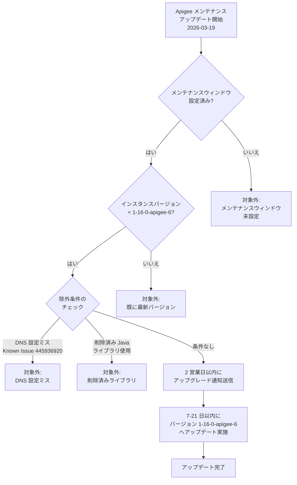

# Apigee X: メンテナンスアップデート (バージョン 1-16-0-apigee-6)

**リリース日**: 2026-03-19

**サービス**: Apigee X

**機能**: メンテナンスウィンドウ設定済みインスタンスの自動アップデート

**ステータス**: Announcement

[このアップデートのインフォグラフィックを見る](https://takech9203.github.io/google-cloud-news-summary/20260319-apigee-x-maintenance-update.html)

## 概要

2026 年 3 月 19 日より、Google Cloud はメンテナンスウィンドウが設定された Apigee X インスタンスに対するメンテナンスアップデートを開始しました。現在のインスタンスバージョンが `1-16-0-apigee-6` 未満のインスタンスが対象となり、今後 7 日から 21 日以内にバージョン `1-16-0-apigee-6` へアップデートされます。

アップグレードの予定日を含む通知は、今後 2 営業日以内に送信されます。これにより、ユーザーは事前にアップデートスケジュールを把握し、必要な準備を行うことができます。

なお、以下の 2 つの条件のいずれかに該当するインスタンスはアップデートの対象外となります。DNS の設定ミスが存在するインスタンス (Known Issue 445936920)、および 2025 年 10 月 16 日のリリースノートで案内された削除済み Apigee Java ライブラリを使用しているインスタンスです。

**アップデート前の課題**

- メンテナンスウィンドウが設定されたインスタンスのうち、`1-16-0-apigee-6` 未満のバージョンで稼働しているものがあり、最新のセキュリティパッチや機能改善が適用されていなかった
- 古いバージョンのインスタンスでは、新機能やパフォーマンス改善の恩恵を受けられなかった
- セキュリティ脆弱性への対応が未適用のインスタンスが存在していた

**アップデート後の改善**

- 対象インスタンスがバージョン `1-16-0-apigee-6` に統一され、最新のセキュリティパッチが適用される
- メンテナンスウィンドウの設定に従い、ユーザーが指定した時間帯にアップデートが実施される
- 2 営業日以内にアップグレード予定日の通知が送信され、事前準備が可能になる

## アーキテクチャ図



この図は、今回のメンテナンスアップデートにおけるインスタンスの判定フローを示しています。メンテナンスウィンドウの設定有無、バージョン確認、除外条件のチェックを経て、対象インスタンスにアップデートが適用されます。

## サービスアップデートの詳細

### 主要ポイント

1. **対象バージョンと更新先**
   - 現在のバージョンが `1-16-0-apigee-6` 未満のインスタンスが対象
   - アップデート後のバージョンは `1-16-0-apigee-6`
   - メンテナンスウィンドウが設定されているインスタンスのみが対象

2. **アップデートスケジュール**
   - 2026 年 3 月 19 日よりアップデートプロセスが開始
   - 各インスタンスのアップデートは 7 日から 21 日以内に実施
   - アップグレード予定日を含む通知が 2 営業日以内に送信される

3. **除外条件**
   - DNS 設定ミスが存在するインスタンス (Known Issue 445936920 に記載)
   - 2025 年 10 月 16 日のリリースノートで案内された削除済み Apigee Java ライブラリを使用しているインスタンス

## 技術仕様

### アップデート対象と条件

| 項目 | 詳細 |
|------|------|
| 対象サービス | Apigee X |
| 更新先バージョン | `1-16-0-apigee-6` |
| 対象条件 | メンテナンスウィンドウ設定済み かつ バージョンが `1-16-0-apigee-6` 未満 |
| アップデート期間 | 7 - 21 日以内 |
| 通知タイミング | 2 営業日以内 |
| 除外条件 1 | DNS 設定ミス (Known Issue 445936920) |
| 除外条件 2 | 削除済み Apigee Java ライブラリの使用 (2025-10-16 リリースノート参照) |

### メンテナンスウィンドウの確認方法

```bash
AUTH="Authorization: Bearer $(gcloud auth print-access-token)"
curl -H "$AUTH" \
  "https://apigee.googleapis.com/v1/organizations/ORGANIZATION_ID/instances/INSTANCE_ID"
```

上記コマンドを実行すると、`maintenanceUpdatePolicy` フィールドと `scheduledMaintenance` フィールドで現在のメンテナンス設定とスケジュールを確認できます。

## 設定方法

### 前提条件

1. Apigee Organization Admin ロール (`roles/apigee.admin`) または `apigee.instances.update` 権限を含むロールが付与されていること
2. `gcloud` CLI がインストールされ、認証済みであること

### 手順

#### ステップ 1: 現在のインスタンスバージョンとメンテナンス設定を確認

```bash
AUTH="Authorization: Bearer $(gcloud auth print-access-token)"
curl -H "$AUTH" \
  "https://apigee.googleapis.com/v1/organizations/ORGANIZATION_ID/instances/INSTANCE_ID"
```

レスポンスの `scheduledMaintenance` フィールドにアップデート予定が表示されます。

#### ステップ 2: メンテナンスウィンドウの設定 (未設定の場合)

```bash
AUTH="Authorization: Bearer $(gcloud auth print-access-token)"
curl -X PATCH \
  -H "$AUTH" \
  -H "Content-Type: application/json" \
  -d '{
    "maintenanceUpdatePolicy": {
      "maintenanceWindows": [
        {
          "day": "SUNDAY",
          "startTime": {
            "hours": 23
          }
        }
      ],
      "maintenanceChannel": "WEEK1"
    }
  }' \
  "https://apigee.googleapis.com/v1/organizations/ORGANIZATION_ID/instances/INSTANCE_ID?updateMask=maintenanceUpdatePolicy.maintenanceWindows,maintenanceUpdatePolicy.maintenanceChannel"
```

`day` と `startTime` はトラフィックが最も少ない時間帯に設定することが推奨されます。時刻は UTC で指定します。

#### ステップ 3: メンテナンス通知のオプトイン

1. Google Cloud コンソールの [ユーザー設定 > コミュニケーション](https://console.cloud.google.com/user-preferences/communication) ページに移動
2. Apigee の「Maintenance window」行で、メールの設定を「オン」に切り替え

通知を受信する必要がある各ユーザーが個別にオプトインする必要があります。

## メリット

### ビジネス面

- **計画的なアップデート**: メンテナンスウィンドウに従った更新により、ビジネスへの影響を最小限に抑制できる
- **事前通知による準備時間の確保**: 2 営業日以内に通知が届くため、関係者への周知やテスト計画の策定が可能

### 技術面

- **セキュリティ強化**: 最新のセキュリティパッチが適用され、脆弱性リスクが低減される
- **バージョンの統一**: インスタンス間のバージョン差異が解消され、運用管理が容易になる
- **新機能の利用**: バージョン `1-16-0-apigee-6` で提供される新機能やパフォーマンス改善が利用可能になる

## デメリット・制約事項

### 制限事項

- メンテナンス中は、新しいインスタンスの作成、環境のアタッチ、エンドポイントアタッチメントの作成、一部のスケーリング操作が実行できない
- メンテナンスの所要時間はインスタンスの構成によって異なり、通常数時間かかる
- DNS 設定ミス (Known Issue 445936920) に該当するインスタンスは今回のアップデート対象外となるため、別途対応が必要

### 考慮すべき点

- 削除済み Apigee Java ライブラリを使用しているインスタンスは、ライブラリの移行を完了するまでアップデートが適用されない
- メンテナンスウィンドウの設定を変更しても、既にスケジュールされたメンテナンスには反映されず、次回以降のメンテナンスから適用される
- Apigee はメンテナンスウィンドウを尊重するよう最善を尽くすが、互換性やセキュリティ上の理由から設定外の時間帯に更新される場合がある

## ユースケース

### ユースケース 1: 本番環境の段階的アップデート

**シナリオ**: 複数の Apigee X インスタンスを本番環境と開発環境で運用している企業が、リスクを最小限に抑えながらアップデートを適用したい場合。

**実装例**:
- 開発環境のインスタンス: メンテナンスウィンドウを設定しない (最初にアップデートが適用される)
- ステージング環境: Week 1 に設定
- 本番環境: Week 2 に設定

**効果**: 開発環境で先行してアップデートを検証し、問題がないことを確認してから本番環境に適用できる。

### ユースケース 2: トラフィック低下時間帯でのアップデート

**シナリオ**: EC サイトの API 基盤として Apigee X を使用しており、日曜深夜がトラフィック最小時間帯の場合。

**効果**: メンテナンスウィンドウを日曜日の深夜 (UTC) に設定することで、ユーザーへの影響を最小限に抑えたアップデートが実現できる。

## 関連サービス・機能

- **Apigee hybrid**: 今回のメンテナンスアップデートは Apigee X のみが対象であり、Apigee hybrid には適用されない
- **Cloud Monitoring**: Apigee インスタンスのヘルスチェックやメンテナンス状況の監視に活用可能
- **Cloud Logging**: メンテナンス前後の API トラフィックやエラーログの確認に利用

## 参考リンク

- [インフォグラフィック](https://takech9203.github.io/google-cloud-news-summary/20260319-apigee-x-maintenance-update.html)
- [公式リリースノート](https://cloud.google.com/release-notes#March_19_2026)
- [Apigee メンテナンス概要](https://cloud.google.com/apigee/docs/api-platform/system-administration/maintenance)
- [Apigee メンテナンスウィンドウの管理](https://cloud.google.com/apigee/docs/api-platform/system-administration/maintenance-windows)

## まとめ

今回のアップデートにより、メンテナンスウィンドウが設定された Apigee X インスタンスがバージョン `1-16-0-apigee-6` に統一され、最新のセキュリティパッチやパフォーマンス改善が適用されます。対象となるユーザーは、2 営業日以内に届く通知でアップグレード予定日を確認し、除外条件 (DNS 設定ミス、削除済み Java ライブラリの使用) に該当しないか事前に確認することを推奨します。

---

**タグ**: #Apigee #ApigeeX #メンテナンス #セキュリティアップデート #API管理
