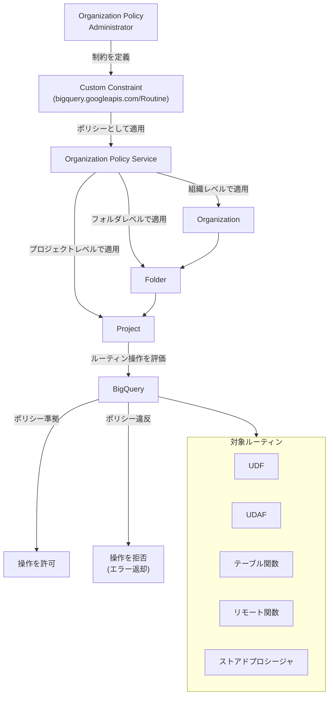

# BigQuery: ルーティンに対するカスタム組織ポリシーのサポート

**リリース日**: 2026-03-19

**サービス**: BigQuery

**機能**: ルーティン (Routines) に対するカスタム組織ポリシー制約

**ステータス**: Preview

[このアップデートのインフォグラフィックを見る](https://takech9203.github.io/google-cloud-news-summary/20260319-bigquery-custom-org-policy-routines.html)

## 概要

BigQuery において、ルーティン (Routines) リソースに対するカスタム組織ポリシーが新たにサポートされた。Organization Policy Service のカスタム制約を使用して、ルーティンに対する特定の操作を許可または拒否できるようになる。この機能は現在 Preview 段階である。

BigQuery のルーティンとは、ユーザー定義関数 (UDF)、ユーザー定義集約関数 (UDAF)、テーブル関数、リモート関数、ストアドプロシージャの総称である。今回のアップデートにより、組織のセキュリティチームやガバナンスチームは、これらのルーティンの作成や更新に対して組織全体で統一的なポリシーを適用できるようになった。

これまで BigQuery のカスタム組織ポリシーは Dataset や Data Transfer Service の TransferConfig など限られたリソースタイプのみをサポートしていたが、今回の拡張により Routine リソースタイプが追加され、より包括的なガバナンスが実現可能となった。

**アップデート前の課題**

- ルーティンの作成や更新を組織ポリシーレベルで制御する手段がなく、IAM ロールによるアクセス制御のみに依存していた
- 組織全体でルーティンの命名規則やプロパティを統一的に強制する仕組みがなかった
- リモート関数やストアドプロシージャなど、外部サービスと連携するルーティンの作成を組織レベルで制限できなかった

**アップデート後の改善**

- カスタム組織ポリシーにより、ルーティンの作成・更新操作を CEL 条件式で柔軟に制御できるようになった
- 組織、フォルダ、プロジェクトの各レベルでルーティンに対するポリシーを階層的に適用可能になった
- IAM によるアクセス制御と組織ポリシーによるガバナンスを組み合わせた多層防御が可能になった

## アーキテクチャ図



Organization Policy Service を通じて、組織の階層構造に沿ってカスタム制約がルーティン操作に適用される流れを示す。ポリシーに違反する操作はエラーとして拒否される。

## サービスアップデートの詳細

### 主要機能

1. **ルーティンリソースに対するカスタム制約**
   - `bigquery.googleapis.com/Routine` リソースタイプに対してカスタム制約を定義可能
   - CEL (Common Expression Language) を使用して条件式を記述
   - ALLOW (許可) または DENY (拒否) のアクションを設定

2. **対象操作の制御**
   - CREATE メソッド: ルーティンの新規作成を制御
   - UPDATE メソッド: 既存ルーティンの更新を制御
   - CREATE と UPDATE の両方、または片方のみを指定可能

3. **階層的ポリシー継承**
   - 組織レベルで設定したポリシーはフォルダおよびプロジェクトに自動継承
   - フォルダレベルのポリシーは配下のプロジェクトに継承
   - 階層評価ルールにより継承の無効化も可能

## 技術仕様

### カスタム制約の構成要素

| 項目 | 詳細 |
|------|------|
| リソースタイプ | `bigquery.googleapis.com/Routine` |
| サポートメソッド | CREATE, UPDATE |
| 条件式言語 | CEL (Common Expression Language) |
| アクションタイプ | ALLOW, DENY |
| 制約名の最大長 | 70 文字 |
| 条件式の最大長 | 1000 文字 |
| 説明の最大長 | 2000 文字 |

### 必要な IAM ロール

| ロール | 用途 |
|------|------|
| `roles/orgpolicy.policyAdmin` | 組織ポリシーの管理 (組織リソースに付与) |
| `roles/bigquery.admin` | BigQuery ルーティンの作成・更新 |

### 制約定義の YAML 形式

```yaml
name: organizations/ORGANIZATION_ID/customConstraints/custom.restrictRoutineCreation
resourceTypes:
  - bigquery.googleapis.com/Routine
methodTypes:
  - CREATE
  - UPDATE
condition: "CEL_CONDITION"
actionType: DENY
displayName: Restrict routine creation
description: Custom constraint to restrict BigQuery routine operations.
```

## 設定方法

### 前提条件

1. Google Cloud 組織が設定されていること
2. 組織 ID を把握していること
3. Organization Policy Administrator ロール (`roles/orgpolicy.policyAdmin`) が付与されていること

### 手順

#### ステップ 1: カスタム制約の YAML ファイルを作成

```yaml
# constraint-restrict-routine.yaml
name: organizations/ORGANIZATION_ID/customConstraints/custom.restrictRoutineCreation
resourceTypes:
  - bigquery.googleapis.com/Routine
methodTypes:
  - CREATE
condition: "resource.routineType == 'SCALAR_FUNCTION'"
actionType: DENY
displayName: Restrict scalar function creation
description: Deny creating scalar UDFs in BigQuery to enforce usage of approved routines only.
```

`ORGANIZATION_ID` を実際の組織 ID に置き換える。

#### ステップ 2: カスタム制約を適用

```bash
gcloud org-policies set-custom-constraint ~/constraint-restrict-routine.yaml
```

#### ステップ 3: 制約の存在を確認

```bash
gcloud org-policies list-custom-constraints --organization=ORGANIZATION_ID
```

#### ステップ 4: 組織ポリシーを作成して適用

```yaml
# policy-restrict-routine.yaml
name: projects/PROJECT_ID/policies/custom.restrictRoutineCreation
spec:
  rules:
    - enforce: true
```

```bash
gcloud org-policies set-policy ~/policy-restrict-routine.yaml
```

ポリシー適用後、約 2 分で Google Cloud がポリシーの適用を開始する。

## メリット

### ビジネス面

- **コンプライアンス強化**: 規制要件に沿ったルーティン管理ポリシーを組織全体に強制でき、監査対応が容易になる
- **ガバナンスの一元化**: 組織、フォルダ、プロジェクトの階層構造を活用し、部門ごとのポリシーを効率的に管理できる

### 技術面

- **多層防御の実現**: IAM によるアクセス制御に加え、組織ポリシーによるリソースレベルの制御で、セキュリティの多層化が可能
- **柔軟な条件定義**: CEL を使用して、ルーティンのプロパティに基づく細かな条件を定義できる
- **自動継承**: 上位レベルで定義したポリシーが下位に自動継承されるため、設定漏れを防止できる

## デメリット・制約事項

### 制限事項

- Preview 段階であり、本番環境での利用は「Pre-GA Offerings Terms」が適用される
- Preview 機能はサポートが限定的であり、変更される可能性がある
- BigQuery の監査ログにおいて、カスタム制約によるアクセス拒否時に PolicyViolationInfo が公開されない (エラーメッセージに constraintId が含まれる)
- ポリシー変更は既存のリソースに対して遡及的に適用されない

### 考慮すべき点

- 既存のルーティンはポリシー適用前に作成されたものであるため、新規の作成・更新操作のみが制御対象となる
- ポリシーの適用には最大約 2 分のラグがある
- 過度に厳格なポリシーを設定すると、開発者の生産性に影響を与える可能性がある
- カスタム制約は組織ごとにリソースタイプあたり最大 20 個まで作成可能

## ユースケース

### ユースケース 1: リモート関数の作成制限

**シナリオ**: セキュリティチームが、外部サービスと連携するリモート関数の作成を本番環境のプロジェクトで制限したい。

**実装例**:
```yaml
name: organizations/123456789/customConstraints/custom.denyRemoteFunctions
resourceTypes:
  - bigquery.googleapis.com/Routine
methodTypes:
  - CREATE
condition: "resource.routineType == 'SCALAR_FUNCTION' && resource.remoteFunctionOptions != null"
actionType: DENY
displayName: Deny remote function creation
description: Prevent creating remote functions that connect to external services.
```

**効果**: 本番環境での予期しない外部連携を防止し、データ流出リスクを低減できる。

### ユースケース 2: ルーティン管理の標準化

**シナリオ**: データガバナンスチームが、組織全体でルーティンの作成を特定のプロジェクトまたは命名規則に準拠させたい。

**効果**: ルーティンの乱立を防止し、承認されたルーティンのみが利用される環境を構築できる。管理対象のルーティンが明確になり、メンテナンスコストが削減される。

## 料金

Organization Policy Service 自体の追加料金は発生しない。BigQuery のルーティンに関する料金は、通常の BigQuery 料金体系に準じる。

詳細は [BigQuery 料金ページ](https://cloud.google.com/bigquery/pricing) を参照。

## 利用可能リージョン

Organization Policy Service はグローバルサービスであり、BigQuery が利用可能なすべてのリージョンで使用可能である。詳細は [BigQuery のロケーションに関するドキュメント](https://cloud.google.com/bigquery/docs/locations) を参照。

## 関連サービス・機能

- **Organization Policy Service**: カスタム制約の管理基盤。BigQuery 以外の Google Cloud サービスにも同様の仕組みを適用可能
- **BigQuery カスタム組織ポリシー (Dataset)**: 既に GA となっている Dataset リソースに対するカスタム制約。今回のルーティン対応はこの拡張にあたる
- **BigQuery Data Transfer Service カスタム組織ポリシー**: TransferConfig リソースに対するカスタム制約
- **IAM (Identity and Access Management)**: ルーティンに対する既存のアクセス制御メカニズム。組織ポリシーと併用することで多層防御を実現
- **Cloud Audit Logs**: ポリシー違反の検出と監査に使用

## 参考リンク

- [インフォグラフィック](https://takech9203.github.io/google-cloud-news-summary/20260319-bigquery-custom-org-policy-routines.html)
- [公式リリースノート](https://cloud.google.com/release-notes#March_19_2026)
- [BigQuery カスタム制約ドキュメント](https://cloud.google.com/bigquery/docs/custom-constraints)
- [ルーティンの概要](https://cloud.google.com/bigquery/docs/routines-intro)
- [Organization Policy Service 概要](https://cloud.google.com/organization-policy/overview)
- [カスタム制約の作成と管理](https://cloud.google.com/organization-policy/create-custom-constraints)
- [BigQuery 料金](https://cloud.google.com/bigquery/pricing)

## まとめ

BigQuery のルーティンに対するカスタム組織ポリシーのサポートにより、UDF、ストアドプロシージャ、リモート関数などのルーティン操作を組織レベルで統一的に制御できるようになった。セキュリティ・ガバナンスチームは、この Preview 機能を評価し、既存の IAM ベースのアクセス制御と組み合わせた多層防御戦略を検討することを推奨する。GA への昇格を見据え、非本番環境での検証を開始するのが良いだろう。

---

**タグ**: #BigQuery #OrganizationPolicy #Governance #Security #Routines #UDF #StoredProcedure #Preview
