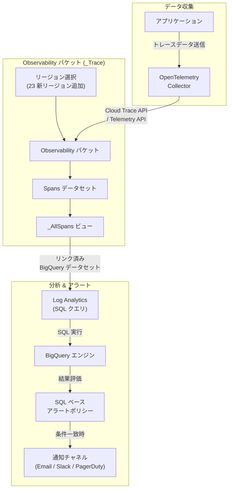

# Cloud Trace: Observability バケットのリージョン拡張と SQL クエリアラートポリシー

**リリース日**: 2026-03-19

**サービス**: Cloud Trace

**機能**: Observability Buckets Location Expansion / SQL Query Alerting Policies

**ステータス**: GA (リージョン拡張) / Public Preview (SQL クエリアラートポリシー)

[このアップデートのインフォグラフィックを見る](https://takech9203.github.io/google-cloud-news-summary/20260319-cloud-trace-observability-updates.html)

## 概要

Google Cloud Observability は、トレースデータを保存する Observability バケットの対応リージョンを大幅に拡張しました。今回のアップデートにより、アフリカ、アジア太平洋、ヨーロッパ、中東、北米、南米の 23 の新しいリージョンが追加され、グローバルに展開する組織がデータレジデンシー要件をより柔軟に満たせるようになりました。

また、SQL クエリの結果を監視するアラートポリシーの作成機能が Public Preview として利用可能になりました。この機能により、Log Analytics ページから SQL クエリを使用してトレースデータやログデータを分析し、その結果に基づいてアラートを設定できます。BigQuery エンジン上で実行されるこの機能は、複数のログエントリやトレーススパンにわたる集約分析に基づくアラートに特に有効です。

これらのアップデートは、コンプライアンス要件を持つエンタープライズ組織や、トレースデータに対する高度な監視・分析を必要とする SRE チーム、DevOps エンジニアに大きな価値を提供します。

**アップデート前の課題**

- Observability バケットの対応リージョンが限定的で、特定の地域でのデータレジデンシー要件を満たすことが困難だった
- トレースデータに対する SQL ベースのアラートポリシーが利用できず、複雑な条件でのアラート設定には手動での監視やカスタムソリューションが必要だった
- アジア太平洋やヨーロッパの一部リージョンでは Observability バケットを作成できず、データの地理的な配置に制約があった

**アップデート後の改善**

- 23 の新リージョンが追加され、世界中のほぼすべての主要な Google Cloud リージョンで Observability バケットを利用可能になった
- SQL クエリの結果に基づくアラートポリシーを作成でき、トレースデータの集約分析に基づく高度な監視が可能になった
- データレジデンシー要件やコンプライアンス規制への対応が大幅に容易になった

## アーキテクチャ図



Observability バケットにトレースデータが保存され、リンク済み BigQuery データセットを通じて Log Analytics から SQL クエリで分析できます。SQL クエリの結果に基づいてアラートポリシーが評価され、条件が満たされると通知が送信されます。

## サービスアップデートの詳細

### 主要機能

1. **Observability バケットのリージョン拡張**
   - 23 の新しいリージョンが Observability バケットの対応ロケーションに追加された
   - 組織、フォルダ、プロジェクトレベルでデフォルトのストレージロケーションを設定可能
   - CMEK (顧客管理暗号鍵) との組み合わせによるデータ保護もサポート
   - リソース階層に基づく設定の自動継承により、大規模な組織でも一元管理が可能

2. **SQL クエリアラートポリシー (Public Preview)**
   - Log Analytics ページから SQL クエリを作成し、その結果を監視するアラートポリシーを設定可能
   - 行数しきい値テスト: クエリ結果の行数が指定した閾値を超えた場合にアラート
   - ブーリアンテスト: クエリ結果のブーリアンカラムに true が含まれる場合にアラート
   - スケジュールとルックバックウィンドウの設定により、定期的な自動評価を実行

## 技術仕様

### 新規追加リージョン一覧

| 地域 | リージョン名 | ロケーション |
|------|-------------|-------------|
| アフリカ | africa-south1 | ヨハネスブルグ |
| アジア太平洋 | asia-east1 | 台湾 |
| アジア太平洋 | asia-east2 | 香港 |
| アジア太平洋 | asia-northeast2 | 大阪 |
| アジア太平洋 | asia-northeast3 | ソウル |
| アジア太平洋 | asia-south1 | ムンバイ |
| アジア太平洋 | asia-south2 | デリー |
| アジア太平洋 | asia-southeast2 | ジャカルタ |
| アジア太平洋 | asia-southeast3 | バンコク |
| アジア太平洋 | australia-southeast2 | メルボルン |
| ヨーロッパ | europe-north2 | 北欧 |
| ヨーロッパ | europe-west1 | ベルギー |
| ヨーロッパ | europe-west4 | オランダ |
| ヨーロッパ | europe-west6 | チューリッヒ |
| ヨーロッパ | europe-west8 | ミラノ |
| 中東 | me-central1 | ドーハ |
| 北米 | northamerica-northeast2 | トロント |
| 北米 | northamerica-south1 | メキシコ |
| 南米 | southamerica-west1 | サンティアゴ |
| 北米 | us-east5 | コロンバス |
| 北米 | us-south1 | ダラス |
| 北米 | us-west2 | ロサンゼルス |
| 北米 | us-west3 | ソルトレイクシティ |

### SQL クエリアラートポリシーの構成要素

| 項目 | 詳細 |
|------|------|
| 条件タイプ | `conditionSql` (SqlCondition) |
| 評価方式 | 行数しきい値テスト (`row_count_test`) またはブーリアンテスト (`boolean_test`) |
| スケジュール | 分、時間、日単位で設定可能 |
| ルックバックウィンドウ | スケジュール間隔と同一 |
| クエリ実行タイムアウト | 5 分 |
| インシデント作成遅延 | 最大約 7 分 + クエリ実行時間 |
| 条件数制限 | 1 ポリシーにつき 1 条件 |

## 設定方法

### 前提条件

1. Google Cloud プロジェクトで Cloud Trace API が有効化されていること
2. Observability バケット (`_Trace`) が作成済みであること
3. SQL クエリアラートの場合、リンク済み BigQuery データセットが設定されていること

### 手順

#### ステップ 1: Observability バケットのデフォルトロケーション設定

```bash
# Observability API を使用してデフォルトストレージロケーションを設定
curl -X PATCH \
  "https://observability.googleapis.com/v1/organizations/ORG_ID/settings" \
  -H "Authorization: Bearer $(gcloud auth print-access-token)" \
  -H "Content-Type: application/json" \
  -d '{
    "defaultStorageLocation": "asia-northeast2"
  }'
```

組織、フォルダ、またはプロジェクトレベルでデフォルトのストレージロケーションを設定します。子リソースはこの設定を自動的に継承します。

#### ステップ 2: SQL クエリアラートポリシーの作成 (API)

```bash
# Cloud Monitoring API を使用して SQL ベースのアラートポリシーを作成
curl -X POST \
  "https://monitoring.googleapis.com/v3/projects/PROJECT_ID/alertPolicies" \
  -H "Authorization: Bearer $(gcloud auth print-access-token)" \
  -H "Content-Type: application/json" \
  -d '{
    "displayName": "High Latency Traces Alert",
    "conditions": [{
      "displayName": "SQL query condition",
      "conditionSql": {
        "query": "SELECT COUNT(*) as error_count FROM `project_id.dataset._AllSpans` WHERE duration > 5000",
        "rowCountTest": {
          "comparison": "COMPARISON_GT",
          "threshold": 100
        },
        "periodicity": {
          "hours": 1
        }
      }
    }],
    "notificationChannels": [
      "projects/PROJECT_ID/notificationChannels/CHANNEL_ID"
    ]
  }'
```

SQL クエリの結果に基づいてアラートポリシーを作成します。上記の例では、5 秒以上のレイテンシを持つトレーススパンが 100 件を超えた場合にアラートを発行します。

## メリット

### ビジネス面

- **データレジデンシーコンプライアンスの強化**: GDPR、APPI (個人情報保護法) など各国の規制に対応したデータ保管が可能になり、グローバル展開の障壁が低減される
- **運用リスクの早期検知**: SQL クエリアラートにより、トレースデータの異常パターンをリアルタイムに近い形で検知でき、サービス品質の低下を未然に防止できる

### 技術面

- **柔軟なデータ配置**: 23 の新リージョンにより、アプリケーションのデプロイ先に近いリージョンでトレースデータを保存でき、データアクセスの効率が向上する
- **高度な分析ベースアラート**: SQL の表現力を活かし、複数のスパンにわたる集約分析やジョイン条件に基づく複雑なアラート条件を設定可能

## デメリット・制約事項

### 制限事項

- Observability バケットの変更・削除はできない (作成後のリージョン変更は不可)
- SQL クエリアラートポリシーは 1 ポリシーにつき 1 条件のみサポート
- SQL クエリの実行時間が 5 分を超えるとタイムアウトする
- SQL クエリアラートポリシーは Analytics ビューをクエリできない (ログビューのみ対応)
- デフォルト設定は新規リソースにのみ適用され、既存のリソースには適用されない

### 考慮すべき点

- SQL クエリアラートポリシーは Public Preview のため、SLA の対象外であり、本番環境での利用には注意が必要
- BigQuery エンジンでクエリが実行されるため、BigQuery の料金が発生する (オンデマンドスロットまたは予約スロット)
- インシデント作成までに最大約 7 分 + クエリ実行時間の遅延がある

## ユースケース

### ユースケース 1: グローバル展開企業のデータレジデンシー対応

**シナリオ**: 日本とヨーロッパにサービスを展開する企業が、各地域の規制に合わせてトレースデータの保管場所を分離する必要がある。

**実装例**:
```bash
# 日本向けフォルダのデフォルトロケーションを大阪に設定
curl -X PATCH \
  "https://observability.googleapis.com/v1/folders/JAPAN_FOLDER_ID/settings" \
  -H "Authorization: Bearer $(gcloud auth print-access-token)" \
  -d '{"defaultStorageLocation": "asia-northeast2"}'

# EU 向けフォルダのデフォルトロケーションをベルギーに設定
curl -X PATCH \
  "https://observability.googleapis.com/v1/folders/EU_FOLDER_ID/settings" \
  -H "Authorization: Bearer $(gcloud auth print-access-token)" \
  -d '{"defaultStorageLocation": "europe-west1"}'
```

**効果**: フォルダレベルの設定により、子プロジェクトが自動的に適切なリージョンにトレースデータを保存し、各国の規制に準拠できる。

### ユースケース 2: SRE チームによるレイテンシ異常の自動検知

**シナリオ**: マイクロサービスアーキテクチャを採用するチームが、特定のサービス間通信のレイテンシ悪化を SQL クエリで検知し、自動アラートを設定したい。

**効果**: BigQuery エンジンの処理能力を活用して大量のトレースデータを集約分析し、従来のメトリクスベースのアラートでは検知が難しかった複合的な異常パターンを検出できる。

## 料金

Observability バケットのリージョン拡張自体には追加料金は発生しません。Cloud Trace の料金は、取り込まれたトレーススパンの量に基づきます。SQL クエリアラートポリシーでは、BigQuery エンジンでのクエリ実行に対して BigQuery の料金が発生します。

### 料金例

| 項目 | 料金 (概算) |
|------|------------|
| Cloud Trace スパン取り込み (最初の 250 万スパン/月) | 無料 |
| Cloud Trace スパン取り込み (超過分) | $0.20 / 100 万スパン |
| BigQuery オンデマンドクエリ | $6.25 / TB (処理データ量) |

## 利用可能リージョン

今回の拡張により、Observability バケットは以下のリージョンで利用可能です。

- **マルチリージョン**: eu, us
- **北米**: us-central1, us-east5, us-south1, us-west1, us-west2, us-west3, northamerica-northeast2, northamerica-south1
- **南米**: southamerica-west1
- **ヨーロッパ**: europe-north2, europe-west1, europe-west4, europe-west6, europe-west8
- **アジア太平洋**: asia-east1, asia-east2, asia-northeast2, asia-northeast3, asia-south1, asia-south2, asia-southeast2, asia-southeast3, australia-southeast2
- **中東**: me-central1
- **アフリカ**: africa-south1

## 関連サービス・機能

- **Cloud Logging**: ログデータの保存・分析基盤。Log Analytics を通じてトレースデータとログデータの SQL ジョインが可能
- **Cloud Monitoring**: アラートポリシーの管理基盤。SQL ベースアラートポリシーの条件評価とインシデント管理を担当
- **BigQuery**: SQL クエリの実行エンジン。リンク済みデータセットを通じてトレースデータの分析を提供
- **Cloud KMS**: Observability バケットの CMEK (顧客管理暗号鍵) 設定に使用

## 参考リンク

- [インフォグラフィック](https://takech9203.github.io/google-cloud-news-summary/20260319-cloud-trace-observability-updates.html)
- [公式リリースノート](https://cloud.google.com/release-notes#March_19_2026)
- [Observability バケットのロケーション](https://cloud.google.com/stackdriver/docs/observability/observability-bucket-locations)
- [Trace ストレージの概要](https://cloud.google.com/trace/docs/storage-overview)
- [Observability バケットのデフォルト設定](https://cloud.google.com/stackdriver/docs/observability/set-defaults-for-observability-buckets)
- [SQL クエリアラートポリシー](https://cloud.google.com/logging/docs/analyze/sql-in-alerting)
- [Google Cloud Observability 料金](https://cloud.google.com/products/observability/pricing)

## まとめ

今回のアップデートにより、Cloud Trace の Observability バケットが 23 の新リージョンに対応し、グローバル展開する組織のデータレジデンシー要件への対応力が大幅に向上しました。また、SQL クエリアラートポリシー (Public Preview) により、トレースデータに対する高度な集約分析ベースの監視が可能になりました。データレジデンシー要件がある組織は、早期にデフォルトストレージロケーションの設定を検討し、SRE チームは SQL クエリアラートの活用による監視強化を評価することを推奨します。

---

**タグ**: #CloudTrace #Observability #DataResidency #SQL #AlertingPolicy #リージョン拡張 #PublicPreview #GoogleCloudObservability
