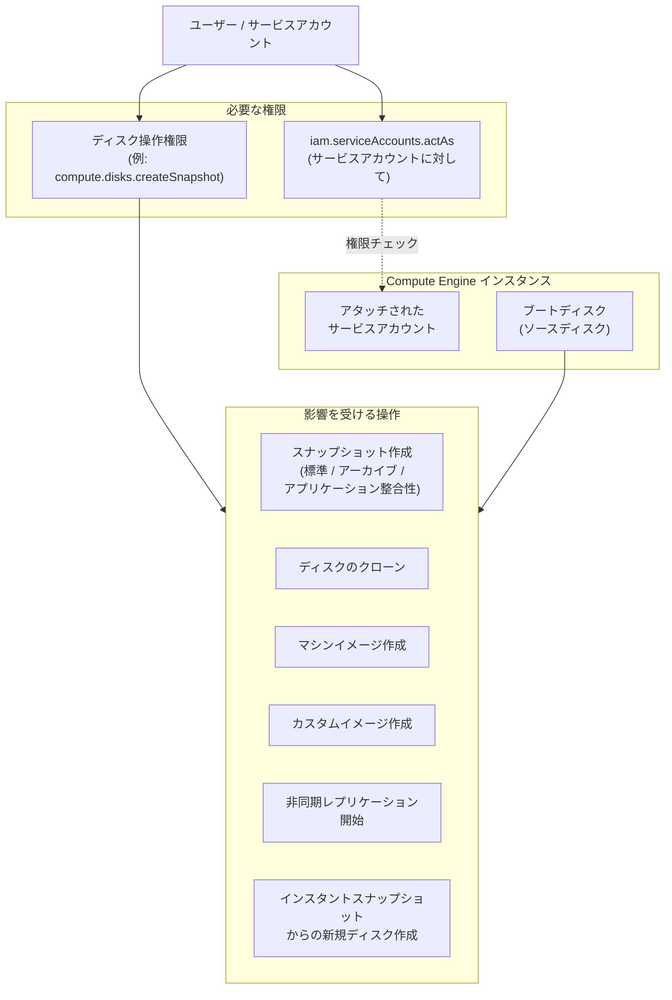

# Compute Engine: ブートディスク操作に iam.serviceAccounts.actAs 権限が必須化 (Breaking Change)

**リリース日**: 2026-03-19

**サービス**: Compute Engine

**機能**: Boot disk operations require iam.serviceAccounts.actAs permission on attached service account

**ステータス**: Breaking Change

[このアップデートのインフォグラフィックを見る](https://takech9203.github.io/google-cloud-news-summary/20260319-compute-engine-boot-disk-iam-permission.html)

## 概要

Compute Engine において、サービスアカウントがアタッチされたインスタンスのブートディスクに対する複数の操作で、当該サービスアカウントに対する `iam.serviceAccounts.actAs` 権限が新たに必須となりました。これは破壊的変更 (Breaking Change) であり、既存のワークフローやオートメーションに影響を及ぼす可能性があります。

この変更は、サービスアカウントの権限借用 (impersonation) に関するセキュリティ強化の一環です。従来、ブートディスクのスナップショット作成やクローン等の操作では、サービスアカウントへの `actAs` 権限が不要でしたが、今後はこれらの操作を実行するユーザーにも明示的な権限付与が求められます。これにより、意図しない権限昇格のリスクが低減されます。

対象となるのは、Compute Engine のディスク管理やバックアップ運用を担当するインフラエンジニア、SRE、およびクラウドアーキテクトです。特に、自動化パイプラインでスナップショットやイメージを作成している環境では、早急な対応が必要です。

**アップデート前の課題**

- サービスアカウントがアタッチされたインスタンスのブートディスクに対するスナップショット作成やクローン等の操作で、サービスアカウントへの impersonation 権限チェックが行われていなかった
- ディスク操作権限のみを持つユーザーが、サービスアカウントの権限を間接的に利用できる可能性があった
- セキュリティモデルとして、ディスク操作とサービスアカウント impersonation の分離が不十分だった

**アップデート後の改善**

- ブートディスク操作時にサービスアカウントに対する `iam.serviceAccounts.actAs` 権限チェックが強制されるようになった
- 権限昇格のリスクが低減され、最小権限の原則がより厳密に適用される
- サービスアカウントの impersonation に関する IAM ポリシーが一貫して適用されるようになった

## アーキテクチャ図



サービスアカウントがアタッチされたインスタンスのブートディスクに対して上記の操作を行う場合、従来のディスク操作権限に加えて、当該サービスアカウントに対する `iam.serviceAccounts.actAs` 権限が必要になります。

## サービスアップデートの詳細

### 影響を受ける操作

以下の操作は、サービスアカウントがアタッチされたインスタンスのブートディスク (ソースディスク) に対して実行する場合、`iam.serviceAccounts.actAs` 権限が新たに必要となります。

1. **スナップショットの作成**
   - ソースディスクの標準スナップショットまたはアーカイブスナップショットの作成
   - アプリケーション整合性スナップショットも対象

2. **ディスクのクローン**
   - ソースディスクのクローン (ディスクの複製) 操作

3. **マシンイメージの作成**
   - 当該インスタンスのマシンイメージ作成

4. **カスタムイメージの作成**
   - ソースディスクからのカスタムイメージ作成

5. **非同期レプリケーションの開始**
   - ソースディスクの別リージョンへの非同期レプリケーション開始

6. **インスタントスナップショットからの新規ディスク作成**
   - インスタンス作成時に、ソースディスクのインスタントスナップショットから新規ディスクを作成する場合

## 技術仕様

### 必要な権限とロール

| 項目 | 詳細 |
|------|------|
| 必要な権限 | `iam.serviceAccounts.actAs` (対象サービスアカウントに対して) |
| 推奨ロール (権限を含む) | Service Account User (`roles/iam.serviceAccountUser`) |
| 影響を受けないロール構成 | Compute Instance Admin (v1) (`roles/compute.instanceAdmin.v1`) + Service Account User (`roles/iam.serviceAccountUser`) を既にプロジェクトレベルで付与済みの場合 |
| 権限付与の粒度 | プロジェクトレベルまたは個別のサービスアカウントレベルで付与可能 |

### 影響の判定フロー

以下の条件が全て当てはまる場合に影響を受けます:

1. 操作対象のディスクが、サービスアカウントがアタッチされた Compute Engine インスタンスのブートディスクである
2. 操作を実行するユーザーまたはサービスアカウントに、当該サービスアカウントに対する `iam.serviceAccounts.actAs` 権限が付与されていない
3. 実行する操作が上記 6 種類のいずれかに該当する

### 権限確認コマンド

```bash
# 現在のユーザーが特定のサービスアカウントに対して actAs 権限を持っているか確認
gcloud iam service-accounts get-iam-policy \
  SA_EMAIL@PROJECT_ID.iam.gserviceaccount.com \
  --format="json"
```

## 設定方法

### 前提条件

1. 対象プロジェクトに対する IAM 管理権限 (ロール付与権限) を持っていること
2. 影響を受けるサービスアカウントを特定していること

### 手順

#### ステップ 1: 影響を受けるサービスアカウントの特定

```bash
# プロジェクト内のサービスアカウントがアタッチされたインスタンスを一覧表示
gcloud compute instances list \
  --project=PROJECT_ID \
  --format="table(name,zone,serviceAccounts.email)"
```

ブートディスクに対してスナップショット作成やクローンを行う対象のインスタンスにアタッチされたサービスアカウントを特定します。

#### ステップ 2: Service Account User ロールの付与

```bash
# プロジェクトレベルで Service Account User ロールを付与
gcloud projects add-iam-policy-binding PROJECT_ID \
  --member="user:USER_EMAIL" \
  --role="roles/iam.serviceAccountUser"
```

または、特定のサービスアカウントに対してのみ権限を付与する場合:

```bash
# 個別のサービスアカウントレベルで権限を付与
gcloud iam service-accounts add-iam-policy-binding \
  SA_EMAIL@PROJECT_ID.iam.gserviceaccount.com \
  --member="user:USER_EMAIL" \
  --role="roles/iam.serviceAccountUser"
```

#### ステップ 3: 自動化パイプラインの確認と更新

自動化ツールやパイプラインのサービスアカウントにも同様に権限を付与します。

```bash
# CI/CD パイプラインのサービスアカウントに権限を付与
gcloud iam service-accounts add-iam-policy-binding \
  TARGET_SA@PROJECT_ID.iam.gserviceaccount.com \
  --member="serviceAccount:PIPELINE_SA@PROJECT_ID.iam.gserviceaccount.com" \
  --role="roles/iam.serviceAccountUser"
```

## メリット

### ビジネス面

- **セキュリティ態勢の強化**: 意図しない権限昇格経路を遮断し、組織全体のセキュリティリスクを低減
- **コンプライアンス対応**: 最小権限の原則をより厳密に適用でき、監査要件への対応を強化

### 技術面

- **IAM ポリシーの一貫性**: サービスアカウントの impersonation チェックが全てのディスク操作に一貫して適用される
- **権限管理の明確化**: ディスク操作とサービスアカウント権限の責任分界点が明確になる

## デメリット・制約事項

### 制限事項

- 既存のオートメーションやスクリプトが、権限不足により失敗する可能性がある
- サービスアカウントレベルでの細かい権限管理が必要になり、IAM ポリシーの管理負荷が増加する場合がある

### 考慮すべき点

- 既にプロジェクトレベルで `roles/compute.instanceAdmin.v1` と `roles/iam.serviceAccountUser` の両方を持っている場合は対応不要
- バックアップスクリプトや Terraform 等の IaC ツールで使用しているサービスアカウントの権限を確認する必要がある
- 組織レベルで多数のプロジェクトを管理している場合、影響範囲の調査に時間がかかる可能性がある
- `iam.serviceAccountUser` ロールの付与はサービスアカウントの impersonation を許可するため、最小権限の原則に基づき付与範囲を慎重に検討する

## ユースケース

### ユースケース 1: 定期バックアップパイプラインの修正

**シナリオ**: Cloud Scheduler と Cloud Functions を使用して、Compute Engine インスタンスのブートディスクの定期スナップショットを作成している環境。バックアップ用サービスアカウントに `compute.disks.createSnapshot` 権限は付与済みだが、`iam.serviceAccounts.actAs` 権限は未付与。

**実装例**:
```bash
# バックアップ用サービスアカウントに対して、対象 VM のサービスアカウントへの actAs 権限を付与
gcloud iam service-accounts add-iam-policy-binding \
  VM_SA@PROJECT_ID.iam.gserviceaccount.com \
  --member="serviceAccount:BACKUP_SA@PROJECT_ID.iam.gserviceaccount.com" \
  --role="roles/iam.serviceAccountUser"
```

**効果**: バックアップパイプラインが中断なく継続動作する。

### ユースケース 2: Terraform によるマシンイメージ作成

**シナリオ**: Terraform で Compute Engine インスタンスからマシンイメージを定期的に作成し、テンプレートとして使用している環境。Terraform 実行用サービスアカウントの権限更新が必要。

**効果**: IaC パイプラインの安定稼働を維持しつつ、セキュリティポリシーに準拠できる。

## 関連サービス・機能

- **Cloud IAM**: `iam.serviceAccounts.actAs` 権限およびサービスアカウント impersonation の管理
- **Compute Engine スナップショット**: ブートディスクのスナップショット作成が直接影響を受ける
- **Compute Engine マシンイメージ**: インスタンスのマシンイメージ作成が影響を受ける
- **Compute Engine 非同期レプリケーション**: ディスクの別リージョンへの非同期レプリケーションが影響を受ける
- **Backup and DR Service**: Compute Engine バックアップにおいても `iam.serviceAccounts.actAs` 権限が必要

## 参考リンク

- [このアップデートのインフォグラフィック](https://takech9203.github.io/google-cloud-news-summary/20260319-compute-engine-boot-disk-iam-permission.html)
- [公式リリースノート](https://cloud.google.com/release-notes#March_19_2026)
- [サービスアカウントの actAs 権限について](https://cloud.google.com/iam/docs/service-accounts-actas)
- [Compute Engine IAM ロールと権限](https://cloud.google.com/compute/docs/access/iam)
- [サービスアカウントの impersonation 管理](https://cloud.google.com/iam/docs/impersonating-service-accounts)
- [Compute Engine スナップショットの管理](https://cloud.google.com/compute/docs/disks/manage-snapshots)

## まとめ

今回の Breaking Change により、サービスアカウントがアタッチされた Compute Engine インスタンスのブートディスクに対するスナップショット作成、クローン、マシンイメージ作成、カスタムイメージ作成、非同期レプリケーション、インスタントスナップショットからのディスク作成の 6 つの操作で `iam.serviceAccounts.actAs` 権限が必須となりました。既に `roles/compute.instanceAdmin.v1` と `roles/iam.serviceAccountUser` の両方をプロジェクトレベルで付与済みの場合は対応不要ですが、それ以外の環境では速やかに影響範囲を確認し、必要な権限を付与することを強く推奨します。

---

**タグ**: #ComputeEngine #IAM #BreakingChange #ServiceAccount #セキュリティ #iam.serviceAccounts.actAs #スナップショット #ディスク管理
