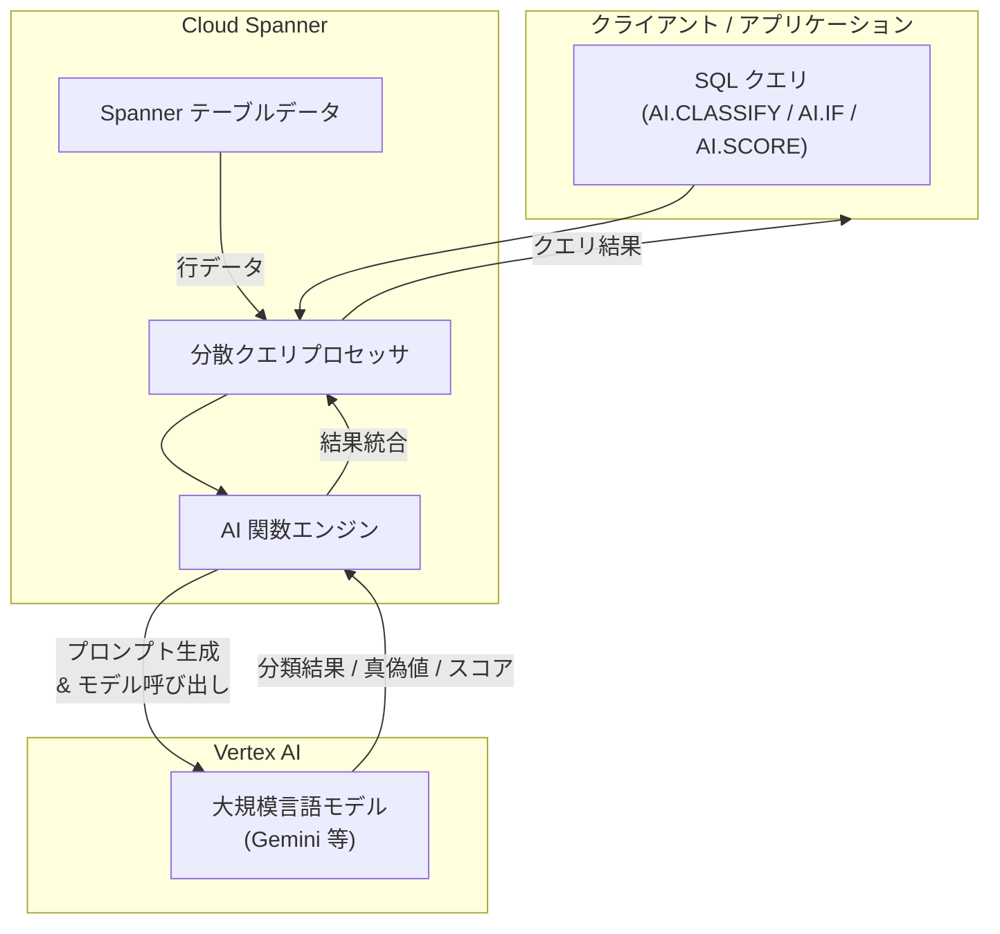

# Spanner: AI 関数による SQL でのセマンティック操作

**リリース日**: 2026-03-19
**サービス**: Spanner
**機能**: AI 関数 (AI.CLASSIFY, AI.IF, AI.SCORE) による LLM を活用したセマンティック操作
**ステータス**: Feature

[このアップデートのインフォグラフィックを見る](https://takech9203.github.io/google-cloud-news-summary/20260319-spanner-ai-functions.html)

## 概要

Spanner に新たに AI 関数が追加されました。これは機械学習関数の一部として提供され、SQL クエリ内で大規模言語モデル (LLM) を活用したセマンティック操作を実行できる機能です。AI.CLASSIFY (分類)、AI.IF (条件評価)、AI.SCORE (スコアリング) の 3 つの関数により、自然言語入力に対する分類、評価、ランク付けをデータベースレベルで直接実行できます。

従来、Spanner では ML.PREDICT 関数を通じて Vertex AI のモデルを呼び出す機能が提供されていましたが、テキスト分類やスコアリングといったセマンティック操作には、モデルの登録やプロンプトの詳細な設計が必要でした。今回の AI 関数は、これらの一般的なセマンティック操作を簡潔な SQL 構文で実行できるよう抽象化されたインターフェースを提供します。

この機能は、顧客フィードバックの自動分類、コンテンツのモデレーション、データ品質評価などを Spanner のデータに対して直接実行したいデータエンジニア、アプリケーション開発者、データアナリストにとって有用です。Spanner Enterprise エディションおよび Enterprise Plus エディションで利用可能です。

**アップデート前の課題**

- セマンティック操作を行うには ML.PREDICT 関数を使用し、事前にモデルを CREATE MODEL で登録する必要があった
- テキスト分類やスコアリングのためのプロンプト設計を開発者自身が行う必要があった
- 自然言語による条件評価をデータベース内で直接実行する手段がなかった

**アップデート後の改善**

- AI.CLASSIFY、AI.IF、AI.SCORE の 3 つの専用関数により、セマンティック操作を簡潔な SQL で実行可能になった
- モデル登録不要で、関数呼び出しのみでLLM を活用した分類・評価・スコアリングが可能になった
- プロンプトの自動最適化により、開発者がスコアリングルーブリックなどを詳細に設計する必要がなくなった

## アーキテクチャ図



Spanner の AI 関数は、SQL クエリ内で自然言語入力を処理し、Vertex AI 上の LLM に対してプロンプトを自動生成・送信します。LLM からの応答は関数の種類に応じて分類ラベル、真偽値、数値スコアとして返却され、通常の SQL 結果セットに統合されます。

## サービスアップデートの詳細

### 主要機能

1. **AI.CLASSIFY: 自然言語入力のカテゴリ分類**
   - ユーザー定義のカテゴリリストに基づいて、自然言語テキストを分類する
   - 顧客フィードバックのトピック分類、サポートチケットのルーティング、ドキュメントの分類などに活用可能
   - カテゴリは SQL クエリ内で配列として指定する

2. **AI.IF: 自然言語による条件評価**
   - 自然言語で記述された条件に対して、テキストが合致するかどうかを真偽値で返す
   - WHERE 句でのフィルタリングに直接使用可能
   - テキストが特定の概念やトピックに関連するかどうかの判定に活用できる

3. **AI.SCORE: 自然言語入力のスコアリング**
   - 自然言語入力に対して数値スコア (FLOAT64) を割り当てる
   - プロンプトの自動最適化により、スコアリングルーブリックが自動生成される
   - セマンティック類似度の評価、コンテンツ品質の定量化、優先度付けなどに活用可能

## 技術仕様

### AI 関数の比較

| 項目 | AI.CLASSIFY | AI.IF | AI.SCORE |
|------|-------------|-------|----------|
| 入力 | テキスト + カテゴリ配列 | テキスト + 自然言語条件 | テキスト + プロンプト |
| 出力型 | STRING (カテゴリ名) | BOOL | FLOAT64 |
| 主な用途 | テキスト分類 | 条件フィルタリング | スコアリング / ランク付け |
| エラー処理 | NULL を返却 | NULL を返却 | NULL を返却 |
| プロンプト最適化 | なし | なし | 自動ルーブリック生成 |

### 対応エディション

| エディション | 対応状況 |
|-------------|---------|
| Spanner Enterprise | 対応 |
| Spanner Enterprise Plus | 対応 |
| Spanner Standard | 非対応 |

## 設定方法

### 前提条件

1. Spanner Enterprise エディションまたは Enterprise Plus エディションのインスタンスが必要
2. Vertex AI API が有効化されたプロジェクトであること
3. Spanner から Vertex AI エンドポイントへのアクセス権限が設定されていること

### 手順

#### ステップ 1: AI.CLASSIFY によるテキスト分類

```sql
SELECT
  feedback_id,
  feedback_text,
  AI.CLASSIFY(
    feedback_text,
    categories => ['請求に関する問題', 'アカウントアクセス', '製品バグ', '機能リクエスト', '配送遅延', 'その他']
  ) AS topic
FROM
  customer_feedback;
```

AI.CLASSIFY は指定されたカテゴリの中から最も適切なものを選択して返します。上記の例では、顧客フィードバックを 6 つのカテゴリに自動分類します。

#### ステップ 2: AI.IF による条件フィルタリング

```sql
SELECT
  review_id,
  review_text
FROM
  customer_reviews
WHERE
  AI.IF(('このレビューは製品のセットアップの困難さについて言及していますか？ レビュー: ', review_text));
```

AI.IF は自然言語で記述された条件を評価し、BOOL 値を返します。WHERE 句で使用することで、特定のセマンティック条件に合致する行のみをフィルタリングできます。

#### ステップ 3: AI.SCORE によるスコアリングとランク付け

```sql
SELECT
  review_id,
  review_text,
  AI.SCORE(
    ('製品セットアップの困難さとの類似度を評価してください。スコアが高いほど類似度が高いことを示します。 レビュー: ', review_text)
  ) AS setup_difficulty_score
FROM
  customer_reviews
ORDER BY
  setup_difficulty_score DESC
LIMIT 10;
```

AI.SCORE はプロンプトに基づいてスコアリングルーブリックを自動生成し、FLOAT64 値を返します。ORDER BY と組み合わせることでセマンティックなランク付けが可能です。

## メリット

### ビジネス面

- **データ分析の迅速化**: SQL のみでテキスト分類やスコアリングが可能になり、外部ツールやカスタムアプリケーションの開発が不要
- **運用コストの削減**: データ移動やアプリケーションレイヤーでの処理が不要になり、アーキテクチャが簡素化される
- **意思決定の高速化**: 顧客フィードバックやコンテンツの分析をリアルタイムで実行でき、ビジネスインサイトの取得が迅速化

### 技術面

- **シンプルな SQL インターフェース**: モデル登録や複雑なプロンプト設計が不要で、関数呼び出しのみで LLM を活用可能
- **分散クエリ処理**: Spanner の分散クエリプロセッサ上で実行されるため、大規模データセットに対しても高いスループットで処理可能
- **既存ワークフローとの統合**: 通常の SQL クエリに AI 関数を組み込むだけで利用でき、既存のデータパイプラインやアプリケーションへの統合が容易

## デメリット・制約事項

### 制限事項

- Spanner Enterprise エディションおよび Enterprise Plus エディションでのみ利用可能であり、Standard エディションでは使用できない
- LLM の呼び出しに伴うレイテンシが発生するため、大量の行に対する処理ではクエリ実行時間が長くなる可能性がある
- AI 関数でエラーが発生した場合は NULL が返却されるため、結果の検証が必要

### 考慮すべき点

- Vertex AI の利用料金が別途発生するため、大規模なデータに対する頻繁な AI 関数呼び出しはコストに影響する
- LLM の応答は確率的であるため、同一入力に対して結果が異なる場合がある
- Vertex AI エンドポイントと Spanner インスタンスを同一リージョンにデプロイすることで、データ転送コストを最小化することを推奨

## ユースケース

### ユースケース 1: 顧客フィードバックの自動分類とトレンド分析

**シナリオ**: EC サイトの運営チームが、大量の顧客レビューを自動的にカテゴリ分類し、問題の傾向を把握したい。

**実装例**:
```sql
SELECT
  AI.CLASSIFY(
    review_text,
    categories => ['請求に関する問題', 'アカウントアクセス', '製品バグ', '機能リクエスト', '配送遅延', 'その他']
  ) AS topic,
  COUNT(*) AS review_count
FROM
  customer_feedback
GROUP BY
  topic
ORDER BY
  review_count DESC;
```

**効果**: カスタムの分類モデルを構築・デプロイすることなく、SQL のみで顧客フィードバックのカテゴリ別集計が可能。問題の傾向をリアルタイムに把握し、迅速な対応につなげられる。

### ユースケース 2: コンテンツモデレーションの自動化

**シナリオ**: コミュニティプラットフォームで、投稿されたコンテンツが利用規約に違反しているかどうかを自動判定し、違反の度合いをスコアリングしたい。

**実装例**:
```sql
SELECT
  post_id,
  post_content,
  AI.IF(('この投稿は利用規約に違反する攻撃的な内容を含んでいますか？ 投稿: ', post_content)) AS is_violation,
  AI.SCORE(('この投稿の不適切さの度合いを評価してください。スコアが高いほど不適切です。 投稿: ', post_content)) AS violation_score
FROM
  community_posts
WHERE
  AI.IF(('この投稿は利用規約に違反する攻撃的な内容を含んでいますか？ 投稿: ', post_content))
ORDER BY
  violation_score DESC;
```

**効果**: AI.IF でフィルタリングし、AI.SCORE で重大度を定量化することで、モデレーションチームが優先的に対応すべきコンテンツを効率的に特定できる。

## 料金

Spanner の AI 関数の利用にあたり、Spanner 側での追加料金は発生しません。ただし、以下の料金が別途発生します。

- **Vertex AI オンライン予測**: 使用する LLM モデルの種類に応じた [Vertex AI の標準料金](https://cloud.google.com/vertex-ai/pricing) が適用される。モデルによって、時間単位またはリクエスト単位の課金体系がある
- **データ転送**: Spanner と Vertex AI 間の [データ転送料金](https://cloud.google.com/spanner/pricing#network) が発生する。同一リージョン内であれば転送コストを最小化可能

### コスト最適化のポイント

| 最適化項目 | 推奨事項 |
|-----------|---------|
| リージョン配置 | Spanner インスタンスと Vertex AI エンドポイントを同一リージョンにデプロイ |
| クエリ設計 | AI 関数呼び出し前に WHERE 句でデータを絞り込み、不要な LLM 呼び出しを削減 |
| 予測クォータ | Vertex AI の予測クォータを明示的に設定し、意図しないコスト増加を防止 |

## 関連サービス・機能

- **[Vertex AI](https://cloud.google.com/vertex-ai)**: AI 関数が内部的に利用する LLM の実行基盤。Gemini などのモデルを提供
- **[ML.PREDICT](https://cloud.google.com/spanner/docs/reference/standard-sql/ml-functions#mlpredict)**: Spanner の既存 ML 関数。より詳細なモデル制御が必要な場合に使用
- **[Spanner Vector Search](https://cloud.google.com/spanner/docs/spanner-ai-overview)**: ベクトル埋め込みを使用した類似性検索機能。AI 関数と組み合わせて高度な検索パイプラインを構築可能
- **[BigQuery AI 関数](https://cloud.google.com/bigquery/docs/generative-ai-overview)**: BigQuery における同様の AI 関数群。分析ワークロードとの連携に活用可能

## 参考リンク

- [インフォグラフィック](https://takech9203.github.io/google-cloud-news-summary/20260319-spanner-ai-functions.html)
- [公式リリースノート](https://cloud.google.com/release-notes#March_19_2026)
- [Spanner AI 概要ドキュメント](https://cloud.google.com/spanner/docs/spanner-ai-overview)
- [Spanner Vertex AI 統合](https://cloud.google.com/spanner/docs/ml)
- [Vertex AI 料金](https://cloud.google.com/vertex-ai/pricing)
- [Spanner 料金](https://cloud.google.com/spanner/pricing)

## まとめ

Spanner の AI 関数 (AI.CLASSIFY, AI.IF, AI.SCORE) は、SQL クエリ内で LLM を活用したセマンティック操作を簡潔に実行できる機能です。モデル登録やプロンプト設計の複雑さを抽象化し、データエンジニアやアナリストが SQL の知識のみでテキスト分類、条件評価、スコアリングを実行できるようになります。Spanner Enterprise エディション以上を利用している場合は、既存のデータに対してこれらの AI 関数を試し、顧客フィードバック分析やコンテンツモデレーションなどのユースケースでの効果を検証することを推奨します。

---

**タグ**: #Spanner #AI #MachineLearning #SQL #LLM #VertexAI #AI.CLASSIFY #AI.IF #AI.SCORE #セマンティック操作 #テキスト分類
