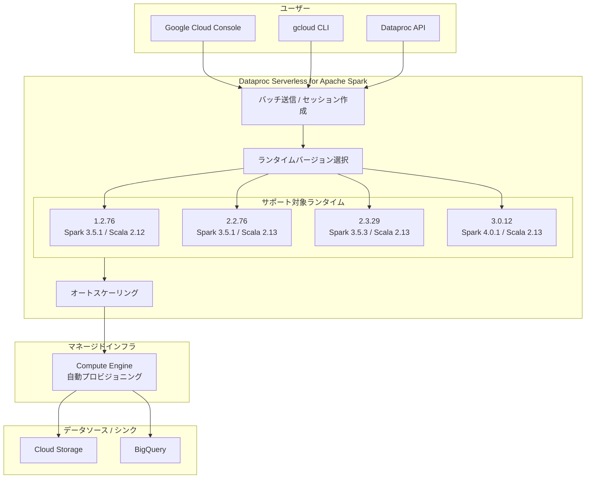

# Dataproc Serverless for Apache Spark: 新ランタイムバージョン 1.2.76, 2.2.76, 2.3.29, 3.0.12

**リリース日**: 2026-03-20

**サービス**: Dataproc

**機能**: Serverless for Apache Spark ランタイムバージョン更新

**ステータス**: 一般提供 (GA)

[このアップデートのインフォグラフィックを見る](https://takech9203.github.io/google-cloud-news-summary/20260320-dataproc-serverless-spark-runtime-versions.html)

## 概要

Google Cloud は Dataproc Serverless for Apache Spark の新しいランタイムバージョンとして 1.2.76、2.2.76、2.3.29、3.0.12 をリリースしました。これらは定期的な週次リリースの一環として提供されるサブマイナーバージョンアップデートであり、バグ修正、セキュリティパッチ、安定性の向上が含まれています。

Dataproc Serverless for Apache Spark は、インフラストラクチャの管理なしに Apache Spark のバッチワークロードやインタラクティブセッションを実行できるサーバーレスサービスです。今回のアップデートにより、4 つのサポート対象ランタイムバージョン全てが最新化され、ユーザーは最新のパッチが適用された環境で Spark ワークロードを実行できるようになります。

対象ユーザーは、Dataproc Serverless を使用してデータ処理パイプライン、ETL ジョブ、機械学習の前処理、インタラクティブなデータ分析を行うデータエンジニア、データサイエンティスト、ML エンジニアです。

## アーキテクチャ図



Dataproc Serverless for Apache Spark では、ユーザーがランタイムバージョンを選択してバッチワークロードを送信すると、マネージドインフラ上で自動的にリソースがプロビジョニングされ、Cloud Storage や BigQuery と連携してデータ処理が実行されます。

## サービスアップデートの詳細

### 主要機能

1. **4 つのランタイムバージョンの同時更新**
   - 1.2.76、2.2.76、2.3.29、3.0.12 が同時にリリース
   - 全てのサポート対象ランタイムに対してバグ修正とセキュリティパッチを提供
   - 週次リリースサイクルに基づく継続的な品質向上

2. **後方互換性の維持**
   - サブマイナーバージョンのアップデートは完全な後方互換性を保証
   - 既存のワークロードコードの変更は不要
   - サブマイナーバージョンのピン留め (固定) は非サポートのため、最新バージョンが自動的に使用される

3. **複数世代のランタイムサポート**
   - ランタイム 1.2 (LTS) と 2.2 (LTS): 2026 年 9 月 30 日までサポート
   - ランタイム 2.3 (LTS): 2027 年 11 月 26 日までサポート
   - ランタイム 3.0: 2027 年 1 月 31 日までサポート

## 技術仕様

### ランタイムバージョン別コンポーネント構成

| コンポーネント | 1.2.76 | 2.2.76 | 2.3.29 | 3.0.12 |
|------|------|------|------|------|
| Apache Spark | 3.5.1 | 3.5.1 | 3.5.3 | 4.0.1 |
| Cloud Storage Connector | 3.0.3 | 3.0.3 | 3.1.2 | 3.1.9 |
| BigQuery Connector | 0.36.4 | 0.36.4 | 0.42.3 | 0.44.0 |
| Java | 17 | 17 | 17 | 21 |
| Python | 3.12 | 3.12 | 3.11 | 3.12 |
| R | 4.3 | 4.3 | 4.3 | - |
| Scala | 2.12 | 2.13 | 2.13 | 2.13 |

### ランタイムバージョンのサポート期間

| バージョン | 種別 | サポート期限 | 利用可能期限 |
|------|------|------|------|
| 1.2 (LTS) | 長期サポート | 2026/09/30 | 2028/09/30 |
| 2.2 (LTS) | 長期サポート (デフォルト) | 2026/09/30 | 2028/09/30 |
| 2.3 (LTS) | 長期サポート | 2027/11/26 | 2029/11/26 |
| 3.0 | 標準サポート | 2027/01/31 | 2029/01/31 |

## 設定方法

### 前提条件

1. Google Cloud プロジェクトで Dataproc API が有効化されていること
2. ランタイム 3.0 を使用する場合は `dataprocrm.googleapis.com` API の有効化が必要
3. 適切な IAM ロール (Dataproc Editor、Service Account User) が付与されていること

### 手順

#### ステップ 1: 特定のランタイムバージョンでバッチワークロードを送信

```bash
gcloud dataproc batches submit spark \
    --region=REGION \
    --jars=file:///usr/lib/spark/examples/jars/spark-examples.jar \
    --class=org.apache.spark.examples.SparkPi \
    --version=2.3 \
    -- 1000
```

`--version` フラグでメジャー.マイナーバージョン (例: `2.3`) を指定します。サブマイナーバージョン (例: `2.3.29`) は自動的に最新のものが使用されます。

#### ステップ 2: API を使用したバッチワークロードの送信

```json
{
  "sparkBatch": {
    "args": ["1000"],
    "runtimeConfig": {
      "version": "2.3"
    },
    "jarFileUris": [
      "file:///usr/lib/spark/examples/jars/spark-examples.jar"
    ],
    "mainClass": "org.apache.spark.examples.SparkPi"
  }
}
```

REST API を使用する場合は、`runtimeConfig.version` フィールドでランタイムバージョンを指定します。

## メリット

### ビジネス面

- **運用負荷の軽減**: サーバーレスアーキテクチャにより、クラスタの管理やスケーリングが不要。バグ修正やセキュリティパッチも自動的に適用される
- **コスト最適化**: 使用した分だけの課金で、アイドル状態のクラスタに対する費用が発生しない

### 技術面

- **最新のセキュリティパッチ**: 週次リリースにより、脆弱性への迅速な対応が可能
- **複数の Spark バージョンをサポート**: Spark 3.5.1 から Spark 4.0.1 まで、プロジェクトの要件に合わせたバージョンを選択可能
- **BigQuery との緊密な連携**: 各ランタイムに BigQuery Connector が組み込まれており、追加設定なしで BigQuery のデータを操作可能

## デメリット・制約事項

### 制限事項

- サブマイナーバージョンのピン留め (固定) はサポートされていないため、特定のサブマイナーバージョンを指定して実行することはできない
- ランタイム 3.0 では Persistent History Server (PHS)、SparkR バッチ、Jupyter セッションがサポートされていない
- LTS ランタイム (1.2, 2.2) のサポート期限は 2026 年 9 月 30 日であり、計画的な移行が必要

### 考慮すべき点

- ランタイム 3.0 は Spark 4.0 ベースであり、Spark 3.x からの移行には API の互換性を確認する必要がある
- ランタイム 3.0 では `dataprocrm.googleapis.com` API の有効化が新たに必要となる
- ランタイム 3.0 ではマルチゾーンでのノード配置がデフォルトとなり、以前のバージョンとは動作が異なる

## ユースケース

### ユースケース 1: 大規模 ETL パイプラインの実行

**シナリオ**: 毎日数 TB のデータを Cloud Storage から BigQuery にロードする ETL パイプラインを運用している。クラスタの管理コストを削減しつつ、最新のセキュリティパッチが適用された環境で実行したい。

**実装例**:
```bash
gcloud dataproc batches submit pyspark \
    --region=asia-northeast1 \
    --version=2.3 \
    --properties=spark.dynamicAllocation.enabled=true \
    gs://my-bucket/etl_pipeline.py
```

**効果**: クラスタ管理が不要になり、運用コストを削減。オートスケーリングにより、データ量の変動にも自動対応。

### ユースケース 2: Spark 4.0 の新機能を活用したデータ分析

**シナリオ**: ランタイム 3.0 (Spark 4.0.1) を使用して、最新の Spark 機能を活用したデータ分析を実施したい。

**効果**: Spark 4.0 の新しい SQL 機能や性能改善を活用でき、分析の効率が向上。リージョン内のマルチゾーン配置により、リソースの可用性も向上。

## 料金

Dataproc Serverless for Apache Spark は、ワークロード実行中に消費したリソース (vCPU、メモリ、ストレージ) に基づいて課金されます。ランタイムバージョンの選択による追加料金はありません。

| リソース | 料金 (概算) |
|--------|-----------------|
| vCPU | $0.06 / vCPU 時間 |
| メモリ | $0.0065 / GB 時間 |
| ストレージ | $0.000054 / GB 時間 |

※ 料金は予告なく変更される場合があります。最新の料金は公式料金ページを参照してください。

## 利用可能リージョン

Dataproc Serverless for Apache Spark は、Google Cloud の主要リージョンで利用可能です。ランタイム 3.0 以降では、リージョン内のマルチゾーンでノードが配置されるため、単一ゾーンの在庫不足の影響を受けにくくなっています。日本リージョン (`asia-northeast1`) を含む多数のリージョンで利用可能です。

## 関連サービス・機能

- **Dataproc on Compute Engine**: クラスタベースの Apache Spark / Hadoop 環境。より細かい制御が必要な場合に適している
- **BigQuery**: データウェアハウスサービス。Spark BigQuery Connector を通じてシームレスに連携
- **Cloud Storage**: Dataproc Serverless のデータソースおよび出力先として使用
- **Dataproc Metastore**: Apache Hive Metastore のマネージドサービス。Serverless ワークロードから外部メタストアとして接続可能

## 参考リンク

- [インフォグラフィック](https://takech9203.github.io/google-cloud-news-summary/20260320-dataproc-serverless-spark-runtime-versions.html)
- [公式リリースノート](https://cloud.google.com/release-notes#March_20_2026)
- [Serverless for Apache Spark ランタイムバージョン](https://cloud.google.com/dataproc-serverless/docs/concepts/versions/dataproc-serverless-versions)
- [Spark バッチワークロードのクイックスタート](https://cloud.google.com/dataproc-serverless/docs/quickstarts/spark-batch)
- [料金ページ](https://cloud.google.com/dataproc-serverless/pricing)

## まとめ

今回のアップデートは、Dataproc Serverless for Apache Spark の全サポート対象ランタイム (1.2, 2.2, 2.3, 3.0) に対する定期的なサブマイナーバージョンの更新です。バグ修正やセキュリティパッチが含まれており、特にセキュリティを重視する本番環境では最新バージョンの利用が推奨されます。LTS ランタイム 1.2 および 2.2 のサポート期限 (2026 年 9 月 30 日) が近づいているため、ランタイム 2.3 または 3.0 への移行計画を検討することを推奨します。

---

**タグ**: #Dataproc #Serverless #ApacheSpark #ランタイムバージョン #サーバーレス #データ処理 #BigQuery #CloudStorage
