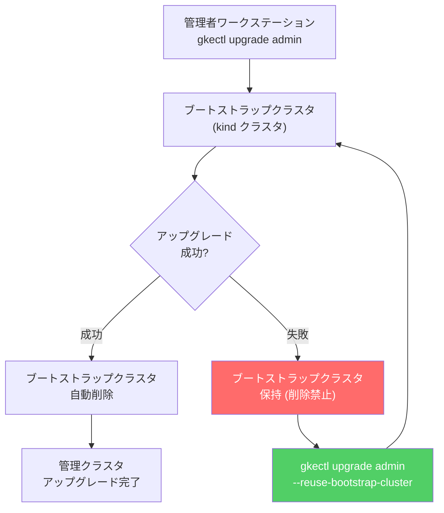

# Google Distributed Cloud (software only) for VMware: 管理クラスタアップグレード時の --reuse-bootstrap-cluster フラグ必須化

**リリース日**: 2026-03-20

**サービス**: Google Distributed Cloud (software only) for VMware

**機能**: 管理クラスタアップグレード失敗時の --reuse-bootstrap-cluster フラグ必須化

**ステータス**: Important (重要な運用変更)

[このアップデートのインフォグラフィックを見る](https://takech9203.github.io/google-cloud-news-summary/20260320-google-distributed-cloud-vmware-upgrade-flag.html)

## 概要

Google Distributed Cloud (software only) for VMware のバージョン 1.32 以降において、管理クラスタ (admin cluster) のアップデートまたはアップグレードが失敗した場合の再試行手順に重要な変更が加わった。失敗後に `gkectl upgrade admin` を再実行する際、`--reuse-bootstrap-cluster` フラグの指定が必須となる。このフラグを指定せずに再実行すると、ブートストラップクラスタに保持されている重要なステート情報が失われ、クリティカルなデータ損失が発生する可能性がある。

この変更は、Advanced Clusters アーキテクチャへの移行が進む中で、アップグレードプロセスの安全性を高めるための措置である。管理クラスタのアップグレードでは、一時的なブートストラップクラスタ (kind クラスタ) が作成され、Kubernetes コントローラの移行に使用される。このブートストラップクラスタには、アップグレードの再開に必要なすべてのステート情報が含まれているため、失敗時に削除してはならない。

対象ユーザーは、Google Distributed Cloud for VMware を運用しているインフラストラクチャ管理者およびプラットフォームエンジニアである。特にバージョン 1.32 以降で Advanced Clusters への移行を計画しているチームにとって、この変更の理解は不可欠である。

**アップデート前の課題**

- アップグレード失敗後の再試行時、ブートストラップクラスタの扱いに関する明確なガイダンスが不足していた
- `gkectl upgrade admin` の再実行時にブートストラップクラスタを再利用するかどうかがユーザーの判断に委ねられていた
- 誤ってブートストラップクラスタを削除した場合や、新しいブートストラップクラスタで再実行した場合にデータ損失のリスクがあった

**アップデート後の改善**

- `--reuse-bootstrap-cluster` フラグにより、既存のブートストラップクラスタの再利用が明示的に指定されるようになった
- フラグの必須化により、誤操作によるデータ損失リスクが軽減された
- アップグレード失敗時のリカバリ手順がより明確かつ安全になった

## アーキテクチャ図



管理クラスタのアップグレードフローを示す。アップグレード失敗時はブートストラップクラスタを保持し、`--reuse-bootstrap-cluster` フラグ付きで再実行することで安全にリカバリできる。

## サービスアップデートの詳細

### 主要機能

1. **--reuse-bootstrap-cluster フラグの必須化**
   - バージョン 1.32 以降の管理クラスタアップグレード失敗時、`gkectl upgrade admin` の再実行に `--reuse-bootstrap-cluster` フラグが必須
   - フラグを指定しない場合、新しいブートストラップクラスタが作成され、既存のステート情報が失われる可能性がある
   - 対象: `gkectl upgrade admin` および `gkectl update admin` コマンド

2. **ブートストラップクラスタのステート保護**
   - ブートストラップクラスタには、アップグレードの再開に必要なすべてのステート情報が保持される
   - 失敗時にワークステーションから外部ブートストラップクラスタを削除してはならない
   - ブートストラップクラスタのスナップショットは自動的に Cloud Storage にアップロードされる

3. **Advanced Clusters へのアップグレード対応**
   - バージョン 1.32 から 1.33 へのアップグレード時に自動的に Advanced Clusters に変換される
   - Advanced Clusters は改善されたアーキテクチャにより、より高い柔軟性とスケーラビリティを提供
   - cert-manager が Advanced Clusters に自動インストールされる

## 技術仕様

### ブートストラップクラスタの役割

| 項目 | 詳細 |
|------|------|
| 実装方式 | kind (Kubernetes in Docker) クラスタ |
| 用途 | 管理クラスタのアップグレード時に Kubernetes コントローラを一時的にホスト |
| ステート保持 | アップグレードの再開に必要なすべてのステート情報を保持 |
| kubeconfig パス | `.kube/kind-config-gkectl` |
| コンテナ名 | `gkectl-control-plane` |
| 自動スナップショット | 失敗時に Cloud Storage バケットに自動アップロード |

### 対象バージョンと要件

| 項目 | 詳細 |
|------|------|
| 対象バージョン | 1.32 以降 |
| 影響を受けるコマンド | `gkectl upgrade admin`, `gkectl update admin` |
| 必須フラグ | `--reuse-bootstrap-cluster` (失敗後の再試行時) |
| Advanced Clusters 最小バージョン | 1.32.0 (cos/cos_cgv2 使用時)、1.31.100 (その他) |

## 設定方法

### 前提条件

1. Google Distributed Cloud (software only) for VMware バージョン 1.32 以降がインストールされていること
2. 管理者ワークステーションに `gkectl` コマンドラインツールがインストールされていること
3. 管理クラスタの kubeconfig ファイルおよび構成ファイルにアクセスできること

### 手順

#### ステップ 1: 通常のアップグレードの実行

```bash
gkectl upgrade admin \
  --kubeconfig ADMIN_CLUSTER_KUBECONFIG \
  --config ADMIN_CLUSTER_CONFIG_FILE
```

通常のアップグレードコマンドを実行する。成功した場合、ブートストラップクラスタは自動的にクリーンアップされる。

#### ステップ 2: アップグレード失敗時の再試行

```bash
gkectl upgrade admin \
  --kubeconfig ADMIN_CLUSTER_KUBECONFIG \
  --config ADMIN_CLUSTER_CONFIG_FILE \
  --reuse-bootstrap-cluster
```

アップグレードが失敗した場合、ワークステーション上のブートストラップクラスタを削除せずに、`--reuse-bootstrap-cluster` フラグを付けて再実行する。同じバンドルとターゲットバージョンを使用すること。

#### ステップ 3: ブートストラップクラスタの状態確認 (必要に応じて)

```bash
# ブートストラップクラスタの Pod 状態を確認
kubectl --kubeconfig /home/ubuntu/.kube/kind-config-gkectl get pods -n kube-system

# ブートストラップクラスタのログを確認
docker exec -it gkectl-control-plane bash
```

トラブルシューティングが必要な場合、ブートストラップクラスタに直接アクセスして状態を確認できる。

## メリット

### ビジネス面

- **ダウンタイムの最小化**: アップグレード失敗時のリカバリが確実になることで、管理クラスタの復旧時間を短縮できる
- **運用リスクの低減**: データ損失の可能性が低下し、アップグレード作業に対する信頼性が向上する

### 技術面

- **ステート保護の強制**: フラグの必須化により、ブートストラップクラスタのステート情報が誤って破棄されることを防止する
- **リカバリの確実性**: 既存のブートストラップクラスタを再利用することで、アップグレードが中断した正確なポイントから再開できる
- **デバッグ情報の保持**: ブートストラップクラスタのスナップショットが Cloud Storage に自動保存され、トラブルシューティングに活用できる

## デメリット・制約事項

### 制限事項

- `--reuse-bootstrap-cluster` フラグはバージョン 1.32 以降でのみ有効
- gcloud CLI、Google Cloud コンソール、Terraform からのアップグレードには適用されない (gkectl コマンドのみ)
- ブートストラップクラスタが実行中のワークステーションのリソース (CPU、メモリ、ディスク) を消費し続ける

### 考慮すべき点

- アップグレード失敗後、ブートストラップクラスタを誤って削除した場合のリカバリが困難になる可能性がある
- Advanced Clusters への自動変換 (1.32 → 1.33) と組み合わせる場合、事前に cert-manager の既存設定を確認する必要がある
- `gkectl repair admin-master` を失敗したアップグレードの後に実行してはならない (クラスタが不正な状態になる)

## ユースケース

### ユースケース 1: Advanced Clusters への移行中のアップグレード失敗対応

**シナリオ**: バージョン 1.32 の管理クラスタを 1.33 にアップグレードして Advanced Clusters に移行する際、ネットワーク障害によりアップグレードが中断された。

**実装例**:
```bash
# 1. アップグレードの初回実行 (失敗)
gkectl upgrade admin \
  --kubeconfig /home/ubuntu/kubeconfig \
  --config /home/ubuntu/admin-cluster-config.yaml

# 2. 失敗後: ブートストラップクラスタは削除しない
# 3. ネットワーク問題を解決した後、フラグ付きで再実行
gkectl upgrade admin \
  --kubeconfig /home/ubuntu/kubeconfig \
  --config /home/ubuntu/admin-cluster-config.yaml \
  --reuse-bootstrap-cluster
```

**効果**: ブートストラップクラスタに保持されたステート情報を利用して、中断されたポイントからアップグレードを安全に再開できる。

### ユースケース 2: パッチリリースの適用失敗時のリカバリ

**シナリオ**: セキュリティパッチ適用のために 1.32.x から 1.32.900 へのアップグレードを実施したが、プリフライトチェックの失敗によりアップグレードが停止した。

**効果**: プリフライトチェックの問題を修正した後、`--reuse-bootstrap-cluster` フラグ付きで再実行することで、既存のステート情報を維持したまま安全にリカバリできる。

## 関連サービス・機能

- **Google Distributed Cloud (software only) for VMware - Advanced Clusters**: バージョン 1.32 で GA となった新しいクラスタアーキテクチャ。より高い柔軟性とスケーラビリティを提供し、トポロジドメインなどの新機能をサポートする
- **Cloud Logging / Cloud Monitoring (Stackdriver)**: ブートストラップクラスタのスナップショットやログが Cloud Storage に自動アップロードされ、トラブルシューティングに活用できる
- **GKE On-Prem API**: Google Cloud コンソール、gcloud CLI、Terraform によるクラスタ管理。ただし今回のフラグは gkectl コマンドのみに適用される

## 参考リンク

- [インフォグラフィック](https://takech9203.github.io/google-cloud-news-summary/20260320-google-distributed-cloud-vmware-upgrade-flag.html)
- [公式リリースノート](https://docs.cloud.google.com/release-notes#March_20_2026)
- [管理クラスタのアップグレード手順](https://cloud.google.com/kubernetes-engine/distributed-cloud/vmware/docs/how-to/upgrading)
- [Advanced Clusters へのアップデートまたはアップグレード](https://cloud.google.com/kubernetes-engine/distributed-cloud/vmware/docs/how-to/update-or-upgrade-to-adv-cluster)
- [アップグレードのトラブルシューティング](https://cloud.google.com/kubernetes-engine/distributed-cloud/vmware/docs/troubleshooting/create-upgrade)
- [既知の問題](https://cloud.google.com/kubernetes-engine/distributed-cloud/vmware/docs/troubleshooting/known-issues)

## まとめ

Google Distributed Cloud (software only) for VMware バージョン 1.32 以降で、管理クラスタのアップグレード失敗後の再試行時に `--reuse-bootstrap-cluster` フラグが必須となった。この変更により、ブートストラップクラスタに保持されたステート情報の誤った破棄によるデータ損失リスクが大幅に低減される。対象バージョンを運用しているチームは、アップグレード手順書にこのフラグの使用を明記し、ブートストラップクラスタの削除禁止ルールを徹底することを推奨する。

---

**タグ**: #GoogleDistributedCloud #VMware #GDC #AdminCluster #Upgrade #BootstrapCluster #gkectl #AdvancedClusters #Kubernetes #HybridCloud #OnPremises
