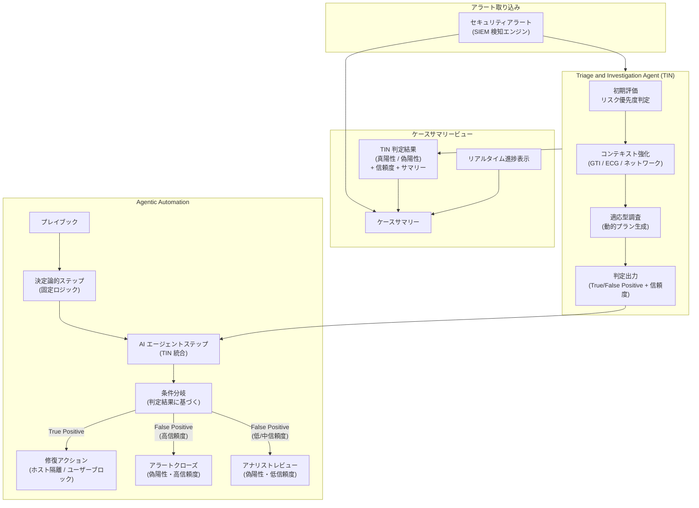

# Google SecOps: TIN ケースサマリー統合 & Agentic Automation

**リリース日**: 2026-03-20

**サービス**: Google SecOps (Google Security Operations)

**機能**: Triage and Investigation Agent (TIN) ケースサマリー統合 / Agentic Automation (AI エージェントによるプレイブック自動化)

**ステータス**: Preview (TIN ケースサマリー統合) / Public Preview (Agentic Automation)

[このアップデートのインフォグラフィックを見る](https://takech9203.github.io/google-cloud-news-summary/20260320-google-secops-tin-agentic-automation.html)

## 概要

Google SecOps に 2 つの重要な AI 駆動型セキュリティ機能がリリースされた。1 つ目は Triage and Investigation Agent (TIN) の調査結果をケースサマリービューに統合する機能で、セキュリティアナリストがケースから離れることなく TIN の判定結果やリアルタイムの進捗状況を確認できるようになった。2 つ目は Agentic Automation で、AI エージェントを既存のプレイブックワークフローに直接組み込むことが可能になった。

TIN ケースサマリー統合により、アナリストは個別の調査画面に遷移せずとも、ケースサマリー内で TIN の真陽性/偽陽性の判定結果、信頼度レベル、調査サマリーを即座に確認できる。これにより、インシデント対応のワークフローが大幅に効率化される。

Agentic Automation は、従来の決定論的なプレイブック自動化に AI エージェントの推論能力を組み合わせる新しいアプローチである。ハードコードされたロジックでは対応が難しかった未知のシナリオや部分的な障害に対して、AI エージェントが動的に推論・判断を行い、アナリストが重要なアクションの制御権を保持しながら自動化の範囲を拡大できる。

**アップデート前の課題**

- TIN の調査結果を確認するにはケースサマリーから別の画面 (Gemini Investigations サイドドロワー) に遷移する必要があり、ワークフローが中断されていた
- TIN の調査進捗をリアルタイムで把握するには、個別の調査ビューを手動で確認する必要があった
- プレイブックの自動化はすべてハードコードされた決定論的ロジックに依存しており、未知のシナリオや予期しない変数への対応が困難だった
- AI エージェントの推論結果をプレイブックのワークフロー内で直接活用する手段がなかった

**アップデート後の改善**

- ケースサマリービューで TIN の判定結果 (真陽性/偽陽性) とサマリーを直接確認でき、画面遷移が不要になった
- TIN の調査進捗がリアルタイムでケースサマリーに反映され、状況把握が即座に可能になった
- AI エージェントをプレイブックのステップとして組み込み、決定論的自動化と AI 推論を組み合わせたハイブリッドワークフローが構築可能になった
- TIN の判定結果 (判定、信頼度) に基づくプレイブックの条件分岐が可能になり、対応の自動化範囲が拡大した

## アーキテクチャ図



TIN がアラートを自律的に調査し、その結果がケースサマリーにリアルタイム表示される。Agentic Automation では TIN の判定結果をプレイブック内の条件分岐に活用し、真陽性の場合は修復アクション、偽陽性の場合は信頼度に応じてクローズまたはアナリストレビューに振り分ける。

## サービスアップデートの詳細

### 主要機能

1. **TIN ケースサマリー統合 (Preview)**
   - TIN の調査結果と判定サマリーをケースサマリービュー内で直接表示
   - リアルタイムの調査進捗更新により、アナリストはケースから離れることなく TIN の状況を把握可能
   - 真陽性/偽陽性の自動判定結果と信頼度レベルをケースコンテキスト内で確認可能
   - 段階的ロールアウトとして提供中

2. **Agentic Automation (Public Preview)**
   - AI エージェントをプレイブックのワークフローに直接埋め込み可能
   - 決定論的な自動化ステップと AI エージェントの推論を組み合わせたハイブリッドワークフローを構築
   - エージェントの実行状態を 3 つのステータス (Not Run / Running / Completed) で管理
   - 非同期処理により、エージェント実行中もプレイブックの実行キューを占有しない

3. **TIN の調査ツールセット**
   - 動的検索クエリ: SecOps 内で検索を実行・精緻化し、アラートの追加コンテキストを収集
   - GTI エンリッチメント: Google Threat Intelligence データ (ドメイン、URL、ハッシュ) で IoC を強化
   - コマンドライン分析: コマンドラインを自然言語で解説
   - プロセスツリー再構築: アラート内のプロセスを分析し、関連するシステムアクティビティの全体像を表示

4. **Expression Builder によるロジック分岐**
   - TIN の構造化された結果を Expression Builder で参照可能
   - 判定結果 (verdict) や信頼度レベル (confidence_level) に基づく条件分岐を設定
   - True Positive、False Positive (高信頼度)、False Positive (低/中信頼度) に応じた異なるワークフローパスを定義

## 技術仕様

### TIN 調査のワークフロー

| フェーズ | 説明 |
|---------|------|
| 初期評価 | アラートの詳細とメタデータを分析し、高信頼度の良性アクティビティを識別。低リスクと判定された場合は調査を終了 |
| コンテキスト強化 | GTI エンリッチメント、Entity Context Graph (ECG) 分析、ネットワークコンテキスト収集、ケースメタデータ統合、プロセスツリー構築を並列実行 |
| 適応型調査 | 前段階の結果に基づき動的に次の調査アクションを決定。GTI エンリッチメント、ECG 分析、コマンドライン分析、ターゲット検索を反復実行 |
| 判定出力 | 真陽性/偽陽性の判定、信頼度レベル、サマリー説明を構造化データとして出力 |

### Agentic Automation の構成要素

| 項目 | 詳細 |
|------|------|
| アクションタイプ | Automatic (自動実行) / Manual (アナリストが手動実行) |
| 失敗時のリトライ | トグルで設定可能 (エージェント実行自体の失敗に適用) |
| エラーハンドリング | Stop the playbook (プレイブック停止) / Skip to the next step (次のステップにスキップ) |
| エージェント状態 | Not Run / Running / Completed の 3 状態で管理 |
| 実行制限 | 自動調査: 最大 5 件/時間 (Vertex AI キャパシティに依存) |

### TIN トライアル利用制限

| 顧客ティア | 合計時間あたり制限 | 内訳 |
|------------|-------------------|------|
| Enterprise | 10 件/時間 | 自動 5 件 + 手動 5 件 |
| Enterprise Plus / Google Unified Security | 20 件/時間 | 自動 10 件 + 手動 10 件 |

トライアル期間: 2026年4月1日 - 2026年6月30日 (Enterprise、Enterprise Plus、Google Unified Security の全顧客対象)

### 必要な権限

```
chronicle.investigations.settings - エージェント設定の管理
```

TIN の利用に必要な IAM 権限の詳細は [Feature RBAC permissions and roles](https://cloud.google.com/chronicle/docs/reference/feature-rbac-permissions-roles#triageInvestigationAgent) を参照。

## 設定方法

### 前提条件

1. Google SecOps Enterprise、Enterprise Plus、または Google Unified Security パッケージの契約
2. シングルテナント構成の Google SecOps (TIN はマルチテナント構成をサポートしない)
3. `chronicle.investigations.settings` 権限を持つユーザーアカウント

### 手順

#### ステップ 1: TIN エージェントの有効化

Case Overview 画面の Gemini Investigation サイドメニューの設定から、テナントに対して TIN エージェントをオプトインする。

#### ステップ 2: AI エージェントステップをプレイブックに追加

1. Response > Playbooks に移動
2. 既存のプレイブックを開くか、新規プレイブックを作成
3. Step Selection パネルを開き、AI Agents カテゴリを選択
4. エージェントをキャンバスにドラッグ&ドロップ
5. ステップをクリックして設定パネルを開く

#### ステップ 3: エージェントステップの設定

設定パネルで以下を定義する:
- Action type: Automatic (自動) または Manual (手動) を選択
- Retry on failure: 一時的なエラー時のリトライを有効化/無効化
- Error Handling: エージェントが処理できない場合の動作を選択

#### ステップ 4: 条件分岐の設定

1. AI Agent ステップの後に Flow ブロック (Conditional) をキャンバスに追加
2. 条件をクリックし、Placeholder メニューを開く
3. AI Agent ステップの結果を選択
4. Expression Builder で評価する値 (verdict、confidence_level) を選択
5. 判定結果に基づく分岐パスを定義

## メリット

### ビジネス面

- **アナリストの生産性向上**: ケースサマリーから離れずに TIN の判定結果を確認でき、コンテキストスイッチングのコストを削減。平均調査時間の短縮が期待される
- **SOC 運用の効率化**: AI エージェントによる自動トリアージと判定により、Tier 1 アナリストの手動調査負荷を大幅に軽減
- **対応速度の向上**: Agentic Automation により、TIN の判定結果に基づく後続アクション (修復、クローズ、エスカレーション) を自動化し、MTTR (平均修復時間) を短縮

### 技術面

- **ハイブリッドワークフロー**: 決定論的自動化の予測可能性と AI エージェントの柔軟性を組み合わせ、未知のシナリオにも対応可能
- **非同期処理アーキテクチャ**: エージェント実行中もプレイブック実行キューを占有せず、並行処理のスループットを維持
- **構造化出力の活用**: TIN の判定結果を Expression Builder で参照し、プログラマティックな条件分岐が可能

## デメリット・制約事項

### 制限事項

- TIN はシングルテナント Google SecOps 構成のみサポート。マルチテナント (親テナント + 子サブテナント) 構成では利用不可
- TIN は Google SecOps SIEM で取り込まれたデータのみ処理可能。SOAR コネクター経由のアラートは処理対象外
- Agentic Automation の自動調査は最大 5 件/時間に制限。Vertex AI のキャパシティ制約の影響を受ける可能性がある
- 両機能とも Pre-GA (Preview / Public Preview) であり、サポートが限定的で、今後の仕様変更の可能性がある

### 考慮すべき点

- TIN のトライアル期間 (2026年4月1日 - 6月30日) 終了後の料金体系を確認する必要がある
- 未サポートのアラートタイプで自動エージェントステップがトリガーされた場合のエラーハンドリング設計が必要
- AI エージェントの判定結果は参考情報であり、重要なセキュリティ判断にはアナリストの確認を組み合わせることが推奨される
- TIN の調査完了には平均 60 秒、最大 20 分を要するため、リアルタイム性が求められるインシデントでは時間制約を考慮する必要がある

## ユースケース

### ユースケース 1: SOC Tier 1 アナリストのアラートトリアージ自動化

**シナリオ**: 大量のセキュリティアラートを処理する SOC で、Tier 1 アナリストが日々数百件のアラートを手動でトリアージしている。偽陽性の割合が高く、真に対応が必要なアラートの発見が遅れている。

**効果**: TIN がアラートを自動的に調査・分類し、Agentic Automation のプレイブックで偽陽性 (高信頼度) を自動クローズ。Tier 1 アナリストはケースサマリーで TIN の判定結果を確認するだけで済み、真陽性のインシデントに集中できる。

### ユースケース 2: インシデント対応のハイブリッド自動化

**シナリオ**: セキュリティチームが特定の脅威パターン (例: 不正なラテラルムーブメント) に対するインシデント対応プレイブックを運用しているが、アラートのコンテキストが不足している場合にプレイブックが停止してしまう。

**効果**: Agentic Automation で TIN を決定論的ステップと組み合わせることで、不足情報を AI エージェントが動的に補完。TIN の判定結果に基づき、True Positive の場合は自動的にホスト隔離やユーザーブロックの修復アクションを実行し、不確実な場合はアナリストにエスカレーションする適応型ワークフローが実現する。

## 料金

TIN のトライアルは 2026年4月1日から6月30日まで無料で提供される。Enterprise、Enterprise Plus、Google Unified Security の全顧客が対象。トライアル期間中は時間あたりの調査件数に上限がある (Enterprise: 10件/時、Enterprise Plus / Google Unified Security: 20件/時)。

トライアル期間終了後の料金体系については、Google SecOps の担当カスタマーエンジニアに確認することが推奨される。

## 関連サービス・機能

- **Google Threat Intelligence (GTI)**: TIN が IoC エンリッチメントに使用する脅威インテリジェンスサービス。VirusTotal のデータも統合
- **Vertex AI**: Agentic Automation の AI エージェント推論基盤。Gemini モデルによるアラート分析と判定を提供
- **Google SecOps SOAR**: プレイブックの実行環境。Agentic Automation は SOAR のプレイブック機能を拡張
- **Google SecOps SIEM**: アラート検知エンジン。TIN は SIEM で取り込まれたデータに基づいて調査を実行
- **Entity Context Graph (ECG)**: エンティティの関係性と prevalence データを提供し、TIN の調査コンテキストを強化

## 参考リンク

- [このアップデートのインフォグラフィック](https://takech9203.github.io/google-cloud-news-summary/20260320-google-secops-tin-agentic-automation.html)
- [公式リリースノート](https://cloud.google.com/release-notes#March_20_2026)
- [Use Triage and Investigation Agent (TIN) to investigate alerts](https://cloud.google.com/chronicle/docs/secops/triage-investigation-agent)
- [Agentic Automation with AI Agents](https://cloud.google.com/chronicle/docs/soar/respond/working-with-playbooks/agentic-automation)
- [Monitor TIN performance with dashboards](https://cloud.google.com/chronicle/docs/secops/triage-investigation-agent-dashboards)
- [Google SecOps packages and pricing](https://cloud.google.com/chronicle/docs/secops/secops-packages)

## まとめ

TIN ケースサマリー統合と Agentic Automation の 2 つの新機能は、Google SecOps における AI 駆動型セキュリティ運用の大きな前進である。アナリストはケースサマリーから離れることなく AI の調査結果を活用でき、プレイブック内で決定論的ステップと AI エージェントを組み合わせた適応型ワークフローを構築できる。両機能ともプレビュー段階のため、トライアル期間を活用して自組織のアラートトリアージワークフローへの適用を検証することが推奨される。

---

**タグ**: #GoogleSecOps #TIN #TriageAndInvestigationAgent #AgenticAutomation #AIAgent #Playbook #SOAR #SIEM #SecurityOperations #Preview
