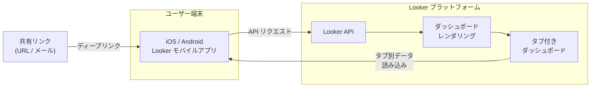

# Looker: モバイルアプリ アップデート (iOS 2.2.0 / Android 2.0.88)

**リリース日**: 2026-03-20

**サービス**: Looker

**機能**: モバイルアプリ アップデート (iOS 2.2.0 / Android 2.0.88)

**ステータス**: Feature

📊 [このアップデートのインフォグラフィックを見る](https://takech9203.github.io/google-cloud-news-summary/infographic/20260320-looker-mobile-app-update.html)

## 概要

Looker モバイルアプリの新バージョンが iOS (バージョン 2.2.0) および Android (バージョン 2.0.88) 向けにリリースされました。今回のアップデートでは、タブ付きダッシュボードのサポート、ダッシュボードリンクのアプリ内直接オープン、読み込み時間の改善、およびダッシュボードのズームに関するバグ修正が含まれています。

タブ付きダッシュボードは、関連するビジュアライゼーションやタイルを個別のタブにグループ化し、データストーリーテリングを向上させる機能です。デスクトップ版の Looker では既に利用可能でしたが、今回のアップデートによりモバイルアプリでもタブ付きダッシュボードを閲覧できるようになりました。これにより、外出先でもデスクトップと同等のダッシュボード体験が可能になります。

このアップデートは、Looker を利用するすべてのモバイルユーザーに影響があり、特に外出先やリモートワーク環境でダッシュボードを頻繁に確認するビジネスアナリストや経営層にとって有用な改善です。

**アップデート前の課題**

- モバイルアプリではタブ付きダッシュボードが表示できず、デスクトップで作成したタブ構成のダッシュボードをモバイルで正しく閲覧できなかった
- ダッシュボードのリンクを受け取った際、ブラウザで開く必要があり、アプリ内で直接アクセスできなかった
- ダッシュボードの読み込みに時間がかかり、モバイル環境での利便性が低下していた
- ダッシュボード表示時にズームに関するバグが発生し、正しくコンテンツを表示できないケースがあった

**アップデート後の改善**

- タブ付きダッシュボードがモバイルアプリ上で完全にサポートされ、デスクトップと同等の閲覧体験が可能になった
- ダッシュボードリンクをアプリ内で直接オープンできるようになり、シームレスなナビゲーションが実現した
- 読み込み時間が改善され、モバイル環境でのダッシュボード表示が高速化した
- ズームに関するバグおよびその他の問題が修正され、安定した表示が可能になった

## アーキテクチャ図

ユーザーが共有リンクからダッシュボードをアプリ内で直接オープンし、Looker API を通じてタブ付きダッシュボードのデータを取得するフローを示しています。タブ別にデータが読み込まれるため、アクティブなタブのみのデータがロードされ、パフォーマンスが向上します。

## サービスアップデートの詳細

### 主要機能

1. **タブ付きダッシュボードのサポート**
   - モバイルアプリ上でダッシュボードのタブ間をスワイプまたはタップで切り替え可能
   - デスクトップで作成したタブ構成がモバイルでも維持され、コンテンツの整理やデータストーリーテリングがそのまま反映される
   - アクティブなタブのタイルのみがロードされるため、初期読み込みのパフォーマンスが向上

2. **ダッシュボードリンクのアプリ内オープン**
   - メールやチャットで受け取ったダッシュボードリンクをタップすると、ブラウザではなく Looker モバイルアプリで直接オープンされる
   - ディープリンク対応により、特定のダッシュボードに素早くアクセス可能
   - ユーザーの操作ステップが削減され、ワークフローが効率化

3. **読み込み時間の改善**
   - ダッシュボードの初期ロード時間が短縮され、モバイル回線環境でも快適に利用可能
   - タブ付きダッシュボードではアクティブタブのみを読み込む遅延ロード方式を採用

4. **バグ修正と安定性の向上**
   - ダッシュボードオープン時のズームバグを修正
   - その他の既知の問題を修正し、アプリ全体の安定性が向上

## 技術仕様

### 対応バージョンと要件

| 項目 | 詳細 |
|------|------|
| iOS バージョン | 2.2.0 |
| Android バージョン | 2.0.88 |
| iOS 最小要件 | iOS 13 以上 |
| Android 最小要件 | Android 8 以上 |
| タブ付きダッシュボードの最大タブ数 | デフォルト 5 (管理者により変更可能、推奨 10 以下) |
| 推奨タイル数 | タブあたり 20 以下 |

### タブ付きダッシュボードの制限事項

| 項目 | 詳細 |
|------|------|
| タブごとのアクセス制御 | 不可 (ダッシュボード単位で制御) |
| タブごとのテーマ設定 | 不可 |
| 個別タブのダウンロード・印刷 | 不可 |
| Looker インスタンス要件 | Looker 26.4 以降 |

## 設定方法

### 前提条件

1. Looker インスタンスがバージョン 26.4 以降であること
2. モバイルアプリのアクセスが管理者により有効化されていること
3. ダッシュボードへの閲覧権限 (View アクセスレベル) を持っていること

### 手順

#### ステップ 1: アプリのアップデート

iOS の場合は App Store、Android の場合は Google Play Store から Looker アプリを最新バージョンにアップデートします。

- **iOS**: [App Store](https://apps.apple.com/us/app/looker-studio/id1644381985) から更新
- **Android**: [Google Play Store](https://play.google.com/store/apps/details?id=com.google.android.apps.cloud.cloudbi) から更新

#### ステップ 2: タブ付きダッシュボードの確認

アプリを起動し、タブ付きダッシュボードにアクセスして、タブが正しく表示されることを確認します。タブをタップして切り替えができることを検証してください。

#### ステップ 3: ディープリンクの動作確認

メールやチャットアプリからダッシュボードのリンクをタップし、Looker モバイルアプリで直接オープンされることを確認します。

## メリット

### ビジネス面

- **意思決定の迅速化**: 外出先でもタブ付きダッシュボードの完全な閲覧が可能になり、リアルタイムなデータに基づく迅速な判断が可能
- **コラボレーションの向上**: ダッシュボードリンクのアプリ内オープンにより、チーム間でのデータ共有がスムーズに行える
- **モバイルワークの生産性向上**: 読み込み時間の短縮とバグ修正により、モバイル環境での分析作業の生産性が向上

### 技術面

- **パフォーマンスの最適化**: タブ付きダッシュボードの遅延ロードにより、モバイル環境でのメモリ使用量とネットワーク帯域が最適化
- **UX の一貫性**: デスクトップとモバイルで同一のダッシュボード構成を閲覧可能になり、プラットフォーム間の体験が統一
- **安定性の向上**: ズームバグの修正により、ダッシュボード表示の信頼性が向上

## デメリット・制約事項

### 制限事項

- タブ付きダッシュボードを作成・編集するにはデスクトップ版の Looker が必要であり、モバイルアプリでのタブの作成・編集はできない
- タブごとのアクセス制御は現時点ではサポートされていない
- Looker インスタンスがバージョン 26.4 以降でなければタブ付きダッシュボードは利用できない

### 考慮すべき点

- Looker Mobile (Legacy) アプリは 2026 年 8 月 31 日に廃止予定のため、新しい Looker アプリへの移行を早期に計画する必要がある
- 多数のタブやタイルを含むダッシュボードでは、モバイル環境でのパフォーマンスに影響が出る可能性がある (推奨: 10 タブ以下、タブあたり 20 タイル以下)

## ユースケース

### ユースケース 1: 営業チームの外出先でのKPI確認

**シナリオ**: 営業マネージャーが顧客訪問の合間に、売上ダッシュボードをモバイルで確認する。ダッシュボードには「売上概要」「地域別詳細」「顧客別分析」の 3 つのタブがあり、必要な情報にタブを切り替えてアクセスする。

**効果**: タブ付きダッシュボードにより、1 つのダッシュボードで複数の視点からデータを確認でき、複数のダッシュボードを切り替える手間が不要になる。読み込み時間の改善により、移動中の限られた時間でも素早くデータにアクセス可能。

### ユースケース 2: 経営層へのダッシュボード共有

**シナリオ**: データアナリストが作成したタブ付きダッシュボードのリンクを、Slack や メールで経営層に共有する。経営層はモバイル端末でリンクをタップし、Looker アプリで直接ダッシュボードを確認する。

**効果**: ディープリンク対応により、リンクをタップするだけでアプリ内で直接ダッシュボードが開き、ブラウザを経由する手間がなくなる。タブ構成により、経営層は必要な情報に素早くアクセスできる。

## 料金

Looker モバイルアプリは、Looker のサブスクリプションに含まれており、追加料金なしで利用できます。Looker の料金体系はインスタンスタイプや利用形態によって異なるため、詳細は Google Cloud の営業担当または料金ページをご確認ください。

| 項目 | 詳細 |
|------|------|
| モバイルアプリ | Looker サブスクリプションに含まれる (追加費用なし) |
| タブ付きダッシュボード | Looker サブスクリプションに含まれる (追加費用なし) |

## 利用可能リージョン

Looker モバイルアプリはグローバルに利用可能です。Looker インスタンスがホストされているリージョンに関わらず、iOS および Android 端末からアクセスできます。アプリは Apple App Store および Google Play Store から世界各国でダウンロード可能です。

## 関連サービス・機能

- **[Looker タブ付きダッシュボード](https://cloud.google.com/looker/docs/tabbed-dashboards)**: デスクトップ版でのタブ付きダッシュボードの作成・管理機能。モバイルアプリでの閲覧の前提となる機能
- **[Looker Mobile (Legacy)](https://cloud.google.com/looker/docs/mobile-app-legacy)**: 旧モバイルアプリ。2026 年 8 月 31 日に廃止予定のため、新しい Looker アプリへの移行を推奨
- **[Looker Studio Pro モバイルアプリ](https://cloud.google.com/looker/docs/studio/how-to-use-the-looker-studio-mobile-app)**: Looker Studio Pro ユーザー向けのモバイルアプリ。レポートやデータソースへのモバイルアクセスを提供

## 参考リンク

- 📊 [インフォグラフィック](https://takech9203.github.io/google-cloud-news-summary/infographic/20260320-looker-mobile-app-update.html)
- [公式リリースノート](https://cloud.google.com/looker/docs/release-notes)
- [Looker モバイルアプリ ドキュメント](https://cloud.google.com/looker/docs/looker-core-mobile-app)
- [タブ付きダッシュボード ドキュメント](https://cloud.google.com/looker/docs/tabbed-dashboards)
- [Looker 料金ページ](https://cloud.google.com/looker/pricing)

## まとめ

今回の Looker モバイルアプリのアップデートは、タブ付きダッシュボードのモバイル対応やディープリンクのサポートにより、モバイル環境でのデータ分析体験を大幅に向上させるものです。特に外出先で頻繁にダッシュボードを確認するユーザーにとって、読み込み速度の改善と合わせて実用的な改善となっています。Looker を利用している組織では、モバイルアプリを最新バージョンにアップデートし、タブ付きダッシュボードの活用を検討することを推奨します。

---

**タグ**: #Looker #モバイルアプリ #タブ付きダッシュボード #BI #ダッシュボード #パフォーマンス改善
