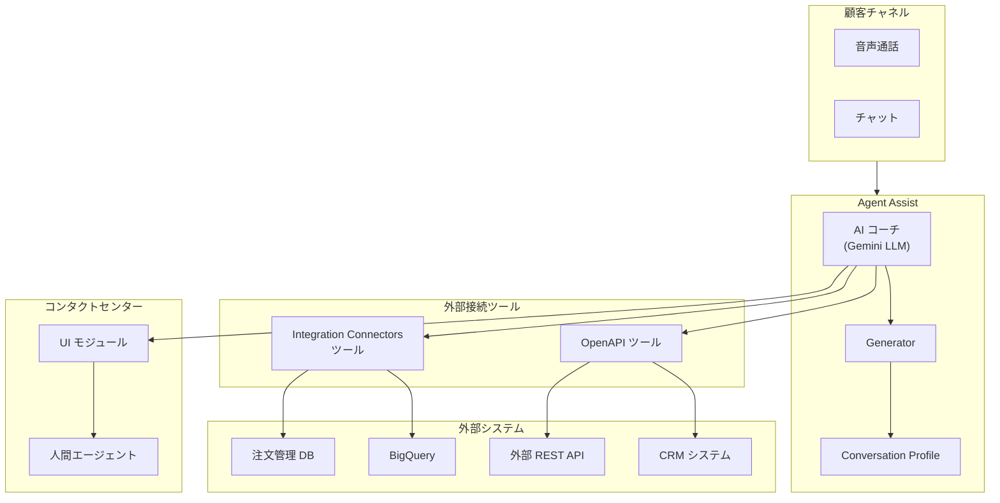

# Agent Assist: Gemini Enterprise for CX の AI コーチツールが GA

**リリース日**: 2026-03-23

**サービス**: Agent Assist

**機能**: Gemini Enterprise for Customer Experience の AI コーチツールが一般提供開始

**ステータス**: GA (一般提供)

📊 [このアップデートのインフォグラフィックを見る](https://takech9203.github.io/google-cloud-news-summary/infographic/20260323-agent-assist-gemini-enterprise-ai-coach-ga.html)

## 概要

Google Cloud は、Agent Assist において Gemini Enterprise for Customer Experience (CX) ツールを AI コーチ機能向けに一般提供 (GA) として開始しました。これらのツールにより、仮想エージェントが外部システムに接続して情報の取得、更新、フォーマット、分析を行うことが可能になります。

AI コーチは、大規模言語モデル (LLM) を活用して、カスタマーサービスの会話中にコンタクトセンターのエージェントへリアルタイムで応答提案を行う機能です。今回のアップデートにより、OpenAPI ツールおよび Integration Connectors ツールが AI コーチと統合され、外部 API やデータソースからの動的な情報取得が可能になりました。

この機能は、コンタクトセンターの運用効率を大幅に改善し、エージェントがより正確かつ迅速に顧客の問い合わせに対応できるようにすることを目的としています。アップセル、クロスセル、顧客維持、業務自動化など、幅広いカスタマーサービスシナリオで活用できます。

**アップデート前の課題**

- AI コーチは内部のナレッジベースのみに依存しており、外部システムのリアルタイムデータにアクセスできなかった
- エージェントが顧客対応中に外部システム (CRM、注文管理、在庫管理など) の情報を手動で検索する必要があった
- 仮想エージェントと外部データソース間の統合にはカスタム開発が必要で、導入コストと時間がかかっていた

**アップデート後の改善**

- OpenAPI ツールにより、AI コーチが外部 API からリアルタイムで情報を取得し、会話コンテキストに基づいた提案が可能になった
- Integration Connectors ツールにより、BigQuery をはじめとする多様なデータソースとの接続が標準機能として利用可能になった
- エージェントが会話を離れることなく、外部システムの最新情報を活用した正確な応答を顧客に提供できるようになった

## アーキテクチャ図



AI コーチが会話コンテキストを分析し、OpenAPI ツールまたは Integration Connectors ツールを通じて外部システムから必要な情報を取得し、エージェントに最適な応答提案を提供するフローを示しています。

## サービスアップデートの詳細

### 主要機能

1. **OpenAPI ツール統合**
   - OpenAPI スキーマを定義することで、任意の外部 REST API に AI コーチから接続可能
   - 会話コンテキストに基づいて自動的にパラメータを抽出し、適切な API リクエストを生成
   - Cloud Run functions をラッパーとして使用し、既存 API への柔軟な接続もサポート

2. **Integration Connectors ツール**
   - Google Cloud の Integration Connectors を活用して多様なデータソースに接続
   - BigQuery、Salesforce、SAP などのエンタープライズシステムとの統合が可能
   - エンティティ操作 (LIST、GET) を通じたデータの読み取りと書き込みに対応

3. **AI コーチのリアルタイム提案強化**
   - 外部データを活用したコンテキスト認識型の応答提案
   - アップセル、クロスセル、顧客維持に特化した指示 (Instructions) の設定が可能
   - すべての Google Cloud 対応言語およびリージョンで利用可能

## 技術仕様

### API と構成要素

| 項目 | 詳細 |
|------|------|
| API バージョン | v2beta1 (Dialogflow API) |
| エンドポイント | `https://{REGION}-dialogflow.googleapis.com/v2beta1` |
| ツールタイプ | OpenAPI ツール、Integration Connectors ツール |
| トリガーイベント | `CUSTOMER_MESSAGE` (顧客メッセージ受信時) |
| 推論パラメータ | `max_output_tokens`、`temperature` の調整が可能 |
| 対応言語 | すべての Agent Assist 対応言語 |
| 対応リージョン | すべての Agent Assist 対応リージョン |

### OpenAPI ツール作成例

```json
{
  "tool_key": "order_lookup_tool",
  "description": "顧客の注文情報を検索するツール",
  "display_name": "注文検索ツール",
  "open_api_spec": {
    "text_schema": "openapi: 3.0.0\ninfo:\n  title: Order API\n  version: 1.0.0\npaths:\n  /orders/{orderId}:\n    get:\n      summary: 注文情報を取得\n      parameters:\n        - name: orderId\n          in: path\n          required: true\n          schema:\n            type: string"
  }
}
```

### Generator 設定例 (AI コーチ)

```json
{
  "agent_coaching_context": {
    "instructions": [
      {
        "display_name": "注文状況確認",
        "condition": "顧客が注文状況について質問した場合",
        "agent_action": "ツールを使用して注文情報を検索し、最新の配送状況を顧客に伝える",
        "description": "注文追跡の支援"
      }
    ],
    "overarching_guidance": "顧客の問い合わせに迅速かつ正確に対応する"
  },
  "inference_parameter": {
    "max_output_tokens": 256,
    "temperature": 0
  },
  "tools": ["projects/{PROJECT_ID}/locations/{REGION}/tools/{TOOL_ID}"],
  "trigger_event": "CUSTOMER_MESSAGE"
}
```

## 設定方法

### 前提条件

1. Google Cloud プロジェクトで Dialogflow API が有効であること
2. 適切な IAM ロール (`roles/dialogflow.agentAssistClient`) が付与されていること
3. 接続先の外部 API の仕様 (OpenAPI スキーマ) または Integration Connectors の設定が準備されていること

### 手順

#### ステップ 1: 環境変数の設定

```bash
CLOUDSDK_CORE_PROJECT=YOUR_PROJECT_ID
REGION=YOUR_REGION
API_VERSION=v2beta1
API_ENDPOINT=https://${REGION}-dialogflow.googleapis.com/${API_VERSION}
```

#### ステップ 2: OpenAPI ツールの作成

```bash
cat > create-tool-request.json << EOF
{
  "tool_key": "UNIQUE_KEY",
  "description": "TOOL_DESCRIPTION",
  "display_name": "TOOL_DISPLAY_NAME",
  "open_api_spec": {
    "text_schema": "YOUR_OPENAPI_SCHEMA"
  }
}
EOF

curl -X POST \
  -H "Authorization: Bearer $(gcloud auth print-access-token)" \
  -H "Content-Type: application/json" \
  ${API_ENDPOINT}/projects/${CLOUDSDK_CORE_PROJECT}/locations/${REGION}/tools \
  -d @create-tool-request.json
```

#### ステップ 3: Generator の作成

```bash
cat > create-generator-request.json << EOF
{
  "agent_coaching_context": {
    "instructions": [
      {
        "agent_action": "ツールを使って情報を検索し顧客を支援する",
        "condition": "顧客が情報を求めた場合",
        "description": "AI コーチによる支援",
        "display_name": "情報検索支援"
      }
    ],
    "overarching_guidance": "顧客の質問に正確に回答する"
  },
  "inference_parameter": {
    "max_output_tokens": 256,
    "temperature": 0
  },
  "tools": ["${TOOL_RESOURCE}"],
  "trigger_event": "CUSTOMER_MESSAGE"
}
EOF

curl -X POST \
  -H "Authorization: Bearer $(gcloud auth print-access-token)" \
  -H "Content-Type: application/json" \
  ${API_ENDPOINT}/projects/${CLOUDSDK_CORE_PROJECT}/locations/${REGION}/generators \
  -d @create-generator-request.json
```

#### ステップ 4: Conversation Profile の作成

```bash
cat > create-conversation-profile-request.json << EOF
{
  "displayName": "ai-coach-with-tools",
  "humanAgentAssistantConfig": {
    "humanAgentSuggestionConfig": {
      "generators": ["${GENERATOR_RESOURCE}"]
    }
  }
}
EOF

curl -X POST \
  -H "Authorization: Bearer $(gcloud auth print-access-token)" \
  -H "Content-Type: application/json" \
  ${API_ENDPOINT}/projects/${CLOUDSDK_CORE_PROJECT}/locations/${REGION}/conversationProfiles \
  -d @create-conversation-profile-request.json
```

## メリット

### ビジネス面

- **顧客対応品質の向上**: 外部システムのリアルタイムデータに基づく正確な情報提供により、顧客満足度が向上する
- **エージェントの生産性向上**: 手動でのシステム検索が不要になり、対応時間が短縮される
- **収益機会の拡大**: アップセルやクロスセルの提案が顧客コンテキストに基づいて最適化される

### 技術面

- **標準化された統合**: OpenAPI スキーマを使用した標準的な方法で外部 API と接続できる
- **柔軟なデータソース接続**: Integration Connectors により、BigQuery、Salesforce、SAP など多様なシステムとの統合が容易
- **Cloud Run functions によるラッパー対応**: 既存 API の仕様変更なしに、Cloud Run functions を介した柔軟な接続が可能

## デメリット・制約事項

### 制限事項

- API バージョンは v2beta1 であり、一部の機能は今後変更される可能性がある
- OpenAPI ツールの作成には、接続先 API の OpenAPI スキーマを事前に準備する必要がある
- Dialogflow API のクォータ制限が各機能の利用に適用される

### 考慮すべき点

- 外部 API のレイテンシがリアルタイム提案の応答速度に影響する可能性がある
- 外部システムとの接続にはネットワーク設定 (VPC、ファイアウォールルール) の適切な構成が必要
- 機密データを扱う場合は、CMEK (Customer Managed Encryption Key) の導入を検討すること

## ユースケース

### ユースケース 1: EC サイトの注文問い合わせ対応

**シナリオ**: 顧客がコンタクトセンターに電話し、注文の配送状況を問い合わせるケース。AI コーチが注文管理システムの API を通じてリアルタイムの配送情報を取得し、エージェントに提案する。

**実装例**:
```json
{
  "agent_coaching_context": {
    "instructions": [
      {
        "display_name": "配送状況確認",
        "condition": "顧客が注文の配送状況を質問した場合",
        "agent_action": "注文検索ツールを使用して注文番号から配送状況を検索し、最新情報を顧客に伝える"
      }
    ]
  },
  "tools": ["projects/my-project/locations/us-central1/tools/order-api-tool"]
}
```

**効果**: エージェントが注文管理システムに手動でアクセスする必要がなくなり、平均対応時間を 30-40% 短縮できる可能性がある

### ユースケース 2: 金融サービスの顧客維持

**シナリオ**: 解約を検討している顧客からの問い合わせに対し、AI コーチが CRM システムから顧客の利用履歴と適格なリテンションオファーを取得し、エージェントに最適な提案を提示する。

**効果**: データに基づいたパーソナライズされたリテンションオファーにより、顧客維持率の改善が期待できる

## 料金

Agent Assist の料金は、Gemini Enterprise for Customer Experience (CX) のライセンスモデルに基づきます。具体的な料金は利用する機能と通話/チャットのボリュームに依存します。

### 料金例

| 項目 | 詳細 |
|------|------|
| Agent Assist 基本機能 | Gemini Enterprise for CX ライセンスに含まれる |
| API 利用量 | Dialogflow API のクォータに基づく従量課金 |
| Integration Connectors | 接続するコネクタの種類と利用量に応じた課金 |

詳細な料金については、Google Cloud の営業担当または公式料金ページを参照してください。

## 利用可能リージョン

AI コーチおよびツール統合は、すべての Agent Assist 対応リージョンで利用可能です。主要なリージョンは以下の通りです。

- us-central1 (アイオワ)
- us-west1 (オレゴン)
- europe-west1 (ベルギー)
- europe-west2 (ロンドン)
- europe-west4 (エームスハーフェン)
- europe-west6 (チューリッヒ)
- asia-northeast1 (東京)
- asia-southeast1 (シンガポール)
- asia-southeast2 (ジャカルタ)
- northamerica-northeast1 (モントリオール)
- northamerica-northeast2 (トロント)
- me-west1 (テルアビブ)
- global

## 関連サービス・機能

- **Gemini Enterprise for Customer Experience**: AI コーチを含む統合カスタマーエクスペリエンスソリューション
- **Dialogflow CX**: 高度な仮想エージェントの構築プラットフォーム
- **Customer Experience Insights**: コンタクトセンターのデータ分析と KPI 提供
- **Integration Connectors**: 多様なデータソースへの接続を提供するコネクタサービス
- **Cloud Run functions**: 外部 API のラッパーとして AI コーチツールと併用可能

## 参考リンク

- 📊 [インフォグラフィック](https://takech9203.github.io/google-cloud-news-summary/infographic/20260323-agent-assist-gemini-enterprise-ai-coach-ga.html)
- [公式リリースノート](https://cloud.google.com/agent-assist/docs/release-notes)
- [AI コーチ概要](https://cloud.google.com/agent-assist/docs/ai-coach-overview)
- [OpenAPI / Integration Connectors ツール](https://cloud.google.com/agent-assist/docs/tools)
- [Datastore アクセス用 OpenAPI ツール設定](https://cloud.google.com/agent-assist/docs/tools_data_store)
- [Gemini Enterprise for CX](https://cloud.google.com/customer-engagement-ai)

## まとめ

Agent Assist における Gemini Enterprise for CX の AI コーチツール GA は、コンタクトセンターのエージェント支援を大きく進化させるアップデートです。外部システムとのリアルタイム連携により、エージェントは会話中に最新の顧客情報や業務データにアクセスでき、より正確でパーソナライズされた対応が可能になります。既にコンタクトセンターで Agent Assist を利用している組織は、OpenAPI ツールまたは Integration Connectors ツールの設定を通じて、この機能の導入を検討することを推奨します。

---

**タグ**: #AgentAssist #GeminiEnterprise #CustomerExperience #AIコーチ #ContactCenter #OpenAPI #IntegrationConnectors #GA
