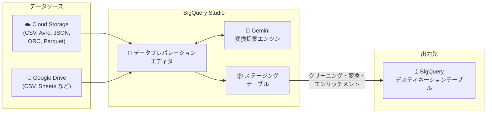

# BigQuery: Cloud Storage / Google Drive ファイルからのデータプレパレーション (GA)

**リリース日**: 2026-03-23

**サービス**: BigQuery

**機能**: Data preparations from Cloud Storage and Google Drive files

**ステータス**: GA (一般提供)

:bar_chart: [このアップデートのインフォグラフィックを見る](https://takech9203.github.io/google-cloud-news-summary/20260323-bigquery-data-preparations-ga.html)

## 概要

BigQuery のデータプレパレーション機能において、Cloud Storage および Google Drive に保存されたファイルを直接データソースとして利用できるようになりました。この機能が一般提供 (GA) となり、本番環境での利用が正式にサポートされます。

データプレパレーションは、Gemini in BigQuery を活用した AI 支援型のデータ準備機能です。ユーザーは BigQuery Studio 上のデータプレパレーションエディタで、Cloud Storage や Google Drive のファイルに対してクリーニング、変換、エンリッチメントの操作を行えます。Gemini がデータとスキーマを分析し、文脈に応じた変換提案を自動的に生成するため、手動でのデータ準備作業にかかる時間と労力を大幅に削減できます。

この機能は、データエンジニア、データアナリスト、ビジネスユーザーなど、BigQuery にデータを取り込む前の前処理が必要なすべてのユーザーを対象としています。

**アップデート前の課題**

- Cloud Storage や Google Drive のファイルデータを BigQuery で分析するには、事前に手動で ETL パイプラインを構築するか、外部テーブルを作成してから別途データクリーニングを行う必要があった
- ファイルデータの品質問題 (フォーマット不統一、欠損値、データ型の不一致など) を解決するには SQL やスクリプトを個別に記述する必要があった
- Cloud Storage / Google Drive ファイルからのデータプレパレーションは Preview 段階であり、本番ワークロードでの利用に制約があった

**アップデート後の改善**

- Cloud Storage および Google Drive のファイルを BigQuery データプレパレーションのソースとして直接利用可能になった (GA)
- Gemini による AI 支援でデータのクリーニング、変換、エンリッチメント提案が自動生成され、コーディング不要で前処理を実行可能
- GA となったことで SLA の対象となり、本番ワークロードでの安定した利用が保証される

## アーキテクチャ図

Cloud Storage / Google Drive のファイルがデータプレパレーションエディタに読み込まれ、Gemini の AI 支援による変換提案を適用した後、BigQuery のデスティネーションテーブルに出力されるフローを示しています。

## サービスアップデートの詳細

### 主要機能

1. **Cloud Storage ファイルからのデータプレパレーション**
   - Cloud Storage バケット内のファイルをデータプレパレーションのソースとして選択可能
   - サポートされるファイル形式: Avro, CSV, JSONL, ORC, Parquet
   - DAT, TSV, TXT などの互換ファイルタイプは CSV 形式として読み取り可能
   - ワイルドカード検索 (`*.csv` など) に対応
   - ファイル形式は自動検出される

2. **Google Drive ファイルからのデータプレパレーション**
   - Google Drive に保存されたファイルをデータプレパレーションのソースとして利用可能
   - BigQuery の外部テーブル対応形式 (CSV, JSONL, Avro, Google Sheets) をサポート

3. **Gemini による AI 支援変換**
   - データとスキーマを分析して文脈に応じた変換提案を自動生成
   - 型変換 (CAST)、文字列関数 (SUBSTR, CONCAT, REPLACE, UPPER, LOWER, TRIM)、日時関数 (PARSE_DATE, TIMESTAMP, EXTRACT, DATE_ADD)、JSON 関数 (JSON_VALUE, JSON_QUERY) などの提案
   - セルの値を編集することで Gemini の提案品質を改善可能
   - 自然言語で提案カードを編集・カスタマイズ可能

4. **データプレパレーションステップ**
   - Transformation (変換): SQL 式によるデータクリーニングと変換
   - Filter (フィルタ): WHERE 句によるレコード除外
   - Deduplicate (重複排除): 選択キーに基づく重複行の除去
   - Validation (バリデーション): 条件を満たさない行をエラーテーブルに分離
   - Join (結合): 2つのソースからの Inner / Left / Right / Full Outer / Cross Join
   - Destination (出力先): デスティネーションテーブルの定義

## 技術仕様

### サポートファイル形式

| ソース | サポート形式 |
|--------|-------------|
| Cloud Storage | Avro, CSV, JSONL, ORC, Parquet (DAT, TSV, TXT は CSV として読み取り) |
| Google Drive | CSV, JSONL, Avro, Google Sheets |

### データプレパレーションの動作

| 項目 | 詳細 |
|------|------|
| データサンプリング | 標準テーブル: TABLESAMPLE で 10,000 レコードのサンプル生成 |
| 外部テーブル/ビュー | 最初の 100 万レコードから代表的な 10,000 レコードを選択 |
| サンプル更新 | 手動リフレッシュが必要 (約 24 時間でキャッシュ期限切れ) |
| バージョン管理 | リポジトリ内: Git ベースのバージョン管理対応、リポジトリ外: バージョン履歴の一覧表示のみ |
| ファイル形式 | SQLX (Dataform 互換) |

### 必要な権限

| 項目 | 詳細 |
|------|------|
| Gemini セットアップ | Gemini in BigQuery の有効化が必要 |
| IAM | データプレパレーション作成者に Dataform Admin ロール (`roles/dataform.admin`) が自動付与 |
| スケジュール実行 | Dataform サービスアカウントに適切な IAM 権限が必要 |

## 設定方法

### 前提条件

1. Gemini in BigQuery が有効化されていること ([セットアップガイド](https://cloud.google.com/bigquery/docs/gemini-set-up))
2. Cloud Storage バケットまたは Google Drive ファイルへのアクセス権限
3. BigQuery Studio の利用可能なプロジェクト

### 手順

#### ステップ 1: データプレパレーションの作成

Google Cloud コンソールで BigQuery ページを開き、「Create new」リストから「Data preparation」を選択します。

#### ステップ 2: データソースの選択

データソースリストから「Google Cloud Storage」または「Google Drive」を選択し、対象ファイルを指定します。Cloud Storage の場合はバケットパス (例: `BUCKET_NAME/FILE_NAME.csv`) を入力します。

#### ステップ 3: ステージングテーブルの定義

Staging table セクションで、プロジェクト、データセット、テーブル名を指定します。スキーマは自動検出され、Gemini がカラム名を推定します。

#### ステップ 4: データの準備と変換

データプレパレーションエディタで、Gemini が提案する変換ステップを確認・適用します。カラムやセルをクリックすると追加の提案が生成されます。

#### ステップ 5: デスティネーションテーブルの設定と実行

出力先テーブルを設定し、データプレパレーションを実行します。必要に応じてスケジュール実行を設定できます。

## メリット

### ビジネス面

- **データ準備時間の短縮**: Gemini の AI 支援により、手動でのデータクリーニング・変換作業を大幅に削減できる
- **ノーコードでのデータ前処理**: SQL やプログラミングの専門知識がなくても、GUI ベースでファイルデータの品質改善が可能
- **本番環境での信頼性**: GA となったことで SLA に基づく安定した運用が可能

### 技術面

- **多様なファイル形式対応**: Avro, CSV, JSONL, ORC, Parquet など主要なデータ形式をサポート
- **CI/CD 対応**: Dataform 連携によりバージョン管理とパイプラインの自動化が可能
- **スケジュール実行**: データプレパレーションの定期実行をサポートし、継続的なデータパイプラインを構築可能
- **インクリメンタル処理**: データプレパレーションの最適化として差分処理に対応

## デメリット・制約事項

### 制限事項

- ソースとデスティネーションのデータセットは同一ロケーションに配置する必要がある
- パイプライン編集中のデータとインタラクションは Gemini データセンターに送信されて処理される
- Gemini in BigQuery は Assured Workloads に対応していない
- リポジトリ外のデータプレパレーションではバージョンの比較・復元機能が利用できない
- データプレパレーション独自の API は提供されていない

### 考慮すべき点

- Gemini の提案はデータセットのサンプルに基づいて生成されるため、全データに対する最適な変換とは限らない
- Gemini in BigQuery は BigQuery 本体と同一のコンプライアンス・セキュリティオファリングに対応していないため、高度なコンプライアンス要件のあるプロジェクトでは利用可否を事前に確認すること
- VPC Service Controls を使用している場合、Dataform と BigQuery の両方を対象としたペリメータ設定が必要

## ユースケース

### ユースケース 1: Cloud Storage からの定期データ取り込みパイプライン

**シナリオ**: 外部パートナーから毎日 Cloud Storage に CSV ファイルがアップロードされるが、フォーマットの不統一 (日付形式の違い、全角/半角混在、NULL 値の表現揺れなど) があり、分析前にクリーニングが必要。

**効果**: データプレパレーションでクリーニングルールを定義し、Dataform と連携したスケジュール実行を設定することで、毎日自動的にクリーンなデータが BigQuery テーブルに取り込まれる。

### ユースケース 2: Google Drive のスプレッドシートデータの統合分析

**シナリオ**: 各部門が Google Sheets で管理している売上データや在庫データを BigQuery に集約して分析したいが、部門ごとにスキーマやデータ形式が異なる。

**効果**: Google Drive ファイルからデータプレパレーションを作成し、Gemini の提案に従ってスキーママッピングとデータ型変換を実施。統一されたフォーマットで BigQuery テーブルに出力し、横断的な分析が可能になる。

## 料金

データプレパレーションの実行とデータプレビューサンプルの作成には BigQuery リソースが使用され、[BigQuery の料金](https://cloud.google.com/bigquery/pricing) に基づいて課金されます。データプレパレーション機能自体は [Gemini in BigQuery の料金](https://cloud.google.com/products/gemini/pricing#gemini-in-bigquery-pricing) に含まれます。

詳細は以下の料金ページを参照してください。

- [BigQuery 料金](https://cloud.google.com/bigquery/pricing)
- [Gemini for Google Cloud 料金](https://cloud.google.com/products/gemini/pricing)

## 利用可能リージョン

データプレパレーションはサポートされているすべての [BigQuery ロケーション](https://cloud.google.com/bigquery/docs/locations) で利用可能です。データ処理ジョブはソースデータセットのロケーションで実行・保存されます。コードアセットの保存リージョンはジョブ実行リージョンと異なる場合があります。

詳細は [BigQuery Studio ロケーション](https://cloud.google.com/bigquery/docs/locations#bqstudio-loc) を参照してください。

## 関連サービス・機能

- **[Gemini in BigQuery](https://cloud.google.com/bigquery/docs/gemini-overview)**: データプレパレーションの AI 支援を提供する基盤機能。SQL 生成、Python コード補完、データキャンバス、データインサイトなど幅広い AI 支援を提供
- **[Dataform](https://cloud.google.com/dataform/docs/overview)**: データプレパレーションのスケジュール実行とバージョン管理 (CI/CD) を提供
- **[Cloud Storage](https://cloud.google.com/storage/docs)**: データプレパレーションのファイルソースの一つ。構造化・半構造化データファイルの保存に使用
- **[BigQuery パイプライン](https://cloud.google.com/bigquery/docs/workflows-introduction)**: データプレパレーション、SQL クエリ、ノートブックタスクを組み合わせたパイプラインの構築が可能

## 参考リンク

- :bar_chart: [インフォグラフィック](https://takech9203.github.io/google-cloud-news-summary/20260323-bigquery-data-preparations-ga.html)
- [公式リリースノート](https://docs.cloud.google.com/release-notes#March_23_2026)
- [Prepare data with Gemini ドキュメント](https://cloud.google.com/bigquery/docs/data-prep-get-suggestions)
- [Introduction to BigQuery data preparation](https://cloud.google.com/bigquery/docs/data-prep-introduction)
- [Gemini in BigQuery 概要](https://cloud.google.com/bigquery/docs/gemini-overview)
- [Gemini for Google Cloud 料金](https://cloud.google.com/products/gemini/pricing)

## まとめ

BigQuery のデータプレパレーション機能で Cloud Storage および Google Drive ファイルからの直接データ準備が GA となったことで、ファイルベースのデータを BigQuery に取り込む際の前処理ワークフローが大幅に簡素化されます。Gemini の AI 支援による変換提案とスケジュール実行機能を活用し、ファイルデータの定期的なクリーニング・変換パイプラインの構築を検討してください。まずは Gemini in BigQuery のセットアップを完了し、小規模なファイルデータで機能を検証することを推奨します。

---

**タグ**: #BigQuery #Gemini #DataPreparation #CloudStorage #GoogleDrive #GA #DataCleaning #ETL
