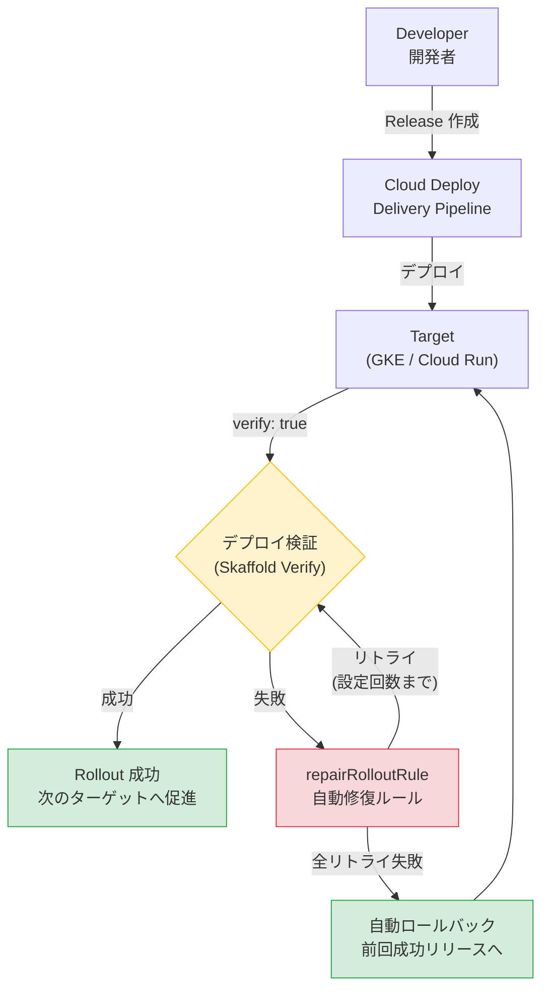

# Cloud Deploy: デプロイ検証と自動ロールバックアクション (Preview)

**リリース日**: 2026-03-23

**サービス**: Cloud Deploy

**機能**: デプロイ検証と自動ロールバックアクション

**ステータス**: Preview

[このアップデートのインフォグラフィックを見る](https://takech9203.github.io/google-cloud-news-summary/20260323-cloud-deploy-deployment-verification.html)

## 概要

Google Cloud Deploy に、デプロイ後のアプリケーションパフォーマンスを任意のモニタリングプラットフォームで分析し、検証結果に基づいてロールバックなどのアクションを自動的にトリガーする機能が Preview として追加されました。

この機能は、Cloud Deploy の既存のデプロイ検証 (Deployment Verification) 機能と自動化ルール (Automation Rules) を組み合わせたもので、デプロイパイプライン全体の安全性と信頼性を大幅に向上させます。CI/CD パイプラインにおいて、デプロイ後の品質ゲートを自動化したい DevOps エンジニアや SRE チームに特に有用な機能です。

**アップデート前の課題**

- デプロイ後のアプリケーション検証は手動で実施するか、別途スクリプトやツールを用意する必要があった
- 検証に失敗した場合のロールバック判断と実行を人手で行う必要があり、対応が遅れるリスクがあった
- モニタリングプラットフォームとデプロイパイプラインの連携が分断されており、検出から復旧までの時間 (MTTR) が長くなりがちだった

**アップデート後の改善**

- 任意のモニタリングプラットフォームを使ってデプロイ後のアプリケーションパフォーマンスを自動的に分析可能になった
- 検証失敗時にロールバックなどのアクションを自動トリガーすることで、人手を介さずに迅速な復旧が可能になった
- `repairRolloutRule` による自動リトライとロールバックの組み合わせにより、デプロイパイプラインの回復力が向上した

## アーキテクチャ図



Cloud Deploy のデプロイ検証と自動ロールバックのフローを示す図。デプロイ後に Skaffold Verify でテストが実行され、失敗時には `repairRolloutRule` により自動リトライとロールバックが行われます。

## サービスアップデートの詳細

### 主要機能

1. **デプロイ検証 (Deployment Verification)**
   - Cloud Deploy と Skaffold を構成して、ターゲットにデプロイしたアプリケーションが正常に動作しているかを自動検証
   - 任意のテストイメージを使用して、デプロイ完了後にテストを実行
   - Cloud Deploy の実行環境、またはアプリケーションが動作するクラスタ上 (GKE のみ) で検証コンテナを実行可能
   - 複数の検証コンテナを指定した場合は並列実行される

2. **自動ロールバック (repairRolloutRule)**
   - ロールバウトが失敗した際に、指定回数のリトライを自動的に実行
   - すべてのリトライが失敗した場合、ターゲット上の最後に成功したリリースへ自動的にロールバック
   - リトライ間隔を線形 (LINEAR) または指数関数的 (EXPONENTIAL) に設定可能
   - 特定のフェーズやジョブのみをリトライ対象として指定可能

3. **自動化ルール (Automation Rules)**
   - デリバリーパイプラインごとに最大 250 の自動化ルールを設定可能
   - `promoteReleaseRule`: 成功後の自動プロモーション
   - `advanceRolloutRule`: カナリアデプロイメントのフェーズ自動進行
   - `timedPromoteReleaseRule`: cron スケジュールに基づく自動プロモーション
   - `repairRolloutRule`: 自動リトライとロールバック

## 技術仕様

### デプロイ検証の設定

デリバリーパイプラインのステージ定義で `verify: true` を設定することで、対象ターゲットでのデプロイ検証が有効になります。

| 項目 | 詳細 |
|------|------|
| 対応ターゲット | GKE、GKE 接続クラスタ、Cloud Run |
| 検証実行環境 | Cloud Deploy 実行環境 (デフォルト) またはアプリケーションクラスタ (GKE のみ) |
| 検証コンテナ | 複数指定可能 (並列実行) |
| 成功判定 | コンテナの終了コード (0: 成功、非 0: 失敗) |
| Skaffold バージョン | skaffold/v3alpha1 以降が必要 |

### repairRolloutRule の設定

```yaml
apiVersion: deploy.cloud.google.com/v1
kind: Automation
metadata:
  name: auto-repair
  description: Automatically repair failed rollouts
suspended: false
serviceAccount: <SERVICE_ACCOUNT>
selector:
  targets:
    - id: <TARGET_ID>
rules:
  - repairRolloutRule:
      id: "repair-rollout"
      repairPhases:
        - retry:
            attempts: 3
            wait: 1m
            backoffMode: EXPONENTIAL
        - rollback:
            destinationPhase: "stable"
            disableRollbackIfRolloutPending: false
```

### Skaffold 検証設定例

```yaml
apiVersion: skaffold/v4beta7
kind: Config
manifests:
  rawYaml:
    - kubernetes.yaml
deploy:
  kubectl: {}
verify:
  - name: verify-integration-test
    container:
      name: integration-test
      image: integration-test
      command: ["./test-systems.sh"]
```

## 設定方法

### 前提条件

1. Cloud Deploy API が有効化されていること
2. デリバリーパイプラインとターゲットが定義済みであること
3. Skaffold v3alpha1 以降の設定ファイルが用意されていること
4. 検証用のテストイメージ (コンテナ) が準備されていること

### 手順

#### ステップ 1: デリバリーパイプラインで検証を有効化

```yaml
apiVersion: deploy.cloud.google.com/v1
kind: DeliveryPipeline
metadata:
  name: my-app-pipeline
serialPipeline:
  stages:
    - targetId: dev
      profiles: []
      strategy:
        standard:
          verify: true
    - targetId: staging
      profiles: []
      strategy:
        standard:
          verify: true
    - targetId: prod
      profiles: []
      strategy:
        standard:
          verify: true
```

#### ステップ 2: Skaffold に検証コンテナを設定

`skaffold.yaml` の `verify` スタンザでテストコンテナとコマンドを定義します。

```yaml
verify:
  - name: smoke-test
    container:
      name: smoke-test
      image: my-test-image:latest
      command: ["/bin/sh"]
      args: ["-c", "run-smoke-tests.sh"]
```

#### ステップ 3: 自動修復ルールを設定

```bash
# Automation リソースを適用
gcloud deploy apply --file=automation.yaml --region=<REGION>
```

#### ステップ 4: パイプラインを登録して検証

```bash
# デリバリーパイプラインを登録
gcloud deploy apply --file=clouddeploy.yaml --region=<REGION>

# リリースを作成して検証フローを確認
gcloud deploy releases create test-release-001 \
  --delivery-pipeline=my-app-pipeline \
  --region=<REGION> \
  --images=my-app-image=gcr.io/<PROJECT>/my-app:latest
```

## メリット

### ビジネス面

- **MTTR の短縮**: デプロイ失敗からの復旧が自動化されることで、サービス停止時間を大幅に削減
- **運用コストの削減**: 手動でのロールバック判断と実行が不要になり、オンコール対応の負荷が軽減

### 技術面

- **パイプラインの回復力向上**: リトライとロールバックの自動化により、一時的な障害にも耐性のあるデプロイメントフローを構築可能
- **柔軟な検証戦略**: 任意のモニタリングプラットフォームやテストフレームワークと統合できるため、既存のテスト資産を活用可能
- **段階的な導入**: ターゲットごとに検証の有効/無効を設定でき、dev 環境から段階的に導入可能

## デメリット・制約事項

### 制限事項

- Preview 段階のため、本番環境での使用は慎重に検討が必要
- Cloud Run へのデプロイでは、検証コンテナをアプリケーションクラスタ上で実行することはできない (Cloud Deploy 実行環境でのみ実行可能)
- デリバリーパイプラインあたりの自動化ルールは最大 250 個まで

### 考慮すべき点

- 検証コンテナの終了コードが検証結果を決定するため、テストスクリプトの品質がパイプライン全体の信頼性に影響する
- リトライ設定 (回数、間隔、バックオフモード) は環境やアプリケーション特性に応じた適切なチューニングが必要
- 自動ロールバックが発生した場合の通知設定 (Pub/Sub) を事前に構成しておくことを推奨

## ユースケース

### ユースケース 1: マイクロサービスのカナリアデプロイメントとヘルスチェック

**シナリオ**: GKE 上で動作するマイクロサービスをカナリアデプロイメントで段階的にリリースし、各段階でエンドポイントのヘルスチェックとレイテンシテストを自動実行する。

**実装例**:
```yaml
# skaffold.yaml - 検証コンテナ設定
verify:
  - name: health-check
    container:
      name: health-check
      image: curlimages/curl:latest
      command: ["/bin/sh"]
      args: ["-c", "curl -f http://my-service:8080/health || exit 1"]
    executionMode:
      kubernetesCluster: {}
```

**効果**: デプロイ後にサービスの正常性が自動検証され、問題がある場合は自動リトライとロールバックにより安全に前バージョンに復元される。

### ユースケース 2: 本番環境への段階的リリースと自動保護

**シナリオ**: ステージング環境でのテスト後に本番環境へ自動プロモーションを行い、本番でもデプロイ検証を実施。検証失敗時は自動ロールバックで保護する。

**効果**: `promoteReleaseRule` と `repairRolloutRule` を組み合わせることで、完全自動化されたデリバリーパイプラインを実現しつつ、安全性を担保できる。

## 関連サービス・機能

- **Cloud Monitoring**: デプロイされたアプリケーションのパフォーマンスメトリクスを収集・分析し、検証テストの判断材料として活用
- **Cloud Logging**: デプロイ検証のログやロールバックイベントのログを収集・分析
- **Pub/Sub**: Cloud Deploy からのデプロイ検証結果 (成功/失敗) やロールバックイベントの通知を受信
- **Skaffold**: デプロイの検証コンテナの設定と実行を管理する Cloud Deploy のコア依存コンポーネント
- **Artifact Registry**: 検証用テストコンテナイメージの保管・管理

## 参考リンク

- [インフォグラフィック](https://takech9203.github.io/google-cloud-news-summary/20260323-cloud-deploy-deployment-verification.html)
- [公式リリースノート](https://docs.cloud.google.com/release-notes#March_23_2026)
- [デプロイ検証ドキュメント](https://docs.cloud.google.com/deploy/docs/verify-deployment)
- [自動化ルールドキュメント](https://docs.cloud.google.com/deploy/docs/automation-rules)
- [Cloud Deploy 料金ページ](https://cloud.google.com/deploy/pricing)

## まとめ

Cloud Deploy のデプロイ検証と自動ロールバックアクション機能は、CI/CD パイプラインの安全性と自動化レベルを大幅に引き上げるアップデートです。任意のモニタリングプラットフォームとの統合により、既存のテスト基盤を活かしながらデプロイの品質ゲートを自動化できます。Preview 段階ではありますが、まずは開発・ステージング環境で検証を有効化し、`repairRolloutRule` の設定を含めたパイプラインの構成を試すことを推奨します。

---

**タグ**: #CloudDeploy #DeploymentVerification #AutoRollback #CICD #DevOps #Preview
