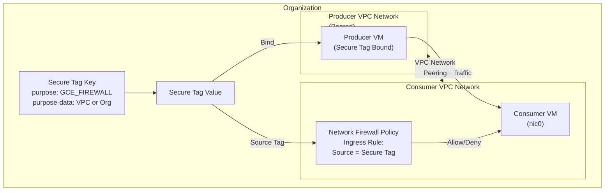

# Cloud NGFW: Secure Tags の VPC Network Peering サポートが GA

**リリース日**: 2026-03-23

**サービス**: Cloud Next Generation Firewall (Cloud NGFW)

**機能**: Secure Tags の VPC Network Peering サポート

**ステータス**: General Availability (GA)

:bar_chart: [このアップデートのインフォグラフィックを見る](https://takech9203.github.io/google-cloud-news-summary/20260323-cloud-ngfw-secure-tags-vpc-peering.html)

## 概要

Cloud NGFW の Secure Tags が VPC Network Peering 接続されたネットワーク間で利用可能になり、General Availability (GA) として正式リリースされた。purpose-data 属性で VPC ネットワークまたは組織を指定した Secure Tags が、VPC Network Peering で接続されたピアリング先の VPC ネットワークのソース識別に対応する。

これにより、ピアリングされた VPC ネットワーク間で IP アドレスベースではなく、IAM で管理される Secure Tags を使ったきめ細かいファイアウォール制御が可能になる。特に Private Services Access を利用してサービスプロデューサーのネットワークと接続している場合に、コンシューマー側からプロデューサー VM のトラフィックを Secure Tags で制御できる点が大きな利点となる。

対象ユーザーは、マルチ VPC アーキテクチャや Shared Services 構成を運用するネットワーク管理者、セキュリティ管理者、および Solutions Architect である。

**アップデート前の課題**

- VPC Network Peering 環境では、ピアリング先の VM をファイアウォールルールのソースとして識別する際に IP アドレス範囲を使用する必要があった
- ネットワークタグはピアリング先の VPC ネットワークの VM を識別できず、同一 VPC 内の VM にしか適用できなかった
- ピアリング先のサービスプロデューサー VM からのトラフィックを個別に制御するには、IP アドレスの管理が煩雑になっていた

**アップデート後の改善**

- Secure Tags の source secure tag をイングレスルールで使用することで、ピアリング先 VPC ネットワークの VM ネットワークインターフェースをソースとして識別可能になった
- IP アドレスに依存しない、IAM ベースのアイデンティティ駆動型ファイアウォール制御がピアリング環境でも実現された
- Private Services Access を利用するコンシューマーが、サービスプロデューサー VM からのパケットを Secure Tags で制御できるようになった

## アーキテクチャ図



VPC Network Peering で接続された 2 つの VPC ネットワーク間で、Secure Tags を使ってイングレスファイアウォールルールのソースを識別する構成を示す。プロデューサー VM にバインドされた Secure Tag がコンシューマー側のファイアウォールポリシーで参照され、トラフィック制御が行われる。

## サービスアップデートの詳細

### 主要機能

1. **ピアリング先 VPC ネットワークの Secure Tags ソース識別**
   - イングレスファイアウォールルールの source secure tag で、ピアリング先 VPC ネットワーク内の VM ネットワークインターフェースを識別可能
   - Cloud NGFW は Secure Tags をネットワークインターフェースにマッピングし、IP アドレスではなくインターフェース単位でパケットを照合する

2. **purpose-data 属性による 2 つのスコープ指定**
   - **VPC ネットワーク指定**: tag key の purpose-data 属性に特定の VPC ネットワークを指定。そのネットワーク内の VM ネットワークインターフェースにのみ適用される
   - **組織指定**: purpose-data 属性に `organization=auto` を指定。組織内のすべての VPC ネットワークの VM ネットワークインターフェースに適用される

3. **IAM ベースのアクセス制御**
   - Secure Tags は Resource Manager で管理され、IAM によるきめ細かいアクセス制御が可能
   - Tag Administrator ロール (`roles/resourcemanager.tagAdmin`) でタグの作成・管理権限を制御
   - ネットワークタグと異なり、権限のないユーザーがタグを変更することを防止

## 技術仕様

### Secure Tags の VPC Network Peering サポート要件

| 項目 | 詳細 |
|------|------|
| Tag Key の purpose 属性 | `GCE_FIREWALL` |
| purpose-data 属性 | VPC ネットワーク指定 または 組織指定 (`organization=auto`) |
| サポートされるルール種別 | イングレスルールの source secure tag |
| ファイアウォールポリシー種別 | 階層型ファイアウォールポリシー、グローバル/リージョナルネットワークファイアウォールポリシー |
| VM あたりのタグ値上限 | 各ネットワークインターフェースに最大 10 タグ値 |
| タグキーあたりのタグ値上限 | 最大 1,000 値 |

### ピアリング先ソース識別の条件

Secure Tags でピアリング先の VM をソースとして識別するには、以下の 2 つの条件を満たす必要がある:

1. Tag Key の purpose-data 属性がピアリング先の VPC ネットワーク (または、そのネットワークを含む組織) を指定していること
2. ピアリング先の VPC ネットワークと、ファイアウォールポリシーを使用する VPC ネットワークが VPC Network Peering で接続されていること

## 設定方法

### 前提条件

1. 2 つの VPC ネットワークが VPC Network Peering で接続されていること
2. Tag Administrator ロール (`roles/resourcemanager.tagAdmin`) が付与されていること
3. Compute Network Admin ロール (`roles/compute.networkAdmin`) でファイアウォールポリシーを管理できること

### 手順

#### ステップ 1: Secure Tag Key とタグ値の作成

サーバー (プロデューサー) ネットワーク側で、purpose を `GCE_FIREWALL` に設定した Secure Tag Key を作成し、タグ値を定義する。

```bash
# タグキーの作成 (VPC ネットワーク指定の場合)
gcloud resource-manager tags keys create TAG_KEY_NAME \
    --parent=organizations/ORG_ID \
    --purpose=GCE_FIREWALL \
    --purpose-data=network=projects/PROJECT_ID/global/networks/NETWORK_NAME

# タグ値の作成
gcloud resource-manager tags values create TAG_VALUE_NAME \
    --parent=tagKeys/TAG_KEY_ID
```

#### ステップ 2: ファイアウォールポリシールールの作成

サーバーネットワークのファイアウォールポリシーに、Secure Tag をソースとするイングレスルールを作成する。

```bash
# ネットワークファイアウォールポリシーにルールを追加
gcloud compute network-firewall-policies rules create PRIORITY \
    --firewall-policy=POLICY_NAME \
    --direction=INGRESS \
    --action=allow \
    --src-secure-tags=tagValues/TAG_VALUE_ID \
    --layer4-configs=tcp:443
```

#### ステップ 3: クライアント VM への Secure Tag のバインド

ピアリング先 (クライアント) ネットワークの VM に Secure Tag をバインドする。

```bash
# VM インスタンスへのタグバインド
gcloud resource-manager tags bindings create \
    --tag-value=tagValues/TAG_VALUE_ID \
    --parent=//compute.googleapis.com/projects/PROJECT_ID/zones/ZONE/instances/INSTANCE_NAME
```

## メリット

### ビジネス面

- **マルチテナント環境の管理簡素化**: IP アドレス範囲の管理が不要になり、ピアリング環境でのファイアウォール管理コストが削減される
- **コンプライアンス強化**: IAM ベースのアクセス制御により、ファイアウォールタグの変更権限を厳密に管理でき、監査要件への対応が容易になる

### 技術面

- **IP アドレス非依存のセキュリティ制御**: VM の IP アドレスが変更されてもファイアウォールルールの更新が不要で、動的な環境に適応しやすい
- **マイクロセグメンテーションの拡張**: ゼロトラストフレームワークに基づくきめ細かいセキュリティ制御がピアリング環境にも適用可能になった
- **ネットワークインターフェース単位の制御**: マルチ NIC VM の場合、特定のネットワークインターフェースのみにタグを適用できるため、より精密な制御が可能

## デメリット・制約事項

### 制限事項

- ピアリング先のソース識別はイングレスルールのみでサポートされ、イグレスルールの target secure tag ではピアリング先 VM を識別できない
- 各ネットワークインターフェースに適用できるタグ値は最大 10 個に制限されている
- Tag Key の purpose 属性および purpose-data 属性は作成後に変更できない
- VPC ファイアウォールルール (レガシー) では Secure Tags は使用できず、ネットワークファイアウォールポリシーまたは階層型ファイアウォールポリシーが必要

### 考慮すべき点

- プロジェクトを組織間で移動する場合、組織指定の purpose-data を持つタグキーを事前にデタッチする必要がある
- Secure Tags は Cloud NGFW Essentials ティアの機能であり追加料金は発生しないが、Standard/Enterprise ティアの機能と組み合わせた場合は該当ティアの料金が適用される

## ユースケース

### ユースケース 1: Private Services Access 環境でのサービスプロデューサー制御

**シナリオ**: SaaS プロバイダーが Private Services Access を通じてサービスを提供しており、コンシューマーがプロデューサー VM からの特定のトラフィックのみを許可したい場合。

**効果**: コンシューマーは Secure Tags を使ってサービスプロデューサー VM を識別し、許可するトラフィックを IP アドレスに依存せず制御できる。プロデューサー側で VM が追加・変更されても、同じ Secure Tag がバインドされていればファイアウォールルールの変更は不要。

### ユースケース 2: マルチ VPC 環境での Shared Services アクセス制御

**シナリオ**: 複数のワークロード VPC が Shared Services VPC とピアリングしており、各ワークロード VPC からのアクセスを役割ベースで制御したい場合。

**効果**: 組織レベルの Secure Tag を使用することで、組織内のすべての VPC ネットワークにまたがるアイデンティティベースのアクセス制御を一元的に管理できる。

## 料金

Secure Tags は Cloud NGFW Essentials ティアの機能であり、Essentials ティアの機能は無料で提供される。ただし、ファイアウォールルールで Standard ティア (FQDN オブジェクト、脅威インテリジェンスなど) や Enterprise ティア (IPS、URL フィルタリングなど) の機能を組み合わせた場合は、該当するティアの料金が適用される。

詳細は [Cloud NGFW pricing](https://cloud.google.com/firewall/pricing) を参照。

## 関連サービス・機能

- **VPC Network Peering**: 2 つの VPC ネットワーク間で内部 IP アドレスによる接続を可能にするサービス。Secure Tags のピアリングサポートの前提条件となる
- **Private Services Access**: Google が管理する VPC ネットワークとのプライベート接続を提供。サービスプロデューサーとコンシューマー間の Secure Tags 制御の主要ユースケース
- **Resource Manager Tags**: Secure Tags の基盤となるタグ管理サービス。IAM によるアクセス制御を提供
- **Cloud NGFW Enterprise (IPS)**: 侵入防止サービスによる L7 レベルのセキュリティ。Secure Tags と組み合わせることで、アイデンティティベースの高度なセキュリティ制御が可能
- **Network Connectivity Center**: VPC スポーク間での Secure Tags のソース識別もサポートしており、ハブ&スポーク構成での利用が可能

## 参考リンク

- :bar_chart: [インフォグラフィック](https://takech9203.github.io/google-cloud-news-summary/20260323-cloud-ngfw-secure-tags-vpc-peering.html)
- [公式リリースノート](https://docs.cloud.google.com/release-notes#March_23_2026)
- [Secure tags for firewalls - ドキュメント](https://docs.cloud.google.com/firewall/docs/tags-firewalls-overview)
- [Create and manage secure tags](https://docs.cloud.google.com/firewall/docs/use-tags-for-firewalls)
- [Use secure tags across peered networks](https://docs.cloud.google.com/firewall/docs/use-tags-for-firewalls#use-tags-across-peered-networks)
- [VPC Network Peering](https://docs.cloud.google.com/vpc/docs/vpc-peering)
- [Cloud NGFW pricing](https://cloud.google.com/firewall/pricing)

## まとめ

Cloud NGFW の Secure Tags が VPC Network Peering 環境で GA となったことで、IP アドレスに依存しないアイデンティティベースのファイアウォール制御がピアリングネットワーク間に拡張された。マルチ VPC アーキテクチャや Private Services Access を利用する環境では、Secure Tags を活用することでセキュリティ管理の簡素化とゼロトラストアプローチの強化が期待できるため、既存の IP ベースのファイアウォールルールからの移行を検討することを推奨する。

---

**タグ**: #CloudNGFW #SecureTags #VPCNetworkPeering #Firewall #NetworkSecurity #GA #ZeroTrust #MicroSegmentation
