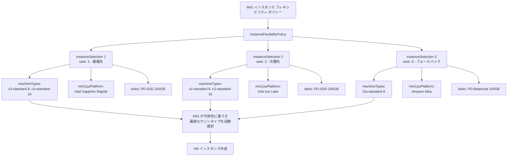

# Compute Engine: MIG インスタンス フレキシビリティ ポリシーの拡張 (最小 CPU プラットフォームとディスク定義のオーバーライド)

**リリース日**: 2026-03-23

**サービス**: Compute Engine

**機能**: MIG インスタンス フレキシビリティ ポリシーにおける最小 CPU プラットフォームおよびディスク定義のオーバーライド

**ステータス**: Preview

📊 [このアップデートのインフォグラフィックを見る](https://takech9203.github.io/google-cloud-news-summary/infographic/20260323-compute-engine-mig-instance-flexibility-preview.html)

## 概要

Compute Engine のマネージド インスタンス グループ (MIG) におけるインスタンス フレキシビリティ ポリシーが拡張され、インスタンス テンプレートで指定された最小 CPU プラットフォームとディスク定義をオーバーライドできるようになりました。これにより、異なる CPU プラットフォームや異なるアーキテクチャで動作するマシンタイプを柔軟に選択できます。

この機能は、大規模なワークロードを運用するユーザーや、リソースの可用性を最大化したいユーザーにとって特に有用です。従来のインスタンス フレキシビリティではマシンタイプの切り替えのみが可能でしたが、今回のアップデートにより CPU プラットフォームやディスク構成もインスタンス選択ごとにカスタマイズできるようになり、異なるハードウェア世代やアーキテクチャ (x86 と Arm など) をまたいだ柔軟なプロビジョニングが実現します。

**アップデート前の課題**

従来のインスタンス フレキシビリティ ポリシーでは、マシンタイプのみをオーバーライド可能で、CPU プラットフォームやディスク構成はインスタンス テンプレートの設定に縛られていました。

- インスタンス テンプレートで指定した最小 CPU プラットフォームがすべてのマシンタイプに適用されるため、異なる CPU アーキテクチャのマシンタイプを混在させることが困難だった
- ディスク定義がインスタンス テンプレートに固定されており、マシンタイプごとに最適なディスク構成を選択できなかった
- 異なるアーキテクチャ (例: Intel と AMD、x86 と Arm) のマシンタイプを同一 MIG で運用するには、別々の MIG を作成する必要があった

**アップデート後の改善**

今回のアップデートにより、インスタンス フレキシビリティ ポリシー内の各インスタンス選択 (instanceSelection) で以下のオーバーライドが可能になりました。

- 各インスタンス選択に `minCpuPlatform` を指定でき、マシンタイプごとに適切な CPU プラットフォームを設定可能になった
- 各インスタンス選択に `disks` を定義でき、マシンタイプに応じたディスク構成 (タイプ、モード、サイズ) をカスタマイズ可能になった
- 異なる CPU アーキテクチャのマシンタイプを単一の MIG 内で柔軟に混在させることが可能になった

## アーキテクチャ図



インスタンス フレキシビリティ ポリシーにより、MIG は複数のインスタンス選択の中から rank (優先度) とリソース可用性に基づいて最適なマシンタイプを自動選択します。各インスタンス選択では、マシンタイプに加えて最小 CPU プラットフォームとディスク定義を個別にオーバーライドできます。

## サービスアップデートの詳細

### 主要機能

1. **最小 CPU プラットフォームのオーバーライド**
   - インスタンス選択ごとに `minCpuPlatform` フィールドを指定可能
   - インスタンス テンプレートの CPU プラットフォーム設定を上書きし、各マシンタイプに適切なプラットフォームを設定
   - 例: Intel Sapphire Rapids、Intel Ice Lake、AMD Milan、Ampere Altra など

2. **ディスク定義のオーバーライド**
   - インスタンス選択ごとに `disks` フィールドでディスク構成を定義可能
   - ディスクタイプ (PERSISTENT / SCRATCH)、モード (READ_WRITE / READ_ONLY)、デバイス名、ソースなどを指定可能
   - マシンタイプの性能特性に合わせた最適なストレージ構成を選択

3. **クロスアーキテクチャ対応**
   - x86 (Intel/AMD) と Arm (Ampere Altra) のマシンタイプを同一 MIG 内で混在可能
   - 各アーキテクチャに適した CPU プラットフォームとディスク構成を個別に設定
   - リソース可用性の最大化とコスト最適化を同時に実現

## 技術仕様

### instanceFlexibilityPolicy の主要フィールド

| フィールド | 型 | 説明 |
|------|------|------|
| `instanceSelections[]` | map | VM 作成時に使用するプロパティを定義する名前付きインスタンス選択 |
| `instanceSelections[].machineTypes[]` | string | 完全なマシンタイプ名 (例: `n1-standard-16`) |
| `instanceSelections[].rank` | integer | 優先度。低い値ほど高い優先度。同じ rank は同等の優先度 |
| `instanceSelections[].minCpuPlatform` | string | 最小 CPU プラットフォーム名 (例: `Intel Ice Lake`) **[新規]** |
| `instanceSelections[].disks[]` | object | インスタンスにアタッチするディスクの定義 **[新規]** |
| `instanceSelections[].disks[].type` | enum | ディスクタイプ: `PERSISTENT` または `SCRATCH` |
| `instanceSelections[].disks[].mode` | enum | ディスクモード: `READ_WRITE` または `READ_ONLY` |
| `instanceSelections[].disks[].deviceName` | string | デバイス名 (Linux の `/dev/disk/by-id/google-*` に反映) |

### ポリシー設定例

```json
{
  "instanceFlexibilityPolicy": {
    "instanceSelections": {
      "preferred-intel": {
        "rank": 1,
        "machineTypes": ["c3-standard-8", "c3-standard-16"],
        "minCpuPlatform": "Intel Sapphire Rapids",
        "disks": [
          {
            "type": "PERSISTENT",
            "mode": "READ_WRITE",
            "deviceName": "boot-disk"
          }
        ]
      },
      "fallback-amd": {
        "rank": 2,
        "machineTypes": ["n2d-standard-8", "n2d-standard-16"],
        "minCpuPlatform": "AMD Milan",
        "disks": [
          {
            "type": "PERSISTENT",
            "mode": "READ_WRITE",
            "deviceName": "boot-disk"
          }
        ]
      },
      "fallback-arm": {
        "rank": 3,
        "machineTypes": ["t2a-standard-8"],
        "minCpuPlatform": "Ampere Altra",
        "disks": [
          {
            "type": "PERSISTENT",
            "mode": "READ_WRITE",
            "deviceName": "boot-disk"
          }
        ]
      }
    }
  }
}
```

## 設定方法

### 前提条件

1. Google Cloud プロジェクトで Compute Engine API が有効化されていること
2. 適切な IAM 権限 (`compute.instanceGroupManagers.update`) を持つサービス アカウントまたはユーザー
3. 対象リージョンで使用するマシンタイプが利用可能であること

### 手順

#### ステップ 1: 既存の MIG にインスタンス フレキシビリティを追加

```bash
gcloud compute instance-groups managed update INSTANCE_GROUP_NAME \
  --region REGION \
  --instance-selection-machine-types c3-standard-8,c3-standard-16,n2-standard-8
```

基本的なマシンタイプの複数指定を設定します。`INSTANCE_GROUP_NAME` は MIG 名、`REGION` は MIG のリージョンに置き換えてください。

#### ステップ 2: REST API で CPU プラットフォームとディスクのオーバーライドを設定

```bash
curl -X PATCH \
  -H "Authorization: Bearer $(gcloud auth print-access-token)" \
  -H "Content-Type: application/json" \
  "https://compute.googleapis.com/compute/beta/projects/PROJECT_ID/regions/REGION/instanceGroupManagers/INSTANCE_GROUP_NAME" \
  -d '{
    "instanceFlexibilityPolicy": {
      "instanceSelections": {
        "intel-selection": {
          "rank": 1,
          "machineTypes": ["c3-standard-8"],
          "minCpuPlatform": "Intel Sapphire Rapids"
        },
        "amd-selection": {
          "rank": 2,
          "machineTypes": ["n2d-standard-8"],
          "minCpuPlatform": "AMD Milan"
        }
      }
    }
  }'
```

REST API (beta) を使用して、各インスタンス選択に最小 CPU プラットフォームとディスク定義のオーバーライドを設定します。

#### ステップ 3: Google Cloud コンソールで設定

Google Cloud コンソールの [インスタンス グループ] ページから対象 MIG を選択し、[編集] をクリックして [Instance flexibility] セクションを展開します。[Add selections] からインスタンス選択を追加し、マシンタイプ、CPU プラットフォーム、ディスク構成を設定できます。

## メリット

### ビジネス面

- **リソース調達の確実性向上**: 複数のアーキテクチャとプラットフォームにまたがってフォールバックできるため、需要の高い時期でも必要な VM を確保しやすくなる
- **コスト最適化**: 優先度付きの複数マシンタイプ設定により、コスト効率の高い構成を優先しつつ、可用性が低い場合は代替構成にフォールバック可能

### 技術面

- **運用の簡素化**: 異なるアーキテクチャのために複数の MIG を管理する必要がなくなり、単一の MIG で統合管理が可能
- **柔軟なストレージ構成**: マシンタイプの性能特性に合わせたディスク構成を選択でき、I/O パフォーマンスの最適化が可能
- **マルチアーキテクチャ対応**: x86 と Arm を同一 MIG で運用できるため、Arm 移行を段階的に進めやすい

## デメリット・制約事項

### 制限事項

- 現在 Preview ステータスであり、本番環境での利用には SLA が適用されない可能性がある
- 既存の VM はフレキシビリティ ポリシーの変更後も既存のマシンタイプを使い続ける。新しい設定を反映するには、既存 VM を削除して MIG をリサイズする必要がある
- 使用するマシンタイプが対象リージョンでサポートされている必要がある

### 考慮すべき点

- アプリケーションが複数のアーキテクチャ (x86 / Arm) で動作するよう、マルチアーキテクチャ対応のコンテナイメージやバイナリを準備する必要がある
- 特定のハードウェアが保証されるわけではないため、確実な割り当てが必要な場合はリザベーションとの併用を検討すべき
- CPU プラットフォームやディスク構成が異なる VM が混在するため、モニタリングとパフォーマンス管理に注意が必要

## ユースケース

### ユースケース 1: 大規模バッチ処理の可用性最大化

**シナリオ**: 大量のデータ処理バッチジョブを実行する際に、特定のマシンタイプが不足して VM のプロビジョニングに失敗するケース。

**実装例**:
```json
{
  "instanceFlexibilityPolicy": {
    "instanceSelections": {
      "high-performance": {
        "rank": 1,
        "machineTypes": ["c3-standard-16"],
        "minCpuPlatform": "Intel Sapphire Rapids"
      },
      "standard": {
        "rank": 2,
        "machineTypes": ["n2-standard-16"],
        "minCpuPlatform": "Intel Ice Lake"
      },
      "arm-fallback": {
        "rank": 3,
        "machineTypes": ["t2a-standard-16"],
        "minCpuPlatform": "Ampere Altra"
      }
    }
  }
}
```

**効果**: 最も高性能な Intel Sapphire Rapids を優先しつつ、可用性に応じて Ice Lake や Arm ベースのマシンタイプにフォールバックすることで、バッチジョブの実行を確実に開始できる。

### ユースケース 2: Arm 移行の段階的推進

**シナリオ**: x86 から Arm への移行を進めたいが、全面移行のリスクを抑えたい場合に、同一 MIG 内で両アーキテクチャを混在させて段階的に Arm の比率を高める。

**効果**: Arm マシンタイプを優先度の高いインスタンス選択に設定し、x86 をフォールバックとすることで、Arm 移行を安全に推進しつつ、Arm リソースが不足した場合は x86 にフォールバック可能。

## 料金

インスタンス フレキシビリティ ポリシー自体には追加料金は発生しません。料金は実際に作成された VM のマシンタイプとディスク構成に基づいて Compute Engine の標準料金が適用されます。

### 料金例

| マシンタイプ | vCPU | メモリ | 月額料金 (概算、us-central1) |
|--------|--------|--------|--------|
| c3-standard-8 | 8 | 32 GB | 約 $245 |
| n2-standard-8 | 8 | 32 GB | 約 $228 |
| t2a-standard-8 | 8 | 32 GB | 約 $205 |

※ 料金は継続利用割引 (SUD) 適用前の概算です。実際の料金は利用状況やリージョンにより異なります。

## 利用可能リージョン

Preview 機能として、Compute Engine MIG が利用可能なすべてのリージョンで使用できます。ただし、各インスタンス選択で指定するマシンタイプと CPU プラットフォームがそのリージョンで利用可能である必要があります。リージョンごとのマシンタイプの可用性は [利用可能なリージョンとゾーン](https://cloud.google.com/compute/docs/regions-zones#available) で確認できます。

## 関連サービス・機能

- **[インスタンス テンプレート](https://cloud.google.com/compute/docs/instance-templates)**: MIG の基盤となるテンプレート。フレキシビリティ ポリシーはテンプレートの設定をオーバーライドする
- **[MIG オートスケーラー](https://cloud.google.com/compute/docs/autoscaler)**: フレキシビリティ ポリシーと組み合わせることで、スケーリング時のリソース確保を改善
- **[リザベーション](https://cloud.google.com/compute/docs/instances/reservations-overview)**: 特定のマシンタイプを事前予約。フレキシビリティ ポリシーは未使用リザベーションを優先的に活用
- **[Spot VM](https://cloud.google.com/compute/docs/instances/spot)**: フレキシビリティ ポリシーと Spot VM を併用することで、さらなるコスト削減が可能

## 参考リンク

- 📊 [インフォグラフィック](https://takech9203.github.io/google-cloud-news-summary/infographic/20260323-compute-engine-mig-instance-flexibility-preview.html)
- [公式リリースノート](https://cloud.google.com/compute/docs/release-notes#March_23_2026)
- [ドキュメント: About instance flexibility in MIGs](https://cloud.google.com/compute/docs/instance-groups/about-instance-flexibility)
- [ドキュメント: Configure instance flexibility](https://cloud.google.com/compute/docs/instance-groups/configure-instance-flexibility)
- [ドキュメント: Change or remove instance flexibility configuration](https://cloud.google.com/compute/docs/instance-groups/change-or-remove-instance-flexibility-configuration)
- [料金ページ](https://cloud.google.com/compute/pricing)

## まとめ

Compute Engine MIG のインスタンス フレキシビリティ ポリシーが拡張され、最小 CPU プラットフォームとディスク定義のオーバーライドが Preview として利用可能になりました。これにより、異なる CPU アーキテクチャやストレージ構成のマシンタイプを単一の MIG 内で柔軟に運用でき、リソースの可用性向上とコスト最適化が期待できます。大規模ワークロードの運用や Arm 移行を検討中のユーザーは、この Preview 機能を早期に検証することを推奨します。

---

**タグ**: #ComputeEngine #MIG #InstanceFlexibility #Preview #CPUPlatform #マルチアーキテクチャ #Arm #コスト最適化
