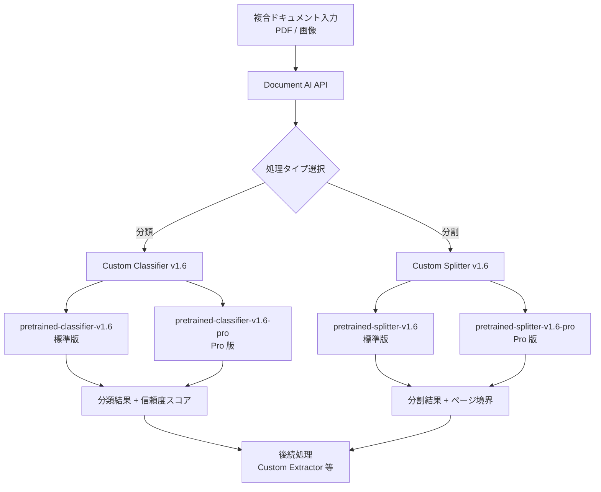

# Document AI: カスタム分類・スプリッターモデル v1.6 Preview 提供開始

**リリース日**: 2026-03-23

**サービス**: Document AI

**機能**: カスタム分類モデル (classifier) およびカスタムスプリッターモデル (splitter) の v1.6 Preview リリース

**ステータス**: Preview

[このアップデートのインフォグラフィックを見る](https://takech9203.github.io/google-cloud-news-summary/infographic/20260323-document-ai-custom-models-v1-6-preview.html)

## 概要

Google Cloud Document AI において、カスタム分類モデルとカスタムスプリッターモデルの v1.6 系が Preview として提供開始されました。今回リリースされたモデルバージョンは、分類モデルが `pretrained-classifier-v1.6-2026-03-09` および `pretrained-classifier-v1.6-pro-2026-03-09`、スプリッターモデルが `pretrained-splitter-v1.6-2026-03-09` および `pretrained-splitter-v1.6-pro-2026-03-09` の計 4 モデルです。

v1.6 系は、v1.5 系で採用されていた Gemini 2.5 Flash LLM ベースのアーキテクチャからさらに進化したモデルであり、標準版と Pro 版の 2 つのバリエーションが用意されています。Pro 版はより高精度な処理が期待される上位モデルであり、用途や精度要件に応じた選択が可能です。これは、同時期にリリースされた Custom Extractor の v1.6 系や Layout Parser の v1.6 系と同様のバージョニング体系に沿ったアップデートです。

このアップデートは、ドキュメント処理ワークフローにおいて分類やスプリット処理を自動化しているユーザーに特に関連します。金融、保険、法務、医療などの業界で大量の複合ドキュメントを処理する組織にとって、最新のモデルバージョンを評価・検証する機会となります。

**アップデート前の課題**

v1.5 系のカスタム分類・スプリッターモデルは GA として安定していましたが、以下の点で改善の余地がありました。

- v1.5 系の標準モデルのみが提供されており、精度と処理速度のトレードオフにおける選択肢が限定されていた
- 複雑なドキュメントレイアウトや多言語ドキュメントにおける分類精度に改善の余地があった
- 最新の LLM 技術の進歩がカスタム分類・スプリッターモデルに反映されていなかった

**アップデート後の改善**

今回の v1.6 Preview リリースにより、以下の改善が期待されます。

- 標準版と Pro 版の 2 バリエーションにより、コストと精度のバランスに応じたモデル選択が可能になった
- 最新の基盤モデル技術を活用した分類・スプリット精度の向上が見込まれる
- v1.5 系との並行運用により、本番環境への影響なく新モデルの検証が可能になった

## アーキテクチャ図



Document AI のカスタムモデル v1.6 では、分類 (Classifier) とスプリッター (Splitter) の両方で標準版と Pro 版が提供され、ドキュメントの種類や精度要件に応じた柔軟な処理パイプラインを構成できます。

## サービスアップデートの詳細

### 主要機能

1. **カスタム分類モデル v1.6 (Preview)**
   - `pretrained-classifier-v1.6-2026-03-09`: 標準版の分類モデル。ゼロショット分類に対応し、事前トレーニングなしでドキュメント分類が可能
   - `pretrained-classifier-v1.6-pro-2026-03-09`: 高精度版の分類モデル。より複雑なドキュメントや微妙な分類境界に対応

2. **カスタムスプリッターモデル v1.6 (Preview)**
   - `pretrained-splitter-v1.6-2026-03-09`: 標準版のスプリッターモデル。複合ドキュメントのページ境界検出とクラス分類を実行
   - `pretrained-splitter-v1.6-pro-2026-03-09`: 高精度版のスプリッターモデル。複雑なドキュメント構造における分割精度を向上

3. **標準版と Pro 版の提供**
   - 用途や精度要件に応じて標準版と Pro 版を選択可能
   - Pro 版はより高精度な処理を提供し、ミッションクリティカルなユースケースに適合
   - ファインチューニングとの併用により、さらなる精度向上が期待可能

## 技術仕様

### モデルバージョン一覧

| モデルタイプ | バージョン | リリースチャネル | リリース日 |
|------|------|------|------|
| Custom Classifier 標準版 | pretrained-classifier-v1.6-2026-03-09 | Preview | 2026-03-09 |
| Custom Classifier Pro 版 | pretrained-classifier-v1.6-pro-2026-03-09 | Preview | 2026-03-09 |
| Custom Splitter 標準版 | pretrained-splitter-v1.6-2026-03-09 | Preview | 2026-03-09 |
| Custom Splitter Pro 版 | pretrained-splitter-v1.6-pro-2026-03-09 | Preview | 2026-03-09 |

### バージョン系譜

| プロセッサ | v1.4 | v1.5 (GA) | v1.6 (Preview) |
|------|------|------|------|
| Custom Classifier | pretrained-foundation-model-v1.4-2025-05-16 | pretrained-classifier-v1.5-2025-08-05 | pretrained-classifier-v1.6-2026-03-09 / pro |
| Custom Splitter | - | pretrained-splitter-v1.5-2025-07-14 | pretrained-splitter-v1.6-2026-03-09 / pro |

### 必要な IAM ロール

```json
{
  "roles": [
    "roles/documentai.admin",
    "roles/storage.admin"
  ],
  "description": "Document AI プロセッサの作成・管理およびストレージアクセスに必要"
}
```

## 設定方法

### 前提条件

1. Google Cloud プロジェクトで Document AI API が有効化されていること
2. 適切な IAM ロール (`roles/documentai.admin`, `roles/storage.admin`) が付与されていること
3. プロセッサの作成先リージョン (US または EU) を決定していること

### 手順

#### ステップ 1: プロセッサの作成とバージョン選択

```bash
# gcloud CLI でカスタム分類プロセッサを作成
gcloud documentai processors create \
  --display-name="my-classifier-v16" \
  --type="CUSTOM_CLASSIFICATION_PROCESSOR" \
  --location=us

# カスタムスプリッタープロセッサを作成
gcloud documentai processors create \
  --display-name="my-splitter-v16" \
  --type="CUSTOM_SPLITTING_PROCESSOR" \
  --location=us
```

プロセッサ作成後、Google Cloud Console の Document AI Workbench からモデルバージョンとして v1.6 系を選択します。

#### ステップ 2: プロセッサバージョンのデプロイ

```bash
# プロセッサバージョンをデプロイ
gcloud documentai processor-versions deploy \
  --processor=PROCESSOR_ID \
  --location=us \
  --processor-version=PROCESSOR_VERSION_ID
```

デプロイ完了後、処理リクエストを送信して v1.6 モデルの精度を検証できます。

#### ステップ 3: Python クライアントからの処理リクエスト

```python
from google.api_core.client_options import ClientOptions
from google.cloud import documentai

# クライアントの初期化
opts = ClientOptions(api_endpoint="us-documentai.googleapis.com")
client = documentai.DocumentProcessorServiceClient(client_options=opts)

# プロセッサのリソース名
name = client.processor_version_path(
    "PROJECT_ID", "us", "PROCESSOR_ID", "PROCESSOR_VERSION_ID"
)

# ドキュメントの処理
with open("document.pdf", "rb") as f:
    raw_document = documentai.RawDocument(
        content=f.read(),
        mime_type="application/pdf"
    )

request = documentai.ProcessRequest(
    name=name,
    raw_document=raw_document
)

result = client.process_document(request=request)
print(f"分類結果: {result.document.entities}")
```

## メリット

### ビジネス面

- **精度要件に応じた柔軟なモデル選択**: 標準版と Pro 版の 2 バリエーションにより、コストと精度のバランスを最適化できる
- **本番移行前の検証機会**: Preview 段階で新モデルを十分に評価し、GA リリース時にスムーズに移行できる
- **ドキュメント処理パイプラインの品質向上**: 分類・スプリット精度の向上により、後続の抽出処理の品質も連鎖的に改善される

### 技術面

- **最新 LLM 技術の活用**: 最新の基盤モデルに基づく分類・スプリット処理により、複雑なドキュメントへの対応力が向上
- **ゼロショット対応**: 事前トレーニングデータなしでプロトタイピングが可能であり、迅速な PoC 実施に貢献
- **信頼度スコアによる自動化**: 信頼度スコアを活用した条件分岐により、ヒューマンレビューの効率化が可能

## デメリット・制約事項

### 制限事項

- 現時点では Preview ステータスであり、本番ワークロードでの使用は推奨されない
- Preview 段階のモデルは GA 前に仕様変更が生じる可能性がある
- スプリッターは 30 ページを超える論理ドキュメントの分割には対応していない (複数ドキュメントに分割される場合がある)

### 考慮すべき点

- v1.5 系 (GA) から v1.6 系 (Preview) への移行は、十分な検証期間を設けてから実施すべきである
- Pro 版の使用は処理コストが増加する可能性があるため、精度向上とのトレードオフを評価する必要がある
- スプリッターの分割結果は、ヒューマンレビューを経てから実際のファイル分割を行うことがベストプラクティスとして推奨されている

## ユースケース

### ユースケース 1: 住宅ローン申請書類の自動仕分け

**シナリオ**: 金融機関が住宅ローン申請パッケージ (申請書、収入証明、身分証明書、不動産鑑定書など) を一括スキャンした PDF を受領し、各書類タイプに自動分割・分類する必要がある。

**実装例**:
```python
# カスタムスプリッター v1.6 Pro で複合ドキュメントを分割
request = documentai.ProcessRequest(
    name=splitter_v16_pro_path,
    raw_document=raw_document
)
result = client.process_document(request=request)

# 分割結果に基づいて各論理ドキュメントを処理
for entity in result.document.entities:
    doc_type = entity.type_  # 例: "application_form", "income_verification"
    confidence = entity.confidence
    pages = [ref.page for ref in entity.page_anchor.page_refs]
    print(f"種類: {doc_type}, 信頼度: {confidence:.2f}, ページ: {pages}")
```

**効果**: Pro 版の高精度モデルにより、複雑なローンパッケージの分割精度が向上し、後続の抽出処理の品質改善とヒューマンレビュー工数の削減が期待できる。

### ユースケース 2: 保険請求書類の自動分類

**シナリオ**: 保険会社が受領した請求関連書類 (請求書、診断書、領収書、事故報告書など) を自動的にカテゴリ分類し、適切な処理パイプラインにルーティングする。

**効果**: カスタム分類モデル v1.6 のゼロショット分類機能により、新しい書類タイプが追加された場合もラベル定義のみで対応可能。Pro 版を使用することで、類似した書類タイプ間の分類精度を向上させることができる。

## 料金

Document AI の料金はプロセッサタイプと処理ページ数に基づきます。Preview 段階の v1.6 モデルの料金は、GA モデルと異なる可能性があります。

### 料金例

| プロセッサタイプ | 料金 (1,000 ページあたり) |
|--------|-----------------|
| Custom Classifier | $65.00 (Document AI Workbench) |
| Custom Splitter | $65.00 (Document AI Workbench) |

※ 上記は Document AI Workbench カスタムプロセッサの一般的な料金です。最新の料金は公式料金ページを参照してください。Preview 期間中は料金体系が変更される場合があります。

## 利用可能リージョン

Document AI のカスタムモデルは以下のリージョンで利用可能です。

- **US** (米国マルチリージョン)
- **EU** (欧州マルチリージョン)

v1.6 系モデルの ML 処理は US および EU で対応しています。ファインチューニングについても US および EU で利用可能 (Preview) です。

## 関連サービス・機能

- **Custom Extractor v1.6**: 同時期にリリースされたカスタム抽出モデル v1.6 系。分類・スプリット後の抽出処理に使用
- **Layout Parser v1.6**: Gemini 3 Flash LLM ベースのレイアウトパーサー。ドキュメントのレイアウト解析とチャンキングに対応
- **Document AI Toolbox SDK**: スプリッターの出力に基づいてドキュメントを物理的に分割するユーティリティを提供
- **Vertex AI**: Document AI の基盤モデルは Vertex AI の Gemini モデルを活用

## 参考リンク

- [インフォグラフィック](https://takech9203.github.io/google-cloud-news-summary/infographic/20260323-document-ai-custom-models-v1-6-preview.html)
- [公式リリースノート](https://cloud.google.com/document-ai/docs/release-notes)
- [カスタム分類モデル ドキュメント](https://cloud.google.com/document-ai/docs/custom-classifier)
- [カスタムスプリッター ドキュメント](https://cloud.google.com/document-ai/docs/custom-splitter)
- [プロセッサバージョンの管理](https://cloud.google.com/document-ai/docs/manage-processor-versions)
- [料金ページ](https://cloud.google.com/document-ai/pricing)

## まとめ

Document AI のカスタム分類モデルおよびカスタムスプリッターモデル v1.6 が Preview として提供開始されました。標準版と Pro 版の 2 バリエーションが提供されることで、精度とコストのバランスに応じた柔軟なモデル選択が可能になります。現在 v1.5 系を利用しているユーザーは、Preview 期間中に v1.6 系の精度を検証し、GA リリース時のスムーズな移行を計画することを推奨します。

---

**タグ**: #DocumentAI #CustomClassifier #CustomSplitter #Preview #v1.6 #MachineLearning #DocumentProcessing
