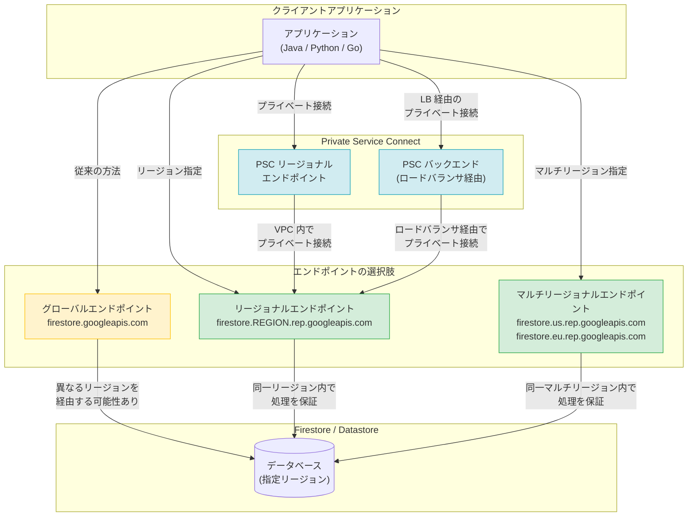

# Firestore / Datastore: リージョナルおよびマルチリージョナルエンドポイントが GA

**リリース日**: 2026-03-23

**サービス**: Firestore, Firestore in Datastore mode

**機能**: Regional and Multi-Regional endpoints GA

**ステータス**: GA (General Availability)

[このアップデートのインフォグラフィックを見る](https://takech9203.github.io/google-cloud-news-summary/20260323-firestore-regional-endpoints-ga.html)

## 概要

Firestore API および Datastore API のリージョナルエンドポイントとマルチリージョナルエンドポイントが一般提供 (GA) になりました。これにより、アプリケーションからの API リクエストが、データベースと同じリージョンまたはマルチリージョン内で送信・保存・処理されることが保証されます。

従来のグローバルエンドポイント (`firestore.googleapis.com` / `datastore.googleapis.com`) では、リクエストのルーティング中にデータベースとは異なるロケーションのサーバーを経由する可能性がありました。今回の GA により、データレジデンシー要件やコンプライアンス要件を持つ組織が、データの地理的な制御をより厳密に行えるようになります。

さらに、Private Service Connect のリージョナルエンドポイントおよび Private Service Connect バックエンドを使用して、Firestore API / Datastore API のリージョナル・マルチリージョナルエンドポイントにプライベート接続することも可能です。これにより、パブリックインターネットを経由せずにセキュアなアクセスが実現します。

**アップデート前の課題**

- グローバルエンドポイント経由のリクエストでは、データベースとは異なるロケーションのサーバーを経由する可能性があり、データレジデンシー要件を満たすことが困難だった
- データの送信・処理が行われるリージョンを厳密に制御する手段がなく、規制産業のコンプライアンス対応に課題があった
- 以前のロケーショナルエンドポイント (`REGION_NAME-firestore.googleapis.com`) は非推奨となり、新しいリージョナルエンドポイント形式への移行が必要だった

**アップデート後の改善**

- リージョナルエンドポイントにより、API リクエストの送信・保存・処理がすべてデータベースと同一リージョン内で完結することが保証された
- マルチリージョナルエンドポイントにより、マルチリージョンデータベースにおいても同一マルチリージョン内での処理が保証された
- Private Service Connect との統合により、VPC 内からのプライベートなアクセス経路が確保され、ネットワークセキュリティが強化された

## アーキテクチャ図



クライアントアプリケーションから Firestore / Datastore へのアクセス経路を示す図。リージョナルエンドポイントまたはマルチリージョナルエンドポイントを使用することで、データの処理がデータベースと同じロケーション内で完結します。Private Service Connect を併用することで、VPC 内からのプライベートなアクセスも可能です。

## サービスアップデートの詳細

### 主要機能

1. **リージョナルエンドポイント (REP)**
   - Firestore / Datastore がサポートするリージョナルロケーションごとに専用のエンドポイントを提供
   - エンドポイント形式: `firestore.REGION_NAME.rep.googleapis.com` / `datastore.REGION_NAME.rep.googleapis.com`
   - データの送信・保存・処理がすべて指定リージョン内で完結することを保証

2. **マルチリージョナルエンドポイント (MREP)**
   - マルチリージョンデータベース向けのエンドポイントを提供
   - Firestore: `firestore.us.rep.googleapis.com` (nam5 用) / `firestore.eu.rep.googleapis.com` (eur3 用)
   - Datastore: `datastore.us.rep.googleapis.com` (nam5, nam7 用) / `datastore.eu.rep.googleapis.com` (eur3 用)

3. **Private Service Connect 統合**
   - PSC リージョナルエンドポイントを使用して VPC 内からプライベートにアクセス可能
   - PSC バックエンド (内部アプリケーション ロードバランサ経由) を使用してセキュリティポリシーの一元管理が可能
   - Google Cloud Armor ポリシーや SSL ポリシーとの統合が可能

4. **グローバルエンドポイント使用の制限**
   - `constraints/gcp.restrictEndpointUsage` 組織ポリシー制約を使用して、グローバルエンドポイントへのリクエストをブロック可能
   - 組織全体でリージョナルエンドポイントの使用を強制し、コンプライアンスを確保

## 技術仕様

### エンドポイント形式

| サービス | エンドポイント種別 | 形式 | 例 |
|------|------|------|------|
| Firestore | リージョナル | `firestore.REGION.rep.googleapis.com` | `firestore.us-central1.rep.googleapis.com` |
| Firestore | マルチリージョナル (US) | `firestore.us.rep.googleapis.com` | nam5 ロケーション用 |
| Firestore | マルチリージョナル (EU) | `firestore.eu.rep.googleapis.com` | eur3 ロケーション用 |
| Datastore | リージョナル | `datastore.REGION.rep.googleapis.com` | `datastore.europe-west1.rep.googleapis.com` |
| Datastore | マルチリージョナル (US) | `datastore.us.rep.googleapis.com` | nam5, nam7 ロケーション用 |
| Datastore | マルチリージョナル (EU) | `datastore.eu.rep.googleapis.com` | eur3 ロケーション用 |

### クライアントライブラリの設定例

**Firestore (Python)**

```python
from google.cloud import firestore
from google.api_core.client_options import ClientOptions

ENDPOINT = "https://firestore.us-central1.rep.googleapis.com"
client_options = ClientOptions(api_endpoint=ENDPOINT)
client = firestore.Client(client_options=client_options)
```

**Firestore (Java)**

```java
import com.google.cloud.firestore.Firestore;
import com.google.cloud.firestore.FirestoreOptions;

FirestoreOptions options = FirestoreOptions.newBuilder()
    .setHost("firestore.us-central1.rep.googleapis.com:443")
    .build();
Firestore firestore = options.getService();
```

**Datastore (Python)**

```python
from google.cloud import datastore
from google.api_core.client_options import ClientOptions

ENDPOINT = "https://datastore.us-central1.rep.googleapis.com"
client_options = ClientOptions(api_endpoint=ENDPOINT)
client = datastore.Client(client_options=client_options)
```

## 設定方法

### 前提条件

1. Google Cloud プロジェクトで Firestore API または Datastore API が有効化されていること
2. Firestore / Datastore データベースが作成済みであること
3. 適切な IAM 権限 (Cloud Datastore User または Cloud Datastore Owner) が付与されていること

### 手順

#### ステップ 1: データベースのロケーションを確認

```bash
# Firestore データベースのロケーションを確認
gcloud firestore databases describe --database="(default)"
```

データベースのロケーションに対応するリージョナルまたはマルチリージョナルエンドポイントを選択します。

#### ステップ 2: クライアントライブラリでエンドポイントを設定

使用するプログラミング言語に応じて、クライアントライブラリの初期化時にエンドポイントを指定します。上記の「クライアントライブラリの設定例」を参照してください。

#### ステップ 3: (オプション) 組織ポリシーでグローバルエンドポイントを制限

```bash
# 組織ポリシーを設定してグローバルエンドポイントの使用を制限
gcloud resource-manager org-policies enable-enforce \
    constraints/gcp.restrictEndpointUsage \
    --organization=ORGANIZATION_ID
```

組織全体でリージョナル / マルチリージョナルエンドポイントの使用を強制する場合に設定します。

#### ステップ 4: (オプション) Private Service Connect 経由でのアクセス設定

```bash
# PSC NEG を作成
gcloud compute network-endpoint-groups create firestore-psc-neg \
    --network-endpoint-type=private-service-connect \
    --psc-target-service=firestore.us-central1.rep.googleapis.com \
    --region=us-central1
```

VPC 内からのプライベートアクセスが必要な場合に設定します。

## メリット

### ビジネス面

- **コンプライアンス対応の強化**: GDPR、HIPAA などの規制要件に対応するために、データの処理ロケーションを厳密に制御可能
- **データレジデンシー要件への対応**: 政府機関や金融機関など、データの地理的な制御が必須の業界での採用が容易に

### 技術面

- **データの地理的制御**: リクエストの送信・保存・処理がすべて指定ロケーション内で完結することが保証される
- **ネットワークセキュリティの強化**: Private Service Connect との統合により、パブリックインターネットを経由しないアクセスが可能
- **一元的なポリシー管理**: PSC バックエンドを使用することで、Google Cloud Armor や SSL ポリシーとの統合が可能

## デメリット・制約事項

### 制限事項

- リージョナルおよびマルチリージョナルエンドポイントではリアルタイムリスナー (Real-time listeners) がサポートされていない
- データベースのロケーションと異なるリージョンのエンドポイントを指定すると `PermissionDeniedError` が発生する
- 以前のロケーショナルエンドポイント (`REGION_NAME-firestore.googleapis.com`) は非推奨であり、新しい形式への移行が必要

### 考慮すべき点

- 既存アプリケーションでグローバルエンドポイントを使用している場合、リージョナルエンドポイントへの移行にはクライアントライブラリの設定変更が必要
- リアルタイムリスナーを使用している場合は、引き続きグローバルエンドポイントを使用する必要がある
- マルチリージョンのマッピング (例: nam5 -> `us`, eur3 -> `eu`) を正しく理解して設定する必要がある

## ユースケース

### ユースケース 1: 規制産業でのデータレジデンシー対応

**シナリオ**: EU 内にデータベースを持つ金融機関が、GDPR に準拠するためにすべてのデータ処理を EU 内で完結させたい。

**実装例**:
```python
from google.cloud import firestore
from google.api_core.client_options import ClientOptions

# EU マルチリージョナルエンドポイントを使用
ENDPOINT = "https://firestore.eu.rep.googleapis.com"
client_options = ClientOptions(api_endpoint=ENDPOINT)
client = firestore.Client(
    client_options=client_options,
    database="eu-database"
)
```

**効果**: API リクエストの送信・保存・処理がすべて EU 内で完結し、GDPR のデータ処理要件を満たすことができる。

### ユースケース 2: VPC 内からのセキュアなプライベートアクセス

**シナリオ**: GKE 上で動作するマイクロサービスから Firestore にアクセスする際、パブリックインターネットを経由させたくない。

**実装例**:
```bash
# PSC NEG を作成
gcloud compute network-endpoint-groups create firestore-neg \
    --network-endpoint-type=private-service-connect \
    --psc-target-service=firestore.asia-northeast1.rep.googleapis.com \
    --region=asia-northeast1

# 内部アプリケーション ロードバランサのバックエンドサービスに追加
gcloud compute backend-services add-backend firestore-backend \
    --network-endpoint-group=firestore-neg \
    --network-endpoint-group-region=asia-northeast1 \
    --region=asia-northeast1
```

**効果**: VPC 内のプライベートネットワーク経由で Firestore にアクセスでき、データがパブリックインターネットを経由しないためセキュリティが向上する。

## 料金

リージョナルエンドポイントおよびマルチリージョナルエンドポイントの使用自体に追加料金は発生しません。Firestore / Datastore の通常の料金体系が適用されます。

Private Service Connect を使用する場合は、PSC エンドポイントおよびロードバランサに関連する追加料金が発生する可能性があります。

| 項目 | 料金 |
|------|------|
| リージョナル / マルチリージョナルエンドポイント | 追加料金なし |
| Private Service Connect エンドポイント | PSC の料金体系に準拠 |
| 内部アプリケーション ロードバランサ | ロードバランサの料金体系に準拠 |

## 利用可能リージョン

リージョナルエンドポイントは Firestore / Datastore がサポートするすべてのリージョナルロケーションで利用可能です。主要なリージョンには以下が含まれます。

- **アジア太平洋**: asia-east1, asia-east2, asia-northeast1, asia-northeast2, asia-northeast3, asia-south1, asia-south2, asia-southeast1, asia-southeast2, australia-southeast1, australia-southeast2
- **ヨーロッパ**: europe-central2, europe-north1, europe-southwest1, europe-west1, europe-west3, europe-west4, europe-west8, europe-west9, europe-west10
- **北米**: us-central1, us-east1, us-east4, us-east5, us-south1, us-west1, us-west2, us-west3, us-west4, northamerica-northeast1, northamerica-northeast2
- **南米**: southamerica-east1, southamerica-west1
- **中東・アフリカ**: me-central1, me-central2, me-west1, africa-south1

マルチリージョナルエンドポイントは US (`us`) および EU (`eu`) で利用可能です。

## 関連サービス・機能

- **Private Service Connect**: リージョナルエンドポイントおよびマルチリージョナルエンドポイントへの VPC 内からのプライベート接続を提供
- **Assured Workloads**: `constraints/gcp.restrictEndpointUsage` 組織ポリシーによるグローバルエンドポイント使用制限との連携
- **Cloud Firestore**: ネイティブモードでのドキュメントデータベース機能
- **Firestore in Datastore mode**: Datastore 互換 API によるアクセスが可能な Firestore データベース
- **VPC Service Controls**: サービス境界と組み合わせることで、データのアクセス制御をさらに強化

## 参考リンク

- [インフォグラフィック](https://takech9203.github.io/google-cloud-news-summary/20260323-firestore-regional-endpoints-ga.html)
- [公式リリースノート (Firestore)](https://cloud.google.com/firestore/docs/release-notes)
- [公式リリースノート (Datastore)](https://cloud.google.com/datastore/docs/release-notes)
- [Firestore リージョナルエンドポイントガイド](https://cloud.google.com/firestore/docs/regional-endpoints)
- [Datastore リージョナルエンドポイントガイド](https://cloud.google.com/datastore/docs/regional-endpoints)
- [Private Service Connect バックエンド](https://cloud.google.com/vpc/docs/private-service-connect-backends)
- [リージョナルサービスエンドポイント一覧](https://cloud.google.com/vpc/docs/regional-service-endpoints)
- [Firestore 料金ページ](https://cloud.google.com/firestore/pricing)

## まとめ

Firestore API および Datastore API のリージョナル・マルチリージョナルエンドポイントの GA は、データレジデンシーやコンプライアンス要件を持つ組織にとって重要なアップデートです。特に規制産業のワークロードにおいて、データの地理的な制御を厳密に行う必要がある場合に大きな価値を提供します。既存のグローバルエンドポイントを使用しているアプリケーションは、リアルタイムリスナーの制約に注意しつつ、段階的にリージョナルエンドポイントへの移行を検討することを推奨します。

---

**タグ**: #Firestore #Datastore #RegionalEndpoints #MultiRegionalEndpoints #DataResidency #PrivateServiceConnect #GA #Compliance #Networking
