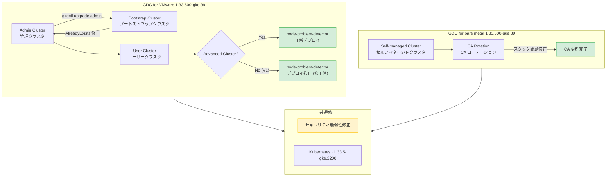

# Google Distributed Cloud: バージョン 1.33.600-gke.39 リリース (VMware / ベアメタル)

**リリース日**: 2026-03-23

**サービス**: Google Distributed Cloud (software only) for VMware, Google Distributed Cloud (software only) for bare metal

**機能**: バージョン 1.33.600-gke.39 バグ修正およびセキュリティアップデート

**ステータス**: GA

[このアップデートのインフォグラフィックを見る](https://takech9203.github.io/google-cloud-news-summary/20260323-gdc-1-33-600-gke-39.html)

## 概要

Google Distributed Cloud (software only) のバージョン 1.33.600-gke.39 が VMware 版およびベアメタル版の両方でリリースされました。本リリースは Kubernetes v1.33.5-gke.2200 上で動作し、複数の重要なバグ修正とセキュリティ脆弱性の修正を含んでいます。

VMware 版では、node-problem-detector の誤デプロイによる containerd ランタイムの連続再起動、非推奨フィールド `stackdriver.enableVPC` による Advanced Cluster へのアップグレードブロック、`gkectl upgrade admin` コマンドのリトライ時の AlreadyExists エラーなど、クラスタの運用安定性に直結する 7 件のバグが修正されました。ベアメタル版では、セキュリティ脆弱性の修正に加え、セルフマネージドクラスタにおける認証局 (CA) ローテーションがスタックする問題が解消されています。

オンプレミスや分散環境で Google Distributed Cloud を運用しているインフラチームや SRE チームにとって、クラスタのアップグレードと安定運用に直結する重要なパッチリリースです。

**アップデート前の課題**

- node-problem-detector が非 Advanced (V1) VMware クラスタに誤ってデプロイされ、containerd ランタイムが連続再起動し、ETCD/CRI 障害やクラスタアップグレード失敗を引き起こしていた
- 非推奨の `stackdriver.enableVPC` フィールドを true に設定した構成ファイルがあると、Advanced Cluster へのアップグレードがブロックされていた
- `gkectl upgrade admin` コマンドの再試行時にブートストラップクラスタで AlreadyExists エラーが発生していた
- プロキシ設定フィールドに余分な空白が含まれていると、クラスタの作成やアップグレードが失敗していた
- レジストリミラーにカスタム CA 証明書を設定した場合、システム証明書プールが無視されていた
- ベアメタル版でセルフマネージドクラスタの CA ローテーションがスタックしていた

**アップデート後の改善**

- node-problem-detector が正しく Advanced Cluster のみにデプロイされるようになり、非 Advanced クラスタでの containerd 再起動問題が解消された
- `stackdriver.enableVPC` フィールドの設定に関わらず、Advanced Cluster へのアップグレードが正常に実行できるようになった
- `gkectl upgrade admin` のリトライが AlreadyExists エラーなしで正常に動作するようになった
- プロキシ設定の余分な空白が自動的に処理されるようになり、クラスタ作成・アップグレードの信頼性が向上した
- カスタム CA 証明書とシステム証明書プールの両方が正しく参照されるようになった
- ベアメタル版で CA ローテーションが正常に完了するようになった

## アーキテクチャ図



VMware 版とベアメタル版の主要な修正箇所を示す図。VMware 版では node-problem-detector のデプロイ制御とアップグレードプロセスの安定化、ベアメタル版では CA ローテーションの修正が中心です。

## サービスアップデートの詳細

### 主要機能

1. **node-problem-detector のデプロイ修正 (VMware)**
   - 非 Advanced (V1) VMware クラスタに node-problem-detector が誤ってデプロイされる問題を修正
   - この誤デプロイにより containerd ランタイムが連続再起動し、ETCD および CRI の障害が発生していた
   - 結果としてクラスタのアップグレードが失敗するケースがあったが、本修正により解消

2. **Advanced Cluster アップグレードのブロック解除 (VMware)**
   - 非推奨の `stackdriver.enableVPC` フィールドが true に設定されている場合、Advanced Cluster へのアップグレードがバリデーションエラーでブロックされていた
   - 本修正により、非推奨フィールドの設定値に関わらずアップグレードが正常に実行可能に

3. **gkectl upgrade admin リトライの安定化 (VMware)**
   - 以前のアップグレード失敗後に `gkectl upgrade admin` を再試行すると、ブートストラップクラスタで AlreadyExists エラーが発生していた
   - リソースの存在チェックと冪等性が改善され、再試行が安全に実行可能に

4. **プロキシ設定の空白文字処理 (VMware)**
   - `proxy` または `noProxy` 設定フィールドに余分な空白が含まれている場合、クラスタの作成やアップグレードが失敗していた
   - 空白文字のトリミング処理が追加され、設定の堅牢性が向上

5. **レジストリミラーの証明書処理修正 (VMware)**
   - レジストリミラーにカスタム CA 証明書を設定した場合、システム証明書プールが無視される問題を修正
   - カスタム CA とシステム証明書プールの両方が正しくマージされるように改善

6. **CA ローテーションの修正 (ベアメタル)**
   - セルフマネージドクラスタで CA ローテーションがスタックする問題を修正
   - CA ローテーションプロセスが正常に完了するようになり、証明書管理の信頼性が向上

7. **セキュリティ脆弱性の修正 (VMware / ベアメタル共通)**
   - 両プラットフォームで既知のセキュリティ脆弱性が修正

## 技術仕様

### リリースバージョン情報

| 項目 | 詳細 |
|------|------|
| GDC バージョン | 1.33.600-gke.39 |
| Kubernetes バージョン | v1.33.5-gke.2200 |
| 対象プラットフォーム | VMware、ベアメタル |
| リリース種別 | パッチリリース (バグ修正 / セキュリティ修正) |
| GKE On-Prem API 利用可能時期 | リリースから約 7-14 日後 |

### VMware 版の修正一覧

| 修正内容 | 影響範囲 | 深刻度 |
|----------|----------|--------|
| node-problem-detector の誤デプロイ | 非 Advanced (V1) クラスタ | 高 |
| stackdriver.enableVPC によるアップグレードブロック | Advanced Cluster へのアップグレード | 高 |
| gkectl upgrade admin のリトライエラー | 管理クラスタのアップグレード | 中 |
| プロキシ設定の空白文字問題 | クラスタ作成・アップグレード | 中 |
| レジストリミラーの証明書処理 | プライベートレジストリ利用環境 | 中 |
| セキュリティ脆弱性 | 全クラスタ | 高 |

### ベアメタル版の修正一覧

| 修正内容 | 影響範囲 | 深刻度 |
|----------|----------|--------|
| CA ローテーションのスタック | セルフマネージドクラスタ | 高 |
| セキュリティ脆弱性 | 全クラスタ | 高 |

## 設定方法

### 前提条件

1. 現在のクラスタバージョンが 1.33.x であること
2. `gkectl` コマンドラインツールが最新版に更新されていること
3. サードパーティストレージベンダーを使用している場合、GDC Ready ストレージパートナーのドキュメントで本リリースの認定状況を確認すること

### 手順

#### ステップ 1: リリースのダウンロード

```bash
# VMware 版のダウンロード
# 公式ダウンロードページからバンドルを取得
# https://cloud.google.com/kubernetes-engine/distributed-cloud/vmware/docs/downloads
```

#### ステップ 2: VMware 版クラスタのアップグレード

```bash
# 管理クラスタのアップグレード
gkectl upgrade admin \
  --kubeconfig ADMIN_CLUSTER_KUBECONFIG \
  --config ADMIN_CLUSTER_CONFIG_FILE

# ユーザークラスタのアップグレード
gkectl upgrade cluster \
  --kubeconfig ADMIN_CLUSTER_KUBECONFIG \
  --config USER_CLUSTER_CONFIG_FILE
```

管理クラスタを先にアップグレードし、その後ユーザークラスタをアップグレードします。

#### ステップ 3: ベアメタル版クラスタのアップグレード

```bash
# bmctl を使用したクラスタアップグレード
bmctl upgrade cluster \
  --kubeconfig CLUSTER_KUBECONFIG \
  -c CLUSTER_NAME
```

#### ステップ 4: アップグレード後の確認

```bash
# クラスタのバージョン確認
kubectl get nodes -o wide

# node-problem-detector のデプロイ状態確認 (VMware)
kubectl get pods -n kube-system | grep node-problem-detector

# クラスタの健全性確認
gkectl diagnose cluster --kubeconfig ADMIN_CLUSTER_KUBECONFIG
```

## メリット

### ビジネス面

- **クラスタアップグレードの成功率向上**: node-problem-detector の誤デプロイやプロキシ設定の空白文字問題など、アップグレードを阻害する複数の要因が解消されたことで、バージョンアップのリスクが大幅に低減
- **運用停止時間の削減**: containerd の連続再起動による ETCD/CRI 障害が解消され、ノードの安定稼働が改善

### 技術面

- **アップグレードプロセスの冪等性向上**: `gkectl upgrade admin` のリトライ時の AlreadyExists エラー修正により、失敗からの復旧が容易に
- **証明書管理の信頼性向上**: VMware 版のレジストリミラー証明書処理とベアメタル版の CA ローテーション修正により、証明書関連の運用が安定化
- **セキュリティ態勢の強化**: 既知の脆弱性が修正され、クラスタのセキュリティリスクが低減

## デメリット・制約事項

### 制限事項

- GKE On-Prem API クライアント (Google Cloud コンソール、gcloud CLI、Terraform) での利用はリリースから約 7-14 日後になる
- サードパーティストレージベンダーを使用している場合、ベンダーの認定が完了するまでアップグレードを待つ必要がある場合がある

### 考慮すべき点

- 本リリースはパッチリリースであるが、node-problem-detector のデプロイ動作変更を含むため、アップグレード後にノードの状態を注意深く監視することを推奨
- VMware 版で `stackdriver.enableVPC` を使用している場合、本修正でアップグレードは通るようになるが、このフィールド自体が非推奨であるため、VPC Service Controls の設定を DNS ベースの方式に移行することを推奨
- ベアメタル版で CA ローテーションが進行中のクラスタがある場合、アップグレード前にローテーションの状態を確認すること

## ユースケース

### ユースケース 1: 非 Advanced クラスタの安定化

**シナリオ**: VMware 上で非 Advanced (V1) クラスタを運用しており、containerd の頻繁な再起動や ETCD 障害に悩まされている環境。node-problem-detector が誤ってデプロイされたことが原因で、ノードの安定性が損なわれている。

**効果**: 本バージョンにアップグレードすることで、node-problem-detector の誤デプロイが解消され、containerd の連続再起動が停止する。ETCD/CRI 障害も解消され、クラスタの安定稼働が回復する。

### ユースケース 2: Advanced Cluster への移行パスの確保

**シナリオ**: 過去の設定ファイルで `stackdriver.enableVPC: true` が設定されたままの VMware クラスタを運用しており、Advanced Cluster へのアップグレードがバリデーションエラーでブロックされている。

**効果**: 本バージョンにアップグレードすることで、非推奨フィールドによるブロックが解除され、Advanced Cluster への移行が可能になる。Google Distributed Cloud 1.33 以降ではすべてのクラスタが Advanced Cluster に自動変換されるため、この修正は移行パスの確保として重要。

### ユースケース 3: ベアメタルクラスタの証明書ローテーション

**シナリオ**: ベアメタル上でセルフマネージドクラスタを運用しており、定期的な CA ローテーションを実施しているが、ローテーションプロセスがスタックして完了しない。

**効果**: 本バージョンにアップグレードすることで、CA ローテーションが正常に完了するようになり、証明書の定期更新が確実に行える環境が整う。

## 関連サービス・機能

- **Google Kubernetes Engine (GKE)**: Google Distributed Cloud は GKE のオンプレミス拡張であり、同一の Kubernetes バージョン (v1.33.5-gke.2200) を基盤としている
- **Node Problem Detector**: Kubernetes のオープンソースコンポーネントで、ノードの健全性を監視し、問題を検出してレポートする。本リリースでは VMware 版でのデプロイ対象が修正された
- **GKE On-Prem API**: Google Cloud コンソール、gcloud CLI、Terraform を通じたクラスタライフサイクル管理を提供。本リリースは 7-14 日後に API クライアントでも利用可能になる
- **Stackdriver (Cloud Operations)**: 非推奨の `stackdriver.enableVPC` フィールドに関連。現在は DNS ベースの Private Google Access 設定が推奨されている

## 参考リンク

- [インフォグラフィック](https://takech9203.github.io/google-cloud-news-summary/20260323-gdc-1-33-600-gke-39.html)
- [公式リリースノート (VMware)](https://cloud.google.com/kubernetes-engine/distributed-cloud/vmware/docs/release-notes)
- [公式リリースノート (ベアメタル)](https://cloud.google.com/kubernetes-engine/distributed-cloud/bare-metal/docs/release-notes)
- [VMware 版ダウンロード](https://cloud.google.com/kubernetes-engine/distributed-cloud/vmware/docs/downloads)
- [ベアメタル版ダウンロード](https://cloud.google.com/kubernetes-engine/distributed-cloud/bare-metal/docs/downloads)
- [VMware 版アップグレードガイド](https://cloud.google.com/kubernetes-engine/distributed-cloud/vmware/docs/how-to/upgrading)
- [ベアメタル版アップグレードガイド](https://cloud.google.com/kubernetes-engine/distributed-cloud/bare-metal/docs/how-to/upgrade)
- [VMware 版既知の問題](https://cloud.google.com/kubernetes-engine/distributed-cloud/vmware/docs/troubleshooting/known-issues)
- [脆弱性修正一覧 (VMware)](https://cloud.google.com/kubernetes-engine/distributed-cloud/vmware/docs/vulnerabilities)
- [脆弱性修正一覧 (ベアメタル)](https://cloud.google.com/kubernetes-engine/distributed-cloud/bare-metal/docs/vulnerabilities)

## まとめ

Google Distributed Cloud 1.33.600-gke.39 は、VMware 版とベアメタル版の両方でクラスタの安定性とセキュリティを大幅に改善するパッチリリースです。特に VMware 版では、node-problem-detector の誤デプロイによる containerd 再起動問題や Advanced Cluster へのアップグレードブロックなど、運用に重大な影響を与えるバグが複数修正されています。現在 1.33.x を運用中の環境では、速やかな本バージョンへのアップグレードを推奨します。

---

**タグ**: #GoogleDistributedCloud #GDC #VMware #BareMetal #PatchRelease #BugFix #Security #NodeProblemDetector #AdvancedCluster #CARotation
