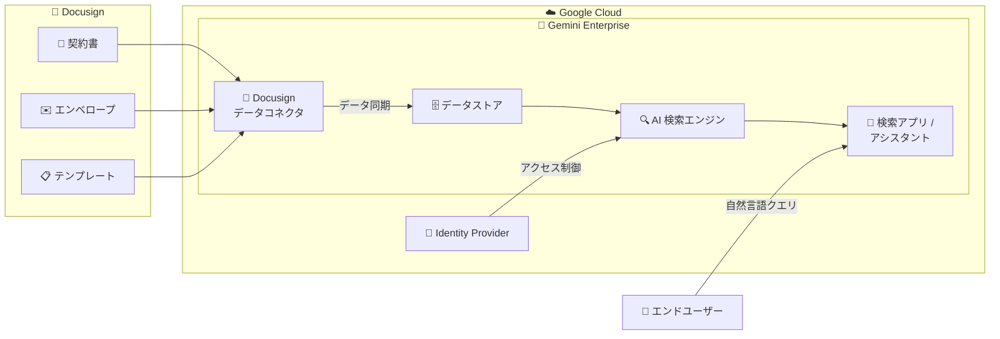

# Gemini Enterprise: Docusign データコネクタ (Preview)

**リリース日**: 2026-03-23

**サービス**: Gemini Enterprise

**機能**: Docusign データコネクタ

**ステータス**: Public Preview

📊 [このアップデートのインフォグラフィックを見る](https://takech9203.github.io/google-cloud-news-summary/20260323-gemini-enterprise-docusign-connector.html)

## 概要

Gemini Enterprise に Docusign データコネクタが Public Preview として追加された。このコネクタにより、Docusign のデータストアを Gemini Enterprise に接続し、契約書や署名済みドキュメントなどの Docusign 上のデータを Gemini Enterprise の検索・分析基盤で活用できるようになる。

Gemini Enterprise のデータコネクタは、Google およびサードパーティのデータソースからデータを取り込み、専用のデータストアに格納する仕組みである。Docusign コネクタの追加により、契約管理プラットフォームに蓄積されたドキュメントデータを、Gemini の AI 検索機能と統合して自然言語で検索・活用することが可能になる。

このアップデートの主な対象ユーザーは、Docusign を契約管理に利用しており、組織内の契約書・署名ドキュメントの横断検索や AI を活用した情報抽出を必要とする企業ユーザーである。

**アップデート前の課題**

- Docusign に格納された契約書や署名済みドキュメントを Gemini Enterprise の検索基盤から直接検索することができなかった
- 契約関連のドキュメントを AI 検索で活用するには、手動でデータをエクスポートして別途データストアに取り込む必要があった
- 組織内の契約情報と他のデータソース (Jira、Confluence、SharePoint など) を横断的に検索する統合的な手段がなかった

**アップデート後の改善**

- Docusign のデータストアを Gemini Enterprise に直接接続し、契約関連ドキュメントをネイティブに検索可能になった
- Gemini Enterprise の AI 検索機能を使い、自然言語で Docusign 上の契約書や署名ドキュメントを検索・分析できるようになった
- 他のサードパーティデータソースと合わせた横断的なエンタープライズ検索が実現可能になった

## アーキテクチャ図



Docusign 上の契約書やエンベロープなどのエンティティが、データコネクタを経由して Gemini Enterprise のデータストアに同期される。同期されたデータは AI 検索エンジンでインデックスされ、エンドユーザーは検索アプリやアシスタントを通じて自然言語で契約情報にアクセスできる。

## サービスアップデートの詳細

### 主要機能

1. **Docusign データソースとの直接接続**
   - Gemini Enterprise の Google Cloud コンソールから Docusign をデータソースとして選択し、データストアを作成可能
   - OAuth 2.0 (Authorization Code) または OAuth 2.0 (JWT Bearer) による認証をサポート
   - 本番環境およびサンドボックス環境の両方に対応

2. **データ同期 (Sync)**
   - データコネクタはエンティティデータとアイデンティティデータの同期をサポート
   - フル同期およびインクリメンタル同期のスケジュール設定が可能
   - 同期間隔は最短 30 分から最長 7 日まで設定可能

3. **アクセス制御 (ACL)**
   - Docusign 側のアクセス権限を Gemini Enterprise の検索結果に反映
   - Google Identity またはサードパーティ Identity Provider (Workforce Identity Federation) によるアイデンティティ管理に対応
   - ドキュメントレベルのアクセス制御により、権限のあるユーザーのみが検索結果を閲覧可能

## 技術仕様

### 認証方式

| 項目 | 詳細 |
|------|------|
| OAuth 2.0 - Authorization Code | Client ID、Scopes、Client Secret、Authorization URL を指定。本番用は `https://account.docusign.com/oauth/auth`、サンドボックス用は `https://account-d.docusign.com/oauth/auth` |
| OAuth 2.0 - JWT Bearer | Connected App Consumer Key、Username、Private Key を使用 |
| サンドボックス対応 | `UseSandbox` オプションで切り替え可能 |

### データストアの構成

| 項目 | 詳細 |
|------|------|
| データ形式 | 非構造化データ (PDF, HTML, DOCX 等) および構造化データに対応 |
| スキーマ | 自動検出またはAPI 経由での手動定義 |
| リージョン | global、us (米国)、eu (欧州) から選択 |
| 暗号化 | Google マネージド暗号鍵 (デフォルト) または CMEK (顧客管理暗号鍵) |

### データコネクタ API リソース

```json
{
  "name": "projects/PROJECT_ID/locations/LOCATION/collections/default_collection/dataConnector",
  "dataSource": "docusign",
  "state": "ACTIVE",
  "refreshInterval": "1800s",
  "entities": [
    {
      "entityName": "contracts"
    }
  ]
}
```

## 設定方法

### 前提条件

1. Google Cloud プロジェクトが作成済みであること
2. Gemini Enterprise が有効化されていること
3. Docusign の管理者アカウントで OAuth アプリケーションが設定済みであること
4. 適切なサービスアカウントと IAM ロールが付与されていること

### 手順

#### ステップ 1: Google Cloud コンソールで Gemini Enterprise を開く

Google Cloud コンソールから Gemini Enterprise ページに移動し、ナビゲーションメニューで「Data Stores」をクリックする。

#### ステップ 2: データストアの作成

1. 「Create Data Store」をクリック
2. データソース選択画面で「Docusign」を検索して選択
3. 認証情報 (Client ID、Client Secret 等) を入力
4. 同期するエンティティを選択
5. 同期スケジュール (フル同期/インクリメンタル同期) を設定
6. データストアのリージョンと名前を指定
7. 「Create」をクリック

#### ステップ 3: 接続の確認

データストアページでステータスを確認する。コネクタの状態が「Creating」から「Running」に変わり、データ同期完了後に「Active」に遷移する。

## メリット

### ビジネス面

- **契約情報の即時アクセス**: Docusign 上の契約書を自然言語で検索でき、法務・営業チームの業務効率が向上する
- **統合エンタープライズ検索**: Docusign のデータを他のサードパーティデータソース (Jira、Confluence、SharePoint 等) と合わせて横断検索できる

### 技術面

- **ノーコード統合**: Google Cloud コンソールから GUI ベースでコネクタを設定でき、カスタム開発が不要
- **きめ細かなアクセス制御**: Docusign 側のアクセス権限が検索結果に自動的に反映され、セキュリティが維持される

## デメリット・制約事項

### 制限事項

- 現在 Public Preview のため、SLA の対象外であり、本番環境での利用には注意が必要
- CMEK (顧客管理暗号鍵) を使用する場合は、us または eu リージョンを選択する必要がある (global では利用不可)
- us / eu リージョンでは一部の Gemini Enterprise 機能に制限がある (動的ファセットの非活性化等)

### 考慮すべき点

- Preview 段階のため、GA に向けて仕様変更が行われる可能性がある
- データ量によっては初回の同期 (インジェスト) に数時間を要する場合がある
- サードパーティデータソースの接続には、CMEK 利用時にマルチリージョンおよびシングルリージョンの鍵登録が必要

## ユースケース

### ユースケース 1: 法務チームの契約書横断検索

**シナリオ**: 法務部門が過去の契約書から特定の条項や条件を含むドキュメントを検索する必要がある。Docusign に数千件の契約書が格納されており、手動での検索は非現実的である。

**効果**: Gemini Enterprise の AI 検索を活用し、「解約条項に 90 日以上の通知期間が含まれる契約」のような自然言語クエリで関連する契約書を即座に特定できる。

### ユースケース 2: 営業チームの契約ステータス確認

**シナリオ**: 営業担当者が顧客との契約状況を確認するため、Docusign のエンベロープ情報を含む複数のデータソースを横断的に検索したい。

**効果**: Gemini Enterprise のアシスタントを通じて、Docusign の契約情報と CRM (Salesforce 等) のデータを統合的に検索し、顧客の契約状況を迅速に把握できる。

## 利用可能リージョン

Gemini Enterprise のデータストアは以下のリージョンで利用可能である。

| リージョン | 説明 |
|-----------|------|
| global | グローバル (推奨。全機能が利用可能) |
| us | 米国マルチリージョン (DRZ / MLP 対応) |
| eu | 欧州マルチリージョン (DRZ / MLP 対応) |
| ca | カナダ (GA with allowlist) |
| in | インド (GA with allowlist) |

詳細は [Gemini Enterprise ロケーション](https://cloud.google.com/gemini/enterprise/docs/locations) を参照。

## 関連サービス・機能

- **Vertex AI Search**: Gemini Enterprise の検索基盤として動作し、データストアのインデックスと検索機能を提供する
- **Integration Connectors**: Google Cloud の Integration Connectors でも Docusign コネクタが提供されており、より低レベルなデータ連携に利用できる
- **Workforce Identity Federation**: サードパーティの Identity Provider を使用したアクセス制御に利用する
- **Cloud KMS**: CMEK (顧客管理暗号鍵) によるデータ暗号化に使用する

## 参考リンク

- 📊 [インフォグラフィック](https://takech9203.github.io/google-cloud-news-summary/20260323-gemini-enterprise-docusign-connector.html)
- [公式リリースノート](https://docs.cloud.google.com/release-notes#March_23_2026)
- [Docusign コネクタ ドキュメント](https://docs.cloud.google.com/gemini/enterprise/docs/connectors/docusign)
- [コネクタとデータストアの概要](https://docs.cloud.google.com/gemini/enterprise/docs/connectors/introduction-to-connectors-and-data-stores)
- [サードパーティデータソースの接続](https://docs.cloud.google.com/gemini/enterprise/docs/connectors/connect-third-party-data-source)
- [Gemini Enterprise ロケーション](https://docs.cloud.google.com/gemini/enterprise/docs/locations)

## まとめ

Gemini Enterprise に Docusign データコネクタが Public Preview として追加されたことで、企業の契約管理データを AI 検索基盤に統合する新たな選択肢が提供された。契約書の横断検索や他のデータソースとの統合検索を実現したい企業は、Preview 段階で評価を開始し、GA リリースに備えることを推奨する。

---

**タグ**: #GeminiEnterprise #Docusign #DataConnector #Preview #AI検索 #エンタープライズ検索 #契約管理
