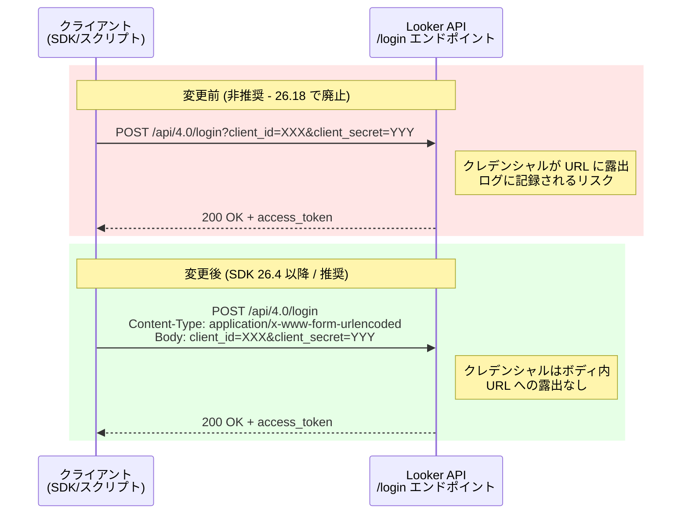

# Looker: SDK および API /login エンドポイントのクレデンシャル渡し方法の変更 (破壊的変更)

**リリース日**: 2026-03-23 (発表日) / 2026年10月 Looker 26.18 リリースで適用予定

**サービス**: Looker

**機能**: SDK および API /login エンドポイントにおけるクレデンシャル送信方法のセキュリティ強化

**ステータス**: 事前告知 (Breaking Change)

📊 [このアップデートのインフォグラフィックを見る](https://takech9203.github.io/google-cloud-news-summary/infographic/20260323-looker-sdk-api-login-security-change.html)

## 概要

Looker は、セキュリティのベストプラクティスを強制するため、Looker 言語 SDK および Looker API の `/login` エンドポイントに対して破壊的変更を行うことを発表しました。今後、クレデンシャル (client_id および client_secret) は HTTP リクエストボディでのみ受け付けられるようになり、URL クエリパラメータでの送信はサポートされなくなります。

この変更は Looker 26.18 リリース (2026年10月予定) で適用されます。現在 URL クエリパラメータでクレデンシャルを渡しているスクリプトやアプリケーションは、この変更後に動作しなくなるため、2026年10月までに対応が必要です。

影響を受けるのは、Looker SDK を使用しているすべての顧客、カスタムスクリプト、および `/login` API エンドポイントを直接呼び出しているアプリケーションです。公式にサポートされている Python、TypeScript、Ruby の SDK に加え、Kotlin、Swift、R などのコミュニティサポート SDK も対象となります。

**アップデート前の課題**

URL クエリパラメータでクレデンシャルを渡す方法には、以下のセキュリティリスクが存在していました。

- クレデンシャルが URL に含まれるため、サーバーログ、ブラウザ履歴、プロキシログに記録される可能性があった
- URL はリファラヘッダーを通じて第三者に漏洩するリスクがあった
- ネットワーク監視ツールや中間プロキシで URL が平文で記録される場合、クレデンシャルが露出する危険があった

**アップデート後の改善**

今回のセキュリティ強化により、以下の改善が実現されます。

- クレデンシャルが HTTP リクエストボディに格納されるため、URL を通じた漏洩リスクが排除される
- サーバーログやプロキシログにクレデンシャルが記録されるリスクが低減される
- OAuth 2.0 のセキュリティベストプラクティスに準拠した認証フローが標準化される

## アーキテクチャ図



この図は、変更前後の `/login` エンドポイントへのクレデンシャル送信方法の違いを示しています。変更前は URL クエリパラメータに含まれていた機密情報が、変更後はリクエストボディ内に安全に格納されます。

## サービスアップデートの詳細

### 主要機能

1. **URL クエリパラメータでのクレデンシャル送信の廃止**
   - `/login` エンドポイントへの `client_id` と `client_secret` の URL クエリパラメータ経由の送信が無効化される
   - Looker 26.18 リリース (2026年10月) で適用
   - 適用後、URL クエリパラメータを使用した認証リクエストは失敗する

2. **HTTP リクエストボディでのクレデンシャル送信への一本化**
   - `Content-Type: application/x-www-form-urlencoded` 形式でボディにクレデンシャルを送信
   - SDK バージョン 26.4 以降ではこの方式がデフォルトで採用済み
   - カスタムスクリプトでも同様の方式への移行が必要

3. **Looker SDK の更新**
   - 公式 SDK (Python、TypeScript、Ruby) のバージョン 26.4 以降で対応済み
   - コミュニティサポート SDK (Kotlin、Swift、R、C#、Go) も sdk-codegen 経由で更新が提供される

## 技術仕様

### 対象 SDK と対応状況

| SDK 言語 | サポート種別 | 対応バージョン | 配布元 |
|----------|------------|--------------|--------|
| Python | 公式 (Looker) | 26.4 以降 | [pypi.org](https://pypi.org/project/looker-sdk/) |
| TypeScript | 公式 (Looker) | 26.4 以降 | [npmjs.com](https://www.npmjs.com/package/@looker/sdk) |
| Ruby | 公式 (Looker) | 26.4 以降 | [rubygems.org](https://rubygems.org/gems/looker-sdk) |
| Kotlin | コミュニティ | 26.4 以降 | [GitHub](https://github.com/looker-open-source/sdk-codegen/tree/main/kotlin) |
| Swift | コミュニティ | 26.4 以降 | [GitHub](https://github.com/looker-open-source/sdk-codegen/tree/main/swift/looker) |
| R | コミュニティ | 要確認 | [GitHub](https://github.com/looker-open-source/lookr) |

### 移行タイムライン

| マイルストーン | 時期 | 内容 |
|--------------|------|------|
| SDK 26.4 リリース | 2026年3月 | リクエストボディ方式に対応した SDK バージョンの提供開始 |
| 事前告知 | 2026年3月23日 | 本破壊的変更の告知 |
| 推奨移行期限 | 2026年10月まで | SDK アップグレードおよびスクリプト修正の完了 |
| 変更適用 | 2026年10月 (26.18) | URL クエリパラメータでの認証が無効化 |

### リクエスト形式の比較

変更前 (非推奨):

```bash
# URL クエリパラメータでクレデンシャルを送信 (廃止予定)
curl -X POST "https://your-instance.looker.com/api/4.0/login?client_id=YOUR_CLIENT_ID&client_secret=YOUR_CLIENT_SECRET"
```

変更後 (推奨):

```bash
# HTTP リクエストボディでクレデンシャルを送信
curl -X POST "https://your-instance.looker.com/api/4.0/login" \
  -H "Content-Type: application/x-www-form-urlencoded" \
  -d "client_id=YOUR_CLIENT_ID&client_secret=YOUR_CLIENT_SECRET"
```

## 設定方法

### 前提条件

1. Looker API クレデンシャル (client_id と client_secret) を保有していること
2. 現在使用している SDK のバージョンを把握していること
3. カスタムスクリプトで `/login` エンドポイントを直接呼び出しているかどうかを確認済みであること

### 手順

#### ステップ 1: 影響範囲の特定

```bash
# コードベース内で URL クエリパラメータによるログインを検索
grep -rn "login?client_id" /path/to/your/project/
grep -rn "login.*\?.*client_id.*client_secret" /path/to/your/project/
```

URL クエリパラメータを使用している箇所をすべてリストアップします。

#### ステップ 2: SDK のアップグレード

```bash
# Python SDK のアップグレード
pip install --upgrade looker-sdk>=26.4

# TypeScript/JavaScript SDK のアップグレード
npm install @looker/sdk@latest @looker/sdk-node@latest

# Ruby SDK のアップグレード
gem update looker-sdk
```

SDK を 26.4 以降にアップグレードすると、自動的にリクエストボディ方式が使用されます。

#### ステップ 3: カスタムスクリプトの修正

```python
# Python - 変更前 (非推奨)
import requests
response = requests.post(
    f"{base_url}/api/4.0/login?client_id={client_id}&client_secret={client_secret}"
)

# Python - 変更後 (推奨)
import requests
response = requests.post(
    f"{base_url}/api/4.0/login",
    data={
        "client_id": client_id,
        "client_secret": client_secret
    }
)
```

#### ステップ 4: テスト環境での検証

```bash
# テスト環境で認証が正常に動作することを確認
curl -X POST "https://your-test-instance.looker.com/api/4.0/login" \
  -H "Content-Type: application/x-www-form-urlencoded" \
  -d "client_id=YOUR_CLIENT_ID&client_secret=YOUR_CLIENT_SECRET" \
  -w "\nHTTP Status: %{http_code}\n"
```

レスポンスに `access_token` が含まれていれば、認証が正常に動作しています。

## メリット

### ビジネス面

- **コンプライアンス強化**: セキュリティ監査やコンプライアンス要件に対して、クレデンシャル管理のベストプラクティスに準拠していることを証明できる
- **インシデントリスク低減**: クレデンシャル漏洩に起因するセキュリティインシデントのリスクが低減される

### 技術面

- **ログ安全性の向上**: URL にクレデンシャルが含まれなくなるため、サーバーログやアクセスログから機密情報が排除される
- **OAuth 2.0 標準への準拠**: RFC に準拠したクレデンシャル送信方式が標準化され、セキュリティ監査ツールとの互換性が向上する

## デメリット・制約事項

### 制限事項

- Looker 26.18 適用後、URL クエリパラメータを使用した認証は完全に動作しなくなる (後方互換性なし)
- SDK 26.4 より前のバージョンを使用し続ける場合、26.18 リリース後に認証が失敗する

### 考慮すべき点

- 本番環境で使用しているすべてのスクリプトとアプリケーションを棚卸しし、影響範囲を正確に把握する必要がある
- サードパーティ製のツールや連携アプリケーションが URL クエリパラメータ方式を使用している場合、ベンダーへの確認が必要
- CI/CD パイプラインで Looker API を呼び出している場合も対象となるため、パイプライン設定の見直しが必要

## ユースケース

### ユースケース 1: Python SDK を使用した既存の自動化スクリプトの移行

**シナリオ**: データチームが Python SDK を使用して Looker のダッシュボードを自動生成するスクリプトを運用している。SDK バージョンが 26.4 より前のため、移行が必要。

**実装例**:
```bash
# 現在の SDK バージョンを確認
pip show looker-sdk | grep Version

# SDK をアップグレード
pip install --upgrade "looker-sdk>=26.4"
```

```python
# SDK 26.4 以降では特別な変更は不要
# SDK が自動的にリクエストボディ方式を使用
import looker_sdk
sdk = looker_sdk.init40()  # looker.ini または環境変数から設定を読み込み
```

**効果**: SDK のアップグレードのみで対応が完了し、既存のビジネスロジックへの影響は最小限に抑えられる。

### ユースケース 2: curl を使用した直接 API 呼び出しの修正

**シナリオ**: インフラチームが cron ジョブで curl コマンドを使用し、Looker API の `/login` エンドポイントを直接呼び出してトークンを取得している。

**実装例**:
```bash
# 変更後の curl コマンド
ACCESS_TOKEN=$(curl -s -X POST \
  "https://your-instance.looker.com/api/4.0/login" \
  -H "Content-Type: application/x-www-form-urlencoded" \
  -d "client_id=${LOOKER_CLIENT_ID}&client_secret=${LOOKER_CLIENT_SECRET}" \
  | jq -r '.access_token')

# 取得したトークンを使用して API を呼び出し
curl -H "Authorization: token ${ACCESS_TOKEN}" \
  "https://your-instance.looker.com/api/4.0/user"
```

**効果**: スクリプトの修正箇所は `/login` の呼び出し部分のみで、取得したアクセストークンの使用方法に変更はない。

## 料金

この変更は Looker のセキュリティ強化であり、追加の料金は発生しません。既存の Looker ライセンスの範囲内で適用されます。

## 利用可能リージョン

この変更は Looker のすべてのデプロイメント形態に適用されます。

- Looker (Google Cloud core) - すべてのリージョン
- Looker (original) - すべてのインスタンス

## 関連サービス・機能

- **[Looker API 4.0](https://cloud.google.com/looker/docs/reference/looker-api/latest)**: 今回の変更の対象となる API バージョン
- **[Looker SDK](https://cloud.google.com/looker/docs/api-sdk)**: 公式 SDK の更新により自動対応が可能
- **[Looker API 認証](https://cloud.google.com/looker/docs/api-auth)**: 認証フローの全体像と SDK/非 SDK 認証の詳細

## 参考リンク

- 📊 [インフォグラフィック](https://takech9203.github.io/google-cloud-news-summary/infographic/20260323-looker-sdk-api-login-security-change.html)
- [公式リリースノート - URL パラメータ廃止通知](https://cloud.google.com/looker/docs/best-practices/deprecate-url-params-notice)
- [Looker API 認証ドキュメント](https://cloud.google.com/looker/docs/api-auth)
- [Looker API /login エンドポイント リファレンス](https://cloud.google.com/looker/docs/reference/looker-api/latest/methods/ApiAuth/login)
- [Looker SDK ドキュメント](https://cloud.google.com/looker/docs/api-sdk)
- [Looker SDK サポートポリシー](https://cloud.google.com/looker/docs/api-sdk-support-policy)

## まとめ

Looker SDK および API `/login` エンドポイントにおけるクレデンシャル送信方法の変更は、URL を通じた認証情報漏洩のリスクを排除するための重要なセキュリティ強化です。SDK 26.4 以降へのアップグレードと、カスタムスクリプトの修正を 2026年10月の Looker 26.18 リリースまでに完了することを強く推奨します。まず影響範囲の棚卸しを行い、テスト環境での検証を経て、計画的に移行を進めてください。

---

**タグ**: #Looker #API #SDK #セキュリティ #破壊的変更 #認証 #OAuth2 #マイグレーション
