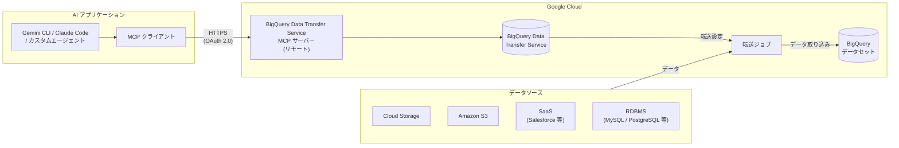

# BigQuery Data Transfer Service: リモート MCP サーバーによる AI エージェント連携

**リリース日**: 2026-03-24

**サービス**: BigQuery Data Transfer Service

**機能**: リモート MCP サーバーで AI エージェントからのデータ転送管理

**ステータス**: Preview

[このアップデートのインフォグラフィックを見る](https://takech9203.github.io/google-cloud-news-summary/20260324-bigquery-dts-mcp-server.html)

## 概要

BigQuery Data Transfer Service に、リモート Model Context Protocol (MCP) サーバーが新たに追加された。この MCP サーバーを利用することで、AI エージェントがデータ転送の作成、管理、実行を自然言語ベースで操作できるようになる。本機能は現在 Preview ステータスで提供されている。

MCP は Anthropic が開発したオープンソースプロトコルであり、大規模言語モデル (LLM) や AI アプリケーションが外部データソースに標準化された方法で接続するための仕組みを提供する。Google Cloud は既に BigQuery、GKE、Cloud SQL、Spanner など多数のサービスで MCP サーバーを提供しており、BigQuery Data Transfer Service もこのエコシステムに加わった形となる。

この機能の主な対象ユーザーは、データエンジニアリングチームや、AI エージェントを活用してデータパイプラインの運用を自動化・効率化したいと考えている組織である。Gemini CLI、Claude Code、Gemini Code Assist のエージェントモードなど、MCP 対応の AI アプリケーションから直接データ転送を操作できる。

**アップデート前の課題**

- データ転送の設定や管理には Google Cloud コンソール、bq コマンドラインツール、または BigQuery Data Transfer Service API を直接使用する必要があった
- AI エージェントからデータ転送を操作するには、独自のインテグレーションを構築する必要があった
- 転送設定の作成やステータス確認に複数のツールやインターフェースを切り替える必要があった

**アップデート後の改善**

- AI エージェントが MCP プロトコル経由でデータ転送の作成、管理、実行を直接操作可能になった
- 自然言語による指示でデータ転送の設定や管理ができるようになった
- Google Cloud の MCP サーバー共通の認証・認可、監査ログ、Model Armor 保護などのエンタープライズ機能が利用可能

## アーキテクチャ図



AI アプリケーション内の MCP クライアントが、リモート MCP サーバーを介して BigQuery Data Transfer Service を操作し、各種データソースから BigQuery へのデータ転送を制御する構成を示している。

## サービスアップデートの詳細

### 主要機能

1. **MCP プロトコルによるデータ転送管理**
   - 転送設定 (Transfer Configuration) の作成・更新・削除を MCP ツール経由で実行可能
   - 転送実行 (Transfer Run) の開始、ステータス確認、履歴の取得が可能
   - AI エージェントが自然言語の指示を MCP ツール呼び出しに変換して操作

2. **Google Cloud MCP サーバー共通のセキュリティ機能**
   - OAuth 2.0 と IAM による認証・認可
   - MCP ディスカバリー: プロジェクトでサーバーを有効化すると、AI アプリケーションが MCP の `tools/list` メソッドでツールを検出可能
   - Model Armor による入出力のセキュリティスキャン (オプション)
   - 監査ログの集中管理

3. **既存のアクセス方法との共存**
   - Google Cloud コンソール、bq コマンドラインツール、REST API は引き続き利用可能
   - MCP サーバーは新たなアクセスチャネルとして追加

## 技術仕様

### MCP サーバー構成

| 項目 | 詳細 |
|------|------|
| プロトコル | Model Context Protocol (MCP) |
| トランスポート | HTTPS (リモート MCP サーバー) |
| 認証方式 | OAuth 2.0 + IAM |
| ステータス | Preview |

### 認証と権限

BigQuery Data Transfer Service の MCP サーバーを使用するには、従来の Data Transfer Service と同様の IAM 権限が必要となる。

| 権限 | 用途 |
|------|------|
| `bigquery.transfers.update` | 転送設定の作成・更新・削除 |
| `bigquery.transfers.get` | 転送実行のステータス確認・履歴取得 |
| `mcp.tools.call` | MCP ツールの呼び出し (MCP Tool User ロール) |

## 設定方法

### 前提条件

1. Google Cloud プロジェクトで BigQuery Data Transfer Service API が有効化されていること
2. MCP サーバーがプロジェクトで有効化されていること
3. 適切な IAM ロール (`roles/bigquery.admin` または必要な個別権限) が付与されていること

### 手順

#### ステップ 1: MCP サーバーの有効化

```bash
gcloud beta services mcp enable bigquerydatatransfer.googleapis.com \
  --project=PROJECT_ID
```

プロジェクトで BigQuery Data Transfer Service の MCP サーバーを有効化する。

#### ステップ 2: MCP クライアントの設定

AI アプリケーション (Gemini CLI、Claude Code など) で MCP サーバーの接続情報を設定する。

```json
{
  "mcpServers": {
    "bigquery-data-transfer": {
      "url": "https://bigquerydatatransfer.googleapis.com/mcp",
      "transport": "http"
    }
  }
}
```

認証の詳細は使用する AI アプリケーションと認証方式に依存する。詳細は [MCP サーバーへの認証](https://cloud.google.com/mcp/authenticate-mcp) を参照。

## メリット

### ビジネス面

- **運用効率の向上**: AI エージェントを活用してデータ転送の設定・管理を効率化でき、データエンジニアの生産性が向上する
- **自然言語による操作**: 複雑な API やコマンドラインの知識がなくても、自然言語でデータ転送を管理できる

### 技術面

- **標準化されたプロトコル**: MCP というオープンスタンダードに準拠しており、様々な AI アプリケーションやエージェントフレームワークから利用可能
- **エンタープライズセキュリティ**: IAM、OAuth 2.0、Model Armor、監査ログなど、Google Cloud の既存のセキュリティインフラを活用できる

## デメリット・制約事項

### 制限事項

- 本機能は Preview ステータスであり、SLA の対象外となる
- Pre-GA Offerings Terms が適用され、サポートが限定される場合がある

### 考慮すべき点

- AI エージェント経由の操作では、意図しない転送設定の変更が行われるリスクがあるため、IAM による権限管理を適切に行う必要がある
- Preview 段階のため、本番環境での使用には注意が必要

## ユースケース

### ユースケース 1: AI エージェントによるデータ転送のセットアップ

**シナリオ**: データエンジニアが、新しい SaaS データソースから BigQuery へのデータ転送を設定する必要がある。Gemini CLI や Claude Code のエージェントモードを使用して、自然言語で転送設定を作成する。

**効果**: 転送設定の作成にかかる時間を短縮し、API ドキュメントを参照する手間を削減できる。

### ユースケース 2: 転送ステータスの監視と障害対応

**シナリオ**: AI エージェントが定期的に転送実行のステータスを確認し、失敗した転送を検知した場合にバックフィル実行をトリガーする。

**効果**: 転送失敗の検知と復旧の自動化により、データの鮮度を維持しやすくなる。

## 料金

BigQuery Data Transfer Service の MCP サーバー自体の追加料金に関する情報は、現時点で公式ドキュメントに明記されていない。BigQuery Data Transfer Service の標準的な料金体系については [料金ページ](https://cloud.google.com/bigquery/pricing#data-transfer-service-pricing) を参照。データが BigQuery に転送された後は、標準的な BigQuery の[ストレージ料金](https://cloud.google.com/bigquery/pricing#storage)と[クエリ料金](https://cloud.google.com/bigquery/pricing#queries)が適用される。

## 関連サービス・機能

- **[BigQuery MCP サーバー](https://cloud.google.com/bigquery/docs/use-bigquery-mcp)**: BigQuery 本体のリモート MCP サーバー。SQL 実行やデータセット管理を AI エージェントから操作可能
- **[Google Cloud MCP サーバー](https://cloud.google.com/mcp/overview)**: Google Cloud 全体の MCP サーバーエコシステム。BigQuery、GKE、Spanner、Cloud SQL など多数のサービスがリモート MCP サーバーを提供
- **[BigQuery Data Transfer Service API](https://cloud.google.com/bigquery/docs/reference/datatransfer/rest)**: 従来の REST API。MCP サーバーのバックエンドとして機能
- **[Cloud Monitoring](https://cloud.google.com/bigquery/docs/dts-monitor)**: データ転送のモニタリングとアラート設定

## 参考リンク

- [インフォグラフィック](https://takech9203.github.io/google-cloud-news-summary/20260324-bigquery-dts-mcp-server.html)
- [公式リリースノート](https://docs.cloud.google.com/release-notes#March_24_2026)
- [BigQuery Data Transfer Service ドキュメント](https://cloud.google.com/bigquery/docs/dts-introduction)
- [Google Cloud MCP サーバー概要](https://cloud.google.com/mcp/overview)
- [Google Cloud MCP 対応プロダクト一覧](https://cloud.google.com/mcp/supported-products)
- [MCP サーバーへの認証](https://cloud.google.com/mcp/authenticate-mcp)
- [料金ページ](https://cloud.google.com/bigquery/pricing)

## まとめ

BigQuery Data Transfer Service のリモート MCP サーバー (Preview) は、AI エージェントからデータ転送を直接管理できる新たなアクセスチャネルを提供する。Google Cloud が推進する MCP エコシステムの拡充の一環であり、AI を活用したデータエンジニアリングワークフローの自動化を検討している組織にとって注目すべきアップデートである。現在 Preview 段階のため、まずは開発・検証環境で機能を試し、GA 昇格時の本番導入に備えることを推奨する。

---

**タグ**: #BigQuery #DataTransferService #MCP #AIエージェント #Preview #データ統合
