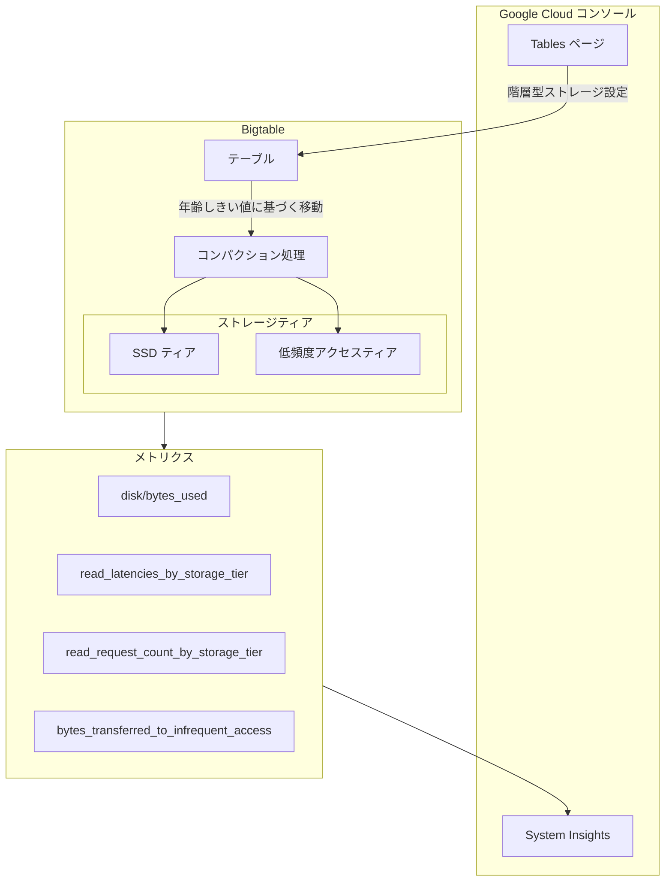

# Bigtable: Google Cloud コンソールでの階層型ストレージ設定

**リリース日**: 2026-03-24

**サービス**: Bigtable

**機能**: Google Cloud コンソールでの階層型ストレージ設定管理

**ステータス**: Preview

[このアップデートのインフォグラフィックを見る](https://takech9203.github.io/google-cloud-news-summary/20260324-bigtable-tiered-storage-console.html)

## 概要

Bigtable の階層型ストレージ (Tiered Storage) の設定を Google Cloud コンソールから直接管理できるようになった。これまで gcloud CLI でのみ可能だった階層型ストレージの有効化、年齢しきい値の変更、無効化といった操作が、コンソールの GUI 上で実行可能になった。

加えて、System Insights で階層型ストレージに関するメトリクスを可視化して確認できるようになった。これにより、SSD ティアと低頻度アクセスティア間のデータ分布やパフォーマンスをコンソール上で一元的に監視できる。

このアップデートは、Bigtable で大量の時系列データや履歴データを管理しているチームにとって、ストレージコストの最適化をより手軽に行えるようにするものである。

**アップデート前の課題**

- 階層型ストレージの設定には `gcloud beta bigtable instances tables create` や `gcloud beta bigtable instances tables update` コマンドを使用する必要があった
- 年齢しきい値の変更や階層型ストレージの無効化も CLI からの操作が必須だった
- 階層型ストレージのメトリクスを確認するには Cloud Monitoring を別途参照する必要があった

**アップデート後の改善**

- Google Cloud コンソールから GUI で階層型ストレージの設定を管理できるようになった
- System Insights で階層型ストレージのメトリクス (ストレージ使用量、レイテンシ、リクエスト数など) を直接確認できるようになった
- CLI に不慣れなユーザーでも階層型ストレージの運用が容易になった

## アーキテクチャ図



Google Cloud コンソールから階層型ストレージの設定を行い、System Insights でメトリクスを監視する全体構成を示す。データはコンパクション処理により年齢しきい値に基づいて SSD ティアと低頻度アクセスティア間を自動的に移動する。

## サービスアップデートの詳細

### 主要機能

1. **コンソールでの階層型ストレージ設定管理**
   - テーブル作成時に階層型ストレージを有効化し、年齢しきい値を設定可能
   - 既存テーブルの年齢しきい値の変更が GUI から実行可能
   - 階層型ストレージの無効化もコンソールから操作可能

2. **System Insights での階層型ストレージメトリクス表示**
   - 各ストレージティア (SSD / 低頻度アクセス) のデータ使用量を確認可能
   - ティアごとの読み取りレイテンシとリクエスト数を監視可能
   - SSD から低頻度アクセスティアへのデータ移動量を追跡可能

3. **年齢ベースの階層化ポリシー**
   - セルのタイムスタンプに基づいてデータを自動移動
   - 最小年齢しきい値は 30 日
   - ローリングウィンドウ方式で、現在時刻からの相対的な期間で管理

## 技術仕様

### ストレージティアの比較

| 項目 | SSD ティア | 低頻度アクセスティア |
|------|-----------|-------------------|
| ノード容量 | 5 TB | 最大 32 TB (SSD 含む) |
| 書き込みレイテンシ | 1 桁ミリ秒 | 1 桁ミリ秒 |
| 読み取りレイテンシ | 1 桁ミリ秒 | 2 桁前半ミリ秒 |
| 用途 | 高スループット・低レイテンシ | アクセス頻度の低いデータ |

### 監視メトリクス

| メトリクス | 説明 |
|-----------|------|
| `disk/bytes_used` | 各ストレージティアに保存されているデータ量 (バイト) |
| `server/read_latencies_by_storage_tier` | 各ストレージティアからの読み取りレイテンシ |
| `server/read_request_count_by_storage_tier` | 各ストレージティアへの読み取りリクエスト数 |
| `table/bytes_transferred_to_infrequent_access` | SSD から低頻度アクセスティアへ移動されたデータ量 |

### API での設定 (参考)

```bash
# テーブル作成時に階層型ストレージを有効化
gcloud beta bigtable instances tables create TABLE_ID \
  --instance=INSTANCE_ID \
  --project=PROJECT_ID \
  --tiered-storage-infrequent-access-older-than=60d

# 年齢しきい値の変更
gcloud beta bigtable instances tables update TABLE_ID \
  --instance=INSTANCE_ID \
  --project=PROJECT_ID \
  --tiered-storage-infrequent-access-older-than=90d

# 階層型ストレージの無効化
gcloud beta bigtable instances tables update TABLE_ID \
  --instance=INSTANCE_ID \
  --project=PROJECT_ID \
  --clear-tiered-storage-config
```

## 設定方法

### 前提条件

1. Bigtable SSD インスタンスが作成済みであること (HDD インスタンスでは階層型ストレージは利用不可)
2. `bigtable.tables.update` 権限を持つ IAM ロール (例: `roles/bigtable.admin`) が付与されていること

### 手順

#### ステップ 1: テーブルの階層型ストレージ設定

1. Google Cloud コンソールで Bigtable インスタンスの一覧を開く
2. 対象のインスタンスをクリック
3. 左ペインの「Tables」をクリック
4. 新規テーブル作成時またはテーブル編集時に、階層型ストレージの設定を構成

#### ステップ 2: System Insights でメトリクスを確認

1. Google Cloud コンソールで対象の Bigtable インスタンスを開く
2. System Insights セクションで階層型ストレージのメトリクスを確認
3. 各ティアのデータ使用量、レイテンシ、リクエスト数を監視

## メリット

### ビジネス面

- **ストレージコスト削減**: アクセス頻度の低い古いデータを低コストの低頻度アクセスティアに自動移動することで、SSD ストレージコストを削減できる
- **運用負荷の軽減**: CLI を使わずにコンソールから設定を管理できるため、運用チームの学習コストと操作ミスのリスクが低下する

### 技術面

- **可視性の向上**: System Insights でティアごとのメトリクスを一元的に監視でき、ストレージ最適化の判断材料が得やすくなった
- **透過的なデータアクセス**: 既存の読み取り・書き込みコードを変更せずに、複数ティアにまたがるデータにアクセス可能
- **双方向のデータ移動**: 年齢しきい値の変更や階層型ストレージの無効化により、低頻度アクセスティアから SSD へデータを戻すことも可能

## デメリット・制約事項

### 制限事項

- Data Boost はサポートされていない
- ホットバックアップはサポートされていない
- HDD インスタンスでは階層型ストレージを利用できない
- 年齢しきい値の最小値は 30 日

### 考慮すべき点

- 低頻度アクセスティアのデータ読み取りは SSD と比較してスループットが低下する
- タイムスタンプ範囲フィルタを使用しない場合、Bigtable は両方のティアを確認するため、レイテンシが増加する可能性がある
- SSD と低頻度アクセスティア間で頻繁にデータを移動すると、コンパクションコストが発生し、コンパクション処理が遅延する可能性がある
- 現在 Preview 段階であり、GA 時に仕様が変更される可能性がある

## ユースケース

### ユースケース 1: 規制コンプライアンスのためのデータ長期保存

**シナリオ**: 金融機関が取引データを規制上の理由で数年間保存する必要がある。直近 60 日間のデータは頻繁にアクセスされるが、それ以前のデータはほとんどアクセスされない。

**効果**: 年齢しきい値を 60 日に設定することで、60 日以上経過したデータは自動的に低コストの低頻度アクセスティアに移動される。直近のデータは SSD の高パフォーマンスを維持しつつ、全体のストレージコストを削減できる。

### ユースケース 2: IoT 時系列データの階層化管理

**シナリオ**: IoT デバイスから大量のセンサーデータが Bigtable に書き込まれる。リアルタイム分析は直近 30 日分で十分だが、機械学習モデルのトレーニングのために過去データも保持しておきたい。

**効果**: 年齢しきい値を 30 日に設定し、古いデータを低頻度アクセスティアに移動する。モデルトレーニング時にはレイテンシが多少増加するが、日常のリアルタイム分析はSSD ティアで高パフォーマンスを維持できる。

## 料金

階層型ストレージに関連する料金は以下の通り。

- **SSD ストレージ料金**: 通常の Bigtable SSD ストレージ料金が適用
- **低頻度アクセスストレージ料金**: SSD とは別の低コストの料金レートが適用
- **テーブルコンパクション料金**: SSD から低頻度アクセスティアへのデータ移動時に発生
- **無料**: 階層型ストレージの設定自体、および低頻度アクセスから SSD へのデータ移動

詳細な料金については [Bigtable の料金ページ](https://cloud.google.com/bigtable/pricing) を参照。

## 関連サービス・機能

- **Cloud Monitoring**: 階層型ストレージのメトリクスは Cloud Monitoring にも送信され、アラートやダッシュボードの作成が可能
- **Cloud Logging**: 階層型ストレージに関連するログを Cloud Logging で確認可能
- **Bigtable Autoscaling**: 階層型ストレージと併用することで、ノード数とストレージコストの両方を最適化可能
- **Bigtable バックアップ**: 階層型ストレージが有効なテーブルのバックアップは、復元時も階層型ストレージが有効な状態で復元される (ただしホットバックアップは非対応)

## 参考リンク

- [インフォグラフィック](https://takech9203.github.io/google-cloud-news-summary/20260324-bigtable-tiered-storage-console.html)
- [公式リリースノート](https://docs.cloud.google.com/release-notes#March_24_2026)
- [階層型ストレージの概要](https://cloud.google.com/bigtable/docs/tiered-storage)
- [テーブルの作成と管理](https://cloud.google.com/bigtable/docs/managing-tables)
- [Bigtable 料金](https://cloud.google.com/bigtable/pricing)
- [SSD と HDD ストレージの選択](https://cloud.google.com/bigtable/docs/choosing-ssd-hdd)

## まとめ

Bigtable の階層型ストレージ設定が Google Cloud コンソールから管理可能になり、CLI に依存しない運用が実現した。System Insights でのメトリクス可視化と合わせて、ストレージコストの最適化をより直感的に行えるようになっている。大量の履歴データや時系列データを Bigtable で管理しているユーザーは、コンソールから階層型ストレージの設定を確認し、コスト削減の機会を検討することを推奨する。

---

**タグ**: #Bigtable #TieredStorage #StorageOptimization #Console #Preview
